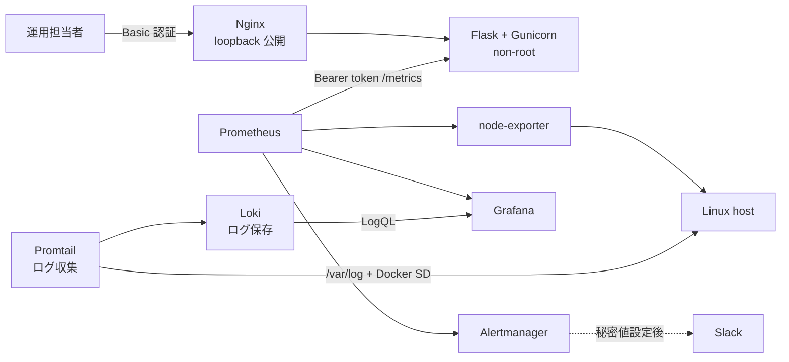

# Server Monitor Infrastructure Lab

[](https://github.com/ns7jp/server-monitor/actions/workflows/python-check.yml)


Python / Flask で作成したサーバー状態表示アプリを、**認証、コンテナ配備、監視収集、アラート、運用手順まで含むインフラ構築・運用ラボ**へ拡張したポートフォリオです。

単に画面を作るのではなく、「安全に公開範囲を制限できるか」「停止や高負荷をどう検知し、どう切り分けるか」を設計・検証対象にしています。

## 実装したこと

| 分野 | 実装・成果物 |
| --- | --- |
| アプリ監視 UI | Flask + psutil + Chart.js による CPU、メモリ、ディスク、ネットワーク、プロセス表示 |
| アクセス制御 | UI / JSON API の Basic 認証、Prometheus metrics の Bearer token 認証 |
| 情報保護 | ホスト名と OS ユーザー名を既定でマスク、秘密値を Docker secrets ファイルで管理 |
| 稼働監視 | 情報を露出しない `/healthz`、保護された `/metrics` |
| 配備 | 非 root `Dockerfile`、Nginx、Docker Compose、native Linux 用 systemd / TLS 設定例 |
| 標準監視基盤 | Prometheus + node-exporter + Grafana + Alertmanager |
| ログ集約 | Loki + Promtail でコンテナログとホスト `/var/log` を収集、Grafana から横断検索 |
| 障害対応 | アラートルール、停止ランブック、CPU 高負荷の模擬インシデント記録 |
| 品質確認 | pytest、GitHub Actions、Compose / Prometheus / Alertmanager / Loki / Promtail / Docker build 検証 |

## 構成



重要な点として、コンテナ化した Flask アプリの `psutil` 表示はアプリコンテナの状態です。Linux ホスト全体の監視は `node-exporter` と Grafana 側で扱い、役割を混同しない設計にしています。

## ドキュメント

| 文書 | 内容 |
| --- | --- |
| [インフラ監視ラボ設計](docs/architecture.md) | 構成図、設計判断、監視条件 |
| [セキュリティ設計](docs/security.md) | 認証、秘密管理、公開範囲、残存リスク |
| [構築・配備手順](docs/deployment.md) | Docker Compose と native Linux 配備例 |
| [バックアップ・復旧設計](docs/backup-restore.md) | 永続データ、復元試験、復旧目標 |
| [停止時ランブック](docs/runbooks/service-down.md) | アラート受信後の確認と復旧手順 |
| [CPU 高負荷演習記録](docs/incidents/cpu-high-drill.md) | 模擬障害の再現、確認、復旧、再発防止 |
| [LogQL クエリ集](docs/loki-queries.md) | ダッシュボードと運用で使う LogQL の例 |

## ダッシュボード機能


| 機能 | 概要 |
| --- | --- |
| System Info | OS、論理ノード名、アーキテクチャ、起動時刻、稼働時間、Load Average、プロセス数 |
| CPU | 使用率、コア別表示、周波数 |
| Memory / Swap | 使用率、使用量、空き容量 |
| Disk | パーティション使用率と閾値表示 |
| Network I/O | 累積送受信量と画面更新間隔内の速度 |
| History | CPU / メモリの直近60秒グラフ |
| Top Processes | CPU 使用率上位15件。ユーザー名は既定で非表示 |

## ログ集約

`Loki + Promtail` でメトリクスと同じ Grafana 画面からログを参照する。アラートで「異常が起きた」と分かった後、ログで「何が起きたか」を即座に確認するための層である。

| 要素 | 役割 | 公開範囲 |
| --- | --- | --- |
| Promtail | コンテナログ（Docker SD）と `/var/log/{syslog,auth.log,messages,secure}` を Loki に転送 | Docker 内部ネットワーク |
| Loki | ログの保存とクエリ。リテンション 30 日、ファイルシステムストレージ | `127.0.0.1:3100`（API のみ、ブラウザ用 UI はない） |
| Grafana | Loki データソースとして登録。Server Monitor ダッシュボードに Logs パネルを内蔵 | `127.0.0.1:3000` |

ラベル設計は **「集計に使う固定値だけラベル化、それ以外は本文に残す」** とし、カーディナリティの爆発を避ける。クエリ例は [LogQL クエリ集](docs/loki-queries.md) に整理した。

- Promtail は `/var/log` と `/var/lib/docker/containers`、`/var/run/docker.sock` を **読み取り専用** でマウントする。Docker socket は権限が強いため、Promtail コンテナは `no-new-privileges` で起動する。詳細は [セキュリティ設計](docs/security.md) を参照。
- Loki のポート 3100 は loopback のみに公開する。Loki 自体には認証がないため、外部公開しない設計である。
- ログ量が増えた場合は `deploy/loki/loki-config.yml` の `limits_config.retention_period` と `compactor` で調整する。

## セキュアな初期値

| エンドポイント | 認証 | 内容 |
| --- | --- | --- |
| `/healthz` | 不要 | 稼働確認のみ。ホスト情報は含まない |
| `/`、`/api/stats`、`/api/processes` | Basic 認証 | ダッシュボードと表示用データ |
| `/metrics` | Bearer token | Prometheus 収集専用 |

- 資格情報が未設定の場合、ダッシュボードと metrics は `503` で応答し、意図せず公開されません。
- `MONITOR_SHOW_HOSTNAME=false` と `MONITOR_SHOW_USERNAMES=false` が既定です。
- Compose 構成でブラウザ向けに公開するポートは `127.0.0.1` に限定しています。

## Docker Compose で起動

対象は Linux 検証ホストです。`node-exporter` が Linux のホスト情報を読み取るため、Windows / macOS 上の Docker Desktop ではホスト監視結果が同一になりません。

```bash
git clone https://github.com/ns7jp/server-monitor.git
cd server-monitor
cp .env.example .env
openssl rand -base64 32 > deploy/secrets/dashboard_password.txt
openssl rand -base64 32 > deploy/secrets/metrics_token.txt
openssl rand -base64 32 > deploy/secrets/grafana_admin_password.txt
chmod 600 deploy/secrets/*.txt
docker compose up -d --build
```

| 画面 | URL |
| --- | --- |
| Server Monitor UI | `http://127.0.0.1:8080/` |
| Grafana | `http://127.0.0.1:3000/` |
| Prometheus | `http://127.0.0.1:9090/` |
| Alertmanager | `http://127.0.0.1:9093/` |
| Loki (内部 API) | `http://127.0.0.1:3100/` |

詳細は [構築・配備手順](docs/deployment.md) を参照してください。

## アプリ単体で起動

開発時も既定では認証が必要です。

```bash
python -m venv .venv
source .venv/bin/activate
pip install -r requirements-dev.txt
export MONITOR_USERNAME=monitor
export MONITOR_PASSWORD='replace-with-a-long-random-password'
export MONITOR_METRICS_TOKEN='replace-with-a-long-random-token'
export MONITOR_NODE_NAME='local-test-node'
python app.py
```

loopback での短時間の UI 開発に限り、`MONITOR_AUTH_DISABLED=true` で UI 認証を無効にできます。`0.0.0.0` で待ち受ける環境では使用しません。

## テスト

```bash
pip install -r requirements-dev.txt
python -m compileall app.py tests
pytest
```

GitHub Actions では、API の認証・マスキング・metrics テストに加えて、Grafana dashboard JSON、Docker Compose、Prometheus / Alertmanager 設定、非 root アプリイメージの build を検証します。

## ディレクトリ構成

```text
server-monitor/
|-- app.py
|-- Dockerfile
|-- compose.yaml
|-- deploy/
|   |-- alertmanager/
|   |-- grafana/provisioning/
|   |-- nginx/
|   |-- prometheus/
|   |-- secrets/
|   `-- systemd/
|-- docs/
|   |-- architecture.md
|   |-- security.md
|   |-- deployment.md
|   |-- backup-restore.md
|   |-- incidents/
|   `-- runbooks/
|-- static/
|-- templates/
`-- tests/
```

## 現在の制約と次の拡張

- 単一ホストの検証構成であり、監視基盤の冗長化は対象外です。
- Slack 通知は Webhook 秘密値をコミットしないため、`compose.slack.yaml.example` を重ねて利用環境で有効化する方式です。
- 次の拡張候補は、複数 Linux ノードの収集、SSO / VPN 連携、リモートストレージへの長期 metrics 保存です。

## License

MIT License

## Author

島田則幸 (Noriyuki Shimada)
