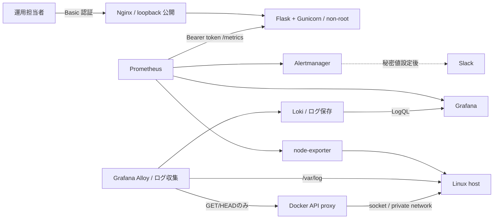
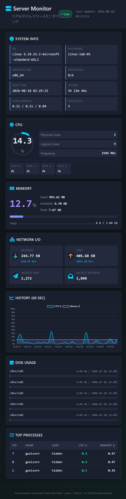

# Server Monitor Infrastructure Lab

[](https://github.com/ns7jp/server/actions/workflows/python-check.yml)
[](https://github.com/ns7jp/server/actions/workflows/full-stack-e2e.yml)


このリポジトリは、**サーバーの健康状態をいつも見張り、壊れたら気づいて直せる仕組み**を、
一から組み立てた記録です。
サーバーの状態を数字で集め、グラフで見て、おかしくなったら知らせる。壊れたら手順どおりに戻す。
この一連を、誰でも同じ手順でやり直せる形にしました。
実際に動かして確かめたことと、まだ確かめていないことは、はっきり分けて書いています。
入っているものは大きく3種類です。
監視アプリと監視基盤そのもの（Flask / Docker Compose / Prometheus / Grafana / Loki / Ansible / Terraform）、未経験者向けの学習教材、実務形式の構築案件文書一式（7パック）です。

**Ubuntu serverをAnsibleで構築し、Prometheus / Grafana / Lokiで監視して、障害注入（わざと止めて、気づけるか・戻せるかを試すこと）・自動復旧・backup restoreまで再実行可能にしたインフラ構築lab**です。

Python / Flask で作成したサーバー状態表示アプリを、認証、コンテナ配備、監視収集、アラート、運用手順まで含むポートフォリオへ拡張しています。

単に画面を作るのではなく、「安全に公開範囲を制限できるか」「停止や高負荷をどう検知し、どう切り分けるか」を設計・検証対象にしています。

## 未経験から始める方へ

**一言でいうと**: 最初から全部を理解しなくて大丈夫です。5つの言葉を覚え、小さく動かすところから始めます。

まずは次の5語だけを押さえてください。残りは動かしながら覚えられます。

| 用語 | このリポジトリでの役割 | 一言で覚える |
| --- | --- | --- |
| Linux | 監視対象と監視基盤が動くOS | サーバーの土台 |
| Docker Compose | 複数コンテナをまとめて起動する | 起動係 |
| Ansible | Linuxの設定を同じ状態へそろえる | 構築係 |
| Prometheus | 数値を定期的に集める | 収集係 |
| Grafana | 集めた数値をグラフで見せる | 可視化係 |

学習は **見る → 動かす → 確認する → 壊して直す → 説明する** の順です。
読むより先に手を動かすほうが、記憶に残るからです。

進む順路は次のとおりです。上から順にたどれば迷いません。

0. **検証環境とコードの用意（ここが最初）** — 破棄できるLinux（壊しても困らない使い捨てのVMなど）を1台用意し、下のコマンドでこのリポジトリを手元に取得します。

   ```bash
   git clone https://github.com/ns7jp/server.git
   cd server
   ```

   検証環境の作り方は[一本道ラーニングパス](docs/learning-path.md)の「Level 0 の前に」の節に手順があります。
1. **準備の確認（短時間）** — 下のコマンドを実行します。設定を変更しない診断だけを行い、足りないものを教えてくれます。
2. **[一本道ラーニングパス](docs/learning-path.md)（まず15分）** — 構築から障害対応までのLevel 0〜5が入門必修です。LVM（ディスク管理）/ 3層（Web/AP/DBの3層構成）/ L2-L3（ネットワークの切り分け）/ AWSは選択式のLevel 6に分けています。**最初に全機能を学ぶ必要はありません。** 「まず15分」は読んで全体像をつかむ目安で、実際に手を動かすと数日かかります。
3. **[初心者向け学習ガイド](docs/beginner-learning-guide.md)（90分）** — コマンドの意味、完了条件、つまずきやすい点、ミニ問題がまとまっています。
4. **[未経験者向けサーバー構築キーワード集](docs/server-building-keywords.md)（都度）** — 分からない用語が出たら引きます。意味・覚え方・実装例・確認コマンドが載っています。
5. **[案件パック 初心者ガイド](docs/build-package/beginner-guide.md)（20分）** — 実務の構築案件で使う文書一式（[Linux server構築案件pack](docs/build-package/README.md)）を読む前に、全体の地図と用語をここで確認します。要件定義書や非機能要件（NFR。速さ・止まりにくさ・安全性など、機能以外の要求）が含まれます。

```bash
./scripts/learning/check-prerequisites.sh
```

> 実機やAWSへいきなり適用しません。最初は破棄できるLinux検証環境を使い、
> 実行していない項目は `NOT RUN` のまま記録します。

### 3分で説明するなら

- **目的**: サーバーの異常に早く気づき、決めた手順で元の状態へ戻せるようにする。
- **構成**: Linux上でDocker Composeがアプリと監視を起動し、Ansibleが設定をそろえる。数値はPrometheus、画面はGrafana、ログはLokiが受け持つ。
- **工夫**: 公開先をループバック（127.0.0.1。そのPCの中からだけ届く宛先）に限定し、認証と秘密値の扱いを既定で安全側に寄せた。
- **確認**: 使い捨てのLinux環境へ一括構築し、2回目の実行で差分が出ないこと、止めても自動で復旧することをCIで検査している。
- **未実施**: 長期間稼働させたホスト、AWSへの実適用、Slack実配信、D-2（ホスト障害からの復元）などは未実測で、`NOT RUN`のままにしている。

話し方の練習と想定質問への答え方は、[初心者向け学習ガイド](docs/beginner-learning-guide.md)にあります。

## 採用ご担当者向け：最初に見る 4 点

1. **2分15秒デモ** — [保存済み実測証跡リプレイ](https://ns7jp.github.io/demo.html)。2026-08-18/19のscreen shotとD-1 logを再構成した閲覧用映像で、実操作の連続録画ではありません。[2026-08-22 E2E](docs/evidence/2026-08-22-full-stack-e2e.md)では実terminalの`demo.cast`もartifact化しました。
   - 平たく言うと: 動いている様子を、まず映像で見る。
   - 言葉の意味: 証跡（いつ・どの環境で・何を実行して・どうなったかの記録）、D-1（プロセスが落ちたときの復旧演習の番号。下の「復旧演習」の表にあります）、E2E（端から端まで通しで行う試験）。
2. **構成と構築工程** — [構成図](docs/architecture.md) / [Linux server構築案件pack](docs/build-package/README.md)。要件 → 設計 → パラメータ → 構築 → 試験 → 作業結果 → 引き渡しを 1 案件として追跡できます。
   - 平たく言うと: 何をどの順で作ったのかを、文書でたどる。
3. **実測証跡** — [検証証跡台帳](docs/evidence/README.md) / [新規host一気通貫E2E](docs/e2e-validation.md)。未実行をPASSにしません。
   - 平たく言うと: 実際に動かして確かめた記録と、その範囲。
4. **考え方と改善** — [設計判断記録](docs/design-decisions.md) / [失敗から学んだ代表事例](docs/lessons-learned.md)。採用技術だけでなく、比較案、欠点、見直し条件、再発防止を説明します。
   - 平たく言うと: なぜその方法を選び、失敗から何を直したか。

本人管理のVPS / VM / AWSで未実測の項目は、[実測証跡計画](docs/real-environment-validation-plan.md)に
停止条件、実行順、Definition of Done（完了の定義。何をもって終わりとするかの取り決め）を用意しています。
環境と資格情報が提供されるまでは、計画を実績へ読み替えず`NOT RUN`を維持します。

> **実測できたこと**
>
> - **実測の現状（2026-08-22 / PR #75）**: runtime変更最終commit `7622a9da974f694ae75e0173135923701be9e5a5`に対する[Full-stack E2E run 32572409469](https://github.com/ns7jp/server/actions/runs/32572409469)で、
>   **使い捨てUbuntu 24.04 hostへの`site.yml`一括適用、2回目`changed=0`、11 containersの稼働、認証、Prometheus target、Docker API proxyのGET成功・POST拒否・Loki log到達、ローカルwebhook通知、loopback/UFW（Ubuntu の firewall 設定ツール）/SSH tunnel、D-1自動復旧（1秒）、3 volumesのchecksum付きbackup / 別volume restoreを23/23 ID PASS**として採録しました。
>   同じcommitに対するAnsible check、Security scan、Backup verify、Python checkも成功しています。
>   判定表・環境・測定値・artifact digestは[日付付き証跡](docs/evidence/2026-08-22-full-stack-e2e.md#pr-75-hardening後の再検証)に固定し、raw logは期限付きActions artifactに保存しています。
> - **実測の追加（2026-08-23 / PR #77）**: [Full-stack Ansible E2E run 32611251044](https://github.com/ns7jp/server/actions/runs/32611251044)で、candidate `84e149254d463a8a27a4cabcd09efa4504d1b47e`をimmutableなGit SHAとして配備・検証しました。
>   前版`59aa88ed1c8ccb7ba188909f0e079b834e9126c7`へrollbackした後も、revision marker、runtime manifest、app container再作成、stale file除去、loopback bind、Loki取り込みが一致してPASSしました。
>   実測値と境界は[日付付きrollback証跡](docs/evidence/2026-08-23-change-CI-GIT-ROLLBACK.md)に固定しています。
>
> **当時の履歴として保持**
>
> - 2026-08-18/19のWSL2実測、D-1 RTO 13秒、二セグメント障害ラボ、[21項目中11項目PASSの結果票](docs/evidence/2026-08-19-build-validation.md)は当時の履歴として保持します。
>
> **まだ実測できていないこと**
>
> - 2026-08-23の結果は、PR branch上の使い捨てrunnerでの実測です。main統合や永続hostでの変更実績ではありません。
> - 2026-08-22のE2Eは、次を対象にしていません。Slack実配信、AWS `apply / destroy`、D-2、構成commit / 設定rollback rehearsal、長期稼働host、実管理端末・組織DNS・cloud firewall。
> - 実行ログが無い項目は実績として扱いません。詳細な境界は[検証証跡台帳](docs/evidence/README.md)を参照してください。

## 実装したこと

**一言でいうと**: 作ったものの一覧です。監視画面、認証、コンテナ配備、構成の自動化、障害対応の手順までが入っています。

| 分野 | 実装・成果物 |
| --- | --- |
| アプリ監視 UI | Flask + psutil + Chart.js による CPU、メモリ、ディスク、ネットワーク、プロセス表示 |
| アクセス制御 | UI / JSON API の Basic 認証、Prometheus metrics の Bearer token 認証 |
| 情報保護 | ホスト名と OS ユーザー名を既定でマスク、秘密値を Docker secrets ファイルで管理 |
| 稼働監視 | 情報を露出しない `/healthz`、保護された `/metrics` |
| 配備 | 非 root `Dockerfile`、Nginx、Docker Compose、native Linux 用 systemd / TLS 設定例 |
| 標準監視基盤 | Prometheus + node-exporter + Grafana + Alertmanager |
| ログ集約 | Loki + Grafana Alloy でコンテナログとホスト `/var/log` を収集。AlloyはDocker socketを直接持たず、専用proxyのGET/HEAD限定APIを使用 |
| 障害対応 | アラートルール、停止ランブック、CPU 高負荷の模擬インシデント記録 |
| 構成管理 | Ansible roles で OS / Docker / TLS / 監視設定 / アプリ配備 / バックアップを宣言的に管理 |
| OS ファミリー | Ubuntu 22.04 / 24.04 に加えて **AlmaLinux / Rocky 9** に対応（`dnf`、firewalld、SELinux、dnf-automatic、sshd drop-in 検査）|
| ディスク設計 | `storage` role で LVM の VG / LV / ファイルシステム / fstab を管理。既存署名のあるディスクは `wipefs` の実読みで拒否 |
| 3 層構成 | [Web / AP / DB ラボ](labs/three-tier/README.md)。層別 health endpoint、層の分離、PostgreSQL の復元試験 |
| L2 / L3 | [ルーティングラボ](labs/routing/README.md)。静的ルート、`ip_forward`、802.1Q VLAN の切り分け |
| クラウド配備 | Terraform で AWS 上に同等構成をコード化（[詳細](docs/aws-architecture.md)。apply 未実施） |
| SLO 運用 | `/healthz` の定期チェックと、しきい値を超えたときのアラート通知（[詳細](docs/slo.md)） |
| 復旧演習 | D-1 はローカル実測RTO（復旧目標時間。壊れてから直るまでの目標）13秒（[2026-08-19](docs/drills/logs/2026-08-19-D-1.md)）とE2E実測RTO 1秒（[2026-08-22](docs/evidence/2026-08-22-full-stack-e2e.md)）。D-2 はランブック・テンプレートのみで未実測 |
| 変更管理 | PR ごとに目的・影響範囲・ロールバック手順を書いて残す運用（[詳細](docs/change-management.md)） |
| 品質確認 | pytest、構成検証、ansible-lint、Molecule 構文検証、任意実行の完全 Molecule、Terraform 検証、Trivy / pip-audit、Dependabot |
| 一気通貫 E2E | disposable Ubuntuへ`site.yml`を2回適用し、runtime/network/通知/障害/restoreを[2026-08-22に全項目PASS](docs/evidence/2026-08-22-full-stack-e2e.md)。raw logと判定表をartifact化 |

## 構成

**一言でいうと**: 誰が何を担当しているかの全体図です。人はNginx越しに画面を見て、Prometheusが数値を、Alloy と Loki がログを集めます。



重要な点として、コンテナ化した Flask アプリの `psutil` 表示はアプリコンテナの状態です。Linux ホスト全体の監視は `node-exporter` と Grafana 側で扱い、役割を混同しない設計にしています。

## ドキュメント

**一言でいうと**: 読む順に並べた文書の一覧です。難易度（🟢 初心者 / 🟡 中級 / 🔴 発展）と所要時間の目安を付けています。

### まず読む文書

初心者が最初に開くのは[一本道ラーニングパス](docs/learning-path.md)、[初心者向け学習ガイド](docs/beginner-learning-guide.md)、[案件パック 初心者ガイド](docs/build-package/beginner-guide.md)の3本です。残りは必要になったときに引きます。

| 文書 | 対象 | 目安 | 内容 |
| --- | --- | ---: | --- |
| [一本道ラーニングパス](docs/learning-path.md) | 🟢 初心者 | まず15分 | 必修Level 0〜5と選択式Level 6、各段階の完了条件 |
| [初心者向け学習ガイド](docs/beginner-learning-guide.md) | 🟢 初心者 | 90分 | 最小構成を確認し、動かし、一次切り分けし、説明する |
| [案件パック 初心者ガイド](docs/build-package/beginner-guide.md) | 🟢 初心者 | 20分 | 案件パックとは何か、12文書の役割、読む順とかかる時間の目安 |
| [Linux サーバー構築案件パック](docs/build-package/README.md) | 🟡 中級 | 半日〜 | 要件から設計、パラメータ、構築、試験、作業結果、引き渡しまでの標準成果物一式 |
| [インフラ監視ラボ設計](docs/architecture.md) | 🟡 中級 | 30分 | 構成図、設計判断、監視条件 |
| [設計判断記録](docs/design-decisions.md) | 🟡 中級 | 20分 | 比較案、採用理由、欠点、見直し条件をADR形式で説明 |
| [失敗から学んだ代表事例](docs/lessons-learned.md) | 🟢 初心者 | 15分 | 実行時欠陥3件の切り分け、修正、再発防止 |
| [セキュリティ設計](docs/security.md) | 🟡 中級 | 30分 | 認証、秘密管理、公開範囲、残存リスク |
| [構築・配備手順](docs/deployment.md) | 🟢 初心者 | 60分〜 | Docker Compose と native Linux 配備例 |
| [Ansible 配備手順](docs/deployment-ansible.md) | 🟡 中級 | 半日〜 | Ubuntu host向け一括構築playbook、roles 構成、Vault、Molecule |
| [新規host一気通貫E2E](docs/e2e-validation.md) | 🔴 発展 | 30分 | `site.yml`適用、冪等性（べきとうせい。何度実行しても同じ状態に落ち着く性質）、network、D-1、backup restoreの自動検証と証跡境界 |
| [バックアップ・復旧設計](docs/backup-restore.md) | 🟡 中級 | 30分 | 永続データ、復元試験、復旧目標 |
| [運用ランブック索引](docs/runbooks/README.md) | 🟡 中級 | 30分〜 | 停止・遅延・disk・memory・監視停止時の切り分け |
| [CPU 高負荷演習記録](docs/incidents/cpu-high-drill.md) | 🟡 中級 | 15分 | 模擬障害の再現、確認、復旧、再発防止 |
| [演習一覧](docs/drills/README.md) | 🟡 中級 | 15分 | 構築演習 B-1〜B-4 と復旧演習 D-1 / D-2 |
| [Web / AP / DB 3 層ラボ](labs/three-tier/README.md) | 🔴 発展 | 半日 | 層別 health、層の分離、DB のバックアップ・復元試験 |
| [L2 / L3 切り分けラボ](labs/routing/README.md) | 🔴 発展 | 半日 | 静的routing、転送設定、802.1Q VLAN |
| [LogQL クエリ集](docs/loki-queries.md) | 🟡 中級 | 20分 | dashboardと運用で使うLogQLの例 |
| [検証証跡台帳](docs/evidence/README.md) | 全員 | 20分 | コード実装と実環境での実測を区別する検証状況 |
| [ローカル証跡採録ガイド](docs/evidence/local-evidence-quickstart.md) | 🟡 中級 | 60分〜 | Grafana / Loki / Alertmanager / D-1を実測証跡にする手順 |
| [2〜3 分デモ収録ガイド](docs/demo-capture-guide.md) | 🟡 中級 | 30分 | 配備、故障注入、通知、復旧の短尺収録手順 |

### 発展的な設計・将来構想

まだ実機で試していない、実機で試したのが一部の範囲にとどまる、または個人ラボの規模を
超えた設計。コードや文書は用意しているが、実務経験として語れる段階ではないものとして
区別している。実機での実測がどこまであるかは、各行の説明に書いている。

| 文書 | 内容 |
| --- | --- |
| [Ansible自動化基盤構築案件パック](docs/build-package-ansible/README.md) | 監視アプリではなく、`common` / `docker` roleと新設した`ansible/playbooks/foundation.yml`（既存roleの組み合わせ）自体を案件の成果物として設計・試験・引き渡しする一式（[初心者ガイド](docs/build-package-ansible/beginner-guide.md)付き）。role設計・変数の優先順位・冪等性・複数OS対応が主題。YAML構文はこのリポジトリ内で確認済みだが、実ホストでの`ansible-lint`・構築・試験実績はまだ無い |
| [Windows サーバー構築案件パック](docs/build-package-windows/README.md) | 既存監視基盤へ Windows Server を監視対象ホストとして追加する設計・パラメータ・手順一式（[初心者ガイド](docs/build-package-windows/beginner-guide.md)付き。Ansible 対応 role・central 側ネットワーク拡張・ログ集約経路は未実装） |
| [AD (Active Directory) サーバー構築案件パック](docs/build-package-ad/README.md) | 新規フォレスト・単一ドメインコントローラーを構築する設計・パラメータ・手順一式（[初心者ガイド](docs/build-package-ad/beginner-guide.md)付き）。2026-09 に手元 Hyper-V の VM で フェーズ1 を通しで実施し、必須 31 ID を PASS（[構築・試験](docs/evidence/2026-09-01-ad-build-validation.md) / [ネットワーク](docs/evidence/2026-09-01-network-host-validation-ad.md) / [引き渡し報告](docs/evidence/2026-09-02-work-result-SM-AD-001.md)）。実機で見つけた手順書の誤り 6 件は修正済み。中央監視統合はWindows版と同じ理由で未実装 |
| [Zabbix 監視基盤構築案件パック](docs/build-package-zabbix/README.md) | 既存の Prometheus / Grafana スタックとは別に、新規ホストへ Zabbix 7.0 LTS（Server / Frontend / PostgreSQL）を構築し、既存の監視対象ホストを Zabbix Agent2 で追加監視する設計・パラメータ・手順一式（[初心者ガイド](docs/build-package-zabbix/beginner-guide.md)付き。`compose.zabbix.yaml` はCIで構文検証、Ansible role化・実ホストでの構築実績は未実装） |
| [DHCP サーバー構築案件パック](docs/build-package-dhcp/README.md) | 検証用LANセグメント（`192.168.50.0/24`）へIPv4アドレスを払い出す isc-dhcp-server を新規ホスト `dhcp-01` へ構築する設計・パラメータ・手順一式（[初心者ガイド](docs/build-package-dhcp/beginner-guide.md)付き）。新規Ansible role `dhcp_server` と専用playbook `ansible/playbooks/dhcp.yml` を追加し、`ansible-lint --offline`（production profile、0 failure）と `--syntax-check` をローカルでPASS済み。中央Prometheusへのnode_exporter登録はLinuxホストのため未実装ブロッカーなし。実ホストへの適用・DORA（DISCOVER/OFFER/REQUEST/ACK）実演は未実施 |
| [WSUS サーバー構築案件パック](docs/build-package-wsus/README.md) | 既存の AD ドメイン（`corp.example.test`）へ WSUS（Windows Server Update Services）サーバーを 1 台追加し、グループポリシーによる更新プログラムの集中管理を実現する設計・パラメータ・手順一式（[初心者ガイド](docs/build-package-wsus/beginner-guide.md)付き）。Windows 版・AD 版パックで「実務では推奨だが対象外」としていた WSUS/グループポリシー集中管理を埋める案件パック。中央監視統合は他パックと同じ理由で未実装、実ホストでの構築・試験実績も未実装 |
| [AWS / Terraform 設計](docs/aws-architecture.md) | VPC / ALB / EC2 などの構成コード（apply 未実施） |
| [AWS コスト計画](docs/cost-report.md) | 月額試算、Budgets |
| [SLO / SLI / エラーバジェット設計](docs/slo.md) | サービス品質目標の決め方とアラート条件 |
| [変更管理ミニ運用](docs/change-management.md) | PR / Issue で目的、影響範囲、ロールバックを記録する運用 |
| [latency-spike ランブック](docs/runbooks/latency-spike.md) | `/healthz` p95 が 500ms を越えた際の切り分け |
| [監視の監視ランブック](docs/runbooks/alertmanager-down.md) | Alertmanager / blackbox-exporter 停止時の対応 |
| [ディスク逼迫ランブック](docs/runbooks/disk-full.md) | ファイルシステム使用率 85% 超過時の切り分け |
| [メモリ逼迫ランブック](docs/runbooks/memory-pressure.md) | メモリ使用率 90% 超過時の切り分け |
| [スナップショット命名規則](docs/backup-naming.md) | バックアップアーティファクトのタグと命名 |
| [インシデント周知テンプレ](docs/incident-comms.md) | Slack へ流す状態遷移ごとの定型文 |

## ダッシュボード機能

**一言でいうと**: 画面に何が出るかの一覧です。CPU、メモリ、ディスク、ネットワーク、実行中のプロセスを1画面で見られます。



> **この画像について**: 上の画面は **Linux(WSL2) 上で実際に起動して撮影したもの**（[実測証跡](docs/evidence/2026-08-18-local-observability.md)）。
> 実測済みと未実測の境界は [検証証跡台帳](docs/evidence/README.md) を参照。

| 機能 | 概要 |
| --- | --- |
| System Info | OS、論理ノード名、アーキテクチャ、起動時刻、稼働時間、Load Average、プロセス数 |
| CPU | 使用率、コア別表示、周波数 |
| Memory / Swap | 使用率、使用量、空き容量 |
| Disk | パーティション使用率と閾値表示 |
| Network I/O | 累積送受信量と画面更新間隔内の速度 |
| History | CPU / メモリの直近60秒グラフ |
| Top Processes | CPU 使用率上位15件。ユーザー名は既定で非表示 |

## 構成管理（Ansible）

**一言でいうと**: サーバーの設定を手作業ではなくコードで行う仕組みです。同じ手順を何度でも同じ結果で再現できます。

新規ホストの構築と運用変更は `ansible/` 配下の playbook と roles に統一している。
配備手順書（[docs/deployment.md](docs/deployment.md)）は **Ansible 版（[docs/deployment-ansible.md](docs/deployment-ansible.md)）へ移行済み** で、リファレンス扱い。

| ロール | 役割 |
| --- | --- |
| `common` | timezone / UFW / SSH hardening / unattended-upgrades / アプリ用ユーザー作成 |
| `docker` | Docker CE + Compose plugin の導入、`daemon.json` でログローテーション |
| `nginx` | ホスト側 TLS（Let's Encrypt / 自己署名）。Nginx 本体は compose スタック内 |
| `monitoring` | app が配備した Prometheus / Loki / Alertmanager 設定を実コンテナで構文検証 |
| `app` | リポジトリ同期、Vault由来の秘密値と環境別Alertmanager設定の生成、`docker compose up -d` |
| `backup` | systemd timer で日次の Prometheus / Grafana / Loki volume スナップショット |

```bash
cd ansible
ansible-galaxy collection install -r requirements.yml
cp inventory/staging.local.yml.example inventory/staging.local.yml
$EDITOR inventory/staging.local.yml  # 対象IP、SSH user、40桁commit SHAへ置換
umask 077
cp inventory/group_vars/monitor/vault.yml.example inventory/group_vars/monitor/vault.yml
$EDITOR inventory/group_vars/monitor/vault.yml  # 3種類の秘密値を設定
openssl rand -base64 48 > .vault_pass
chmod 600 .vault_pass inventory/group_vars/monitor/vault.yml
ansible-vault encrypt inventory/group_vars/monitor/vault.yml --vault-password-file .vault_pass
export ANSIBLE_VAULT_PASSWORD_FILE="$PWD/.vault_pass"
ansible-playbook -i inventory/staging.local.yml playbooks/site.yml --check --diff
ansible-playbook -i inventory/staging.local.yml playbooks/site.yml
```

実hostへ適用する前に、[完全なAnsible配備手順](docs/deployment-ansible.md)の前提、
fresh hostでのcheck modeの限界、実行後確認、rollback条件を確認する。

監視アプリを含む一式ではなく、OSハードニングとコンテナランタイムだけの共通基盤を
構築したい場合は`ansible-playbook -i inventory/foundation.local.yml playbooks/foundation.yml`
（`common` + `docker` role）を使う。この基盤構築そのものを1つの案件と見立てた設計・試験・
引き渡し文書は[Ansible自動化基盤構築案件パック](docs/build-package-ansible/README.md)にまとめている。

CI では `ansible-lint` と Molecule scenario の構文検証を常時実行する。完全な
`molecule test` は `ansible-integration.yml`、host全体の構築・冪等性・復旧は
`full-stack-e2e.yml`で実行し、後者はraw log、結果TSV、terminal castをartifactへ残す。

## クラウド配備（AWS / Terraform）

**一言でいうと**: 同じ構成をAWS上にも作れるよう、コードで書いてあります。ただしAWSへ実際に適用した実績はありません。

`terraform/` 配下に AWS 上の同等構成を IaC（Infrastructure as Code。基盤の設定をコードで書き、同じ環境を再現する考え方）として用意した。
VPC からアラート通知までを 5 モジュール（`network` / `compute` / `alb` / `monitoring` / `backup`）に分けた。
環境別（`dev` / `prod`）の `terraform/environments/<env>/` がそれらを呼び出すパターンである。

```bash
cd terraform/environments/dev
cp backend.hcl.example backend.hcl       # 実値を入れる（コミット禁止）
cp terraform.tfvars.example terraform.tfvars
terraform init -backend-config=backend.hcl
terraform plan
terraform apply
```

通信の暗号化、アクセス範囲の制限、監査ログの有効化など、基本的なセキュリティ初期値を
コードに含めている。CI では `terraform fmt / validate` に加えて静的スキャンを毎回実行する。
個々の設定内容は [docs/aws-architecture.md](docs/aws-architecture.md) を参照。

このコードが AWS で稼働した実績や実費を意味するものではない。
ALB 配下の各 EC2 に同居するローカル監視データは、中央の正本としない。
本番相当では外部 probe（外から定期的に叩いて応答を確かめること）と中央保存を追加する。詳細は [docs/aws-architecture.md](docs/aws-architecture.md)、
[docs/cost-report.md](docs/cost-report.md)、[docs/evidence/README.md](docs/evidence/README.md) を参照。

## SLO / エラーバジェット

**一言でいうと**: 「どのくらい止まらなければ合格か」を数字で決め、危なくなったら知らせる仕組みです。

`server-monitor` のサービス品質の目標値を数値で定義した。
計測query、recording rule、dashboard、burn-rate alertを実装している。
ラボ内の blackbox-exporter は Nginx 経由で `/healthz` を 30 秒間隔でprobeする。
これによりPrometheusが30日窓の成功率を計算できる。
起動時点のprobeとE2Eは実測済みだが、同一hostを30日連続稼働させた達成率の証跡は未採録である。

| 項目 | 目標 | 期間 |
| --- | --- | --- |
| 可用性 | 99.5% | 30 日（許容ダウンタイム 216 分 / 月） |
| `/healthz` p95 | < 500ms | 28 日 |
| アラート到達時間 | < 2 分 | 月次手動テスト |

目標を下回りそうなペースになったらアラートで知らせる仕組みを Prometheus / Alertmanager
に実装している。仕組みの詳細（アラートの条件設計や参考にした考え方）は
[docs/slo.md](docs/slo.md) にまとめた。

Grafana `Server Monitor SLO` ダッシュボード (`uid=slo-overview`) で可用性、目標消費の
残量、`/healthz` のレイテンシを 1 画面で見られる。

## 復旧演習

**一言でいうと**: 壊れたときに本当に戻せるかを、日を決めて試す練習です。

「バックアップではなく、リストアが運用できることが価値」と考えている。
そのため演習を月次・四半期で回し、実時間の RTO / RPO（復旧目標時点。どこまで戻せるかの目標）を実測する設計である。
D-1 はローカルでRTO 13秒（[2026-08-19](docs/drills/logs/2026-08-19-D-1.md)）、
使い捨て環境のE2E（ephemeral runner）でRTO 1秒（[2026-08-22](docs/evidence/2026-08-22-full-stack-e2e.md)）を実測した。
D-2は実行ログがないため、演習手順と自動化コードが整備済みという範囲で提示する。

| 演習 | 頻度 | 想定時間 | 環境 | 自動化 |
| --- | --- | --- | --- | --- |
| **D-1** プロセスダウン → 自動復旧 | 月次 | 15 分 | ローカル Docker / ephemeral runner | 実測済み（RTO 13秒 / 1秒） / `scripts/drills/d1-process-down.sh` |
| **D-2** ホスト障害 → 別ホストに復元 | 四半期 | 2 時間 | AWS staging | 未実測 / 手動（ランブック化）|

```bash
# D-1 を実行
./scripts/drills/d1-process-down.sh
```

人手の演習を補うため、`.github/workflows/backup-verify.yml` が毎日 04:00 UTC に：

- Ansible が生成するバックアップシェルスクリプトを **shellcheck** で検査
- ダミー volume を tar 圧縮し、展開可能性まで **smoke test**
- （任意）AWS Backup の最新 recovery point の鮮度を OIDC 経由で確認

実施計画と振り返りテンプレは [docs/drills/](docs/drills/) を、演習由来の改善履歴は
[docs/backup-restore.md](docs/backup-restore.md) を参照。

## 変更管理

**一言でいうと**: 「いつ・何を・なぜ変えて、どう戻すか」を必ず書き残す運用です。

運用変更は PR と Issue に、目的、影響範囲、検証、ロールバック、証跡リンクを残す。
個人ラボでも「いつ、何を、なぜ変え、どう戻せるか」を追えるよう、
[PR テンプレート](.github/pull_request_template.md) と
[Change request Issue](.github/ISSUE_TEMPLATE/change-request.yml) を用意した。

監視、通知、Nginx、Ansible、Terraform、AWS 費用に影響する変更は、実装前に
[変更管理ミニ運用](docs/change-management.md) のチェック項目を使う。証跡採録は
[Evidence capture Issue](.github/ISSUE_TEMPLATE/evidence-capture.yml) と
[ローカル証跡採録ガイド](docs/evidence/local-evidence-quickstart.md) に沿って記録する。

## ログ集約

**一言でいうと**: サーバーとコンテナが書き出す記録（ログ）を1か所に集め、グラフと同じ画面から検索できるようにします。

`Loki + Grafana Alloy` でメトリクスと同じ Grafana 画面からログを参照する。Promtail は
2026 年 3 月 2 日に EOL となったため、収集エージェントは Alloy に移行した。

| 要素 | 役割 | 公開範囲 |
| --- | --- | --- |
| Grafana Alloy | コンテナログ（Docker discovery）と `/var/log/{syslog,auth.log,messages,secure}` を Loki に転送 | `monitoring` + 専用`docker-api`内部ネットワーク |
| Docker API proxy | Alloyにcontainer/network discoveryとログ取得のGET/HEADだけを提供。host portは非公開 | Alloyだけが参加する`docker-api`内部ネットワーク |
| Loki | ログの保存とクエリ。リテンション 30 日、ファイルシステムストレージ | `127.0.0.1:3100`（API のみ、ブラウザ用 UI はない） |
| Grafana | Loki データソースとして登録。Server Monitor ダッシュボードに Logs パネルを内蔵 | `127.0.0.1:3000` |

ラベル設計は **「集計に使う固定値だけラベル化、それ以外は本文に残す」** としている。
ラベルの種類が増えすぎると（カーディナリティの爆発）、検索も保存も重くなるからである。
クエリ例は [LogQL クエリ集](docs/loki-queries.md) に整理した。

- Docker socketを直接マウントするのは専用proxyだけで、Alloyはprivate network越しに
  `CONTAINERS=1` / `NETWORKS=1` / `POST=0`のAPIを利用する。socketの`:ro`だけでは
  API操作を制限できないため、固有Nginx logのLoki到達とPOST拒否をE2Eで検査する。
  hostの`monitor`ユーザーにもdocker groupを付与しない。詳細は
  [セキュリティ設計](docs/security.md)を参照。
- Loki のポート 3100 は loopback のみに公開する。Loki 自体には認証がないため、外部公開しない設計である。
- ログ量が増えた場合は `deploy/loki/loki-config.yml` の `limits_config.retention_period` と `compactor` で調整する。

## セキュアな初期値

**一言でいうと**: 何も設定していない状態が、いちばん安全な状態になるようにしてあります。

| エンドポイント | 認証 | 内容 |
| --- | --- | --- |
| `/healthz` | 不要 | 稼働確認のみ。ホスト情報は含まない |
| `/`、`/api/stats`、`/api/processes` | Basic 認証 | ダッシュボードと表示用データ |
| `/metrics` | Bearer token | Prometheus 収集専用 |

- 資格情報が未設定の場合、ダッシュボードと metrics は `503` で応答し、意図せず公開されません。
- `MONITOR_SHOW_HOSTNAME=false` と `MONITOR_SHOW_USERNAMES=false` が既定です。
- Compose 構成でブラウザ向けに公開するポートは `127.0.0.1` に限定しています。

## Docker Compose で起動

対象は Linux 検証ホストです。`node-exporter` が Linux のホスト情報を読み取るため、Windows / macOS 上の Docker Desktop ではホスト監視結果が同一になりません。

```bash
git clone https://github.com/ns7jp/server.git
cd server
cp .env.example .env
openssl rand -base64 32 > deploy/secrets/dashboard_password.txt
openssl rand -base64 32 > deploy/secrets/metrics_token.txt
openssl rand -base64 32 > deploy/secrets/grafana_admin_password.txt
chmod 700 deploy/secrets
chmod 644 deploy/secrets/*.txt
docker compose up -d --build
```

| 画面 | URL |
| --- | --- |
| Server Monitor UI | `http://127.0.0.1:8080/` |
| Grafana | `http://127.0.0.1:3000/` |
| Prometheus | `http://127.0.0.1:9090/` |
| Alertmanager | `http://127.0.0.1:9093/` |
| Loki (内部 API) | `http://127.0.0.1:3100/` |

詳細は [構築・配備手順](docs/deployment.md) を参照してください。

## アプリ単体で起動

開発時も既定では認証が必要です。

```bash
python -m venv .venv
source .venv/bin/activate
pip install -r requirements-dev.txt
export MONITOR_USERNAME=monitor
export MONITOR_PASSWORD='replace-with-a-long-random-password'
export MONITOR_METRICS_TOKEN='replace-with-a-long-random-token'
export MONITOR_NODE_NAME='local-test-node'
python app.py
```

loopback での短時間の UI 開発に限り、`MONITOR_AUTH_DISABLED=true` で UI 認証を無効にできます。`0.0.0.0`（そのマシンの全てのネットワーク宛先で待ち受ける指定。`127.0.0.1` の対義）で待ち受ける環境では使用しません。

## テスト

```bash
pip install -r requirements-dev.txt
python -m compileall app.py tests
pytest
```

GitHub Actions では、API の認証・マスキング・metrics テストに加えて、Grafana dashboard JSON、Docker Compose、Prometheus / Alertmanager / Loki / Alloy 設定、非 root アプリイメージの build を検証します。依存・秘密値・構成のスキャンは `security-scan.yml`、更新提案は Dependabot が担います。

## ディレクトリ構成

```text
server/
|-- app.py
|-- Dockerfile
|-- compose.yaml
|-- deploy/
|   |-- alloy/
|   |-- alertmanager/
|   |-- grafana/provisioning/
|   |-- nginx/
|   |-- prometheus/
|   |-- secrets/
|   `-- systemd/
|-- docs/
|   |-- architecture.md
|   |-- security.md
|   |-- deployment.md
|   |-- backup-restore.md
|   |-- incidents/
|   `-- runbooks/
|-- static/
|-- templates/
`-- tests/
```

## 対応 OS

**一言でいうと**: Ubuntu系とRHEL系（AlmaLinux / Rocky）の両方に、同じ role で対応できます。

国内の商用環境は RHEL 系が多い一方、手元のラボは Ubuntu で組んでいた。
そのため、OS ごとの差分を role 側に閉じ込めた。

| 項目 | Ubuntu 22.04 / 24.04 | AlmaLinux / Rocky 9 |
| --- | --- | --- |
| パッケージ | `apt` | `dnf`（+ EPEL） |
| firewall | UFW（`limit` で SSH を抑止） | firewalld（rich rule の `limit`、既定 ssh service は削除） |
| 時刻同期 | chrony（unit `chrony`） | chrony（unit `chronyd`） |
| 自動更新 | unattended-upgrades | dnf-automatic（`upgrade_type = security`） |
| SELinux | 該当なし | `enforcing` を維持 |
| SSH | `sshd_config` | `sshd_config` + `sshd_config.d/*.conf` の上書き検査 |
| Docker | apt keyring + repo | `rpm_key` + `yum_repository`（CentOS チャネル） |

OS ファミリーごとの値は `ansible/roles/*/vars/<family>.yml` に集約し、
tasks 側は変数だけを見る。未対応の OS ではパッケージを 1 つも入れる前に
`assert` で停止する。

Molecule は `default`（Ubuntu 22.04）と `el9`（Rocky 9）の 2 scenario を持ち、
`ansible-integration.yml` が両方を実コンテナで回す。

```bash
cd ansible/roles/common
molecule test -s default   # Ubuntu
molecule test -s el9       # AlmaLinux / Rocky
```

## 手を動かす演習（B シリーズ）

**一言でいうと**: 監視の外側にある「構築の基礎」を、自分の手で動かして確かめる練習問題です。

監視基盤の外側にある「構築の基礎」を実測するためのラボ。
すべてスクリプトが**実行結果から証跡を自動生成**する
（`docs/drills/logs/<日付>-B-<n>.md`）。判定は期待値との比較結果で、
手で PASS を書き込む余地は無い。1 件でも FAIL があれば終了コードが 0 にならない。

| 演習 | 内容 | 実行 |
| --- | --- | --- |
| B-1 | LVM で VG / LV を作り、容量を使い切り、PV を足して online 拡張する | `sudo ./scripts/labs/lvm-drill.sh` |
| B-2 | Web / AP / DB のどの層で止まっているかを層別 health で絞り込む | `./labs/three-tier/run-drill.sh` |
| B-3 | `pg_dump` / `pg_restore` で復元し、RTO / RPO と内容ハッシュを実測する | `./labs/three-tier/run-restore-drill.sh` |
| B-4 | 静的ルート、`ip_forward`、VLAN ID 不一致を切り分ける | `./labs/routing/run-drill.sh` |

> **B-1 〜 B-4 はすべて実行済み**です。
> [B-1](docs/drills/logs/2026-08-24-B-1.md) 5 PASS（220M→457M の online 拡張）、
> [B-2](docs/drills/logs/2026-08-24-B-2.md) 9 PASS、
> [B-3](docs/drills/logs/2026-08-24-B-3.md) 7 PASS・RTO 0.149 秒、
> [B-4](docs/drills/logs/2026-08-24-B-4.md) 6 PASS / 3 SKIP-ENV（VLAN 部のみ kernel 都合で未検証）。
> B-1 と B-4 は実行を試みた結果、それぞれ Ansible の版依存と Docker の
> ネットワーク制約で**そのままでは動かない**ことが分かり、直したうえで通しています。
> 経緯は[証跡の索引](docs/evidence/README.md)に書いています。

`storage` role の安全装置そのものは、専用の negative test が検証する。

```bash
sudo ./scripts/labs/storage-guard-test.sh
```

存在しないデバイス、`/` への mount、既存 filesystem のあるディスクなどを与えて、
**LVM 操作の手前で止まること**を 7 ケースで確認する。

## AI の利用について

このリポジトリの文書とコードには AI 支援を使っている。範囲を正確に書く。

| 使っている範囲 | 具体例 |
| --- | --- |
| 文書の構成・整形・調査 | README、設計書、ランブックの下書きと推敲 |
| **実装コードの生成** | Ansible role、Terraform module、CI workflow、テスト、ラボの雛形 |
| コードレビュー、リンク・表記の確認 | PR 上でのレビューと修正提案 |

`git log --no-merges` で数えると、`Author: Claude <noreply@anthropic.com>` または
`Co-Authored-By: Claude` を含むコミットは **95 件中 49 件**（2026-08-25 時点）。
プロフィール側は 71 件中 42 件、サイト側は 77 件中 19 件で、
**範囲はこのリポジトリに限らない**（内訳は
[プロフィール README](https://github.com/ns7jp/ns7jp/blob/main/README.md#ai-の利用について)）。

**AI が生成した手順や説明を、本人が実行・理解していない状態で実績にはしない。**
機密情報のマスク、技術選定の最終判断、面接での説明は本人が担当する。

**証跡の実行環境については、次の区別を守る。** B-1〜B-4（2026-08-24）は
AI 支援セッションの作業環境上で実行している。独立した物理／VPS ホストではなく、
本人の手元 WSL2 でもない。各証跡ファイルの「実施環境」欄には、採録時の `uname` を
そのまま残している。2026-08-18 / 19 の WSL2 上の実測は、証跡に実行者を明記している。

仮説を外した経緯を含む一次記録は、プロフィール側の
[学習の一次記録](https://github.com/ns7jp/ns7jp/blob/main/LEARNINGS.md)にある
（**本人のみが編集するファイル**）。実行して見つかった欠陥は
[欠陥台帳](docs/evidence/defects-found.md)に 1 件ずつ記録している。

## 現在の制約と次の拡張

**一言でいうと**: いまできていないことと、その理由を正直に並べています。

- 単一ホストの検証構成であり、監視基盤の冗長化は対象外です。
- **恒久的に稼働しているホストがまだありません。** 再起動後の永続性、24 / 72 時間
  稼働、Slack 実配信、実 DNS / TLS、インターネット越しの firewall は、これが原因で
  まとめて未実測です。対象ホストを 1 台用意してから証跡が出るまでの手順と、
  結果票を自動生成する仕組みは
  [10 立ち上げと受け入れ試験](docs/build-package/10-host-bringup-and-acceptance.md)
  に用意しています。
- AlmaLinux / Rocky 9 対応は role と Molecule scenario です。**Molecule `el9`
  は 2026-08-25 に [実行証跡](https://github.com/ns7jp/server/actions/runs/32811100007)
  を採録しました**（common / docker 両 role、コンテナ上での検証）。実機の
  AlmaLinux ホストへ `site.yml` を適用した証跡はまだありません。
- **B-1 〜 B-4 は実行した証跡がありますが、実行環境は AI 支援セッションの
  作業環境です**（B-1 は qemu 上の Ubuntu 24.04 ゲスト、B-2 / B-3 は Docker
  コンテナ、B-4 は network namespace）。独立した物理／VPS ホストや、
  本人の手元 WSL2 での再実行証跡ではありません。ラボ環境の演習なので、
  物理ディスク、物理スイッチ、VLAN 対応スイッチの設定は対象外です。B-4 の VLAN 部は kernel が `CONFIG_VLAN_8021Q`
  を有効にしている環境でのみ実行でき、証跡を採った環境では未検証（`SKIP-ENV`）
  です。
- AWS Terraform は構成コードを実装済みですが、AWS上のapply / destroy、費用、復元試験の実測証跡はまだありません。
- `site.yml`一括構築・冪等性、runner内network/UFW/待受、backup restoreは[2026-08-22の自動E2E](docs/evidence/2026-08-22-full-stack-e2e.md)でPASSです。
  ただしGitHub runner imageにはDocker等が事前導入されていました。そのため、最小OSからの導入証跡とはしません。
  実管理端末・組織DNS・cloud firewallを含むproduction相当のnetwork証跡とも区別します。
- Slack 通知は Webhook 秘密値をコミットしないため、`compose.slack.yaml.example` を重ねて利用環境で有効化する方式です。
- 次の拡張候補は、外部 probe、中央 telemetry、SSO / VPN 連携、リモートストレージへの長期 metrics 保存です。

## License

MIT License

## Author

島田則幸 (Noriyuki Shimada)
