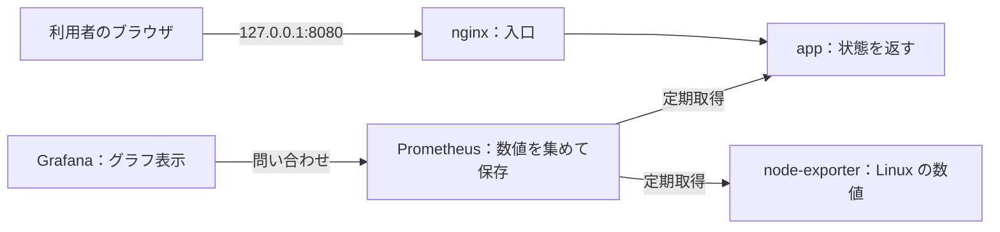

# server — Linux / Windows Server の構築・監視の学習ポートフォリオ

[](https://github.com/ns7jp/server/actions/workflows/python-check.yml)
[](https://github.com/ns7jp/server/actions/workflows/full-stack-e2e.yml)

**未経験からサーバー構築エンジニアを目指す私が、「サーバーを作る → 動作を確かめる → 異常を調べる → 元へ戻す」を学ぶための個人学習ラボです。**
業務での構築・運用経験を示すものではありません。コード・手順・試験記録をつなぎ、確認できた範囲を自分の言葉で説明することを目指します。

## 手元の VM で私が確認したこと

採用向けには、まず次の実行記録をご覧ください。いずれも **AI の手順案内を受けて、私が手元の Hyper-V 上の VM を操作し、結果を画面で確認した実習**です。AI を使わずに再現した記録は、まだありません。

| 実施日 | 私の操作と確認結果 |
| --- | --- |
| 2026-09-01〜02 | [AD の構築・試験](docs/evidence/2026-09-01-ad-build-validation.md)：Windows Server 2022 評価版の `ad-dc01`（VM 1 台）で AD DS（ドメインの認証基盤）を構築し、試験仕様書のフェーズ 1 必須 31 項目がすべて PASS。手順書・設計書の欠陥 6 件を実機で見つけて修正 |
| 2026-09-02 | [System State 復元](docs/evidence/2026-09-02-ad-restore-drill.md)：非権威復元で、バックアップ後に作った目印の OU が消えることを確認。復元処理 15 分 29 秒、復旧全体は約 40 分（うち約 18 分は `safeboot` 解除漏れによるやり直し）。当日見落とした SYSVOL の欠損は翌日に訂正 |
| 2026-09-03〜04 | [2 台目の DC と複製](docs/evidence/2026-09-03-ad-second-dc-replication.md)：複製の失敗 0/5、遅延 17.8 秒。GPO（グループポリシー）が届かない原因を、前日の復元で欠けた `gpt.ini` と特定して修復。[計画停止](docs/evidence/2026-09-03-ad-dc-outage-drill.md)：1 台を止めても DNS・LDAP・Kerberos が継続し、復帰後の収束は 18 分 31 秒。[FSMO 奪取](docs/evidence/2026-09-04-ad-fsmo-seize.md)：正常停止した 1 台を失った想定で、残った DC へ FSMO 役割（特定の DC だけが担う管理役割）を奪取し、`ntdsutil` で古い DC の情報を削除 |
| 2026-09-07〜08 | [WSUS の構築](docs/evidence/2026-09-07-wsus-build-validation.md)：更新配信サーバー `wsus-01` をドメインに参加させて構築。必須 28 項目中 26 PASS / 1 FAIL / 1 期待結果未達で、判定は FAIL。翌日、[残った 2 件の原因](docs/evidence/2026-09-08-wsus-sit04-sit06-root-cause.md)を実機で特定し、手順書を修正（SIT-06 は承認ルールの分類・製品が 0 件で保存され、「絞り込みなし」と解釈されていた。修正後の通し再試験は未実施） |
| 2026-09-07〜08 | [Ubuntu 初期構築](docs/evidence/2026-09-08-lab-base01-initial-build.md)：固定 IP、SSH 鍵認証、sudo、UFW、時刻同期、自動更新を手作業で設定し、わざと起こした設定不備から復旧（OS 単体の演習） |
| 2026-09-08 | [Docker 最小構成](docs/evidence/2026-09-08-lab-base01-compose-practice.md)：app と nginx の 2 サービスを起動し、未認証 401・認証あり 200、計画停止・手動再開を確認 |
| 2026-09-08 | [数値監視](docs/evidence/2026-09-08-lab-base01-monitoring-practice.md)：Prometheus / Grafana で収集状態の 1→0→1。[ログ検索](docs/evidence/2026-09-08-lab-base01-loki-practice.md)：目印付き Nginx ログ 2 件（メモリ 2 GiB の VM で、それぞれ 5 / 6 サービスを分けて起動） |
| 2026-09-08 | [バックアップ復元](docs/evidence/2026-09-08-lab-base01-restore-practice.md)：Loki の別名ボリューム（同じ VM 内）から同じログ 2 件を読取り。[D-1](docs/evidence/2026-09-08-lab-base01-d1-practice.md)：アプリの自動再起動で再起動回数 0→1、HTTP 復帰 2 秒（1 回の計測）、その後 healthy を確認 |

Ansible と Git の小さな練習（2026-09-09〜15）の記録は、[練習ログ](docs/evidence/practice/README.md)に分けています。各記録で確認できていない範囲は、それぞれの証跡と下の[実装と検証の範囲](#実装と検証の範囲)に書いています。

AD の作業結果と、障害・課題 15 件（LAB-01〜15）の対処は[作業結果・引き渡し報告](docs/evidence/2026-09-02-work-result-SM-AD-001.md)にまとめています。

Linux の演習は、次に [小さな構成の再起動・24 時間点検・別 VM 復元・引き渡し](docs/partial-lab-continuation.md)へ進みます。**この続編は手順を準備した段階で、新しい実機結果は `NOT RUN`** です。過去の記録を上書きせず、実行した段階だけ追記します。

## 採用ご担当者向け：最初に見る 3 本

手元の VM で確認した記録のうち、特に説明したいものを 3 本に絞りました。

1. **AD の冗長化と復旧**：[構築・試験](docs/evidence/2026-09-01-ad-build-validation.md)・[System State 復元](docs/evidence/2026-09-02-ad-restore-drill.md)・[FSMO 奪取](docs/evidence/2026-09-04-ad-fsmo-seize.md)
2. **Ubuntu の構築と監視**：[初期構築](docs/evidence/2026-09-08-lab-base01-initial-build.md)・[数値監視](docs/evidence/2026-09-08-lab-base01-monitoring-practice.md)
3. **原因の切り分け**：[WSUS の SIT-04 / SIT-06 原因特定](docs/evidence/2026-09-08-wsus-sit04-sit06-root-cause.md)

背景を知りたい場合は、[構成と設計判断](docs/design-decisions.md)、[AD 構築案件パック](docs/build-package-ad/README.md)、[失敗から学んだ事例](docs/lessons-learned.md)をご覧ください。すべての記録は[検証証跡台帳](docs/evidence/README.md)の「主要な記録」と、2026-09-09〜15 の細かな Ansible / Git 練習を集めた[練習ログ](docs/evidence/practice/README.md)に分けています。`terraform/` の AWS 構成は[未実行（NOT RUN）](terraform/README.md)です。

**2026-09-17 の性能改善**: [旧 CI の分析](docs/evidence/2026-09-17-performance-ci-analysis.md)で HTTP 502 の集計漏れを見つけ、集計・CI 判定と上流接続の再利用を修正しました。[比較と確認試験](docs/evidence/2026-09-17-upstream-keepalive-comparison.md)では、同じ負荷設定の 2 回の CI で、並列 1/2/4/8/16 の HTTP・通信失敗が 0 件でした。最終試験では、認証（未認証 401・認証あり 200）と、アプリの IP を変えた後の復旧も確かめました。AI 支援による分析・改善で、測定は使い捨て runner での短時間のものです（長期運用や本番の容量は対象外）。

[保存済み証跡のデモ](https://ns7jp.github.io/demo.html)は 2026-08-18/19 の画像・ログを再構成した閲覧用リプレイで、実操作の連続録画ではありません。

## 構成



**最初は左の 3 要素だけで考えます。** Linux は動作の土台、Docker Compose は部品の起動係です。上の矢印はリクエストの方向です。Grafana が Prometheus に問い合わせて数値を受け取ります。ログ収集と通知まで含む構成は [詳細な構成図](docs/architecture.md) にあります。

コンテナ内の `psutil` は実行環境から見える値を返します。すべてがコンテナの使用量だけを表すとは限らないため、Linux ホストの監視は `node-exporter` 側で確認します。

<a id="3分で説明するなら"></a>

## 30 秒で説明するなら

> サーバーを構築し、動作確認と障害対応まで学ぶ個人ラボです。Linux 上でアプリを動かし、応答と認証を確認します。次に Prometheus で数値を集め、Grafana で見えるようにします。実際に行った操作と結果を記録し、未実施の内容も分けて説明します。

「私が構築・検証しました」と話すのは、自分の実行記録がある項目に限ります。

## 実装と検証の範囲

| 区分 | このリポジトリで示せるもの | 境界 |
| --- | --- | --- |
| 実装済み | 認証付き Flask アプリ、Compose、監視、Ansible、復旧手順 | コードが存在することと各環境で動作することは別 |
| 記録済みの CI 実測 | [2026-08-22 の E2E](docs/evidence/2026-08-22-full-stack-e2e.md)：一括構築・冪等性・復旧・復元など 23 ID PASS | 当該 commit の使い捨て Ubuntu runner。最新差分や永続ホストの保証には使わない |
| 記録済みの VM 実測 | [2026-09-04 Ubuntu の基盤構築](docs/evidence/2026-09-04-ansible-foundation-build.md)と[AlmaLinux の基盤構築](docs/evidence/2026-09-04-ansible-foundation-el9-build.md)：`foundation.yml` の `common` / `docker` role 適用・冪等性 | 監視全体の `site.yml` とは別。AlmaLinux は再利用 VM で、新規構築・最小公開の証明には未到達 |
| 記録済みの手作業構築（2026-09） | [手元の VM で私が確認したこと](#手元の-vm-で私が確認したこと)の Ubuntu・Docker 最小構成・AD / WSUS の各記録。AD / WSUS は [AD 構築案件パック](docs/build-package-ad/README.md)と [WSUS 構築案件パック](docs/build-package-wsus/README.md)の手順書・試験仕様書に沿って構築・試験し、実機で見つけた手順書の誤り・欠落（AD 6 件・WSUS 9 件）を修正（[AD の作業結果](docs/evidence/2026-09-02-work-result-SM-AD-001.md)・[WSUS の作業結果](docs/evidence/2026-09-07-work-result-SM-WSUS-001.md)） | AI の手順案内を受けた手作業で、本リポジトリの Ansible（Windows 用 role を含む）は使っていない。監視全体の同時稼働と通知、組織 DNS・クライアント PC、中央 Prometheus からの収集（BLOCKED）、電源断からの復旧、独力での再現、長期稼働は `NOT RUN` |
| 未実施 | AWS の実適用・削除、Slack 実配信、監視ラボの長期稼働、D-2 ホスト障害復元 | `NOT RUN`。[実測計画](docs/real-environment-validation-plan.md)を参照 |

実行者が私・CI・AI 支援環境のどれかは、各証跡に書いています。

## ドキュメント

| 読みたいこと | 開く文書 |
| --- | --- |
| 最初の実習を進める | [初心者向け学習ガイド](docs/beginner-learning-guide.md) |
| 確認を繰り返しすぎず安全に作業を閉じる | [手放して進める運用キット](docs/work-completion/README.md)（詳細設計・記録テンプレート・判定サンプル） |
| 次の学習範囲を決める | [一本道ラーニングパス](docs/learning-path.md)（Level 0〜5 と選択式 Level 6） |
| 言葉の意味を、たとえと覚え方で確かめる | [サーバー基礎用語集（やさしい版）](docs/server-basics-glossary/README.md)（408 語・五十音さくいん付き） |
| 知らない言葉を、このリポジトリのファイルと結び付けて調べる | [サーバー構築キーワード集](docs/server-building-keywords.md) |
| コマンド・結果・説明を記録する | [初心者実習記録テンプレート](docs/evidence/templates/beginner-practice-record.md) |
| 要件や設計書の読み方を知る | [案件パック初心者ガイド](docs/build-package/beginner-guide.md) |
| 機能・OS・AWS・各案件パックを探す | [実装・設計・教材の詳細一覧](docs/project-reference.md) |

## 学習に使う方へ

**最初に開く文書は [初心者向け学習ガイド](docs/beginner-learning-guide.md) です。**
最初は Linux 上の `app`（応答するアプリ）と `nginx`（通信の入口）の **2 サービス**だけを動かします。監視と Ansible は、その後に追加して学びます。

| 順番 | やること | できたかの確認 |
| --- | --- | --- |
| 1. 見る | ガイドの構成図と 5 つの用語を読む | 入口とアプリの役割を言える |
| 2. 動かす | 専用 Linux 検証環境で最小構成を起動する | `app` と `nginx` が起動する |
| 3. 確認する | 応答と認証の有無を比べる | health は `200`、認証なしの画面は `401` |
| 4. 壊して直す | 正常時の記録後に計画停止・再開する | 停止前・停止中・復旧後の違いを記録する |
| 5. 説明する | [学習記録](docs/evidence/templates/beginner-practice-record.md)を基に話す | 自分で確認したことと未実施を分けて言える |

コードの取得と前提診断は **Linux の Bash、取得した `server` ディレクトリ内**で行います。Linux の準備がまだなら、ガイドの「実行場所と準備」から始めてください。

```bash
git clone https://github.com/ns7jp/server.git
cd server
bash scripts/learning/check-prerequisites.sh --minimal
```

環境がまだなくても、ガイドの図と HTTP の期待値を読む 10 分の練習から始められます。`--minimal` は最初の 2 サービス用の診断です。`FAIL` が出たら表示された `NEXT` を確認します。実習の終了時は同じ場所で `docker compose down` を使います。操作前の予想・実結果・自分の説明を記録し、後日の再現と分けて振り返ります。

## AI の利用について

文書作成、コード生成、レビュー、検証補助に AI を使っています。AI が生成したコードや説明は、私が実行・理解するまで実績として扱いません。学習記録には **自分で実行・説明できる範囲、AI に支援された範囲、未確認の範囲**を残します。[利用範囲の詳細](docs/project-reference.md#ai-の利用について)も公開しています。

<details>
<summary>以前の README の節から探す</summary>

<a id="実装したこと"></a><a id="ダッシュボード機能"></a><a id="構成管理ansible"></a><a id="クラウド配備aws--terraform"></a><a id="slo--エラーバジェット"></a><a id="復旧演習"></a><a id="変更管理"></a><a id="ログ集約"></a><a id="セキュアな初期値"></a><a id="ディレクトリ構成"></a><a id="対応-os"></a><a id="手を動かす演習b-シリーズ"></a><a id="現在の制約と次の拡張"></a><a id="まず読む文書"></a><a id="発展的な設計将来構想"></a>

各機能・構成・演習・制約は [詳細一覧](docs/project-reference.md)へ移しました。

<a id="docker-compose-で起動"></a><a id="アプリ単体で起動"></a><a id="テスト"></a>

起動と確認は [初心者向け学習ガイド](docs/beginner-learning-guide.md)、配備方法の比較は [詳細一覧](docs/project-reference.md)を参照してください。

</details>

## License

[MIT License](LICENSE)

## Author

島田則幸 (Noriyuki Shimada)
