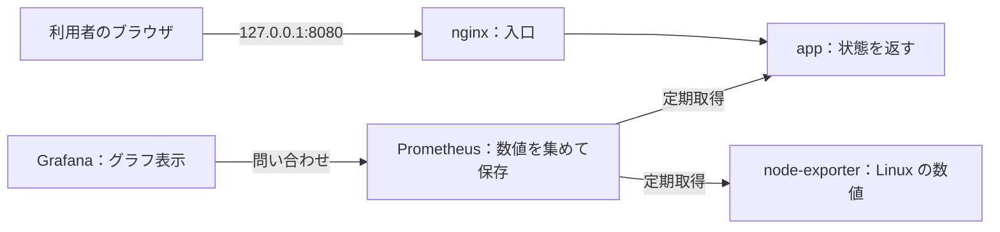

# server — Linux サーバー構築・監視の学習ポートフォリオ

[](https://github.com/ns7jp/server/actions/workflows/python-check.yml)
[](https://github.com/ns7jp/server/actions/workflows/full-stack-e2e.yml)

**「サーバーを作る → 動作を確かめる → 異常を調べる → 元へ戻す」を学ぶ、未経験サーバー構築エンジニア志望者の個人学習ラボです。**
業務での構築・運用経験を示すものではありません。コード・手順・試験記録をつなぎ、確認できた範囲を自分の言葉で説明することを目指します。

## 未経験から始める方へ

**最初に開く文書は [初心者向け学習ガイド](docs/beginner-learning-guide.md) です。**
最初は Linux 上の `app`（応答するアプリ）と `nginx`（通信の入口）の **2 サービス**だけを動かします。監視と Ansible は、その後に追加して学びます。

| 順番 | やること | できたかの確認 |
| --- | --- | --- |
| 1. 見る | ガイドの構成図と 5 つの用語を読む | 入口とアプリの役割を言える |
| 2. 動かす | 専用 Linux 検証環境で最小構成を起動する | `app` と `nginx` が起動する |
| 3. 確認する | 応答と認証の有無を比べる | health は `200`、認証なしの画面は `401` |
| 4. 壊して直す | 正常時の記録後に計画停止・再開する | 停止前・停止中・復旧後の違いを記録する |
| 5. 説明する | [学習記録](docs/evidence/templates/beginner-practice-record.md)を基に話す | 自分で確認したことと未実施を分けて言える |

コードの取得と前提診断は **Linux の Bash、取得した `server` ディレクトリ内**で行います。Linux の準備がまだなら、ガイドの「実行場所と準備」から始めてください。

```bash
git clone https://github.com/ns7jp/server.git
cd server
bash scripts/learning/check-prerequisites.sh
```

`FAIL` が出たら表示された `NEXT` を確認します。初回実習は環境構築時間を含めて急がず進め、終了時は同じ場所で `docker compose down` を使います。詳しい成功条件・失敗時の分岐・再開方法はガイドにまとめています。

## 構成



**最初は左の 3 要素だけで考えます。** Linux は動作の土台、Docker Compose は部品の起動係です。上の矢印はリクエストの方向です。Grafana が Prometheus に問い合わせて数値を受け取ります。ログ収集と通知まで含む構成は [詳細な構成図](docs/architecture.md) にあります。

コンテナ内の `psutil` は実行環境から見える値を返します。すべてがコンテナの使用量だけを表すとは限らないため、Linux ホストの監視は `node-exporter` 側で確認します。

<a id="3分で説明するなら"></a>
## 30 秒で説明するなら

> サーバーを構築し、動作確認と障害対応まで学ぶ個人ラボです。Linux 上でアプリを動かし、応答と認証を確認します。次に Prometheus で数値を集め、Grafana で見えるようにします。実際に行った操作と結果を記録し、未実施の内容も分けて説明します。

これはプロジェクトの紹介例です。「私は構築・検証しました」と話す範囲は、自分の実行記録がある項目に限ります。[3 分説明の型・想定質問・復習方法](docs/beginner-learning-guide.md#5-説明して定着させる)で練習できます。

## 採用ご担当者向け：最初に見る 4 点

1. [構成と設計判断](docs/design-decisions.md)：何を作り、なぜその構成にしたか。
2. [Linux 構築案件パック](docs/build-package/README.md)：要件 → 設計値 → 構築 → 試験 → 証跡 → 運用 → 変更の文書。
3. [検証証跡台帳](docs/evidence/README.md)：実行日時・環境・対象 commit・結果・未実施の範囲。
4. [失敗から学んだ事例](docs/lessons-learned.md)：想定が外れた原因、修正と再発防止。

[保存済み証跡のデモ](https://ns7jp.github.io/demo.html)は 2026-08-18/19 の画像・ログを再構成した閲覧用リプレイで、実操作の連続録画ではありません。

## 実装と検証の範囲

| 区分 | このリポジトリで示せるもの | 境界 |
| --- | --- | --- |
| 実装済み | 認証付き Flask アプリ、Compose、監視、Ansible、復旧手順 | コードが存在することと各環境で動作することは別 |
| 記録済みの CI 実測 | [2026-08-22 の E2E](docs/evidence/2026-08-22-full-stack-e2e.md)：一括構築・冪等性・復旧・復元など 23 ID PASS | 当該 commit の使い捨て Ubuntu runner。最新差分や永続ホストの保証には使わない |
| 記録済みの VM 実測 | [2026-09-04 Ubuntu の基盤構築](docs/evidence/2026-09-04-ansible-foundation-build.md)と[AlmaLinux の基盤構築](docs/evidence/2026-09-04-ansible-foundation-el9-build.md)：`foundation.yml` の `common` / `docker` role 適用・冪等性 | 監視全体の `site.yml` とは別。AlmaLinux は再利用 VM で、新規構築・最小公開の証明には未到達 |
| 未実施 | AWS の実適用・削除、Slack 実配信、監視ラボの長期稼働、D-2 ホスト障害復元 | `NOT RUN`。[実測計画](docs/real-environment-validation-plan.md)を参照 |

実行者が本人・CI・AI 支援環境のどれかも各証跡で区別します。既存の PASS を、読む人自身の習得・実行実績へ転記しません。

## ドキュメント

| 読みたいこと | 開く文書 |
| --- | --- |
| 最初の実習を進める | [初心者向け学習ガイド](docs/beginner-learning-guide.md) |
| 確認を繰り返しすぎず安全に作業を閉じる | [手放して進める運用キット](docs/work-completion/README.md)（詳細設計・記録テンプレート・判定サンプル） |
| 次の学習範囲を決める | [一本道ラーニングパス](docs/learning-path.md)（Level 0〜5 と選択式 Level 6） |
| 知らない言葉を調べる | [サーバー構築キーワード集](docs/server-building-keywords.md) |
| コマンド・結果・説明を記録する | [初心者実習記録テンプレート](docs/evidence/templates/beginner-practice-record.md) |
| 要件や設計書の読み方を知る | [案件パック初心者ガイド](docs/build-package/beginner-guide.md) |
| 機能・OS・AWS・各案件パックを探す | [実装・設計・教材の詳細一覧](docs/project-reference.md) |

## AI の利用について

文書作成、コード生成、レビュー、検証補助に AI を使っています。本人の理解や実施を代行した実績として扱いません。学習記録には **自分で実行・説明できる範囲、AI に支援された範囲、未確認の範囲**を残します。[利用範囲の詳細](docs/project-reference.md#ai-の利用について)も公開しています。

<details>
<summary>以前の README の節から探す</summary>

<a id="実装したこと"></a><a id="ダッシュボード機能"></a><a id="構成管理ansible"></a><a id="クラウド配備aws--terraform"></a><a id="slo--エラーバジェット"></a><a id="復旧演習"></a><a id="変更管理"></a><a id="ログ集約"></a><a id="セキュアな初期値"></a><a id="ディレクトリ構成"></a><a id="対応-os"></a><a id="手を動かす演習b-シリーズ"></a><a id="現在の制約と次の拡張"></a><a id="まず読む文書"></a><a id="発展的な設計将来構想"></a>

各機能・構成・演習・制約は [詳細一覧](docs/project-reference.md)へ移しました。

<a id="docker-compose-で起動"></a><a id="アプリ単体で起動"></a><a id="テスト"></a>

起動と確認は [初心者向け学習ガイド](docs/beginner-learning-guide.md)、配備方法の比較は [詳細一覧](docs/project-reference.md)を参照してください。

</details>

## License

[MIT License](LICENSE)

## Author

島田則幸 (Noriyuki Shimada)
