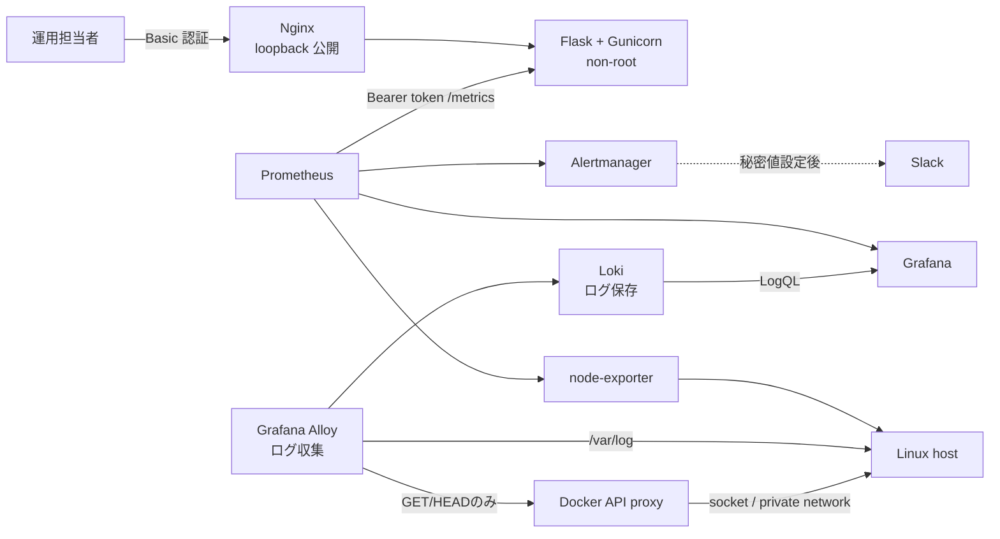

# Server Monitor Infrastructure Lab

[](https://github.com/ns7jp/server-monitor/actions/workflows/python-check.yml)
[](https://github.com/ns7jp/server-monitor/actions/workflows/full-stack-e2e.yml)


**Ubuntu serverをAnsibleで構築し、Prometheus / Grafana / Lokiで監視して、障害注入・自動復旧・backup restoreまで再実行可能にしたインフラ構築lab**です。

Python / Flask で作成したサーバー状態表示アプリを、認証、コンテナ配備、監視収集、アラート、運用手順まで含むポートフォリオへ拡張しています。

単に画面を作るのではなく、「安全に公開範囲を制限できるか」「停止や高負荷をどう検知し、どう切り分けるか」を設計・検証対象にしています。

## 採用ご担当者向け：最初に見る 3 点

1. **2分15秒デモ** — [保存済み実測証跡リプレイ](https://ns7jp.github.io/demo.html)。2026-08-18/19のscreen shotとD-1 logを再構成した閲覧用映像で、実操作の連続録画ではありません。[2026-08-22 E2E](docs/evidence/2026-08-22-full-stack-e2e.md)では実terminalの`demo.cast`もartifact化しました。
2. **構成と構築工程** — [構成図](docs/architecture.md) / [Linux server構築案件pack](docs/build-package/README.md)。
3. **実測証跡** — [検証証跡台帳](docs/evidence/README.md) / [新規host一気通貫E2E](docs/e2e-validation.md)。未実行をPASSにしません。

> **実測の現状（2026-08-22）**: PR #75のruntime変更最終commit
> `7622a9da974f694ae75e0173135923701be9e5a5`に対する
> [Full-stack E2E run 32572409469](https://github.com/ns7jp/server-monitor/actions/runs/32572409469)で、
> **使い捨てUbuntu 24.04 hostへの`site.yml`一括適用、2回目`changed=0`、11 containersの稼働、
> 認証、Prometheus target、Docker API proxyのGET成功・POST拒否・Loki log到達、
> ローカルwebhook通知、loopback/UFW/SSH tunnel、D-1自動復旧（1秒）、
> 3 volumesのchecksum付きbackup / 別volume restoreを23/23 ID PASS**として採録しました。
> 同じcommitに対するAnsible check、Security scan、Backup verify、Python checkも成功しています。
> 判定表・環境・測定値・artifact digestは
> [日付付き証跡](docs/evidence/2026-08-22-full-stack-e2e.md#pr-75-hardening後の再検証)に固定し、
> raw logは期限付きActions artifactに保存しています。
>
> 2026-08-18/19のWSL2実測、D-1 RTO 13秒、二セグメント障害ラボ、
> [21項目中11項目PASSの結果票](docs/evidence/2026-08-19-build-validation.md)は当時の履歴として保持します。
> 今回のE2EはSlack実配信、AWS `apply / destroy`、D-2、構成commit / 設定rollback rehearsal、
> 長期稼働host、実管理端末・組織DNS・
> cloud firewallを対象にしていません。実行ログが無い項目は実績として扱いません。
> 詳細な境界は[検証証跡台帳](docs/evidence/README.md)を参照してください。

## 実装したこと

| 分野 | 実装・成果物 |
| --- | --- |
| アプリ監視 UI | Flask + psutil + Chart.js による CPU、メモリ、ディスク、ネットワーク、プロセス表示 |
| アクセス制御 | UI / JSON API の Basic 認証、Prometheus metrics の Bearer token 認証 |
| 情報保護 | ホスト名と OS ユーザー名を既定でマスク、秘密値を Docker secrets ファイルで管理 |
| 稼働監視 | 情報を露出しない `/healthz`、保護された `/metrics` |
| 配備 | 非 root `Dockerfile`、Nginx、Docker Compose、native Linux 用 systemd / TLS 設定例 |
| 標準監視基盤 | Prometheus + node-exporter + Grafana + Alertmanager |
| ログ集約 | Loki + Grafana Alloy でコンテナログとホスト `/var/log` を収集。AlloyはDocker socketを直接持たず、専用proxyのGET/HEAD限定APIを使用 |
| 障害対応 | アラートルール、停止ランブック、CPU 高負荷の模擬インシデント記録 |
| 構成管理 | Ansible roles で OS / Docker / TLS / 監視設定 / アプリ配備 / バックアップを宣言的に管理 |
| クラウド配備 | Terraform で AWS 上に同等構成をコード化（[詳細](docs/aws-architecture.md)。apply 未実施） |
| SLO 運用 | `/healthz` の定期チェックと、しきい値を超えたときのアラート通知（[詳細](docs/slo.md)） |
| 復旧演習 | D-1 はローカル実測RTO 13秒（[2026-08-19](docs/drills/logs/2026-08-19-D-1.md)）とE2E実測RTO 1秒（[2026-08-22](docs/evidence/2026-08-22-full-stack-e2e.md)）。D-2 はランブック・テンプレートのみで未実測 |
| 変更管理 | PR ごとに目的・影響範囲・ロールバック手順を書いて残す運用（[詳細](docs/change-management.md)） |
| 品質確認 | pytest、構成検証、ansible-lint、Molecule 構文検証、任意実行の完全 Molecule、Terraform 検証、Trivy / pip-audit、Dependabot |
| 一気通貫 E2E | disposable Ubuntuへ`site.yml`を2回適用し、runtime/network/通知/障害/restoreを[2026-08-22に全項目PASS](docs/evidence/2026-08-22-full-stack-e2e.md)。raw logと判定表をartifact化 |

## 構成



重要な点として、コンテナ化した Flask アプリの `psutil` 表示はアプリコンテナの状態です。Linux ホスト全体の監視は `node-exporter` と Grafana 側で扱い、役割を混同しない設計にしています。

## ドキュメント

### まず読む文書

| 文書 | 内容 |
| --- | --- |
| [Linux サーバー構築案件パック](docs/build-package/README.md) | 基本・詳細設計、パラメータ、ネットワーク、構築、試験、引き渡し |
| [インフラ監視ラボ設計](docs/architecture.md) | 構成図、設計判断、監視条件 |
| [セキュリティ設計](docs/security.md) | 認証、秘密管理、公開範囲、残存リスク |
| [構築・配備手順](docs/deployment.md) | Docker Compose と native Linux 配備例 |
| [Ansible 配備手順](docs/deployment-ansible.md) | Ubuntu host向け一括構築playbook、roles 構成、Vault、Molecule |
| [新規host一気通貫E2E](docs/e2e-validation.md) | `site.yml`適用、冪等性、network、D-1、backup restoreの自動検証と証跡境界 |
| [バックアップ・復旧設計](docs/backup-restore.md) | 永続データ、復元試験、復旧目標 |
| [運用ランブック索引](docs/runbooks/README.md) | 共通実行前提、停止・遅延・disk・memory・監視停止時の切り分け |
| [CPU 高負荷演習記録](docs/incidents/cpu-high-drill.md) | 模擬障害の再現、確認、復旧、再発防止 |
| [復旧演習一覧](docs/drills/README.md) | D-1（実測済み）と、環境待ちの D-2 の整理 |
| [LogQL クエリ集](docs/loki-queries.md) | ダッシュボードと運用で使う LogQL の例 |
| [検証証跡台帳](docs/evidence/README.md) | コード実装と実環境での実測を区別する検証状況 |
| [ローカル証跡採録ガイド](docs/evidence/local-evidence-quickstart.md) | Grafana / Loki / Alertmanager / D-1 演習を実測証跡に変える最短手順 |
| [2〜3 分デモ収録ガイド](docs/demo-capture-guide.md) | デプロイ、故障注入、通知、復旧を短尺動画にする収録手順 |

### 発展的な設計・将来構想

まだ実機で試していない、または個人ラボの規模を超えた設計。コードや文書は用意しているが、
実務経験として語れる段階ではないものとして区別している。

| 文書 | 内容 |
| --- | --- |
| [AWS / Terraform 設計](docs/aws-architecture.md) | VPC / ALB / EC2 などの構成コード（apply 未実施） |
| [AWS コスト計画](docs/cost-report.md) | 月額試算、Budgets |
| [SLO / SLI / エラーバジェット設計](docs/slo.md) | サービス品質目標の決め方とアラート条件 |
| [変更管理ミニ運用](docs/change-management.md) | PR / Issue で目的、影響範囲、ロールバックを記録する運用 |
| [latency-spike ランブック](docs/runbooks/latency-spike.md) | `/healthz` p95 が 500ms を越えた際の切り分け |
| [監視の監視ランブック](docs/runbooks/alertmanager-down.md) | Alertmanager / blackbox-exporter 停止時の対応 |
| [ディスク逼迫ランブック](docs/runbooks/disk-full.md) | ファイルシステム使用率 85% 超過時の切り分け |
| [メモリ逼迫ランブック](docs/runbooks/memory-pressure.md) | メモリ使用率 90% 超過時の切り分け |
| [スナップショット命名規則](docs/backup-naming.md) | バックアップアーティファクトのタグと命名 |
| [インシデント周知テンプレ](docs/incident-comms.md) | Slack へ流す状態遷移ごとの定型文 |

## ダッシュボード機能


> **この画像について**: 上の画面は **Linux(WSL2) 上で実際に起動して撮影したもの**（[実測証跡](docs/evidence/2026-08-18-local-observability.md)）。
> 実測済みと未実測の境界は [検証証跡台帳](docs/evidence/README.md) を参照。

| 機能 | 概要 |
| --- | --- |
| System Info | OS、論理ノード名、アーキテクチャ、起動時刻、稼働時間、Load Average、プロセス数 |
| CPU | 使用率、コア別表示、周波数 |
| Memory / Swap | 使用率、使用量、空き容量 |
| Disk | パーティション使用率と閾値表示 |
| Network I/O | 累積送受信量と画面更新間隔内の速度 |
| History | CPU / メモリの直近60秒グラフ |
| Top Processes | CPU 使用率上位15件。ユーザー名は既定で非表示 |

## 構成管理（Ansible）

新規ホストの構築と運用変更は `ansible/` 配下の playbook と roles に統一している。配備手順書（[docs/deployment.md](docs/deployment.md)）は **Ansible 版（[docs/deployment-ansible.md](docs/deployment-ansible.md)）へ移行済み** で、リファレンス扱い。

| ロール | 役割 |
| --- | --- |
| `common` | timezone / UFW / SSH hardening / unattended-upgrades / アプリ用ユーザー作成 |
| `docker` | Docker CE + Compose plugin の導入、`daemon.json` でログローテーション |
| `nginx` | ホスト側 TLS（Let's Encrypt / 自己署名）。Nginx 本体は compose スタック内 |
| `monitoring` | app が配備した Prometheus / Loki / Alertmanager 設定を実コンテナで構文検証 |
| `app` | リポジトリ同期、Vault由来の秘密値と環境別Alertmanager設定の生成、`docker compose up -d` |
| `backup` | systemd timer で日次の Prometheus / Grafana / Loki volume スナップショット |

```bash
cd ansible
ansible-galaxy collection install -r requirements.yml
cp inventory/staging.local.yml.example inventory/staging.local.yml
$EDITOR inventory/staging.local.yml  # 対象IP、SSH user、40桁commit SHAへ置換
umask 077
cp inventory/group_vars/monitor/vault.yml.example inventory/group_vars/monitor/vault.yml
$EDITOR inventory/group_vars/monitor/vault.yml  # 3種類の秘密値を設定
openssl rand -base64 48 > .vault_pass
chmod 600 .vault_pass inventory/group_vars/monitor/vault.yml
ansible-vault encrypt inventory/group_vars/monitor/vault.yml --vault-password-file .vault_pass
export ANSIBLE_VAULT_PASSWORD_FILE="$PWD/.vault_pass"
ansible-playbook -i inventory/staging.local.yml playbooks/site.yml --check --diff
ansible-playbook -i inventory/staging.local.yml playbooks/site.yml
```

実hostへ適用する前に、[完全なAnsible配備手順](docs/deployment-ansible.md)の前提、
fresh hostでのcheck modeの限界、実行後確認、rollback条件を確認する。

CI では `ansible-lint` と Molecule scenario の構文検証を常時実行する。完全な
`molecule test` は `ansible-integration.yml`、host全体の構築・冪等性・復旧は
`full-stack-e2e.yml`で実行し、後者はraw log、結果TSV、terminal castをartifactへ残す。

## クラウド配備（AWS / Terraform）

`terraform/` 配下に AWS 上の同等構成を IaC として用意した。VPC からアラート通知まで
5 モジュール（`network` / `compute` / `alb` / `monitoring` / `backup`）に責務を分離し、
環境別（`dev` / `prod`）の `terraform/environments/<env>/` を呼び出すパターン。

```bash
cd terraform/environments/dev
cp backend.hcl.example backend.hcl       # 実値を入れる（コミット禁止）
cp terraform.tfvars.example terraform.tfvars
terraform init -backend-config=backend.hcl
terraform plan
terraform apply
```

通信の暗号化、アクセス範囲の制限、監査ログの有効化など、基本的なセキュリティ初期値を
コードに含めている。CI では `terraform fmt / validate` に加えて静的スキャンを毎回実行する。
個々の設定内容は [docs/aws-architecture.md](docs/aws-architecture.md) を参照。

このコードが AWS で稼働した実績や実費を意味するものではない。ALB 配下の各 EC2 に
同居するローカル監視データは中央の正本とせず、本番相当では外部 probe と中央保存を
追加する。詳細は [docs/aws-architecture.md](docs/aws-architecture.md)、
[docs/cost-report.md](docs/cost-report.md)、[docs/evidence/README.md](docs/evidence/README.md) を参照。

## SLO / エラーバジェット

`server-monitor` のサービス品質の目標値を数値で定義し、計測query、recording rule、
dashboard、burn-rate alertを実装している。ラボ内の blackbox-exporter は Nginx 経由で
`/healthz` を 30 秒間隔でprobeし、Prometheusが30日窓の成功率を計算できる。
起動時点のprobeとE2Eは実測済みだが、同一hostを30日連続稼働させた達成率の証跡は未採録である。

| 項目 | 目標 | 期間 |
| --- | --- | --- |
| 可用性 | 99.5% | 30 日（許容ダウンタイム 216 分 / 月） |
| `/healthz` p95 | < 500ms | 28 日 |
| アラート到達時間 | < 2 分 | 月次手動テスト |

目標を下回りそうなペースになったらアラートで知らせる仕組みを Prometheus / Alertmanager
に実装している。仕組みの詳細（アラートの条件設計や参考にした考え方）は
[docs/slo.md](docs/slo.md) にまとめた。

Grafana `Server Monitor SLO` ダッシュボード (`uid=slo-overview`) で可用性、目標消費の
残量、`/healthz` のレイテンシを 1 画面で見られる。

## 復旧演習

「バックアップではなく、リストアが運用できることが価値」のため、演習を月次・四半期で
回し、実時間 RTO / RPO を実測する設計である。D-1 はローカルでRTO 13秒
（[2026-08-19](docs/drills/logs/2026-08-19-D-1.md)）、ephemeral E2EでRTO 1秒
（[2026-08-22](docs/evidence/2026-08-22-full-stack-e2e.md)）を実測した。D-2は実行ログがないため、
演習手順と自動化コードが整備済みという範囲で提示する。

| 演習 | 頻度 | 想定時間 | 環境 | 自動化 |
| --- | --- | --- | --- | --- |
| **D-1** プロセスダウン → 自動復旧 | 月次 | 15 分 | ローカル Docker / ephemeral runner | 実測済み（RTO 13秒 / 1秒） / `scripts/drills/d1-process-down.sh` |
| **D-2** ホスト障害 → 別ホストに復元 | 四半期 | 2 時間 | AWS staging | 未実測 / 手動（ランブック化）|

```bash
# D-1 を実行
./scripts/drills/d1-process-down.sh
```

人手の演習を補うため、`.github/workflows/backup-verify.yml` が毎日 04:00 UTC に：

- Ansible が生成するバックアップシェルスクリプトを **shellcheck** で検査
- ダミー volume を tar 圧縮し、展開可能性まで **smoke test**
- （任意）AWS Backup の最新 recovery point の鮮度を OIDC 経由で確認

実施計画と振り返りテンプレは [docs/drills/](docs/drills/) を、演習由来の改善履歴は
[docs/backup-restore.md](docs/backup-restore.md) を参照。

## 変更管理

運用変更は PR と Issue に、目的、影響範囲、検証、ロールバック、証跡リンクを残す。
個人ラボでも「いつ、何を、なぜ変え、どう戻せるか」を追えるよう、
[PR テンプレート](.github/pull_request_template.md) と
[Change request Issue](.github/ISSUE_TEMPLATE/change-request.yml) を用意した。

監視、通知、Nginx、Ansible、Terraform、AWS 費用に影響する変更は、実装前に
[変更管理ミニ運用](docs/change-management.md) のチェック項目を使う。証跡採録は
[Evidence capture Issue](.github/ISSUE_TEMPLATE/evidence-capture.yml) と
[ローカル証跡採録ガイド](docs/evidence/local-evidence-quickstart.md) に沿って記録する。

## ログ集約

`Loki + Grafana Alloy` でメトリクスと同じ Grafana 画面からログを参照する。Promtail は
2026 年 3 月 2 日に EOL となったため、収集エージェントは Alloy に移行した。

| 要素 | 役割 | 公開範囲 |
| --- | --- | --- |
| Grafana Alloy | コンテナログ（Docker discovery）と `/var/log/{syslog,auth.log,messages,secure}` を Loki に転送 | `monitoring` + 専用`docker-api`内部ネットワーク |
| Docker API proxy | Alloyにcontainer/network discoveryとログ取得のGET/HEADだけを提供。host portは非公開 | Alloyだけが参加する`docker-api`内部ネットワーク |
| Loki | ログの保存とクエリ。リテンション 30 日、ファイルシステムストレージ | `127.0.0.1:3100`（API のみ、ブラウザ用 UI はない） |
| Grafana | Loki データソースとして登録。Server Monitor ダッシュボードに Logs パネルを内蔵 | `127.0.0.1:3000` |

ラベル設計は **「集計に使う固定値だけラベル化、それ以外は本文に残す」** とし、カーディナリティの爆発を避ける。クエリ例は [LogQL クエリ集](docs/loki-queries.md) に整理した。

- Docker socketを直接マウントするのは専用proxyだけで、Alloyはprivate network越しに
  `CONTAINERS=1` / `NETWORKS=1` / `POST=0`のAPIを利用する。socketの`:ro`だけでは
  API操作を制限できないため、固有Nginx logのLoki到達とPOST拒否をE2Eで検査する。
  hostの`monitor`ユーザーにもdocker groupを付与しない。詳細は
  [セキュリティ設計](docs/security.md)を参照。
- Loki のポート 3100 は loopback のみに公開する。Loki 自体には認証がないため、外部公開しない設計である。
- ログ量が増えた場合は `deploy/loki/loki-config.yml` の `limits_config.retention_period` と `compactor` で調整する。

## セキュアな初期値

| エンドポイント | 認証 | 内容 |
| --- | --- | --- |
| `/healthz` | 不要 | 稼働確認のみ。ホスト情報は含まない |
| `/`、`/api/stats`、`/api/processes` | Basic 認証 | ダッシュボードと表示用データ |
| `/metrics` | Bearer token | Prometheus 収集専用 |

- 資格情報が未設定の場合、ダッシュボードと metrics は `503` で応答し、意図せず公開されません。
- `MONITOR_SHOW_HOSTNAME=false` と `MONITOR_SHOW_USERNAMES=false` が既定です。
- Compose 構成でブラウザ向けに公開するポートは `127.0.0.1` に限定しています。

## Docker Compose で起動

対象は Linux 検証ホストです。`node-exporter` が Linux のホスト情報を読み取るため、Windows / macOS 上の Docker Desktop ではホスト監視結果が同一になりません。

```bash
git clone https://github.com/ns7jp/server-monitor.git
cd server-monitor
cp .env.example .env
openssl rand -base64 32 > deploy/secrets/dashboard_password.txt
openssl rand -base64 32 > deploy/secrets/metrics_token.txt
openssl rand -base64 32 > deploy/secrets/grafana_admin_password.txt
chmod 700 deploy/secrets
chmod 644 deploy/secrets/*.txt
docker compose up -d --build
```

| 画面 | URL |
| --- | --- |
| Server Monitor UI | `http://127.0.0.1:8080/` |
| Grafana | `http://127.0.0.1:3000/` |
| Prometheus | `http://127.0.0.1:9090/` |
| Alertmanager | `http://127.0.0.1:9093/` |
| Loki (内部 API) | `http://127.0.0.1:3100/` |

詳細は [構築・配備手順](docs/deployment.md) を参照してください。

## アプリ単体で起動

開発時も既定では認証が必要です。

```bash
python -m venv .venv
source .venv/bin/activate
pip install -r requirements-dev.txt
export MONITOR_USERNAME=monitor
export MONITOR_PASSWORD='replace-with-a-long-random-password'
export MONITOR_METRICS_TOKEN='replace-with-a-long-random-token'
export MONITOR_NODE_NAME='local-test-node'
python app.py
```

loopback での短時間の UI 開発に限り、`MONITOR_AUTH_DISABLED=true` で UI 認証を無効にできます。`0.0.0.0` で待ち受ける環境では使用しません。

## テスト

```bash
pip install -r requirements-dev.txt
python -m compileall app.py tests
pytest
```

GitHub Actions では、API の認証・マスキング・metrics テストに加えて、Grafana dashboard JSON、Docker Compose、Prometheus / Alertmanager / Loki / Alloy 設定、非 root アプリイメージの build を検証します。依存・秘密値・構成のスキャンは `security-scan.yml`、更新提案は Dependabot が担います。

## ディレクトリ構成

```text
server-monitor/
|-- app.py
|-- Dockerfile
|-- compose.yaml
|-- deploy/
|   |-- alloy/
|   |-- alertmanager/
|   |-- grafana/provisioning/
|   |-- nginx/
|   |-- prometheus/
|   |-- secrets/
|   `-- systemd/
|-- docs/
|   |-- architecture.md
|   |-- security.md
|   |-- deployment.md
|   |-- backup-restore.md
|   |-- incidents/
|   `-- runbooks/
|-- static/
|-- templates/
`-- tests/
```

## 現在の制約と次の拡張

- 単一ホストの検証構成であり、監視基盤の冗長化は対象外です。
- AWS Terraform は構成コードを実装済みですが、AWS上のapply / destroy、費用、復元試験の実測証跡はまだありません。
- `site.yml`一括構築・冪等性、runner内network/UFW/待受、backup restoreは[2026-08-22の自動E2E](docs/evidence/2026-08-22-full-stack-e2e.md)でPASSです。GitHub runner imageにはDocker等が事前導入されていたため、最小OSからの導入証跡とはしません。実管理端末・組織DNS・cloud firewallを含むproduction相当のnetwork証跡とも区別します。
- Slack 通知は Webhook 秘密値をコミットしないため、`compose.slack.yaml.example` を重ねて利用環境で有効化する方式です。
- 次の拡張候補は、外部 probe、中央 telemetry、SSO / VPN 連携、リモートストレージへの長期 metrics 保存です。

## License

MIT License

## Author

島田則幸 (Noriyuki Shimada)
