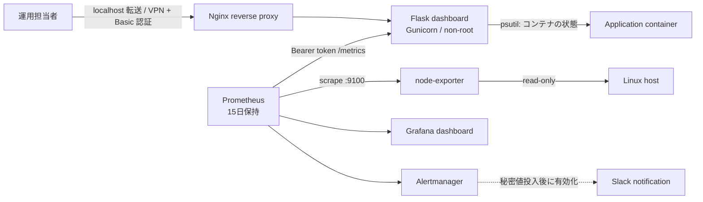

# インフラ監視ラボ設計

## 目的

小規模な Linux サーバーの監視を題材に、構築、アクセス制御、可視化、アラート、障害対応を一連で検証できる構成を作る。Flask ダッシュボードはアプリケーション実装の題材、Prometheus / Grafana / Alertmanager は運用を想定した監視基盤として役割を分ける。

## 構成図

## コンポーネント

| コンポーネント | 役割 | 公開範囲 |
| --- | --- | --- |
| Nginx | ダッシュボードの入口、セキュリティヘッダー付与 | Compose では `127.0.0.1:8080` のみ |
| Flask / Gunicorn | 独自 UI、API、独自 Prometheus metrics | Docker 内部ネットワーク |
| node-exporter | Linux ホストの CPU、メモリ、ファイルシステム収集 | Docker 内部ネットワーク |
| Prometheus | 収集、ルール評価、15日分の履歴保持 | `127.0.0.1:9090` |
| Alertmanager | アラートの集約、通知ルーティング | `127.0.0.1:9093` |
| Grafana | 運用向けダッシュボード | `127.0.0.1:3000` |

## 重要な設計判断

| 判断 | 理由 |
| --- | --- |
| ダッシュボードは既定で Basic 認証必須 | プロセス情報やリソース情報を無認証で開示しないため |
| `/metrics` は別の Bearer token で保護 | 人が閲覧する権限と監視収集の権限を分離するため |
| ホスト名とユーザー名は既定でマスク | 情報漏えい時の影響を小さくするため |
| Web アプリを非 root コンテナで実行 | アプリ侵害時の権限を限定するため |
| Compose の公開ポートは loopback のみ | 学習環境で誤って LAN / Internet に露出しないため |
| ホスト監視には node-exporter を採用 | コンテナ内の `psutil` だけではホスト全体の監視にならないため |
| 履歴は Prometheus TSDB に保持 | UI の短期グラフではなく、障害調査で遡れる履歴を残すため |

## 収集とアラート

| 対象 | メトリクス / 条件 | 対応 |
| --- | --- | --- |
| Flask ダッシュボード | `up{job="server-monitor"} == 0` が2分継続 | サービス停止ランブックを実施 |
| Linux ホスト収集 | `up{job="linux-node"} == 0` が2分継続 | exporter / ホスト接続を確認 |
| CPU | 85%超が10分継続 | 高負荷プロセスと直近変更を確認 |
| メモリ | 90%超が10分継続 | OOM、キャッシュ、プロセス増大を確認 |
| ディスク | 85%超が15分継続 | ログ増大、不要ファイル、容量計画を確認 |

`server-monitor` の `/metrics` は CPU / メモリ / 稼働秒数 / Load Average (1m, 5m, 15m) / プロセス数 / アプリプロセス起動時刻 / ディスク使用率を Prometheus に提供する。ホスト全体の詳細な収集は `node-exporter` 側に集約する。

## 可用性と拡張

このラボは単一ホストでの学習・検証を対象とし、冗長化は行わない。本番相当へ拡張する場合は、TLS 終端、VPN または SSO、外部永続ストレージ、複数 node-exporter の収集、通知先の当番運用を追加する。
