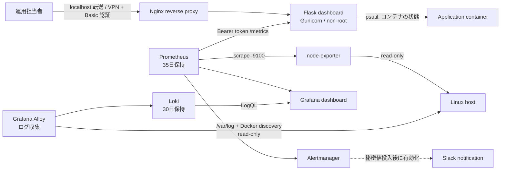
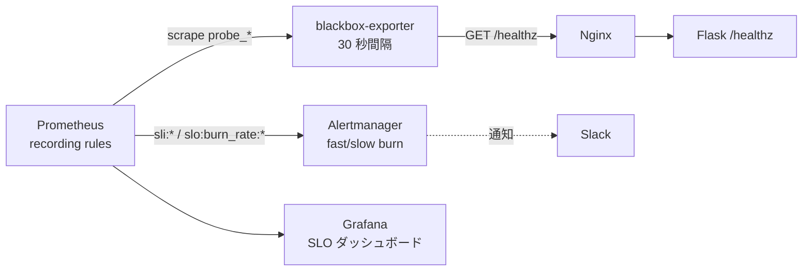

# インフラ監視ラボ設計

## 目的

小規模な Linux サーバーの監視を題材に、構築、アクセス制御、可視化、アラート、障害対応を一連で検証できる構成を作る。Flask ダッシュボードはアプリケーション実装の題材、Prometheus / Grafana / Alertmanager / Loki は運用を想定した監視・ログ基盤として役割を分ける。

## 構成図

## コンポーネント

| コンポーネント | 役割 | 公開範囲 |
| --- | --- | --- |
| Nginx | ダッシュボードの入口、セキュリティヘッダー付与 | Compose では `127.0.0.1:8080` のみ |
| Flask / Gunicorn | 独自 UI、API、独自 Prometheus metrics | Docker 内部ネットワーク |
| node-exporter | Linux ホストの CPU、メモリ、ファイルシステム収集 | Docker 内部ネットワーク |
| Prometheus | 収集、ルール評価、35日分の履歴保持 | `127.0.0.1:9090` |
| Alertmanager | アラートの集約、通知ルーティング | `127.0.0.1:9093` |
| Grafana | 運用向けダッシュボード（Prometheus + Loki データソース） | `127.0.0.1:3000` |
| Grafana Alloy | コンテナログと `/var/log` の収集、Loki への転送 | Docker 内部ネットワーク |
| Loki | ログの保存とクエリ、30日分の履歴保持 | `127.0.0.1:3100`（API のみ） |

## 重要な設計判断

| 判断 | 理由 |
| --- | --- |
| ダッシュボードは既定で Basic 認証必須 | プロセス情報やリソース情報を無認証で開示しないため |
| `/metrics` は別の Bearer token で保護 | 人が閲覧する権限と監視収集の権限を分離するため |
| ホスト名とユーザー名は既定でマスク | 情報漏えい時の影響を小さくするため |
| Web アプリを非 root コンテナで実行 | アプリ侵害時の権限を限定するため |
| Compose の公開ポートは loopback のみ | 学習環境で誤って LAN / Internet に露出しないため |
| 公開対象だけ `host-access` bridgeにも接続 | `internal` networkだけではLinux hostへのport転送が作られないため。内部通信用の`frontend` / `monitoring`は維持し、host側は`127.0.0.1` bindとUFWで制限する |
| ホスト監視には node-exporter を採用 | コンテナ内の `psutil` だけではホスト全体の監視にならないため |
| 履歴は Prometheus TSDB に保持 | UI の短期グラフではなく、障害調査で遡れる履歴を残すため |
| ログは Loki に集約 | アラートで気づいた異常の原因を、同じ Grafana 画面で即時に追跡するため |
| ログラベルは固定値のみ | カーディナリティ爆発を避け、Loki の単一ホスト構成を安定動作させるため |
| Alloy は読み取り専用マウント | ホストの `/var/log` と Docker socket / メタデータを侵害時に書き換えられないため |

## 収集とアラート

| 対象 | メトリクス / 条件 | 対応 |
| --- | --- | --- |
| Flask ダッシュボード | `up{job="server-monitor"} == 0` が2分継続 | サービス停止ランブックを実施 |
| Linux ホスト収集 | `up{job="linux-node"} == 0` が2分継続 | exporter / ホスト接続を確認 |
| CPU | 85%超が10分継続 | 高負荷プロセスと直近変更を確認 |
| メモリ | 90%超が10分継続 | OOM、キャッシュ、プロセス増大を確認 |
| ディスク | 85%超が15分継続 | ログ増大、不要ファイル、容量計画を確認 |

`server-monitor` の `/metrics` は CPU / メモリ / 稼働秒数 / Load Average (1m, 5m, 15m) / プロセス数 / アプリプロセス起動時刻 / ディスク使用率を Prometheus に提供する。ホスト全体の詳細な収集は `node-exporter` 側に集約する。

## SLO と SLI 計測経路

`server-monitor` は社内向け監視ダッシュボードとして以下の SLO を定める（詳細は
[docs/slo.md](slo.md) を参照）。

| SLO | 目標 | 計測 |
| --- | --- | --- |
| 可用性 | 99.5% / 30 日 | blackbox-exporter が Nginx 経由で `/healthz` を 30 秒間隔で GET |
| `/healthz` p95 | < 500ms / 28 日 | blackbox-exporter `probe_duration_seconds` |
| アラート到達時間 | < 2 分 | 月次の手動テスト |

バジェットの消費ペースは Prometheus の recording rule
（`slo:burn_rate:rate{5m,30m,1h,6h}`）で計算し、各アラートには対応するランブック URL
を `annotations.runbook_url` で付与する。Alertmanager と blackbox-exporter 自身の
`up` も監視対象に含め、監視の仕組み自体が止まっていないかも確認できるようにしている。
詳細は [docs/slo.md](slo.md) を参照。

## ログ収集とラベル設計

| 対象 | ジョブ | 主なラベル |
| --- | --- | --- |
| Compose 上のコンテナ stdout / stderr | `containers` | `container`、`service`、`compose_project`、`stream` |
| Nginx access log（pipeline 抽出） | `containers`（`service="nginx"`） | 上記 + `method`、`status` |
| ホストの `/var/log/{syslog,auth.log,messages,secure}` | `varlogs` | `job`、`host`、`process` |

ラベルにしないもの：クライアント IP、URL パス、リクエスト ID、ユーザー ID、その他高カーディナリティの値。LogQL の本文検索 `|=` / `|~` で絞り込む。リテンションは Loki `limits_config.retention_period: 720h`（30 日）で開始し、ディスク使用量を測定したうえで調整する。

ログ起点のアラートを追加する場合、Loki Ruler が同じ Alertmanager (`http://alertmanager:9093`) にルーティングする設計のため、Prometheus 由来のアラートと統一の通知経路で扱える。

## 構成管理

OS 設定、Docker / Compose スタック、監視配付物、秘密値、バックアップは Ansible（`ansible/`）で管理する。役割分担は次のとおり。

| ロール | 担当 |
| --- | --- |
| `common` | timezone、UFW、SSH ハードニング、unattended-upgrades、アプリ用ユーザー |
| `docker` | Docker CE、Compose plugin、`daemon.json`（ログローテーション + live-restore） |
| `nginx` | ホスト側 TLS（Let's Encrypt または自己署名）。Nginx 本体は compose 内 |
| `monitoring` | app が配備した Prometheus / Loki / Alertmanager 設定の実コンテナ構文検証 |
| `app` | リポジトリ同期、Vault由来の秘密値と環境別Alertmanager設定の生成、`docker compose up -d` |
| `backup` | systemd timer による Prometheus / Grafana / Loki volume の日次スナップショット |

CI（`.github/workflows/ansible-check.yml`）で `ansible-lint` と Molecule scenario の
構文を確認する。冪等性と verify を含む完全な `molecule test` は手動 workflow
（`.github/workflows/ansible-integration.yml`）の実行結果を証跡として残す。
詳細手順は [Ansible 配備手順](deployment-ansible.md) を参照。

## 可用性と拡張

このラボは単一ホストでの学習・検証を対象とし、冗長化は行わない。本番相当へ拡張する場合は、TLS 終端、VPN または SSO、対象ホスト外からの probe、外部永続ストレージ（Prometheus は remote_write、Loki は S3 互換のチャンクストア）、複数 node-exporter / Alloy の収集、通知先の当番運用を追加する。
