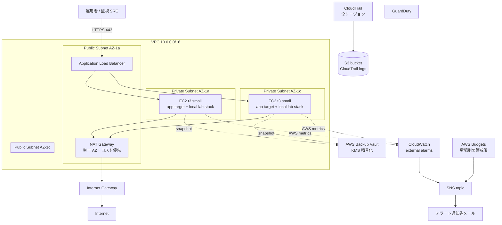

# AWS / Terraform アーキテクチャ

オンプレ / 単一 VM 構成だった server-monitor を AWS 上に IaC で再構築するため、
v2.0 で Terraform 化した。Ansible（v1.2）は EC2 内部の設定担当として残し、
Terraform は VPC からモニタリング基盤までを宣言的に管理する。

## 実装範囲と検証状態

`terraform/` は AWS リソースを作成する構成コードとして実装済みである。一方、
実 AWS アカウントでの `terraform apply`、障害試験、実費測定の証跡は現時点では
未収録である。実行結果は [検証証跡台帳](evidence/README.md) に沿って記録し、
コードが存在することを稼働実績として表現しない。

この設計は AWS のベストプラクティス集や公式ドキュメントを参考に組み立てたもので、
実務での AWS 運用経験に基づくものではない。

## 全体構成



## 観測境界

ALB の target は Flask / Nginx のサービス入口（`:8080`）であり、各 EC2 に
同居する Prometheus / Loki / Grafana のローカルデータを ALB 配下で一つの
監視基盤として扱わない。2 台の node-local TSDB / ログ履歴は互いに独立しており、
どちらの Grafana に接続したかで見える履歴が変わるためである。

| 用途 | 現時点の位置付け | 本番相当で追加すべきもの |
| --- | --- | --- |
| ローカル学習 | Compose 上の Prometheus / Loki / Grafana / Alloy | 追加なし |
| AWS アプリ可用性の外部観測 | ALB / EC2 の CloudWatch alarm を Terraform で定義 | CloudWatch Synthetics 等、対象ホスト外からの `/healthz` probe |
| 中央 metrics / logs | 未実装。node-local データは正本にしない | AMP `remote_write`、CloudWatch Logs または object storage backed Loki（詳細設計は[外部 probe / 中央 telemetry 設計](roadmap/external-probe-central-telemetry.md)） |

Compose 内の blackbox-exporter はラボでの SLI 計算には有効だが、同じホストが
停止すると probe 自体も止まる。AWS で外形 SLO を主張するには、ホスト外の probe
と中央保存された観測結果の証跡を追加する。構成図・採用方針・Definition of Done は
[外部 probe / 中央 telemetry 設計](roadmap/external-probe-central-telemetry.md)に
まとめてあり、実装はしていないが空白ではない。

## モジュール責務

| モジュール | 担当範囲 |
| --- | --- |
| `network` | VPC、Subnet、IGW、NAT、Route Table |
| `compute` | EC2、IAM、EBS、夜間停止スケジュール |
| `alb` | ALB、Target Group、Listener、ACM |
| `monitoring` | CloudWatch アラーム、SNS、費用アラート |
| `backup` | AWS Backup Vault、Plan、Selection |

ALB と Compute の **循環依存** を避けるため、`aws_lb_target_group_attachment` は
モジュール内ではなく `environments/<env>/main.tf` で配線する。

## セキュリティ設計

| 領域 | 実装 |
| --- | --- |
| 公開範囲 | EC2 はプライベートサブネットのみに置き、ALB だけをインターネットに公開する |
| 通信の暗号化 | ALB は TLS 終端、EC2 のディスク（EBS）は暗号化して保存する |
| EC2 への接続 | SSH は開けず、SSM Session Manager 経由でのみ接続する |
| 監査ログ | CloudTrail と VPC Flow Logs で API 呼び出しと通信ログを記録し、GuardDuty で不審な挙動を検知する |
| 未使用のデフォルト設定 | 既定のセキュリティグループは空ルールでロックし、誤って使われないようにする |

## Ansible との接続

EC2 は `Application=server-monitor` タグと `AnsibleHost=true` タグを持つ。
Ansible 側は `ansible/inventory/aws_ec2.yml.example` の動的インベントリで
これらのタグから対象ホストを集める。

```bash
cd ansible
ansible-galaxy collection install amazon.aws
cp inventory/aws_ec2.yml.example inventory/aws_ec2.yml
# Environmentを対象環境へ限定し、SSM bucket/regionも実環境へ合わせる
ansible-inventory -i inventory/aws_ec2.yml --graph
ansible-playbook -i inventory/aws_ec2.yml \
  -e ansible_connection=amazon.aws.aws_ssm playbooks/site.yml
```

SSH ではなく SSM Session Manager 経由で接続する場合は `ansible_connection: aws_ssm`
を使う。`amazon.aws.aws_ssm` connection plugin を導入し、IAM 上で `ssm:StartSession`
を許可した踏み台ユーザーで実行する。

## トラフィック経路

| 区間 | プロトコル | 補足 |
| --- | --- | --- |
| User → ALB | HTTPS (TLS 1.2/1.3) | ACM 証明書、`drop_invalid_header_fields` |
| ALB → EC2 | HTTP 8080 | EC2 SG が ALB SG のみ許可。VPC 内 |
| EC2 → 外部 | HTTPS / HTTP（NAT 経由） | apt、Docker Hub、SSM、CloudWatch エンドポイント |
| EC2 → NTP | UDP 123 (169.254.169.123) | Amazon Time Sync Service |
| Prometheus → EC2 内 `/metrics` | HTTP（Bearer token） | Compose 内ネットワーク内 |

Composeのlocal/CI既定は全管理portを`127.0.0.1`へbindする。AWS inventoryだけはNginx入口8080を
`0.0.0.0`へ明示変更する。authoritativeな到達制御はEC2 Security GroupのALB Security Group参照で、
UFWにもTerraformがtagへ記録したVPC CIDRのhost policyを残す。ただしDockerのpublished portがUFW
INPUTを通るとは仮定しない。3000 / 9090 / 9093 / 3100はAWSでもloopbackのままにする。

## 障害設計

| 障害想定 | 期待動作 | 検出 |
| --- | --- | --- |
| EC2 1 台故障 | ALB が他 AZ EC2 に振り分け継続（適用後に要検証） | `UnHealthyHostCount` アラーム |
| EC2 全台異常 | ALB 5xx 急増 → アラート、運用者が確認 | `HTTPCode_ELB_5XX_Count` アラーム |
| EBS 故障 | AWS Backup の最新スナップショットから復元 | EC2 ステータスチェック失敗アラーム |
| 設定誤りで EC2 停止 | EC2 ステータスチェック failed → 通知 → 復旧 | `StatusCheckFailed` アラーム |
| 予期せぬ課金 | Budgets 80% / 100% で SNS 通知 | `aws_budgets_budget` |
| 不審 API コール | GuardDuty findings | GuardDuty + 後続のレビュー |

GuardDuty detectorはaccount / regionごとに1個なので、同一accountでdev / staging / prodを
重ねても各stackから作成しません。本構成では長期利用するprod rootだけがGuardDutyと
account-wide CloudTrailを所有し、devとD-2 stagingはその共有controlを重複作成しません。
別account構成へ移す場合は、application stackではなくaccount baselineの専用stateで管理します。

図と表のHTTPS記載はproduction境界を示す。ACM証明書を設定しないdev / D-2 stagingは、
短時間検証に限ってHTTP 80を使い、ALB Security Groupの許可元を承認済みCIDRへ限定する。
productionは`certificate_arn`が必須で、Security GroupもHTTPS 443だけを許可する。

## 拡張余地（将来構想）

現時点では実装していない、思いついている改善案。

- ホスト外からの死活監視、メトリクス・ログの一元化（[docs/roadmap/external-probe-central-telemetry.md](roadmap/external-probe-central-telemetry.md)）
- NAT・EC2 の冗長化、公開 FQDN、WAF などの本番運用向け強化
