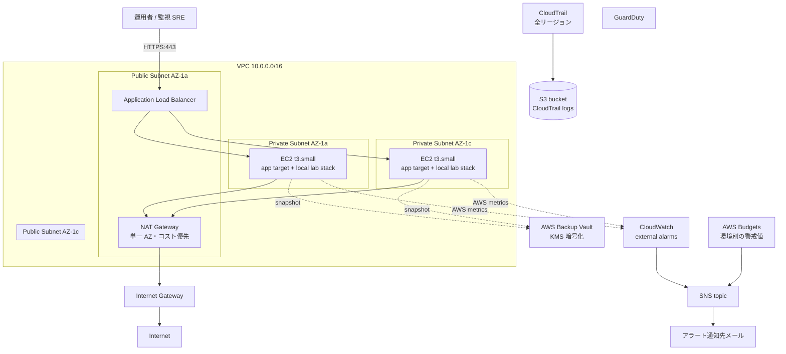

# AWS / Terraform アーキテクチャ

オンプレ / 単一 VM 構成だった server-monitor を AWS 上に IaC で再構築するため、
v2.0 で Terraform 化した。Ansible（v1.2）は EC2 内部の設定担当として残し、
Terraform は VPC からモニタリング基盤までを宣言的に管理する。

## 実装範囲と検証状態

`terraform/` は AWS リソースを作成する構成コードとして実装済みである。一方、
実 AWS アカウントでの `terraform apply`、障害試験、実費測定の証跡は現時点では
未収録である。実行結果は [検証証跡台帳](evidence/README.md) に沿って記録し、
コードが存在することを稼働実績として表現しない。

## 全体構成



## 観測境界

ALB の target は Flask / Nginx のサービス入口（`:8080`）であり、各 EC2 に
同居する Prometheus / Loki / Grafana のローカルデータを ALB 配下で一つの
監視基盤として扱わない。2 台の node-local TSDB / ログ履歴は互いに独立しており、
どちらの Grafana に接続したかで見える履歴が変わるためである。

| 用途 | 現時点の位置付け | 本番相当で追加すべきもの |
| --- | --- | --- |
| ローカル学習 | Compose 上の Prometheus / Loki / Grafana / Alloy | 追加なし |
| AWS アプリ可用性の外部観測 | ALB / EC2 の CloudWatch alarm を Terraform で定義 | CloudWatch Synthetics 等、対象ホスト外からの `/healthz` probe |
| 中央 metrics / logs | 未実装。node-local データは正本にしない | AMP `remote_write`、CloudWatch Logs または object storage backed Loki |

Compose 内の blackbox-exporter はラボでの SLI 計算には有効だが、同じホストが
停止すると probe 自体も止まる。AWS で外形 SLO を主張するには、ホスト外の probe
と中央保存された観測結果の証跡を追加する。

## モジュール責務

| モジュール | 担当範囲 | 主リソース |
| --- | --- | --- |
| `network` | VPC、Subnet、IGW、NAT、Route Table、VPC Flow Logs | `aws_vpc` / `aws_subnet` / `aws_nat_gateway` / `aws_flow_log` |
| `compute` | EC2、IMDSv2、IAM、EBS（KMS 暗号化）、夜間停止スケジュール | `aws_instance` / `aws_kms_key.ebs` / `aws_scheduler_schedule` |
| `alb` | ALB、Target Group、Listener、ACM、アクセスログ S3 | `aws_lb` / `aws_lb_listener` / `aws_lb_target_group` / `aws_s3_bucket.access_logs` |
| `monitoring` | CloudWatch アラーム、SNS、CloudTrail、GuardDuty、AWS Budgets | `aws_cloudwatch_metric_alarm` / `aws_sns_topic` / `aws_cloudtrail` / `aws_guardduty_detector` / `aws_budgets_budget` |
| `backup` | AWS Backup Vault、Plan、Selection、長期アーカイブ S3 | `aws_backup_vault` / `aws_backup_plan` / `aws_s3_bucket.archive` |

ALB と Compute の **循環依存** を避けるため、`aws_lb_target_group_attachment` は
モジュール内ではなく `environments/<env>/main.tf` で配線する。

## セキュリティ設計

| 領域 | 実装 |
| --- | --- |
| 公開範囲 | EC2 はプライベートサブネットのみ。インターネットへの egress は NAT 経由。ALB のみパブリック |
| ALB ingress | `allowed_ingress_cidrs` で制限。prod は validation で 1 件以上必須 |
| ALB TLS | `ELBSecurityPolicy-TLS13-1-2-2021-06`、prod は `certificate_arn` 必須 |
| EC2 認証 | SSH は既定で閉じ、SSM Session Manager のみ。インスタンスプロファイルで SSM 権限付与 |
| IMDS | v2 強制（`http_tokens = "required"`） |
| EBS | gp3、暗号化（顧客管理 KMS）、ルートも含めて all encrypted |
| S3 | アクセスログ用バケットは AES256（ALB の仕様）、CloudTrail / Archive は KMS。すべて Public Access Block 有効、Versioning 有効、`aws:SecureTransport=false` 拒否 |
| KMS | EBS / Flow Logs / 監査ログ / Backup の 4 系統で分離。すべて自動ローテーション有効 |
| 監査 | CloudTrail（全リージョン、ログ検証、KMS 暗号化、CloudWatch Logs 連携）+ GuardDuty + VPC Flow Logs |
| デフォルト SG | `aws_default_security_group` を空ルールでロックし、誤って使われないようにする |

## Ansible との接続

EC2 は `Application=server-monitor` タグと `AnsibleHost=true` タグを持つ。
Ansible 側は `ansible/inventory/aws_ec2.yml.example` の動的インベントリで
これらのタグから対象ホストを集める。

```bash
cd ansible
ansible-galaxy collection install amazon.aws
ansible-inventory -i inventory/aws_ec2.yml --graph
ansible-playbook -i inventory/aws_ec2.yml playbooks/site.yml
```

SSH ではなく SSM Session Manager 経由で接続する場合は `ansible_connection: aws_ssm`
を使う。`amazon.aws.aws_ssm` connection plugin を導入し、IAM 上で `ssm:StartSession`
を許可した踏み台ユーザーで実行する。

## トラフィック経路

| 区間 | プロトコル | 補足 |
| --- | --- | --- |
| User → ALB | HTTPS (TLS 1.2/1.3) | ACM 証明書、`drop_invalid_header_fields` |
| ALB → EC2 | HTTP 8080 | EC2 SG が ALB SG のみ許可。VPC 内 |
| EC2 → 外部 | HTTPS / HTTP（NAT 経由） | apt、Docker Hub、SSM、CloudWatch エンドポイント |
| EC2 → NTP | UDP 123 (169.254.169.123) | Amazon Time Sync Service |
| Prometheus → EC2 内 `/metrics` | HTTP（Bearer token） | Compose 内ネットワーク内 |

## 障害設計

| 障害想定 | 期待動作 | 検出 |
| --- | --- | --- |
| EC2 1 台故障 | ALB が他 AZ EC2 に振り分け継続（適用後に要検証） | `UnHealthyHostCount` アラーム |
| EC2 全台異常 | ALB 5xx 急増 → アラート、運用者が確認 | `HTTPCode_ELB_5XX_Count` アラーム |
| EBS 故障 | AWS Backup の最新スナップショットから復元 | EC2 ステータスチェック失敗アラーム |
| 設定誤りで EC2 停止 | EC2 ステータスチェック failed → 通知 → 復旧 | `StatusCheckFailed` アラーム |
| 予期せぬ課金 | Budgets 80% / 100% で SNS 通知 | `aws_budgets_budget` |
| 不審 API コール | GuardDuty findings | GuardDuty + 後続のレビュー |

## 拡張余地

- CloudWatch Synthetics などを使い、監視対象ホスト外から `/healthz` を測定する
- Metrics / logs の正本を AMP / CloudWatch Logs または中央 Loki に移し、EC2 ごとの履歴分断を解消する
- `single_nat_gateway = false` で NAT を AZ ごとに作り、NAT 障害時の冗長性を確保する
- EC2 を Auto Scaling Group + Launch Template に置き換え、Self-healing を導入する
- Prometheus の long-term storage を `remote_write` で AWS Managed Prometheus (AMP) に転送する
- Route 53 + ACM で公開 FQDN を構成する
- WAF を ALB の前段に追加し、SQL injection / XSS の基本的な保護を入れる
