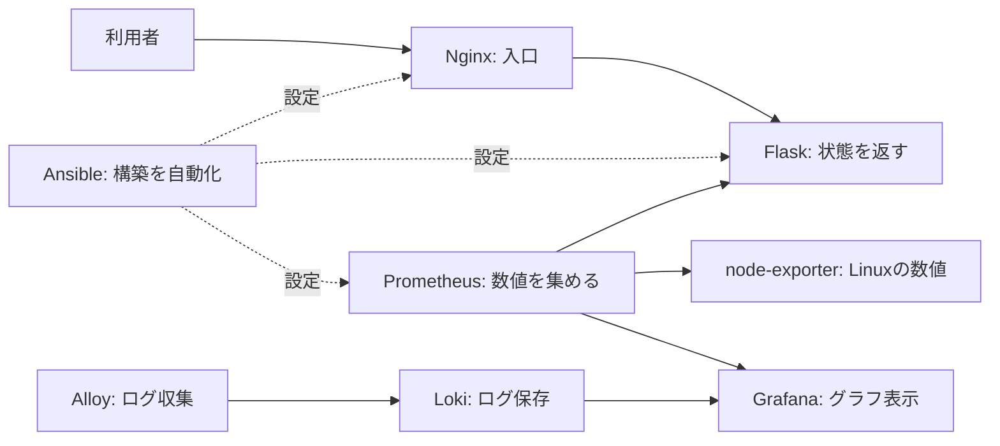

# 初心者向け学習ガイド

> **難易度**: 🟢 BEGINNER / **所要時間**: 約90分
> 全体の必修・選択範囲は[一本道ラーニングパス](learning-path.md)を先に確認してください。
> 前提診断で`FAIL`が出た場合は、その解消が先になるため約90分では終わりません。

開始前に、設定を変更しない前提診断を実行します。

```bash
./scripts/learning/check-prerequisites.sh
```

`FAIL`があれば先へ進みません。表示された`NEXT`を確認し、学習記録には`BLOCKED`と残します。
`WARN`は合格を意味しませんが、影響を理解したうえで続行できます。

このガイドは、Linuxサーバー構築が未経験の人のための道順です。教材には `server-monitor` を使います。
目標は「動かした」で終わらせず、「構成と確認方法を説明できる」状態になることです。

## ゴール

完了時に、次の5点を自分の言葉で説明できれば合格です。

1. サーバー、コンテナ、監視の役割の違い
2. Prometheusが集め、Grafanaが表示する流れ
3. Ansibleが目指す冪等性（べきとうせい。2回目に実行しても差分が出ない性質）とは何か
   （このガイドでは`site.yml`を読むだけで実行はしない。実際に2回実行して確認するのはLevel 4）
4. サービス停止時に、状態、ログ、通信の順で調べる理由
5. `PASS`、`FAIL`、`BLOCKED`、`NOT RUN` の違い

## 学習前の安全ルール

- 会社や公開中のサーバーではなく、削除できるLinux検証環境を使う
- 秘密値をGitへ追加しない。`git status --short` で毎回確認する
- `sudo` を付ける前に、対象ファイル、ホスト、コマンドの作用を確認する
- AWSの `terraform apply` はこの入門では実行しない。料金が発生し、外部公開の可能性もあるため
- 実行結果がない項目を `PASS` にしない。未実行は `NOT RUN` と書く

## 全体像を一文で覚える

> AnsibleでLinuxを構築し、Docker Composeでアプリと監視基盤を動かし、
> Prometheusが数値を集め、Grafanaが見える形にする。



## 90分で進める5ステップ

| 手順 | 目安 | 学ぶこと | 完了条件 |
| --- | ---: | --- | --- |
| 1. 見る | 10分 | ファイルと役割 | 主要5要素を言える |
| 2. 小さく確認 | 15分 | Pythonテスト | テスト結果を記録した |
| 3. 起動する | 25分 | Composeと認証 | コンテナ状態とhealthを確認した |
| 4. 切り分ける | 25分 | 状態・ログ・通信 | 原因と復旧を記録した |
| 5. 説明する | 15分 | 証跡と振り返り | 3分で説明できた |

### 1. 見る

**一言でいうと**: どのファイルが何をしている部品なのかを言えるようになります。

最初に読むのは次のファイルだけです。

| ファイル | 役割 | 見つけるもの |
| --- | --- | --- |
| [`compose.yaml`](../compose.yaml) | 起動するサービスの一覧 | `services:` と `ports:` |
| [`app.py`](../app.py) | 監視画面のAPI | `/healthz` と `/metrics` |
| [`prometheus.yml`](../deploy/prometheus/prometheus.yml) | 収集先の設定 | `scrape_configs` |
| [`site.yml`](../ansible/playbooks/site.yml) | 一括構築の入口 | `roles:` |
| [構成図](architecture.md) | サービス間の通信 | 認証と公開範囲 |

確認コマンドです。変更は行いません。

```bash
git status --short
docker compose config --services
```

`docker compose config --services` が使えない場合は、Docker Composeが未導入です。
[構築・配備手順](deployment.md)の前提条件を確認してください。

### 2. 小さく確認する

**一言でいうと**: 全体を起動する前に、アプリ単体が壊れていないかを確かめられるようになります。

いきなりサーバー全体を起動せず、Pythonアプリのテストから始めます。

```bash
python3 -m venv .venv
source .venv/bin/activate
python -m pip install -r requirements-dev.txt
python -m compileall app.py tests
pytest -q
```

見るポイントは終了コードとテスト件数です。

```bash
echo "$?"
```

- `0`: コマンドが成功
- `0`以外: 失敗。最後のエラーから読む

Windows PowerShellでは終了コードの確認に `$LASTEXITCODE` を使います。
Step 2 のPythonテストは、手元のWindowsのままでも確認できます。
テストが成功しても、Linuxホスト、Docker、Ansible、AWSの動作確認をしたことにはなりません。
Step 3 以降のDockerと監視の確認は、削除できるLinux検証環境で行ってください。

### 3. 検証環境で起動する

**一言でいうと**: 監視付きの一式を自分の手で起動し、動いていることを確認できるようになります。

対象はLinuxです。WindowsまたはmacOSのDocker Desktopでは、表示される値がLinux実機と
同じとは限りません。

```bash
cp .env.example .env
openssl rand -base64 32 > deploy/secrets/dashboard_password.txt
openssl rand -base64 32 > deploy/secrets/metrics_token.txt
openssl rand -base64 32 > deploy/secrets/grafana_admin_password.txt
chmod 700 deploy/secrets
chmod 644 deploy/secrets/*.txt
docker compose up -d --build
docker compose ps
curl -fsS http://127.0.0.1:8080/healthz
```

完了条件は次の3点です。

- `docker compose ps` で必要なサービスが起動している
- `/healthz` が成功する
- `git status --short` に秘密値ファイルが表示されない

停止するときは、同じディレクトリで次を実行します。

```bash
docker compose down
```

`docker compose down -v` は永続データも削除します。この入門では使いません。

### 4. 一次切り分けを覚える

**一言でいうと**: 止まったときに、推測ではなく事実から原因を絞る順番が身につきます。

障害時は、推測で設定を変える前に次の順で事実を集めます。

```bash
# 1. 状態: 何が停止しているか
docker compose ps --all

# 2. ログ: いつ、何が起きたか
docker compose logs --tail=100 app nginx prometheus

# 3. 通信: 入口が応答するか
curl -v http://127.0.0.1:8080/healthz

# 4. 設定: Composeとして解釈できるか
docker compose config --quiet
```

覚え方は **状態 → ログ → 通信 → 設定** です。
原因が分からなくても、コマンド、出力、仮説を
[一次記録テンプレート](evidence/templates/troubleshooting-worklog.md)へ残せれば前進です。

より詳しい復旧は[サービス停止ランブック](runbooks/service-down.md)を使います。
ランブックは、作業の手順をまとめた文書です。
意図的な停止演習は、通常起動と確認が成功してから[D-1演習](drills/D-1-process-down.md)で行います。

### 5. 説明して定着させる

**一言でいうと**: やったことを3分で説明し、証跡（確認した事実の記録）として残せるようになります。

次の型で3分説明を作ります。

1. **目的**: Linuxサーバーを再現可能に構築し、異常を早く見つける
2. **構成**: Ansible、Docker Compose、Prometheus、Grafanaの役割
3. **工夫**: ループバック（127.0.0.1。そのPCの中からだけ届く）に限定した公開、認証、秘密値の分離、非root実行
4. **確認**: 実行コマンド、期待値、終了コード、日付、commit SHA
5. **未実施**: 実行していない環境や試験を `NOT RUN` と説明

学習記録には次の最小形式を使えます。

```text
日付:
commit SHA:
環境:
実行したコマンド:
結果: PASS / FAIL / BLOCKED / NOT RUN
分かったこと:
次に試すこと:
```

## 未実施の範囲

このガイドは90分で完走できる範囲に絞っているため、`site.yml`はStep1で「見る」だけで
実行しません。Ansibleを実際に2回適用して`changed=0`になることを確認するのは
[一本道ラーニングパス](learning-path.md)のLevel 4（半日）の範囲です。このガイドを終えた
時点でAnsibleの冪等性を「体感」はしていない、という前提でLevel 4へ進んでください。

## よくあるつまずき

| 症状 | 最初の確認 | 考え方 |
| --- | --- | --- |
| `docker: command not found` | `docker --version` | Dockerが未導入またはPATH未設定 |
| `permission denied` | `id`、`ls -l` | 所有者と権限を確認し、むやみに`sudo`で回避しない |
| ポートが使えない | `ss -lntp` | 既存プロセスとの重複を確認 |
| 画面が`401` | Basic認証のユーザー名と秘密値 | 認証が働いているため、無効化より設定を確認 |
| `/metrics`が`401` | Bearer token設定 | UI認証とは別の資格情報 |
| コンテナが再起動する | `docker compose logs <service>` | 最初のエラーと設定ファイルを確認 |
| Ansibleの2回目にも変更が出る | 変更されたtask名 | 冪等性が崩れている箇所を絞る |

## 用語集

以下は最初に覚える最小用語集です。Linux、ネットワーク、Docker、Ansible、監視、
セキュリティ、障害対応、設計・試験まで詳しく調べる場合は、
[未経験者向けサーバー構築キーワード集](server-building-keywords.md)を使ってください。

| 用語 | やさしい説明 |
| --- | --- |
| サーバー | ネットワーク経由で機能やデータを提供するコンピューターまたはソフトウェア |
| ホスト | コンテナを動かしているLinux本体 |
| コンテナ | アプリと必要な実行環境をまとめた単位 |
| イメージ | コンテナを作るための読み取り専用のひな型 |
| ポート | 通信先のサービスを区別する番号 |
| メトリクス | CPU使用率など、時間とともに測る数値 |
| ログ | アプリやOSで起きた出来事の記録 |
| アラート | 条件を超えたことを運用者へ知らせる仕組み |
| IaC | 構築や設定をコードとして管理する考え方 |
| 冪等性 | 同じ処理を繰り返しても、望む状態から余計に変わらない性質 |
| ランブック | 障害や運用作業を安全に進める手順書 |
| 証跡 | 実行日時、環境、コマンド、結果など、確認した事実の記録 |
| RTO | 障害から復旧するまでの目標時間 |
| RPO | 障害時に許容するデータ損失時間 |
| 秘密値 | パスワードやトークンなど、外部へ見せてはいけない値 |
| Basic認証 | ユーザー名とパスワードで画面の閲覧を制限する仕組み |
| Bearer token | 合言葉のような文字列を付けて送り、APIの利用を許可する方式 |
| ループバック | 127.0.0.1。そのPCの中からだけ届く通信のあて先 |

## ミニ確認問題

1. PrometheusとGrafanaの役割の違いは何ですか。
2. `docker compose ps` と `docker compose logs` は何を確認しますか。
3. Ansibleを2回実行する理由は何ですか。
4. テストが未実行のとき、結果欄に何と書きますか。
5. 秘密値をコミットしてはいけない理由は何ですか。

<details>
<summary>解答例</summary>

1. Prometheusは数値を収集・保存し、Grafanaは数値をグラフで表示します。
2. `ps`はサービスの現在状態、`logs`は起きた出来事を確認します。
3. 2回目に不要な変更が出ない冪等性を確認するためです。
4. `NOT RUN` と書きます。
5. リポジトリの閲覧者や履歴から資格情報が漏れ、不正利用されるためです。

</details>

## 次に進む道

- 用語を詳しく学ぶ: [サーバー構築キーワード集](server-building-keywords.md)
- 構築工程を学ぶ: [Linuxサーバー構築案件パック](build-package/README.md)
- 自動構築を学ぶ: [Ansible配備手順](deployment-ansible.md)
- 監視設計を学ぶ: [構成図と設計判断](architecture.md)
- 障害対応を学ぶ: [運用ランブック](runbooks/README.md)
- 実績と未実施を確認する: [検証証跡台帳](evidence/README.md)

すべてを暗記する必要はありません。役割、確認コマンド、期待値、戻し方を一組で覚え、
分からないときに文書へ戻れることがサーバー構築では重要です。
