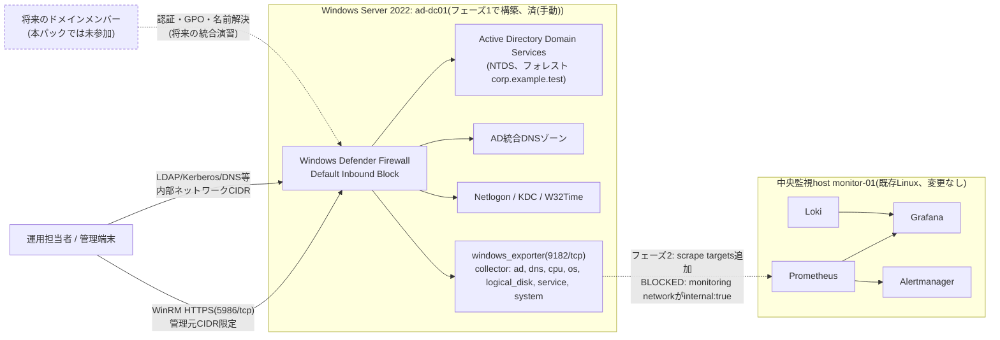

# 基本設計書

> 💡 **初めて読む方へ**: この文書は要件を「どう実現するか」の全体方針を描く文書です。初めての場合は先に[案件パック 初心者ガイド](beginner-guide.md#01-基本設計書)で全体の地図を確認してください。

要求と受け入れ条件は[要件定義書](00-requirements.md)を正本とし、本書ではその実現方式を定義します。

## 1. 目的

Windows Server 1台へ新規のActive Directoryフォレスト・ドメインを安全かつ再現可能に構築し、ディレクトリサービスの基本機能(認証、ディレクトリ検索、名前解決、グループポリシー配布)と、障害時の検知・復旧・復元までを検証できる環境を提供します。

## 2. 対象範囲

| 対象 | 内容 |
| --- | --- |
| OS | Windows Server 2022 Standard(Desktop Experience基準。Server Coreは構成の対応を検討) |
| 対象ホスト | 検証用VM 1台(論理ホスト名`ad-dc01`) |
| 配備 | 本パックのPowerShell手順による手動構築(Ansible化されたWindows対応roleは未実装) |
| ディレクトリ | Active Directory Domain Services(AD DS)、新規フォレスト・新規ドメイン(`corp.example.test`、NetBIOS名`CORP`) |
| DNS | AD統合ゾーン。DC自身がDNSサーバーを兼ねる |
| 監視(フェーズ2、要ネットワーク拡張) | windows_exporterのAD/DNS collectorによるホスト・ディレクトリメトリクス。既存の中央Prometheus側で実施する設計であり、Windows側に新規の監視サーバーは置かない |
| ログ(フェーズ2、未実装) | Grafana Alloy for Windows経由で既存Lokiへ集約する設計のみ存在し、実装はまだ無い |
| 運用 | Windows Server Backup(System State)によるバックアップ、AD ごみ箱、ランブック、変更管理、サービス停止復旧演習 |

対象外は、複数DCによる冗長化・レプリケーション実測、RODC、AD CS、AD FS、Microsoft Entra ID連携、24時間有人運用、SSO、実組織の個人情報、商用SLA、既存中央監視基盤本体の変更、[Windows版パック](../build-package-windows/01-basic-design.md)の監視対象ホスト(`monitor-win-01`)のドメイン参加です。

### 2.1 なぜ新規フォレスト・新規ドメインなのか

[Windows版パック](../build-package-windows/01-basic-design.md)は「既存ADドメインへ参加させる場合の設定差分(系統B)」を示すにとどめ、AD自体の構築は対象外としていました。本パック(`SM-AD-001`)は、その「既存ADドメイン」に相当する側を、要件定義から引き渡しまで一つの案件として構築するものです。単一のDC・単一のドメインに絞り込むのは、初めてADを構築する人が「フォレスト」「ドメイン」「OU」「GPO」「FSMO」といった概念を、複雑なマルチドメイン構成に埋もれずに理解できるようにするためです。2台目のDC追加によるレプリケーション実測は、この基礎が固まった後の発展課題として2.4節に別途示します。

## 3. 論理構成

### 3.1 フェーズ構成

本案件は次の2段階で構成します。[試験仕様書・結果票](06-test-specification.md)、[引き渡しチェックリスト](07-handover-checklist.md)、[作業結果・引き渡し報告書](11-work-result-report.md)でもこの2段階を区別して記載します。

- **フェーズ1(ホスト単体構築)**: OS初期設定、WinRM、Firewall、フォレスト・ドメイン作成、DC昇格、AD統合DNS、OU/GPO設計、FSMO確認、windows_exporter導入、バックアップ、単体でのnetwork実機検証まで。「済(手動)」の範囲で完結し、Windows Server 1台だけで検証・完了できます。
- **フェーズ2(中央監視統合)**: 中央Prometheusからのscrape、blackbox probe、ログ集約、アラート経路。[Windows版パック](../build-package-windows/01-basic-design.md)と共通の次の3点が解消するまで`BLOCKED`です。
  1. `ansible/roles`配下にWindows対応role(`common_windows`等)が無く、Ansibleでの自動構築ができない。
  2. `compose.yaml`のmonitoring networkは`internal: true`(外部egress不可)であり、Prometheusコンテナは今のままでは同じDockerホストの外にある実マシン(`ad-dc01`)のwindows_exporter(既定9182/tcp)へ到達できません。
  3. Windows Event Log/ADディレクトリサービス監査ログを既存Lokiへ送る経路(Grafana Alloy for Windowsの導入、Lokiのpush APIをloopback以外からも安全に受け付けるための認証・network設計)が無い。

  解消後は、[Windows版パック](../build-package-windows/05-build-procedure.md)5節と同じ手順で、`ansible/roles/app/defaults/main.yml`の`app_node_exporter_targets`変数へ`ad-dc01`のaddress/host/environmentを1行追加し、中央host側で`ansible-playbook site.yml`を再適用するだけでscrapeを有効化できます。

### 3.2 構成図

実線は現時点(フェーズ1)で成立する経路、点線はフェーズ2で構築予定、または本パックの対象外である経路(将来のドメインメンバー参加)を示します。Windows Defender Firewallのルール自体(AD DS関連の自動生成ルール、windows_exporterの許可)はフェーズ1の「済(手動)」範囲で設定しますが、中央Prometheusからの実際の到達は3.1節に記載した未実装事項が解消するまで成立しません。

### 3.3 コンポーネント間の関係

`ad-dc01`は1台でディレクトリ(NTDS)、DNS、認証(Kerberos/NTLM)、グループポリシー配布(SYSVOL/NETLOGON共有)を兼ねます。この「1台で複数の役割を兼ねる」構成は、[Linux版パック](../build-package/01-basic-design.md)のような「1台でWeb/監視/ログを兼ねる」構成と考え方は似ていますが、AD DSの各コンポーネントは独立したサービスとして動作するため、[詳細設計書](02-detailed-design.md)ではコンポーネントごとに正常性確認の方法を分けて定義します。

### 3.4 発展構成(対象外・将来課題)

次は本パックの範囲に含みませんが、基礎が固まった後の発展課題として設計の方向性だけを示します。

- **2台目のDC追加とレプリケーション実測**: `Install-ADDSDomainController`で2台目を追加し、`repadmin /replsummary`・`repadmin /showrepl`でレプリケーション状態を確認する。FSMO役割の一部を`Move-ADDirectoryServerOperationMasterRole`で移譲し、単一障害点を減らす設計を検証する。
  - **2026-09-03に実施済み(ラボ範囲)**: `ad-dc02`(`192.0.2.51/24`)を追加し、NTDS複製5パーティション失敗0、SYSVOL初期同期成功、**サイト内レプリケーション遅延17.8秒**を実測しました([証跡](../evidence/2026-09-03-ad-second-dc-replication.md))。FSMO移譲も実施し、フォレストレベル2役割(スキーマ、ドメイン名前付け)を`ad-dc02`へ、ドメインレベル3役割(PDC、RID、インフラストラクチャ)を`ad-dc01`に分けました(所要0.238秒、`dcdiag /test:knowsofroleholders`合格)。`ad-dc02`の要塞化(WinRM HTTPS、Firewallスコープ、RDP無効、SMBv1無効)まで実施し、**GPO化したセキュリティ設定3件(LDAP署名必須、チャネルバインディング、DSアクセス監査)が、dc02側で一切のレジストリ編集なしに自動適用されること**を検証しました。

  この演習で、前日のSystem State復元がdc01から`scripts`フォルダーとDefault Domain Policyの`gpt.ini`を失わせていたことも判明しています。**いずれも単一DCでは無症状**で(前者は共有定義が残るため、後者は適用済みのローカルポリシーが残るため)、2台目を追加して初めて顕在化しました。後者はdc02にGPOが1件も適用されない状態を招いていました。**冗長化は可用性のためだけでなく、「設定が正しく配信されているか」を検証する手段でもある**というのが、この演習で得られた最も大きな知見です。

  `ad-dc02`のwindows_exporterとSystem Stateバックアップ、役割の奪取(seize)、DC 1台を停止した可用性試験は`NOT RUN`です。
- **RODC(読み取り専用ドメインコントローラー)**: 支店やDMZ相当の環境を想定し、パスワードキャッシュポリシーを制限したRODCを追加する。
- **monitor-win-01のドメイン参加**: [Windows版パック](../build-package-windows/01-basic-design.md)の系統Bとして言及されている「既存ADに参加させる場合の差分」を、実際に`ad-dc01`を使って検証する統合演習。
- **Tier分離の実装**: NFR-08で言及したTier0の考え方を、特権アクセスワークステーション(PAW)や管理用ジャンプホストの導入まで含めて実装する。

## 4. 非機能要件

| 分類 | 要件 | 確認方法 |
| --- | --- | --- |
| セキュリティ | WinRMはHTTPS専用としBasic認証を無効化する。RDPは既定Disableとする | AST-01、AST-02 |
| セキュリティ | LDAP署名とチャネルバインディングを必須化し、SMBv1を無効化する | AST-04、AST-05 |
| パスワードポリシー | 既定ドメインGPOで最小長14文字、複雑性要件、ロックアウトしきい値を設定する | AST-03 |
| 最小権限 | `Domain Admins`等の特権グループのメンバーを最小限に保つ | AST-07 |
| 再現性 | 未構築の対象VMへ本パックの手順(手動PowerShell)を適用し、エラーなく完了する | AIT-01 |
| 再実行安全性 | 昇格済みDCへの誤った再実行が安全に失敗する(冪等性とは異なる概念) | AIT-11 |
| ネットワーク | Windows Defender FirewallはDefault Inbound Blockとし、AD DS関連ポートを内部ネットワークCIDR、管理系を管理元CIDR限定で許可する | AST-08 |
| 可観測性 | メトリクス・監査ログを関連付けて一次切り分けできる(フェーズ2の範囲は未実装区間ありと明記する) | AIT-09 |
| 復旧性 | サービス停止演習で検知から復旧までのRTOを記録する。System Stateバックアップ・AD ごみ箱で復元できる | AIT-06〜08 |
| 保守性 | 変更前後の状態、検証、ロールバック条件と結果を記録する | [08 変更・ロールバック計画](08-change-rollback-plan.md) |
| 追跡性 | 実行日時、環境、ホストのビルド番号、実行コマンド、実出力、判定を証跡へ残す | 全必須試験 |
| 実装境界の明示 | Ansible化されていない手順を「済(手動)」と明記し、既存の`site.yml`のような自動化済み経路と混同しない | 全文書共通 |

## 5. 可用性と保存期間

- 単一ドメインコントローラー構成のため、ホスト障害時の無停止継続は保証しません。単一障害点(SPOF)であることは、[基本設計書](01-basic-design.md)2.4節の発展構成(2台目のDC追加)で扱う課題として明記します。
- System Stateバックアップは日次03:30(Asia/Tokyo)、保持14世代を初期値とし([Linux版](../build-package/01-basic-design.md)・[Windows版](../build-package-windows/01-basic-design.md)と同じ値)、別ボリューム/別ホストへの復元試験(AIT-06)で確認します。
- AD ごみ箱の保存期間(削除オブジェクトの保持期間)は既定のtombstone lifetime(180日、フォレスト機能レベルWindows Server 2008 R2以降の既定値)をそのまま使用します。
- 中央側のPrometheus/Lokiの保持期間は既存設計を変更しません。値は[Linux版基本設計書](../build-package/01-basic-design.md)のとおり、Prometheusは35日、Lokiは30日を初期値とします。
- ラボ内SLOは、フェーズ1の範囲ではディレクトリサービス関連サービスの起動状態確認にとどめます。既存の[SLO](../slo.md)への正式な数値目標の統合は、フェーズ2(中央Prometheusによる監視)が有効化された後に行う予定であり、現時点で`ad-dc01`のSLO数値は`NOT SET`です。

## 6. 受け入れ条件

本書の受け入れ条件は次のとおりです。

- フェーズ1必須試験(AUT-01〜04、AIT-01〜08、AIT-10〜11、AST-01〜08、ANW-01〜09)がすべて`PASS`していること。
- フェーズ2対象試験(AIT-09)は、3.1節に記載した3点の未実装事項が解消するまで`BLOCKED`として明記され、理由と解除条件が記録されていること。
- 実行日時、環境、ホストのビルド番号(`winver`または`Get-ComputerInfo`の`OsBuildNumber`)、実行コマンド、実出力、判定が証跡として保存されていること。
- 未解決事項、秘密値(DSRMパスワード、証明書等)の受け渡し方法、ロールバック方法が[作業結果・引き渡し報告書](11-work-result-report.md)に記録されていること。

詳細な試験項目と判定基準は[試験仕様書・結果票](06-test-specification.md)を正本とします。
