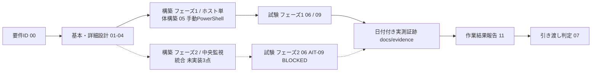

# ADサーバー構築案件パック

**一言でいうと**: 新しいActive Directoryのドメイン(`corp.example.test`)をWindows Server 1台に作り、運用担当者へ引き渡すまでの書類一式です。

初めての方は、先に[案件パック 初心者ガイド](beginner-guide.md)を読むと全体像がつかめます。

このディレクトリは、新規のActive Directoryフォレスト・ドメイン(`corp.example.test`)を構築し、最初のドメインコントローラー(利用者や機器の情報をまとめて管理するサーバー)を運用担当者へ引き渡す案件の成果物を、工程順にまとめたものです。既存の監視基盤である[Linux版パック](../build-package/README.md)(案件ID`SM-LAB-001`)、およびその監視対象ホストを追加する[Windows版パック](../build-package-windows/README.md)(案件ID`SM-WIN-001`)とは独立した、新規の構築案件です。

案件は「何を作るか決める → 設計する → 作る → 試験する → 報告して渡す」の順に進みます。工程ごとに書類が分かれるため、文書は00から11までの12個あります。番号は作られた順で、読む順とは一致しません。初めて読むときは、下の「最短レビュー順」に従ってください。

構成・文体・厳格さは`docs/build-package`(Linuxサーバー構築案件パック)を踏襲します。本文書にある「設計値」と、実機で取得した「実績値」は分けて管理します。

| 案件 ID | 対象 | 現在の引き渡し判定 |
| --- | --- | --- |
| `SM-AD-001` | Windows Server 2022 Standard(Desktop Experience基準)の検証用VM 1台(論理ホスト名`ad-dc01`)への、新規フォレスト・新規ドメインの最初のドメインコントローラー構築 | **フェーズ1 `PASS`(ラボ範囲)** — 2026-09-01〜02に手元Hyper-VのVM 1台で必須31 IDをすべて`PASS`([報告書](../evidence/2026-09-02-work-result-SM-AD-001.md))。組織環境・永続hostでの引き渡しは`NOT RUN`。フェーズ2(`AIT-09`)は未実装3点の解消待ちで`BLOCKED` |

次の3つは、それぞれ別の状態です。ひとまとめにしないでください。

- 文書が「作成済み」であること
- フェーズ1の手順を実機で実行して`PASS`したこと
- 特定の引き渡し対象ホスト(`ad-dc01`)で受け入れが完了したこと

最終判定は[作業結果・引き渡し報告書](11-work-result-report.md)と[引き渡しチェックリスト](07-handover-checklist.md)を使います。

### 初めての方はまずこちら

`NFR`(非機能要件。速さ・止まりにくさ・安全性など、機能以外の要求)、`AIT-xx`(試験項目の番号)、
案件IDのような言葉が初見の場合は、12文書を読み始める前に
[案件パック 初心者ガイド](beginner-guide.md)で、案件パックとは何か、各文書の役割、
読む順とかかる時間の目安を確認してください。

## 最短レビュー順

1. [要件定義書](00-requirements.md) — 何を作り、何を作らないか。どうなれば合格かを決める（要件 ID と受け入れ条件を定義）
2. [基本設計書](01-basic-design.md) — 全体の構成、フェーズ1とフェーズ2の分け方、非機能(NFR)の設計方針
3. [パラメータシート](03-parameter-sheet.md) — 実際に入力する設定値の一覧(OS・ドメイン・ネットワーク・windows_exporter)
4. [構築手順書](05-build-procedure.md) — `ad-dc01`を手作業のPowerShell操作で組み立てる手順(フェーズ1)
5. [試験仕様書・結果票](06-test-specification.md) — 何を確かめれば合格かと、実測結果を書き込む用紙(AUT/AIT/AST/ANW)
6. [ネットワーク実機検証手順](09-network-validation-procedure.md) — 実機で通信できるかの確認(通信が届くか、名前が引けるか、経路は正しいか、待ち受けているか。IP/route/DNS/待受/LDAP・Kerberos到達性/packet/Firewall)
7. [作業結果・引き渡し報告書](11-work-result-report.md) — 計画対実績（予定と実際の比較）、試験の集計、差異、残存リスク（残ったままの危険）、完了判定
8. [検証証跡台帳](../evidence/README.md) — 実測済み・未実測の境界(どこまで実機で確かめ、どこからが未確認か)

## 成果物一覧

| 工程 | 成果物 | 状態 |
| --- | --- | --- |
| 要件定義 | [00-requirements.md](00-requirements.md) | 作成済み |
| 基本設計 | [01-basic-design.md](01-basic-design.md) | 作成済み |
| 詳細設計 | [02-detailed-design.md](02-detailed-design.md) | 作成済み |
| パラメータ設計 | [03-parameter-sheet.md](03-parameter-sheet.md) | 作成済み |
| ネットワーク設計 | [04-network-ip-plan.md](04-network-ip-plan.md) | 作成済み |
| 構築(フェーズ1) | [05-build-procedure.md](05-build-procedure.md) | 2026-09-01〜02にHyper-V VMで通しで実施。実機で見つけた誤り6件を修正済み |
| 試験 | [06-test-specification.md](06-test-specification.md) | 原本は`NOT RUN`のまま。実績は[構築・試験結果票](../evidence/2026-09-01-ad-build-validation.md)(AUT/AIT/AST 22/22 PASS、AIT-09 BLOCKED) |
| 引き渡し | [07-handover-checklist.md](07-handover-checklist.md) | 作成済み。ラボ範囲の項目のみ確認 |
| 変更・ロールバック | [08-change-rollback-plan.md](08-change-rollback-plan.md) | System State復元を実演([2026-09-02](../evidence/2026-09-02-ad-restore-drill.md)、復元15分29秒)。チェックポイント復元の実演は`NOT RUN`。チェックポイントは`phase1-hardened`の1世代に整理(更新は「新規取得→旧世代を統合」の順) |
| ネットワーク実機検証 | [09-network-validation-procedure.md](09-network-validation-procedure.md) | [結果票](../evidence/2026-09-01-network-host-validation-ad.md) ANW-01〜09 9/9 PASS |
| 立ち上げ・受け入れ | [10-host-bringup-and-acceptance.md](10-host-bringup-and-acceptance.md) | 評価版ISO + Hyper-V(Windows 11 Pro)の選択肢で実施 |
| 作業結果報告 | [11-work-result-report.md](11-work-result-report.md) | [2026-09-02 記入済み版](../evidence/2026-09-02-work-result-SM-AD-001.md)あり |
| ネットワーク結果票(AD) | [実機検証テンプレート](../evidence/templates/network-host-validation-ad.md) | テンプレート作成済み。記入例は上記結果票 |
| 一次切り分け記録 | [トラブルシュート一次記録テンプレート](../evidence/templates/troubleshooting-worklog.md) | テンプレート作成済み(Linux/Windows版と共用) |

## 工程ゲート

表中の`NOT SET`は、値や承認がまだ決まっていないことを表します。

| Gate | 完了条件 | 現在の状態 |
| --- | --- | --- |
| G0 要件確定 | 要件ID、対象、対象外、受け入れ条件が合意済み | 文書作成済み。実案件での承認は`NOT SET` |
| G1 設計確定 | 基本・詳細・パラメータ・ネットワーク設計のレビュー完了 | 文書作成済み。実案件での承認は`NOT SET` |
| G2(フェーズ1)構築完了 | 初回昇格(`AIT-01`)が成功し、FSMO(`AIT-05`)・DNS(`AIT-03`)が設計どおり確認できること | `PASS`(2026-09-01、ラボVM) |
| G2(フェーズ2)統合完了 | `app_node_exporter_targets`への`ad-dc01`追加、Dockerホストと`ad-dc01`間の実接続の確立、windows_exporterのFirewall許可(Dockerホストの実IP)、Windows向けログ集約経路の導入が完了 | 設計のみ。3点とも未着手で着手時期は`NOT SET` |
| G3(フェーズ1)試験完了 | フェーズ1必須31 IDがすべて`PASS` | `PASS`(31/31、2026-09-02) |
| G3(フェーズ2)試験完了 | `AIT-09`が`PASS` | `BLOCKED`(G2フェーズ2の解消が前提) |
| G4 作業完了 | 作業結果報告書に実績、障害、差異、残存リスクを記録 | `PASS`([2026-09-02 報告書](../evidence/2026-09-02-work-result-SM-AD-001.md)) |
| G5 引き渡し | 受領者、日時、秘密値受け渡し、未解決事項を記録 | ラボ範囲で完了(引き渡し元/先とも本人)。組織環境への引き渡しは`NOT RUN` |

## 検証環境

基準環境はWindows Server 2022 Standard(Desktop Experience基準)の検証用VM 1台(論理ホスト名`ad-dc01`)です。Windows Server 2022 Server Coreへの対応は検討課題であり、基準VMはDesktop Experienceであるため、両エディションでの実測を意味しません。最小構成の目安は2 vCPU / メモリ4GB / ディスク60GBです([Windows版パック](../build-package-windows/README.md)と同じ最小要件)。Windows Serverはライセンス費用が発生するため、[Linux版パック](../build-package/README.md)で使える無償のVirtualBox VMのような代替が使えません。立ち上げ環境の選択肢(クラウドWindows Serverインスタンス/評価版ISOによるHyper-V・VMware上のVM/社内ボリュームライセンス)は[10-host-bringup-and-acceptance.md](10-host-bringup-and-acceptance.md)にまとめます。

2026-09-01〜02に、Windows 11 Pro上のHyper-V(内部スイッチ)にWindows Server 2022 評価版のVM 1台を立て、ホストPCを管理端末としてフェーズ1を実施しました。**なおこの`ad-dc01`は2026-09-04の[FSMO役割奪取演習](../evidence/2026-09-04-ad-fsmo-seize.md)で削除済みで、現在は`ad-dc02`の単一DC構成です**（[上記の発展演習](#フェーズ1完了後に実施した発展演習2026-09-0307)を参照）。([ネットワーク結果票](../evidence/2026-09-01-network-host-validation-ad.md)、[構築・試験結果票](../evidence/2026-09-01-ad-build-validation.md))。ホストPCとVMが同一物理機であるため、独立した管理端末・組織DNS・実ドメインメンバーからの検証は含みません。

## フェーズ1完了後に実施した発展演習（2026-09-03〜07）

**重要: この案件パックが構築対象とした `ad-dc01` は、現在存在しません。** 上のフェーズ1の
`PASS`(31/31)は2026-09-02時点、`ad-dc01`上で取得した結果であり、記録としては有効です。
その後、[01 基本設計書](01-basic-design.md)3.4節の発展構成を順に実施した結果、
**現在このドメインを構成しているのは `ad-dc02` 1台のみ**です。

パックの成果物（00〜11の12文書）はフェーズ1を対象としており、以下の演習は成果物の範囲外です。
ただしこのパックの設計判断を実際に検証・是正した記録であるため、ここから辿れるようにしています。

| 日付 | 演習 | 主な結果 |
| --- | --- | --- |
| 2026-09-03 | [2台目DC追加とレプリケーション実測](../evidence/2026-09-03-ad-second-dc-replication.md) | `ad-dc02`を追加し、サイト内レプリケーション遅延**17.8秒**、FSMOフォレストレベル2役割の移譲**0.238秒**を実測。**単一DC構成では無症状だった欠陥3件**（SYSVOLの`scripts`欠損、Default Domain Policyの`gpt.ini`欠損、2設定がGPO化されていなかったこと）を発見・修復 |
| 2026-09-03 | [DC 1台停止時の可用性試験](../evidence/2026-09-03-ad-dc-outage-drill.md) | `ad-dc01`を計画停止し、`ad-dc02`単独での継続性を実測。DNS・LDAP・Kerberos・GCは継続、PDCエミュレーター/RIDマスター固有の操作のみ縮退。復帰後の**ディレクトリ完全収束まで18分31秒** |
| 2026-09-04 | [FSMO役割の奪取と`ad-dc01`の完全喪失想定復旧](../evidence/2026-09-04-ad-fsmo-seize.md) | 「dc01が復旧不能になった」想定へ切り替え、`ad-dc02`から役割を強制奪取。ADのメタデータから`ad-dc01`を除去し、**VM自体も削除（不可逆）**。以降このドメインは`ad-dc02`の単一DC構成 |
| 2026-09-07 | [`ad-dc02`の時刻同期元の是正](../evidence/2026-09-07-ad-dc02-time-sync-fix.md) | 上記の奪取で`ad-dc02`がPDCエミュレーターを保持する構成へ変わったため、時刻同期の前提を再評価して是正 |
| 2026-09-07 | [windows_exporterの最小権限化(gMSA)](../evidence/2026-09-07-ad-windows-exporter-least-privilege.md) | [03 パラメータシート](03-parameter-sheet.md)等で「AST-07相当の継続課題」としていた、実行アカウントの`LocalSystem`からの最小権限化を実施 |

なお、[WSUS版パック](../build-package-wsus/README.md)の構築に伴い、`ad-dc02`のdefault route
とDNSフォワーダが変更されています。経緯と戻し方は[01 基本設計書](01-basic-design.md)3.4節に
記載していますが、**本パック側での再検証は未実施**です。

## 完了の定義

次をすべて満たした時点で「構築・試験完了」とします。

- フェーズ1の必須試験(`AUT-01`〜`AUT-04`、`AIT-01`〜`AIT-08`、`AIT-10`、`AIT-11`、`AST-01`〜`AST-08`、`ANW-01`〜`ANW-09`、合計31 ID)がすべて`PASS`
- フェーズ2の必須試験(`AIT-09`)は、[要件定義書](00-requirements.md)に記す「未実装」3点(Windows対応Ansible roleの不在、Dockerホストと`ad-dc01`間の実接続およびwindows_exporterのFirewall許可(Dockerホストの実IP)の未確立、Windows向けログ集約経路の不在)の解消条件とともに`BLOCKED`として明記されていること
- DSRM(ディレクトリサービス復元モード)パスワード等の秘密値は、実値をこのリポジトリのどの文書にも記載せず、受け渡し方法(誰が・いつ・どの秘密値台帳経由で受け渡したか)が引き渡し記録に残ること
- 実行日時、環境、ホストのビルド番号(`winver`または`Get-ComputerInfo`の`OsBuildNumber`)、実行コマンド、実出力、判定が証跡として保存される
- 未解決事項、ロールバック方法(スナップショット復元を最優先手段とする)が引き渡し記録に残る
- 実ホストの名前解決、経路、待受、LDAP/Kerberos到達性、Windows Defender Firewallを確認し、実行出力を保存する
- [作業結果・引き渡し報告書](11-work-result-report.md)の計画対実績、試験集計、差異、残存リスク、受領判定を記入する