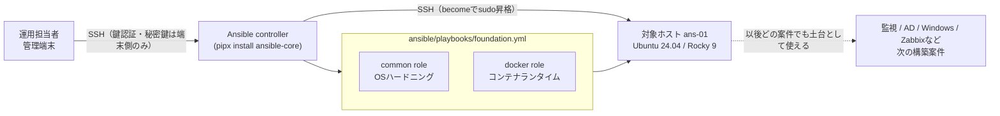

# 基本設計書

> 💡 **初めて読む方へ**: この文書は決めた要件を「どう実現するか」の全体方針を決める文書です。個別のtaskや変数の中身は[詳細設計書](02-detailed-design.md)で扱います。

## 1. 全体構成

重要な点として、`foundation.yml`は対象ホストへ**特定のアプリケーションを1つも配備しません**。作るのは「次の構築案件が乗る前提条件」だけです。この境界を意識しないと、「基盤roleに監視アプリ固有の設定を混ぜてしまう」という設計上の失敗につながります。

## 2. 非機能要件の実現方針

| NFR | 実現方針 | 確認方法 |
| --- | --- | --- |
| NFR-01 再現性 | `common` → `docker`の順で、それぞれ独立したroleとして適用する。role間の暗黙の実行順序依存はmeta依存ではなくplaybook側のroles配列で明示する | `foundation.yml`のroles配列 |
| NFR-02 冪等性 | 「今の状態を読む（read）」タスクと「状態を変える（write）」タスクを分離し、read側は`changed_when: false`を明示する。write側はAnsibleモジュールの標準機能（`state: present`等）に任せ、shell/commandでの直接操作を避ける | [詳細設計書](02-detailed-design.md#冪等性の実装パターン) |
| NFR-03 移植性 | `ansible_os_family`（`Debian` / `RedHat`）で分岐し、OS固有の値は`vars/<family>.yml`、OS固有の手順は`tasks/<処理>-<family>.yml`へ分離する。共通のtasks本体は変数名だけを参照し、`if`分岐を極力書かない | `ansible/roles/common/vars/`、`ansible/roles/docker/vars/` |
| NFR-04 最小公開 | `common` roleのfirewall設定はデフォルト拒否（`default deny incoming`）とし、許可ポートは`server_monitor_allowed_tcp_ports`（既定`[22]`）だけに絞る。`foundation` group側でこの既定値を上書きしない限りSSH以外は開かない | [ネットワーク設計](04-network-ip-plan.md) |
| NFR-05 認証 | SSHのroot直接ログインとpassword認証を`common` roleが強制的に無効化する。鍵か既存`authorized_keys`のどちらも無い状態でこの無効化を行うと閉め出しが起きるため、事前に`assert`で検査する | `ansible/roles/common/tasks/ssh.yml`、`admin-access.yml` |
| NFR-06 最小権限 | `docker` roleはアプリ用アカウントへ`docker`グループを付与しない。`docker`グループはコンテナ経由でホストのroot権限を得られるため、root権限相当として扱う | `ansible/roles/docker/tasks/main.yml` |
| NFR-07 安全装置 | 各roleの`tasks/main.yml`冒頭で、ホストを変更する前に`ansible.builtin.assert`を実行する。未対応OS、`root`グループの誤指定、危険な`install_dir`はここで停止し、途中まで適用してしまう事故を防ぐ | [詳細設計書](02-detailed-design.md#安全装置ガードassert) |
| NFR-08 保守性 | roleの責務を1つずつに絞る（`common`=OS、`docker`=コンテナランタイム）。監視アプリ固有の設定は`app` roleなど別roleへ置き、`common`/`docker`には混ぜない | [詳細設計書](02-detailed-design.md#コンポーネント設計) |
| NFR-09 テスト容易性 | 各roleにMoleculeシナリオ（`default`=Ubuntu、`el9`=Rocky）を同梱し、`create → converge → idempotence → verify → destroy`のライフサイクルを実コンテナで検証できるようにする | [詳細設計書](02-detailed-design.md#moleculeのシナリオ設計) |
| NFR-10 追跡性 | 実行結果は原本を上書きせず、日付付きevidenceへコピーする運用を他パックと共通化する | [試験仕様書](06-test-specification.md) |

## 3. Ansible設計の考え方

**一言でいうと**: 「壊れにくく」「読みやすく」「他の案件でも使い回せる」の3つを、具体的な設計ルールへ落とし込んだものです。

### (1) 責務でroleを分ける

1つのroleに複数の役割を詰め込むと、変更の影響範囲が予測しにくくなります。本パックは「OSの土台を整える」（`common`）と「コンテナランタイムを入れる」（`docker`）を明確に分け、どちらも監視アプリのような特定ワークロードへの依存を持ちません。

### (2) mutation前にガードする

ホストの状態を変える（mutation）タスクを実行する前に、前提条件を`assert`で確認します。「実行してから失敗に気づく」のではなく、「1つもホストを変更していない時点で止める」ことを狙います。詳しくは[詳細設計書](02-detailed-design.md#安全装置ガードassert)を参照してください。

### (3) OSごとの違いを変数へ閉じ込める

`if ansible_os_family == 'Debian'`をtasksのあちこちに書くと、対応OSが増えるたびに全taskを見直す必要が生まれます。本パックのroleは、OSごとに異なる**値**は`vars/<family>.yml`に、OSごとに異なる**手順**は`tasks/<処理>-<family>.yml`に分離し、共通のtasks本体は変数名だけを参照します。

### (4) 冪等性を「祈らず」に保証する

「2回目に実行しても変わらないはず」という期待だけに頼らず、読み取り専用コマンドには`changed_when: false`を明示し、状態変更はAnsible標準モジュールに任せます。詳しくは[詳細設計書](02-detailed-design.md#冪等性の実装パターン)を参照してください。

### (5) テストを役割ごとに分ける

構文レベルの誤りはCIの`ansible-lint`と`--syntax-check`で検出し、実コンテナでの収束・冪等性はローカルのMoleculeで検証します。CIで毎回フルのMoleculeを回さない理由と、開発者がローカルで実施する理由は[詳細設計書](02-detailed-design.md#moleculeのシナリオ設計)にまとめます。

### (6) 変数は「優先順位のある地層」として設計する

`role defaults` < `group_vars/all` < `group_vars/<group>` < `host_vars` < `extra-vars`という優先順位を使い、共通の既定値と案件固有の上書きを同じ変数名のまま両立させます。具体例は[詳細設計書](02-detailed-design.md#変数の優先順位設計)を参照してください。
