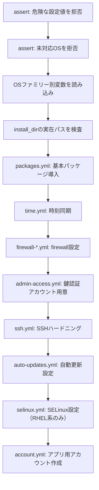
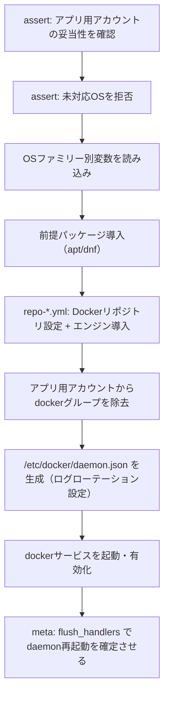
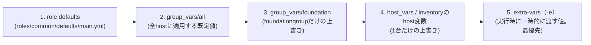

# 詳細設計書

> 💡 **初めて読む方へ**: この文書はrole内部の実装と、「Ansibleの設計をどう考えるか」を詳しく描く文書です。先に[基本設計書](01-basic-design.md)で全体方針をつかんでから読むと理解しやすくなります。

## コンポーネント設計

| コンポーネント | 実装 | 依存先 | 正常性確認 |
| --- | --- | --- | --- |
| `common` role | timezone、パッケージ、firewall（UFW/firewalld）、SSHハードニング、自動更新、SELinux、アプリ用アカウント | OS標準パッケージリポジトリ | `sshd -T`の実効値、`systemctl is-active`、firewall status |
| `docker` role | Docker CE + Compose plugin導入、`daemon.json`によるログローテーション、競合パッケージ（podman等）の除去、アプリ用アカウントからのdockerグループ除去 | `common` role適用後のOS状態 | `docker version`、`docker compose version`、`systemctl is-active docker` |
| `foundation.yml` | 上記2roleを`common → docker`の順で対象ホストへ適用するplaybook | Ansible controller、対象ホストへのSSH到達性 | 2roleそれぞれの正常性確認 + play recap `failed=0` |

## role内部のtask設計

### `common` role のtask順序

この順序には理由があります。**鍵認証で入れる管理者アカウント（H）を用意してから、SSHをハードニング（I）する**という順番を崩すと、鍵もpassword認証も無い状態でホストへ二度と入れなくなる事故につながります。同様に、firewall設定（G）より前にSSHを閉め出す設定はしません。

### `docker` role のtask順序

最後の`flush_handlers`（I）は、後続のroleがワークロードを配備する前に、`daemon.json`の変更によるDocker daemon再起動を確実に終わらせるためのものです。再起動前に稼働中コンテナのpublished portが失われる可能性があるため、ワークロード配備前にこの一手間を挟みます（`ansible/roles/docker/tasks/main.yml`のコメント参照）。

## 安全装置（ガード・assert）

**一言でいうと**: 「実行してから失敗に気づく」のではなく、「1つもホストを変更していない時点で止める」ための仕組みです。

両roleとも、`tasks/main.yml`の一番最初に`ansible.builtin.assert`を置いています。

| 検査内容 | 目的 | 該当role |
| --- | --- | --- |
| `server_monitor_user` / `group`が`root`でないこと | root権限の誤付与を防ぐ | `common`、`docker` |
| `server_monitor_group`が`docker`でないこと | 「アプリ用アカウントに、うっかりroot相当の権限を渡す」事故を防ぐ | `common`、`docker` |
| `ansible_os_family`が`Debian`または`RedHat`であること | 未対応OSへ、パッケージを1つも入れる前に停止する | `common`、`docker` |
| `server_monitor_install_dir`が`/opt`または`/srv`配下の安全な文字集合のみで構成されていること（`realpath -m`で正規化した結果と一致し、`..`セグメントを含まない） | パス traversal やシンボリックリンクによる意図しないディレクトリへの書き込みを防ぐ | `common` |

`assert`はホストへの変更を一切伴わない読み取り専用の確認です。ここで失敗すれば、後続のパッケージ導入・アカウント作成・firewall変更のいずれも実行されません。

## 変数の優先順位設計

**一言でいうと**: 同じ変数名のまま、「全体の既定値」と「案件固有の上書き」を両立させる仕組みです。

Ansibleの変数は、定義した場所によって優先順位が決まります。本パックが使う範囲では、優先順位の低い順に次のようになります。

具体例として、`server_monitor_user`（アプリ用アカウント名）の値がどう決まるかを追います。

| 階層 | 定義場所 | 値 |
| --- | --- | --- |
| group_vars/all | `ansible/inventory/group_vars/all/main.yml` | `monitor`（監視アプリ向けの既定値） |
| group_vars/foundation | `ansible/inventory/group_vars/foundation/main.yml` | `svc-baseline`（本パック向けに上書き） |
| 実際に使われる値 | — | `svc-baseline`（より優先順位の高い`group_vars/foundation`が勝つ） |

`common` / `docker`両roleのtasksは、常に`server_monitor_user`という同じ変数名だけを読みます。**role側のコードは一切変更せず、inventory側の変数階層を変えるだけで、監視アプリ向けの既定値から本パック向けの値へ切り替えられる**のがこの設計の狙いです。この仕組みが無いと、案件ごとにroleをコピーして書き換えることになり、修正が他の案件へ伝播しなくなります。

## 冪等性の実装パターン

**一言でいうと**: 「2回目に実行しても変わらないはず」という期待だけに頼らず、コードレベルで保証する工夫です。

| パターン | 説明 | 実装例 |
| --- | --- | --- |
| 読み取り専用コマンドに`changed_when: false`を明示 | `command` / `shell`モジュールは既定で「実行したら常にchanged」と扱われる。状態を読むだけの実行はそう明示しないと、毎回「変更あり」と誤判定される | `ansible/roles/common/tasks/main.yml`の`realpath -m`実行、`docker`roleの`id -nG`実行 |
| 状態変更はAnsible標準モジュールに任せる | `ansible.builtin.user` / `ansible.builtin.copy` / `ansible.builtin.systemd`などは、既に望む状態であれば何もしない（内部で差分判定する） | アカウント作成、`daemon.json`のレンダリング、サービス起動 |
| firewallルールは「allowとlimitを二重に当てない」 | 同じportへ`allow`と`limit`の両方を適用すると、UFW上で互いを上書きし、実行のたびに`changed`になり冪等性が崩れる。そのため`common_ufw_rate_limited_ports`の対象は`allow`ループから明示的に除外する | `ansible/roles/common/defaults/main.yml`のコメント |
| handlerで変更を1箇所に集約する | 設定ファイルが変わった時だけ`notify`でhandlerを呼び、サービス再起動を1回にまとめる。無条件のrestartタスクを都度書くと、変更が無くても毎回changedになる | `docker`roleの`daemon.json`変更 → `Restart docker`handler |

### check modeの限界

`--check --diff`（dry run）は「実行前の予測」を確認するbest-effortの手段であり、フル代替にはなりません。

| 状況 | check modeでの挙動 |
| --- | --- |
| 変数・パス・アカウントのassertガード | 実行される（ホストを変更しないため） |
| パッケージ未導入のfreshホスト | 実際には導入しないため、後続moduleが前提バイナリ不足で失敗する場合がある |
| Dockerサービス起動・handler | check mode中はスキップされる |

そのため、fresh hostでの`--check --diff`成功は「構文と変数解決が正しいことの確認」であり、「本適用が成功する保証」ではありません。本適用は使い捨てホストまたは復元可能なホストで実施します。

## Moleculeのシナリオ設計

**一言でいうと**: 実コンテナを使って「本当に構築できるか」「2回目も変わらないか」を、Ubuntu / Rocky両方で確認する仕組みです。

| scenario | 対象OS | 用途 |
| --- | --- | --- |
| `default` | Ubuntu 22.04（`geerlingguy/docker-ubuntu2204-ansible`イメージ） | Debian系での動作確認 |
| `el9` | Rocky Linux 9 | RHEL系での動作確認 |

Moleculeのライフサイクルは`create → converge → idempotence → verify → destroy`の順です。`idempotence`ステップは`converge`をもう一度実行し、`changed`が1件も出ないことを機械的に検査します。冪等性の実装を怠ると、この段階で確実に検出されます。

コンテナ内では、firewalld/UFWが操作するkernel側のnftables/iptablesや、SELinuxのenforcing状態を実際には変更できません。そのため各roleには`common_manage_firewall` / `common_manage_selinux` / `docker_manage_service`のような切り替え変数があり、Molecule実行時（scenarioの`converge.yml`）だけ`false`にして「設定内容の検証」に絞ります。実ホストへの適用では既定の`true`のまま使います。

CIの`.github/workflows/ansible-check.yml`は、共有ランナー上での不安定さを避けるため、Molecule scenarioの検出（`molecule list`）と、converge/verify playbookの構文検証（`--syntax-check`）だけを常時実行します。実コンテナでのフルライフサイクル（`molecule test`）は開発者がローカルで実行する前提です。手順は[Ansible配備手順](../deployment-ansible.md#9-ローカル検証molecule)を参照してください。

## `foundation.yml`が対象外にしていること

- Docker Composeによるワークロードの起動（監視アプリ、DBなど）
- `ansible-vault`による機密値の管理（`common` / `docker`は機密値を必要としない）
- 複数ホストへの並行適用や、ホスト間の依存関係の調整
- 中央監視基盤へのホスト登録（node-exporterのターゲット追加など）

これらは他の構築案件（[Linux版パック](../build-package/README.md)など）が個別に担う領域であり、本パックの`foundation.yml`はその手前の「共通の土台」だけを扱います。
