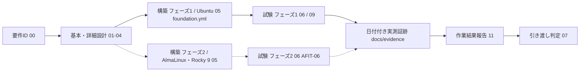

# Ansible自動化基盤構築案件パック

**一言でいうと**: 監視アプリなどの「上に載せるもの」ではなく、**どんな構築案件にも使い回せるAnsibleの土台（common + docker role）そのもの**を1から設計・実装し、引き渡すまでの書類一式です。

初めての方は、先に[案件パック 初心者ガイド](beginner-guide.md)を読むと全体像がつかめます。

## このパックが扱うもの

既存の[Linuxサーバー構築案件パック](../build-package/README.md)（案件ID`SM-LAB-001`）は、`server-monitor`という監視アプリを1台のUbuntuホストへ構築する案件です。Ansibleはそこで「実現手段」として使われています。

本パック（案件ID`SM-ANS-001`）は視点を1段掘り下げ、**Ansibleの構築コードそのものを製品として設計・実装・試験・引き渡しする案件**と見立てています。対象は`ansible/roles/common`と`ansible/roles/docker`という2つのroleと、それらを組み合わせる新しいplaybook`ansible/playbooks/foundation.yml`です。監視・AD・Windows・Zabbixのどの案件パックも、最初の一歩は「OSを整え、コンテナランタイムを入れる」ことから始まります。本パックは、その共通の一歩を独立した製品として切り出したものです。

| 案件パック | 何を作るか | Ansibleの位置づけ |
| --- | --- | --- |
| [Linux版](../build-package/README.md)（`SM-LAB-001`） | 監視アプリ1式 | 実現手段（`site.yml`が丸ごと適用） |
| [Windows版](../build-package-windows/README.md)（`SM-WIN-001`） | 監視対象ホストの追加 | 未使用（手動構築） |
| [AD版](../build-package-ad/README.md)（`SM-AD-001`） | ドメインコントローラー | 未使用（手動構築） |
| [Zabbix版](../build-package-zabbix/README.md)（`SM-ZBX-001`） | 独立監視基盤 | 未使用（Docker Compose手動構築） |
| **Ansible版**（`SM-ANS-001`、本パック） | **Ansibleの構築コードそのもの** | **成果物そのもの**（roleの設計・変数設計・冪等性・複数OS対応） |

| 案件 ID | 対象 | 現在の引き渡し判定 |
| --- | --- | --- |
| `SM-ANS-001` | 新規VM 1台（論理ホスト名`ans-01`、Ubuntu Server 24.04 LTS基準）へ`common` + `docker` roleを適用し、以後どの案件でも使い回せるOS+コンテナランタイム基盤を構築する。AlmaLinux/Rocky 9（論理ホスト名`ans-el9-01`）はフェーズ2として同一playbookでの対応を設計 | **フェーズ1 `PASS`（ラボ範囲）** — 2026-09-04に手元Hyper-VのVM 1台で必須16 IDをすべて`PASS`（[結果票](../evidence/2026-09-04-ansible-foundation-build.md)）。任意項目のAFNW-06（rate limit）は未実施。**フェーズ2（AlmaLinux 9.7実機）も2026-09-04に構築・冪等性・SELinux enforcingを実測`PASS`**（[結果票](../evidence/2026-09-04-ansible-foundation-el9-build.md)）だが、対象VMが以前の用途からの再利用環境のため「新規構築」「最小公開」の証跡としては専用の新規VMでの再実施が必要 |

次の3つは、それぞれ別の状態です。ひとまとめにしないでください。

- 文書が「作成済み」であること
- `foundation.yml`が実行可能なコードとして存在すること
- 特定の引き渡し対象ホストで受け入れが完了したこと（`ans-01`はフェーズ1完了。`ans-el9-01`はrole自体の動作は実測済みだが、再利用VMのため「新規構築」の証跡としては別途専用VMでの再実施が必要）

最終判定は[作業結果・引き渡し報告書](11-work-result-report.md)と[引き渡しチェックリスト](07-handover-checklist.md)を使います。

### 初めての方はまずこちら

`NFR`（非機能要件）、`AFIT-xx`（試験項目の番号）、「冪等性」「変数の優先順位」のような言葉が初見の場合は、12文書を読み始める前に[案件パック 初心者ガイド](beginner-guide.md)で、案件パックとは何か、各文書の役割、Ansibleの仕組みの覚え方を確認してください。

## 最短レビュー順

1. [要件定義書](00-requirements.md) — 何を作り、何を作らないか。どうなれば合格かを決める（要件IDと受け入れ条件を定義）
2. [基本設計書](01-basic-design.md) — 全体の構成と、Ansible設計の考え方（role分割・ガード・OS抽象化・冪等性・テスト戦略）
3. [詳細設計書](02-detailed-design.md) — role内部のtask設計、変数の優先順位、冪等性の実装パターン
4. [構築手順書](05-build-procedure.md) — `ans-01`を`foundation.yml`で組み立てる手順
5. [試験仕様書・結果票](06-test-specification.md) — 何を確かめれば合格かと、実測結果を書き込む用紙
6. [ネットワーク実機検証手順](09-network-validation-procedure.md) — 実機で通信できるかの確認（本パックはSSHの1ポートだけを検証する、意図的に小さい範囲）
7. [作業結果・引き渡し報告書](11-work-result-report.md) — 計画対実績、試験の集計、差異、残存リスク、完了判定
8. [検証証跡台帳](../evidence/README.md) — 実測済み・未実測の境界

## 成果物一覧

| 工程 | 成果物 | 状態 |
| --- | --- | --- |
| 要件定義 | [00-requirements.md](00-requirements.md) | 作成済み |
| 基本設計 | [01-basic-design.md](01-basic-design.md) | 作成済み |
| 詳細設計 | [02-detailed-design.md](02-detailed-design.md) | 作成済み |
| パラメータ設計 | [03-parameter-sheet.md](03-parameter-sheet.md) | 作成済み |
| ネットワーク設計 | [04-network-ip-plan.md](04-network-ip-plan.md) | 作成済み |
| 構築（フェーズ1/フェーズ2） | [05-build-procedure.md](05-build-procedure.md) | 2026-09-04にHyper-V VM 2台（Ubuntu・AlmaLinux）で通しで実施。実機結果は[フェーズ1結果票](../evidence/2026-09-04-ansible-foundation-build.md) / [フェーズ2結果票](../evidence/2026-09-04-ansible-foundation-el9-build.md) |
| 試験 | [06-test-specification.md](06-test-specification.md) | 原本は`NOT RUN`のまま。実績は[フェーズ1結果票](../evidence/2026-09-04-ansible-foundation-build.md)（必須16 ID全件PASS、任意のAFNW-06のみ残る）と[フェーズ2結果票](../evidence/2026-09-04-ansible-foundation-el9-build.md) |
| 引き渡し | [07-handover-checklist.md](07-handover-checklist.md) | 作成済み。ラボ範囲の項目のみ確認 |
| 変更・ロールバック | [08-change-rollback-plan.md](08-change-rollback-plan.md) | 計画・記録様式作成済み。実行実績は`NOT RUN` |
| ネットワーク実機検証 | [09-network-validation-procedure.md](09-network-validation-procedure.md) | [結果票](../evidence/2026-09-04-ansible-foundation-build.md) AFNW-01〜05 PASS、任意のAFNW-06はNOT RUN |
| 立ち上げ・受け入れ | [10-host-bringup-and-acceptance.md](10-host-bringup-and-acceptance.md) | Hyper-V Quick Create（Ubuntu 24.04 gallery image）で実施。再起動後の確認は未実施 |
| 作業結果報告 | [11-work-result-report.md](11-work-result-report.md) | [2026-09-04 記入済み版](../evidence/2026-09-04-work-result-SM-ANS-001.md)あり |
| 実装コード | [`ansible/playbooks/foundation.yml`](../../ansible/playbooks/foundation.yml)、[`ansible/inventory/group_vars/foundation/main.yml`](../../ansible/inventory/group_vars/foundation/main.yml)、[`ansible/inventory/foundation.local.yml.example`](../../ansible/inventory/foundation.local.yml.example) | 新規作成済み。CIの構文検証対象に追加済み。実ホストでの構築・冪等性を2026-09-04に実測 |

## 工程ゲート

表中の`NOT SET`は、値や承認がまだ決まっていないことを表します。

| Gate | 完了条件 | 現在の状態 |
| --- | --- | --- |
| G0 要件確定 | 要件ID、対象、対象外、受け入れ条件が合意済み | 文書作成済み。実案件での承認は`NOT SET` |
| G1 設計確定 | 基本・詳細・パラメータ・ネットワーク設計のレビュー完了 | 文書作成済み。実案件での承認は`NOT SET` |
| G2（フェーズ1）構築完了 | `ans-01`（Ubuntu）への初回適用が成功し、実績値と差異を記録 | `PASS`（2026-09-04、Hyper-V VM） |
| G2（フェーズ2）構築完了 | `ans-el9-01`（AlmaLinux/Rocky 9）への初回適用が成功 | `PASS`（2026-09-04、AlmaLinux 9.7実機。ただし再利用VM、専用新規VMでの再実施が望ましい） |
| G3（フェーズ1）試験完了 | フェーズ1必須試験IDがすべて`PASS` | `PASS`（2026-09-04、必須16 ID全件。任意のAFNW-06のみ未実施） |
| G3（フェーズ2）試験完了 | `AFIT-06`が`PASS` | `PASS`（2026-09-04、構築・冪等性・SELinux enforcing実測。AFST-03相当の最小公開は再利用VMのため対象外） |
| G4 作業完了 | 作業結果報告書に実績、障害、差異、残存リスクを記録 | `PASS`（[2026-09-04 報告書](../evidence/2026-09-04-work-result-SM-ANS-001.md)） |
| G5 引き渡し | 受領者、日時、鍵の受け渡し、未解決事項を記録 | ラボ範囲で完了（引き渡し元/先とも本人）。組織環境への引き渡しは`NOT RUN` |

## 検証環境

基準環境はUbuntu Server 24.04 LTSの単一ホスト（論理ホスト名`ans-01`）です。`common` / `docker`両roleはAlmaLinux/Rocky 9にも対応するコードとして実装済みで、Moleculeの`el9` scenarioでコンテナ検証しています。単一ホストの検証構成であり、複数ホストへの同時適用や高可用性は対象外です。

2026-09-04に、Windows上のHyper-V（Quick Create、Ubuntu 24.04.4 LTS gallery image）にVM 1台を立て、同じホストPC上のWSL2をAnsible controllerとしてフェーズ1を実施しました（[結果票](../evidence/2026-09-04-ansible-foundation-build.md)）。VMイメージにnetplan設定が無くDHCPv4が要求されない、`common`roleが作る管理者アカウントに既定のままだとsudoが使えない、という2件の事実を実行して初めて発見し、前者は運用上の回避、後者はコード側の欠陥修正（[欠陥台帳](../evidence/defects-found.md)#30）で対応しました。ホストPCとVMが同一物理機であるため、独立した管理端末や組織DNSからの検証は含みません。

同日、フェーズ2としてHyper-V VM（世代2、AlmaLinux 9.7）へも同じ`foundation.yml`を`--limit`で適用しました（[結果票](../evidence/2026-09-04-ansible-foundation-el9-build.md)）。ここでも実行して初めて欠陥が1件見つかり（`container_manage_cgroup` SELinux booleanの導入順序、[欠陥台帳](../evidence/defects-found.md)#31）、修正後に構築・冪等性・SELinux enforcing・dnf-automaticを実測`PASS`しました。ただしこのVMは以前の用途（Zabbixサーバー等）から再利用した環境であり、他サービスが既に稼働していたため、「まっさらな新規ホストへの構築」「最小公開（SSHのみ）」の証跡としては専用の新規VMでの再実施が必要です。

## 完了の定義

次をすべて満たした時点で「構築・試験完了」とします。

- `ansible/playbooks/foundation.yml`が`failed=0`で終了する
- 2回目の適用が`changed=0`になる
- [試験仕様書](06-test-specification.md)のフェーズ1必須項目がすべて`PASS`
- SSH鍵認証・firewall既定値・docker導入の証跡がcommit SHA付きで保存される
- 未解決事項、鍵の受け渡し方法、ロールバック方法が引き渡し記録に残る
- 実ホストの名前解決、経路、待受、SSH到達性、firewallを確認し、実行出力を保存する
- [作業結果・引き渡し報告書](11-work-result-report.md)の計画対実績、試験集計、差異、残存リスク、受領判定を記入する
