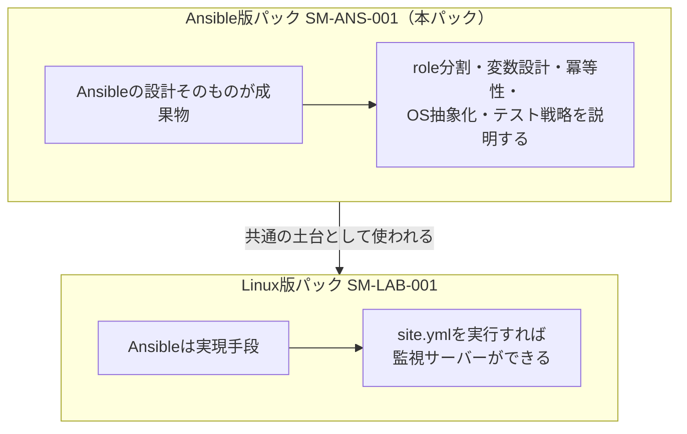

# 案件パック 初心者ガイド（Ansible版）

> **対象**: 「role」「冪等性」「変数の優先順位」のような言葉を初めて見る人
> **ゴール**: 12個の文書を読む前に、案件パック全体の地図と、Ansibleの設計を覚えるための5つの概念を頭に入れる
> **所要時間の目安**: 30〜40分（暗記ではなく、地図と概念のセットを持ち帰ることが目的）

このディレクトリ（[`docs/build-package-ansible/`](README.md)）には、文書が12個並んでいます。**監視アプリではなく、Ansibleの構築コードそのもの**（`common` role + `docker` role + それを組み合わせる`foundation.yml`）を1つの小規模な構築案件と見立てて、要件定義から引き渡しまでを一式そろえたものです。

すでに[Linux版パックの初心者ガイド](../build-package/beginner-guide.md)を読んでいる場合、12文書の並び方や用語（`NFR`、`Gate`、`NOT RUN`など）はほぼ共通です。この文書は**重複を避け、Ansible版パックに固有の内容**（なぜこのパックが必要か、Ansibleの設計をどう覚えるか）に絞って説明します。まだLinux版を読んでいない場合は、先に[Linux版の初心者ガイド](../build-package/beginner-guide.md)を読むことをおすすめします。

## この文書の使い方

**一言でいうと**: この文書は頭から通読するものではなく、次の順で辞書のように使うものです。

1. 「[1. なぜ2つ目のAnsible案件パックが要るのか](#1-なぜ2つ目のansible案件パックが要るのか)」で、Linux版との違いをつかむ
2. 「[2. Ansibleの仕組みを5つの概念で覚える](#2-ansibleの仕組みを5つの概念で覚える)」が本ガイドの中心です。まずここだけ読んでも構いません
3. 「[3. 12文書カード](#3-12文書カード)」を辞書として使い、読みながら該当カードだけ確認する
4. 分からない言い回しが出たら「[4. 現場用語ブリッジ](#4-現場用語ブリッジ)」を引く
5. 一度に全部を覚えようとしない。困ったらこの文書へ戻ってくればよい

## 1. なぜ2つ目のAnsible案件パックが要るのか

**一言でいうと**: Linux版パックは「Ansibleを使って何を作るか」を扱い、本パックは「Ansibleのコードそのものをどう設計するか」を扱います。

[Linux版パック](../build-package/README.md)（案件ID`SM-LAB-001`）を読むと、「`ansible-playbook`を実行すれば監視サーバーが1台できあがる」ことは分かります。しかし、次のような疑問には直接答えていません。

- なぜroleを`common`と`docker`のように分けるのか
- 「2回実行しても結果が変わらない」（冪等性）は、具体的にどうやって保証しているのか
- Ubuntu用の値とAlmaLinux用の値を、コードのどこで切り替えているのか
- 同じroleを、監視アプリ以外の案件（AD、Zabbixなど）でも使い回すには、何を変えればよいのか

本パック（案件ID`SM-ANS-001`）は、**この疑問そのものを要件と設計にした**案件パックです。対象は監視アプリではなく、`ansible/roles/common`・`ansible/roles/docker`という既存role、そしてそれを組み合わせる新しいplaybook`ansible/playbooks/foundation.yml`です。



**面接で聞かれたときの一言**: 「監視サーバー1台を作った経験だけでなく、その裏側で使っているAnsibleのroleが、なぜそう設計されているかを自分の言葉で説明できるように、設計意図を独立した案件パックとして書き出しました。」

## 2. Ansibleの仕組みを5つの概念で覚える

**一言でいうと**: 12文書を読み進める前に、Ansibleの設計判断を支える5つの考え方を先に押さえます。これは[未経験者向けサーバー構築キーワード集](../server-building-keywords.md)の「一言 → なぜ重要か → このパックでの実例」形式にならっています。

### ① Role（役割ごとの部品）

- **一言**: 「OSを整える」「コンテナランタイムを入れる」のように、1つの役割だけを担うコードのまとまり
- **なぜ重要か**: 1つのroleに複数の役割を詰め込むと、変更したときの影響範囲が予測できなくなる。役割を分けておけば、「`docker`roleだけ直したい」がそのまま実現できる
- **このパックでの実例**: `common`（OSハードニング）と`docker`（コンテナランタイム）に分け、どちらも監視アプリのような特定ワークロードへ依存しない
- **覚え方**: 「role＝担当者」。1人の担当者に仕事を集めすぎない

### ② 冪等性（べきとうせい）

- **一言**: 同じ操作を何度実行しても、結果が変わらない性質
- **なぜ重要か**: 「手順書どおりに手作業したら、2回目は既にある設定でエラーになった」という事故を防ぐ。Ansibleは「今の状態」と「望む状態」を比較し、差分がなければ何もしない
- **このパックでの実例**: `ansible-playbook ... playbooks/foundation.yml`を2回連続実行し、2回目が`changed=0`になることを[試験仕様書](06-test-specification.md)のAFIT-02で確認する。firewallルールで`allow`と`limit`を同じportへ二重に当てると、この性質が壊れることも[詳細設計書](02-detailed-design.md#冪等性の実装パターン)で説明している
- **覚え方**: 「何回押しても同じ結果のボタン」。壊れたエレベーターのボタンのように、連打しても状態が変わらない

### ③ 変数の優先順位（地層）

- **一言**: 同じ変数名でも、定義した場所によって「どの値が実際に使われるか」が決まる仕組み
- **なぜ重要か**: この仕組みが無いと、案件ごとにroleのコードそのものをコピーして書き換えることになり、修正が他の案件へ伝わらなくなる
- **このパックでの実例**: `server_monitor_user`という同じ変数名が、`group_vars/all`では`monitor`（監視アプリ向け）、`group_vars/foundation`では`svc-baseline`（本パック向け）という異なる値になる。role側のコードは一切変更しない（[詳細設計書「変数の優先順位設計」](02-detailed-design.md#変数の優先順位設計)）
- **覚え方**: 「後から書いた地層が上に乗る」。role defaults（一番下の地層）→ group_vars/all → group_vars/foundation → host_vars → extra-vars（一番上の地層）の順に、上にあるものが勝つ

### ④ Handler / notify（変更があった時だけ動く仕掛け）

- **一言**: 設定ファイルなどが実際に変わったときだけ、サービス再起動のような後処理を1回だけ実行する仕組み
- **なぜ重要か**: 「設定ファイルを毎回無条件で書き換えて、毎回サービスを再起動する」手順では、変更が無い日もサービスが止まってしまう。handlerは「変更があった時だけ」を保証する
- **このパックでの実例**: `docker`roleで`/etc/docker/daemon.json`の内容が変わったときだけ`Restart docker`handlerが呼ばれる。さらに、ワークロード配備前に`meta: flush_handlers`でこの再起動を確実に終わらせておく（[詳細設計書](02-detailed-design.md#docker-role-のtask順序)）
- **覚え方**: 「呼び鈴（notify）を鳴らさない限り、後処理（handler）は動かない」

### ⑤ Molecule（作って壊してためすテスト）

- **一言**: 実際のコンテナを使って、「構築できるか」「2回目も変わらないか」を自動でテストする道具
- **なぜ重要か**: 「コードを書いた本人の環境では動いた」だけでは、他の環境（別のOSファミリーなど）で壊れていないか分からない
- **このパックでの実例**: `common`・`docker`両roleに`default`（Ubuntu）と`el9`（Rocky）の2つのMolecule scenarioがあり、`create → converge → idempotence → verify → destroy`の流れで検証する。CIでは構文だけを検証し、実コンテナでのフルテストは開発者がローカルで実行する（[詳細設計書「Moleculeのシナリオ設計」](02-detailed-design.md#moleculeのシナリオ設計)）
- **覚え方**: 「使い捨てのミニチュアサーバーで、本番の前にリハーサルする」

この5つを1セットとして覚えると、12文書のどこを読んでいても「これはRoleの話」「これは冪等性の話」と自分の中で分類しながら読み進められます。

## 3. 12文書カード

**一言でいうと**: 12個の文書を1枚ずつのカードにした辞書です。頭から読まず、必要なカードだけ引きます。基本的な役割は[Linux版パックの12文書カード](../build-package/beginner-guide.md#4-12文書カード)と共通なので、ここでは**Ansible版パック固有の読みどころ**だけを書きます。

| 文書 | Ansible版パックでの読みどころ |
| --- | --- |
| [00 要件定義書](00-requirements.md) | 「済(自動)/済(手動)/未実装」の区分表。本パックはコードが実行可能でも、まだ実ホストでの`PASS`実績が無いことを最初に明示している |
| [01 基本設計書](01-basic-design.md) | 「Ansible設計の考え方」の6項目。role分割・ガード・OS抽象化・冪等性・テスト戦略・変数階層 |
| [02 詳細設計書](02-detailed-design.md) | 本パックの中心。role内部のtask順序図、変数の優先順位の具体例、冪等性の実装パターン表 |
| [03 パラメータシート](03-parameter-sheet.md) | 「`group_vars/all`の既定値」と「`foundation` groupでの上書き値」を並べた表。②の変数優先順位を数値で確認できる |
| [04 ネットワーク設計](04-network-ip-plan.md) | 公開ポートがSSHの1つだけである理由。監視アプリを配備しないという設計方針の裏付け |
| [05 構築手順書](05-build-procedure.md) | `--check --diff`で「何が確認でき、何が確認できないか」を表で区別している点に注目 |
| [06 試験仕様書・結果票](06-test-specification.md) | 試験ID接頭辞`AF`（Ansible Foundation）の由来と、AFUT/AFIT/AFST/AFNWの4系統 |
| [07 引き渡しチェックリスト](07-handover-checklist.md) | Vaultを使わない理由と、それでも受け渡す必要がある1つの機密（管理者のSSH秘密鍵） |
| [08 変更・ロールバック計画](08-change-rollback-plan.md) | roleが他の案件パックと共有されているため、role内部を変更すると影響範囲が本パックの外へ広がる点 |
| [09 ネットワーク実機検証手順](09-network-validation-procedure.md) | 他パックより検証項目が少ない（AFNW-01〜06のみ）理由を04と合わせて読む |
| [10 立ち上げと受け入れ試験](10-host-bringup-and-acceptance.md) | 「再起動後もSSHハードニングとfirewall設定が保たれるか」という、使い捨て環境では確認できない項目 |
| [11 作業結果・引き渡し報告書](11-work-result-report.md) | フェーズ1（Ubuntu）とフェーズ2（RHEL系）を分けて完了判定する表 |

## 4. 現場用語ブリッジ

**一言でいうと**: 本パックに固有の言い回しをまとめた表です。`Gate`・`NOT RUN`・`NOT SET`など、案件パック共通の用語は[Linux版パックの現場用語ブリッジ](../build-package/beginner-guide.md#5-現場用語ブリッジ)を参照してください。

| 用語 | 意味 |
| --- | --- |
| `SM-ANS-001` | 本パックの案件ID。「ANS」はAnsibleの略 |
| `AF`（試験ID接頭辞） | Ansible Foundationの略。他パックの`Z`（Zabbix）、`A`（AD）と区別するための接頭辞 |
| `foundation` group | `ansible/playbooks/foundation.yml`が対象とするinventory group。監視アプリ用の`monitor` groupとは独立している |
| `svc-baseline` | `foundation` group専用に上書きしたアプリ用アカウント名。監視アプリ向けの既定値`monitor`と区別するために選んだ、案件非依存な名前 |
| フェーズ1 / フェーズ2 | フェーズ1はUbuntu（基準環境）、フェーズ2はAlmaLinux/Rocky 9（未着手）。[AD版パック](../build-package-ad/README.md)と同じ、実行済み範囲と設計のみの範囲を区別する書き方 |
| assert（ガード） | ホストを変更する前に、前提条件を確認して満たさなければ停止するタスク。「実行してから失敗に気づく」のではなく「変更前に止める」ための仕組み |
| Molecule scenario | `default`（Ubuntu）や`el9`（Rocky）のように、Moleculeが検証する対象環境の単位 |
| `--syntax-check` | ホストへ接続せず、playbookの構文だけを確認するAnsibleのオプション |
| `--check --diff` | 実際には変更せず、変更予定の差分だけを表示する実行（dry run）。「検証済み」の代わりにはならない限界があることを[05-build-procedure.md](05-build-procedure.md#3-適用前確認-check-diff)で説明している |

## 5. 読む順とかかる時間の目安

| 順番 | 文書 | 目安時間 | この段階の完了条件 |
| --- | --- | ---: | --- |
| 0 | この初心者ガイド | 30分 | 5つの概念（Role/冪等性/変数優先順位/Handler/Molecule）を、自分の言葉で1つずつ説明できる |
| 1 | [00 要件定義書](00-requirements.md) | 15分 | 本パックがLinux版パックと何を分担しているかを説明できる |
| 2 | [02 詳細設計書](02-detailed-design.md) | 20分 | role内部のtask順序を1つ選び、「なぜその順序か」を言える |
| 3 | [03 パラメータシート](03-parameter-sheet.md) | 10分 | `server_monitor_user`が`monitor`から`svc-baseline`へ上書きされる仕組みを説明できる |
| 4 | [05 構築手順書](05-build-procedure.md) | 15分 | `--check --diff`で確認できることと、できないことを分けて言える |
| 5 | [06 試験仕様書・結果票](06-test-specification.md) | 10分 | AF接頭辞の由来と、フェーズ1/フェーズ2で必須試験が分かれる理由を言える |
| 6 | [検証証跡台帳](../evidence/README.md) | 10分 | 実測済みと未実測の境界を、1つ具体例で説明できる |

残りの01・04・07・08・09・10・11は、上のステップを終えてから読んでください。

## 6. 覚えるための1分チェック

1. 本パック（`SM-ANS-001`）とLinux版パック（`SM-LAB-001`）は、何が違いますか。
2. 冪等性とは何ですか。firewallルールの例で1つ挙げてください。
3. `server_monitor_user`の値は、どの階層のどのファイルで最終的に決まりますか。
4. handlerとnotifyの関係を一言で説明してください。
5. なぜCIはMoleculeのフルライフサイクルを毎回実行しないのですか。

<details>
<summary>解答例</summary>

1. Linux版パックはAnsibleを「使って」監視アプリを作る案件、本パックはAnsibleの設計そのものを成果物とする案件
2. 同じ操作を何度実行しても結果が変わらない性質。同じportへ`allow`と`limit`を二重に適用すると、実行のたびに互いを上書きしてchangedが出続け、冪等性が崩れる
3. `group_vars/all`より優先順位の高い`group_vars/foundation/main.yml`の値（`svc-baseline`）が最終的に使われる
4. 設定などに変更があったときだけnotifyが呼び鈴を鳴らし、handlerがその後処理（再起動など）を1回だけ実行する
5. 実コンテナでのフルライフサイクルは共有CIランナー上で不安定になりやすいため、CIでは構文とscenarioの検出だけを確認し、フルテストは開発者がローカルで実行する運用にしている

</details>

## 7. 面接で聞かれたら

```text
このパックでは、Ansibleの`common`・`docker` roleを、監視アプリに依存しない
[再利用可能な基盤]として切り出し、[SM-ANS-001]という案件に見立てて
設計から引き渡しまでの文書一式を作りました。

role設計では[責務を1つに絞る]ことを意識し、変数は
[role defaults → group_vars/all → group_vars/foundation → host_vars]
という優先順位を使って、[コードを変更せずに案件ごとの値を切り替えられる]
ようにしています。

冪等性は「祈る」のではなく、[読み取り専用コマンドへのchanged_when: false]や
[allowとlimitを二重に適用しない設計]のように、コードレベルで保証しています。

現時点ではUbuntu向けの設計・実装が中心で、AlmaLinux/Rocky 9への実機適用は
[フェーズ2として未着手]です。これは[実VMを用意できていない]という制約であり、
コード自体はMoleculeの`el9` scenarioで検証済みであることも合わせて説明します。
```

## 8. よくある誤解

| 誤解 | 実際 |
| --- | --- |
| 新しいroleを作った案件だと思った | `common` / `docker`は既存role。本パックが新規に作ったのは`foundation.yml`というplaybookと、それ専用のinventory/group_varsだけ |
| Linux版パックと内容が重複している | Linux版は「監視アプリの構築」、本パックは「Ansible設計そのもの」を扱う。対象読者も「これから構築する人」から「Ansibleの設計判断を説明したい人」へ変わる |
| AlmaLinux/Rocky対応は完了している | role側のコードとMoleculeのコンテナ検証は済んでいるが、実VMへ適用した実績は無い（フェーズ2、未着手） |
| Vaultを使っていないのは手抜き | `common` / `docker`両roleは機密値を必要としないため、意図的にVaultを使わない設計にしている（[00-requirements.md](00-requirements.md#5-制約と対象外)） |

## 次に読む文書

- 案件パック本体: [Ansible版パックREADME（最短レビュー順・成果物一覧・工程ゲート）](README.md)
- 対になるLinux版パック: [Linux サーバー構築案件パック](../build-package/README.md) / [その初心者ガイド](../build-package/beginner-guide.md)
- Ansibleの実行手順そのもの: [Ansible配備手順](../deployment-ansible.md)
- 用語をさらに詳しく: [未経験者向けサーバー構築キーワード集](../server-building-keywords.md)
- 実測と未実施の境界: [検証証跡台帳](../evidence/README.md)
