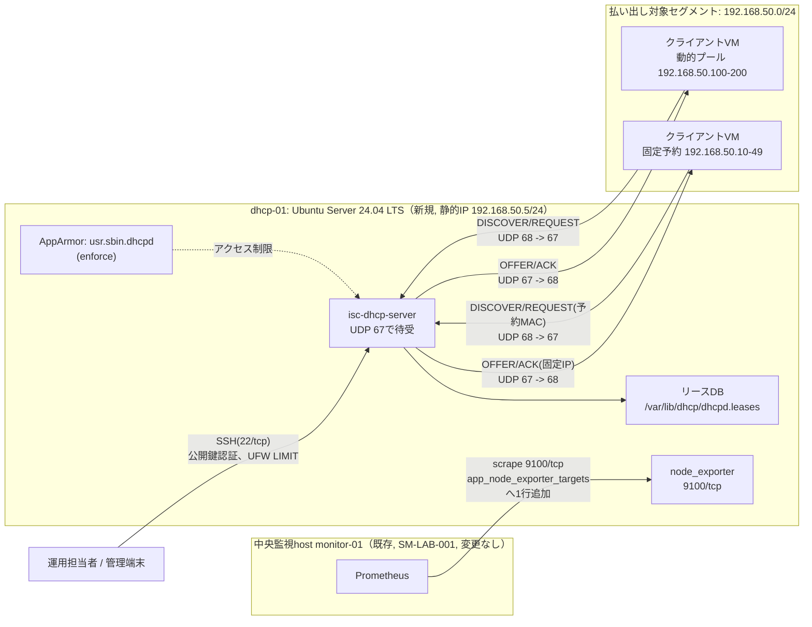

# 基本設計書

> 💡 **初めて読む方へ**: この文書は要件を「どう実現するか」の全体方針を描く文書です。初めての場合は先に[案件パック 初心者ガイド](beginner-guide.md#01-基本設計書)で全体の地図を確認してください。

要求と受け入れ条件は[要件定義書](00-requirements.md)を正本とし、本書ではその実現方式を定義します。

## 1. 目的

新規の検証用VM1台（論理ホスト名`dhcp-01`、Ubuntu Server 24.04 LTS）へ**isc-dhcp-server**による新規DHCPv4サーバーを安全かつ再現可能に構築し、検証用LANセグメント（`192.168.50.0/24`）向けに、動的リース払い出し（DORA）、固定IP予約、リース更新・解放、プール枯渇時の安全な失敗、サービス停止からの復旧までを検証できる環境を提供します。「アプリ監視基盤（Linux/Windows/AD/Zabbix）」に加えて、**ネットワークの基盤サービスそのものを要件定義から引き渡しまで設計・構築できる**ことを示すのが、本パックをポートフォリオへ追加した狙いです。

## 2. 対象範囲

| 対象 | 内容 |
| --- | --- |
| OS(dhcp-01) | Ubuntu Server 24.04 LTS、新規の検証用VM1台（静的IP`192.168.50.5/24`） |
| 配備 | 新規Ansible role `dhcp_server`（`ansible/roles/dhcp_server/`）+ 専用playbook `ansible/playbooks/dhcp.yml`。既存の`common` roleでOS基盤（SSH強化、パッケージ更新、UFW既定方針等）を整えたうえで適用する2 play構成 |
| DHCPサーバー | isc-dhcp-server（Ubuntuのapt package）。設定は`/etc/dhcp/dhcpd.conf`（`templates/dhcpd.conf.j2`から生成）、デーモン起動オプションは`/etc/default/isc-dhcp-server`（`templates/isc-dhcp-server.j2`から生成） |
| 払い出し対象 | 検証用LANセグメント`192.168.50.0/24`。動的プール`192.168.50.100`〜`.200`（101個）、固定IP予約帯`192.168.50.10`〜`.49`（MACアドレスで予約） |
| 監視統合 | 既存の中央Prometheus（`monitor-01`、案件ID`SM-LAB-001`、変更なし）へnode_exporterを登録し、`up=1`を確認する。新たな監視サーバーは`dhcp-01`側に置かない |
| 運用 | `dhcpd.conf`とリースDB（`/var/lib/dhcp/dhcpd.leases`）のバックアップ・復元、rogue DHCP事前確認、サービス停止復旧演習、変更管理 |

対象外は、ISC failoverプロトコルによる冗長化・複数DHCPサーバー構成、DHCPv6・SLAAC併用、DHCPリレー（`dhcrelay`）による複数セグメント配信、Dynamic DNS連携、DHCP snooping/Dynamic ARP Inspectionなどスイッチ側の対策、Kea DHCPへの移行、24時間有人監視、複数拠点、実組織の個人情報、商用SLAです（詳細は[要件定義書](00-requirements.md)の5章、対応表は本書8章）。

## 3. 論理構成

管理経路（SSH）とDHCPペイロード経路（UDP 67/68）は、制限の考え方が異なります。SSH（22/tcp）はUFWの`LIMIT`ルールで全送信元を対象としつつ、production受入では管理元CIDR限定へ絞る前提とします。DHCP（67/udp）は送信元CIDRでは絞れません。DHCPDISCOVERはクライアントがまだIPアドレスを持たない状態で送出するため送信元が`0.0.0.0`であり、`192.168.50.0/24`のようなCIDRに一致しないためです。そこでUFWは払い出し対象セグメント側interface（`dhcp_server_interface`）を対象にDHCPの待受を限定し、他のinterface（管理面NIC等）からは67/udpへ到達できないようにします（NFR-03、DST-01）。この考え方は、[Zabbixパックのtrapper port](../build-package-zabbix/01-basic-design.md)や[Linux版のnode_exporter](../build-package/04-network-ip-plan.md)と同じ「用途ごとに公開範囲を最小化する」設計方針の踏襲です。

DHCPクライアントとの通信はブロードキャストを含むため、`dhcp-01`は払い出し対象セグメントへ直接接続されたNIC（`dhcp_server_interface`変数で指定、既定値は空文字で必ずinventoryで実機確認後に指定する）上でのみ待ち受けます。DHCPリレー（`dhcrelay`）を使った複数セグメントへの配信は対象外のため、本パックは単一セグメント内へ`dhcp-01`を直接配置する構成のみを扱います（詳細は[ネットワーク設計・IPアドレス表](04-network-ip-plan.md)）。

node_exporter（9100/tcp）は、既存の[Linux版パック](../build-package/01-basic-design.md)や[Windows版パック](../build-package-windows/01-basic-design.md)の`app_node_exporter_targets`と同じ汎用機構をそのまま使い、`monitor-01`のPrometheusが`dhcp-01`をscrapeします。`dhcp-01`はLinuxホストのため、Windows/AD版のように新たなAnsible role・network egressの追加設計を必要とせず、既存の仕組みへ1行追加するだけで統合できます（詳細は5章）。

DORA（DISCOVER/OFFER/REQUEST/ACK）のpacket captureによる実機確認手順は[ネットワーク実機検証手順](09-network-validation-procedure.md)（DNW-06）、実際の立ち上げ環境（VirtualBoxのHost-Only/Internalネットワーク）は[立ち上げ環境](10-host-bringup-and-acceptance.md)にまとめます。

## 4. DHCPデーモンの選定とその理由

DHCPデーモンには、Ubuntuのapt packageとして提供される**isc-dhcp-server**（パッケージ名・サービス名とも`isc-dhcp-server`）を採用します。ここで正直に明記すべき事実として、開発元のISCは2022年にisc-dhcpを**EOL（開発終了）**とし、後継として**Kea DHCP**（`isc-kea-dhcp4-server`、JSON形式の設定）を推奨しています。これは隠さずに本書へ明記します。

それでも本パックがisc-dhcp-serverを選ぶ理由は次のとおりです。

1. 設定ファイル（`dhcpd.conf`）がブロック構文で、JSON中心のKeaより初心者にとって読み書きしやすいこと。
2. 国内の入門書・資格教材（LPIC等）や既存の小規模DHCP運用で、今なお広く使われている実務知識であること。
3. Ubuntu 24.04（noble）のuniverseリポジトリに`isc-dhcp-server`パッケージが存在する前提で設計していますが、この前提は[構築手順書](05-build-procedure.md)で`apt-cache policy isc-dhcp-server`により必ず実機確認します。パッケージが存在しない場合はKea DHCPへの切替が必要になります。
4. Keaへの移行は対象外ではなく、8章「発展的な設計・将来構想」で次のステップとして明記します。

この技術選定トレードオフの説明は、[Zabbixパック](../build-package-zabbix/01-basic-design.md)が「なぜ既存Prometheusと統合せず専用のZabbixサーバーを新設するか」を正直に説明しているのと同じ位置づけの、設計判断の記録です。EOL済みのソフトウェアをあえて選ぶことは、実務では珍しくない判断です（枯れた実装・既存資産・教育コストなどの理由で、後継への移行が計画済みのまま現行版を使い続けるケースは多くあります）。本パックはその判断の理由と移行計画を明文化することそのものを、設計スキルの一部として示します。

## 5. 単一フェーズで完結する理由

本パックは、[Windows版パック](../build-package-windows/01-basic-design.md)・[AD版パック](../build-package-ad/01-basic-design.md)のような「フェーズ1（ホスト単体構築）」「フェーズ2（中央監視統合、未解消の課題により`BLOCKED`）」の2段階分割を採用せず、[Linux版パック](../build-package/01-basic-design.md)と同じ単一フェーズの工程ゲート（G0〜G5）で完結します。

Windows版・AD版パックがフェーズ2を`BLOCKED`とする理由は、次の3点に集約されます（[Windows版基本設計書](../build-package-windows/01-basic-design.md)3.1節）。

1. `ansible/roles`配下にWindows対応roleが無く、Ansibleでの自動構築ができない。
2. `compose.yaml`のmonitoring networkが`internal: true`であり、Prometheusコンテナが同じDockerホスト外の実マシン（Windows Server）へ到達できない。
3. Windows Event Log/IISログを既存Lokiへ送る経路（Grafana Alloy for Windows導入、認証・network設計）が無い。

`dhcp-01`はこれらの制約をいずれも持ちません。

- `dhcp-01`はUbuntu Server（Linuxホスト）であり、既存の`common` role、`app_node_exporter_targets`変数、`ansible/roles/app/templates/prometheus.yml.j2`のfor展開機構をそのまま使えます。新たなOS別roleを用意する必要がありません。
- node_exporter（9100/tcp）は、Windows版のwindows_exporterのように「monitoring networkが`internal: true`で到達できない」という課題を持ちません。`monitor-01`のPrometheusコンテナから同一ネットワーク内のLinuxホストのnode_exporterをscrapeする経路は、既存の[Linux版パック](../build-package/01-basic-design.md)ですでに確立済みです。
- syslog/journalへのログ出力は`dhcp-01`上のホストOS機能であり、Windows版のようにログ集約基盤（Grafana Alloy for Windows）を新規導入する設計課題を持ちません（現時点ではLokiへの中央集約は行わず、`journalctl -u isc-dhcp-server`によるホスト上の確認にとどめます。中央ログ収集への連携は8章の将来構想です）。

したがって`dhcp-01`は、`common` role → `dhcp_server` role → 中央Prometheusの`app_node_exporter_targets`へ1行追加、という一連の流れをG2（構築完了）〜G3（試験完了）の中で完結でき、Windows/AD版のような「中央監視基盤への統合待ち`BLOCKED`」という区分を必要としません。これは本パックが単純だからではなく、対象がLinuxホストであるためにWindows/AD版が抱える構造的な制約（OS別roleの不在、Dockerネットワークの隔離、ログ収集経路の不在）を最初から持たない、という設計上の事実です。

## 6. 非機能要件と実現方針

| ID | 分類 | 要件 | 実現方針 | 確認方法 |
| --- | --- | --- | --- | --- |
| NFR-01 | 再現性 | 未構築の対象VMへ`dhcp.yml`を適用し、エラーなく完了すること | `common` role → `dhcp_server` role の順に適用。role冒頭で`ansible.builtin.assert`により全入力（interface名、range、DNS等）を検証してから`/etc/dhcp/dhcpd.conf`を書き換える | DIT-01 |
| NFR-02 | 冪等性 | `dhcp.yml`の2回目適用が`changed=0`になること | `ansible.builtin.template`・`ansible.builtin.package`など宣言的モジュールのみを使用し、シェルコマンドでの状態変更を避ける | DIT-01（2回目） |
| NFR-03 | セキュリティ | UFWでUDP 67の待受を払い出し対象interface限定にし、それ以外のネットワークへ非公開とすること | `dhcp_server_manage_firewall: true`変数に基づき、roleが`dhcp_server_interface`をinterfaceとして指定したUFW ruleを追加する | DST-01 |
| NFR-04 | セキュリティ | `/etc/dhcp/dhcpd.conf`の所有者・権限が`root:root`かつ`0644`以下であること | `templates/dhcpd.conf.j2`を配布する`template`タスクで`owner`/`group`/`mode`を明示指定する | DST-02 |
| NFR-05 | セキュリティ | AppArmorプロファイル`usr.sbin.dhcpd`がenforceモードで有効であること | Ubuntuの`isc-dhcp-server`パッケージが同梱するAppArmorプロファイルを無効化せず、既定のenforceモードのまま維持する | DST-03 |
| NFR-06 | セキュリティ | SSHは`common` roleの既定強化（root禁止、パスワード認証禁止）を継承すること | `dhcp.yml`のplay順序で`common` roleを`dhcp_server` roleより先に適用し、既存の強化設定を上書きしない | DST-04 |
| NFR-07 | 監査性 | リースの割当・解放イベントがsyslog/journalへ記録されること | isc-dhcp-serverは既定でdaemonファシリティへログ出力し、journaldが収集する。中央Lokiへの集約は行わずホスト上での確認にとどめる（8章） | DST-05 |
| NFR-08 | セキュリティ | 構築直前に、同一セグメントに想定外のDHCPサーバー（rogue DHCP）が存在しないことを確認した記録があること | [構築手順書](05-build-procedure.md)の作業前確認に、`nmap --script broadcast-dhcp-discover`相当の確認手順を組み込み、記録を証跡に残す | DST-06 |
| NFR-09 | 復旧性 | `dhcpd.conf`とリースDBのバックアップ・復元手順があり、RTOを記録すること | バックアップ対象を`/etc/dhcp/dhcpd.conf`と`/var/lib/dhcp/dhcpd.leases`に限定し、手順化・所要時間計測を行う | DIT-11 |
| NFR-10 | 保守性 | プール拡張・固定IP追加などの変更時、Go/No-Go条件とロールバック手順を記録すること | 変更はAnsible変数（`dhcp_server_range_end`、`dhcp_server_reservations`等）の変更と再適用で行い、失敗時は変数を戻して再適用、または`dhcpd.conf`バックアップから復元する | [08-change-rollback-plan.md](08-change-rollback-plan.md) |
| NFR-11 | 追跡性 | 実行日時、環境、コマンド、実出力、判定を証跡に残すこと | 日付付きevidence（`docs/evidence/YYYY-MM-DD-dhcp-build-validation.md`）へ結果をコピーする運用とし、原本は直接上書きしない | 全必須試験 |
| NFR-12 | 完了管理 | 計画対実績、試験集計、差異、残存リスクを1件の報告へまとめること | [作業結果・引き渡し報告書](11-work-result-report.md)へ集約する | [11-work-result-report.md](11-work-result-report.md) |
| NFR-13 | 監視統合 | node_exporterを中央Prometheusへ登録し、`up=1`を確認すること | `ansible/roles/app/defaults/main.yml`の`app_node_exporter_targets`へ`dhcp-01`を1行追加し、`monitor-01`側で`site.yml`を再適用する | DIT-10 |

## 7. 可用性と保存期間

- 単一の`dhcp-01`ホスト構成のため、ホスト障害時の無停止継続は保証しません。ISC failoverプロトコルによる冗長化は8章の将来構想です。
- リース（lease）の保存期間はdefault-lease-time`43200`秒（12時間）、max-lease-time`86400`秒（24時間）を初期値とします。T1（renew、目安50%＝21600秒）・T2（rebind、目安87.5%＝37800秒）は、クライアント側の自動更新タイミングを理解するための説明用の値にとどめます。`dhcpd.conf`ではdhcp-renewal-time（option 58）・dhcp-rebinding-time（option 59）を明示指定しないため、isc-dhcp-serverはこれらの値をクライアントへ送信しません。この場合T1/T2はRFC 2131の既定比率に従いDHCPクライアント側で計算されるものであり、サーバー側の既定計算ではありません。
- 既存の中央監視基盤（`SM-LAB-001`）側のPrometheus保持期間は変更しません。[Linux版基本設計書](../build-package/01-basic-design.md)のとおり、Prometheusは35日を初期値とします。
- `dhcpd.conf`とリースDBのバックアップ頻度・保持世代は、[変更・ロールバック計画](08-change-rollback-plan.md)で定めます。復元できることはNFR-09・DIT-11で確かめ、RTOを記録します。
- 本パック自体に対する可用性・latencyのSLO数値目標は現時点で`NOT SET`です。動的プールの枯渇率やリース払い出しの成功率といった運用指標の定常的な可視化は、8章の将来構想（プール使用率の可視化・アラート）として扱い、本案件の範囲には含めません。

## 8. 発展的な設計・将来構想

次の項目は、現時点では設計・言及にとどめ、実装は行っていません。対象外（[要件定義書](00-requirements.md)5章「制約と対象外」）ではなく、次のステップとして正直に記録します。

| 項目 | 内容 |
| --- | --- |
| Kea DHCPへの移行 | isc-dhcp-serverはEOLのため、将来的にJSON設定ベースのKea DHCP（`isc-kea-dhcp4-server`）へ移行する構想。設定の考え方は近いが構文が異なるため別途設計が必要 |
| DHCP failover | ISC DHCP failoverプロトコル、またはKeaのHA機能による2台構成の冗長化。本パックは単一サーバー構成のため未実装 |
| DHCPv6 / IPv6 | DHCPv6ステートフル配布、またはSLAAC + DHCPv6 option-onlyの併用。本パックはIPv4のみを扱う |
| DHCPリレー（`dhcrelay`）による複数セグメント配信 | 現在は単一セグメント内に直接配置する構成のみ。複数セグメントへは、各セグメントのルーター/L3スイッチにIP helper相当の設定を入れ、`dhcrelay`を経由して`dhcp-01`へ集約する設計が必要 |
| DHCP snooping / Dynamic ARP Inspection | rogue DHCP対策としてスイッチ側で行う機能。本パックはDST-06/DNW-09の手動確認にとどめ、スイッチ設定は対象外 |
| プール使用率の可視化・アラート | `dhcpd.leases`を解析してPrometheus形式で公開するexporter（コミュニティ製のものはあるが公式パッケージではない）を導入し、プール枯渇の予兆をGrafanaで可視化する構想。未実装 |
| Dockerラボでの払い出し実演 | 既存の[二セグメント障害ラボ](../../labs/network-troubleshooting/README.md)と同様の使い捨てDocker環境でDORAを実演する構想。Docker既定bridgeのIPAMと衝突するため設計課題が残っており、未実装 |
| 中央ログ収集（Loki）への連携 | isc-dhcp-serverのsyslog出力を、既存のGrafana Alloy経由でLokiへ集約する構想。現在は対象ホスト上の`journalctl`確認にとどまる |

## 9. 受け入れ条件

[試験仕様書・結果票](06-test-specification.md)の必須試験（`DUT-01`〜`05`、`DIT-01`〜`11`、`DST-01`〜`06`、`DNW-01`〜`09`、合計31 ID）がすべて`PASS`し、実行日時、commit SHA、環境、主要ログ、発見した問題が証跡（`docs/evidence/YYYY-MM-DD-dhcp-build-validation.md`）として保存され、[作業結果・引き渡し報告書](11-work-result-report.md)の差異・残存リスク・受領判定が記入されていることを受け入れ条件とします。`dhcp_server` roleの`ansible-lint --offline`（production profile）とAnsible構文チェックはローカルで通過済み（DUT-02、DUT-03）ですが、これは対象ホストへの実適用・DORAの実演がPASSしたことを意味しません。実ホストへの適用は現時点で`NOT RUN`です。
