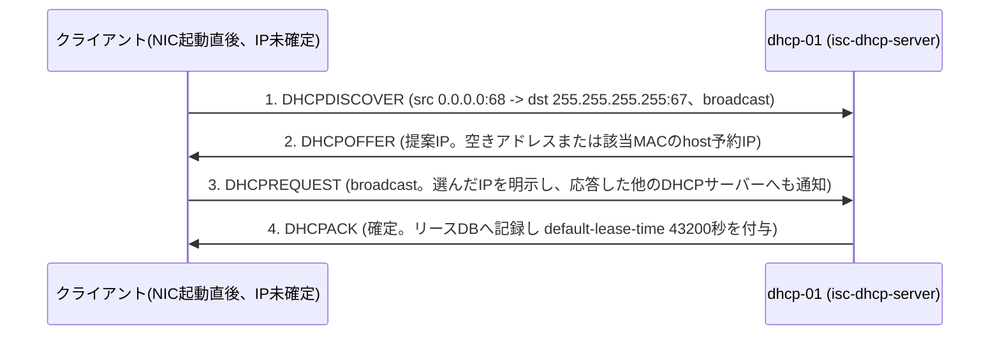

# 詳細設計書

> 💡 **初めて読む方へ**: この文書はコンポーネントごとの実装と「正常性の見分け方」を描く文書です。案件パック全体の地図は[初心者ガイド](beginner-guide.md#02-詳細設計書)を参照してください。

要求と受け入れ条件は[要件定義書](00-requirements.md)、実現方式の全体像は[基本設計書](01-basic-design.md)を正本とし、本書では新規ホスト`dhcp-01`上の5コンポーネント(isc-dhcp-server本体、`dhcpd.conf`、リースDB、AppArmorプロファイル、node_exporter)の実装・依存関係・正常性確認、配備設計、アクセス制御、ログ・監視設計、バックアップ・ロールバック設計を定義します。中央監視host(論理名`monitor-01`)側の構成は、`app_node_exporter_targets`への1行追加以外は変更しません。本パックはWindows版・AD版パックのようなフェーズ1(ホスト単体構築)/フェーズ2(中央監視統合)の分割を採用せず、[要件定義書](00-requirements.md)のとおり単一フェーズで完結します。新規role `ansible/roles/dhcp_server/` と専用playbook `ansible/playbooks/dhcp.yml` はすでに実装済みで、ローカルでの`ansible-lint --offline`(production profile)とAnsible構文チェックは通過を確認済みですが、対象ホストへの実適用とDORA(DISCOVER/OFFER/REQUEST/ACKの4-way handshake)の実演は`NOT RUN`です。

## コンポーネント設計

| コンポーネント | 実装 | 依存先 | 正常性確認 |
| --- | --- | --- | --- |
| isc-dhcp-server本体(dhcpdデーモン) | aptパッケージ`isc-dhcp-server`(Ubuntu 24.04 noble universe)。systemdサービス名も`isc-dhcp-server`。バインドinterfaceは`/etc/default/isc-dhcp-server`の`INTERFACESv4`で指定(空のままだと全interfaceを待受してしまうため`dhcp_server_interface`変数で必ず明示) | `dhcpd.conf`(起動時に構文検査も兼ねる)、`dhcp_server_interface`変数(払い出し対象セグメント`192.168.50.0/24`へ実接続されたNIC) | `systemctl is-enabled isc-dhcp-server`が`enabled`(DUT-04)。`systemctl status isc-dhcp-server`がactive (running)。クライアントVMでのDORA実測でIPを取得できること(DIT-02) |
| dhcpd.conf | `ansible.builtin.template`で`templates/dhcpd.conf.j2`から`/etc/dhcp/dhcpd.conf`へrender。所有者`root:root`・モード`0644`、`validate: /usr/sbin/dhcpd -t -cf %s`により構文エラーのある内容は反映前に拒否 | `dhcp_server_subnet`/`_netmask`/`_range_start`/`_range_end`/`_routers`/`_dns_servers`/`_domain_name`/`_default_lease_time`/`_max_lease_time`/`_reservations`/`_authoritative`の各変数。いずれも`tasks/main.yml`の`ansible.builtin.assert`で書き換え前に検証 | `sudo dhcpd -t -cf /etc/dhcp/dhcpd.conf`が構文エラーなし・exit 0(DUT-01)。`stat -c '%U:%G %a' /etc/dhcp/dhcpd.conf`が`root:root`かつ`644`以下(DST-02、NFR-04) |
| リースDB(`/var/lib/dhcp/dhcpd.leases`) | isc-dhcp-serverパッケージが初回起動時に自動生成する、プレーンテキスト形式の追記型リース記録。roleはこのファイルを明示的に作成・管理せず、パッケージの既定動作に委ねる設計 | isc-dhcp-serverサービス本体、書込み先ディレクトリ`/var/lib/dhcp/`の権限 | `sudo systemctl restart isc-dhcp-server`後も既存のリース内容が保持されていること(DIT-06、FR-05)。バックアップからの復元後に新規リースが正常に払い出されること(DIT-11、NFR-09) |
| AppArmorプロファイル(`usr.sbin.dhcpd`) | isc-dhcp-serverパッケージに同梱される`/etc/apparmor.d/usr.sbin.dhcpd`。Ubuntu Server 24.04ではapparmorパッケージ・サービスが既定で有効なため、パッケージ導入と同時にenforceモードで読み込まれる想定。`dhcp_server` roleはこのプロファイルを明示操作しない | OS既定のapparmorサービス(`common` roleでも無効化しない前提。この前提自体はDST-03で実機確認する) | `sudo aa-status \| grep dhcpd`で`usr.sbin.dhcpd`がenforceモード(DST-03、NFR-05) |
| node_exporter | aptパッケージ`prometheus-node-exporter`(Ubuntu universe)をdhcp-01へ個別導入。`dhcp_server` role・`common` roleのいずれのタスクにも含まれておらず、現時点は手動導入(下記「配備設計」参照) | UFWで9100/tcpを中央Prometheus host(`monitor-01`)のIPのみ許可。`ansible/roles/app/defaults/main.yml`の`app_node_exporter_targets`への登録 | dhcp-01上で`curl http://localhost:9100/metrics`が200。中央Prometheusで`up{host="dhcp-01"}=1`(DIT-10、FR-09、NFR-13) |

**DORA(DISCOVER→OFFER→REQUEST→ACK)のシーケンス**: 新規クライアントがIPアドレスを持たない状態から取得するまでの4-way handshakeは次のとおりです。

1〜4の4パケットを`tcpdump -nn -i <interface> udp port 67 or port 68`で観測することがDIT-02・DNW-06の判定条件です。3.のDHCPREQUESTがbroadcastである理由は、同一セグメントに複数のDHCPサーバー(rogue DHCPを含む)が存在する場合に、選ばれなかったサーバー側が自分の提案を破棄できるようにするためです。`dhcpd.conf`で`authoritative;`を有効にしている`dhcp-01`は、自分の管理範囲(`192.168.50.0/24`)に対して無効なIP・リースを要求するクライアントへ積極的にDHCPNAKを返します。ただしこれはdhcpd自身の応答挙動であり、同一セグメントに他のDHCPサーバーが存在すること自体を運用者へ知らせる仕組みではありません。rogue DHCPの有無そのものはDST-06/DNW-09の能動的なスキャンで別途確認します。なお、DORAが行われるのは新規取得時のみです。リース満了前の更新は2段階あり、まずT1到達時にクライアントがリース元へunicastで直接DHCPREQUESTを送りDHCPACKを受け取る2パケットのRENEWを試みます。RENEWへの応答が得られないままT2に到達すると、クライアントは相手を特定せずDHCPREQUESTをbroadcastするREBINDへ移行し、応答したいずれかのDHCPサーバーからDHCPACKを受け取ります。どちらの場合も新たなDISCOVER/OFFERは介しません(FR-05、DIT-05)。

**固定IP予約(host reservation)の設計**: 固定IP予約は`dhcpd.conf.j2`内の`host`ブロックとして表現し、`dhcp_server_reservations`変数(`name`/`mac`/`ip`のリスト)から生成します。予約帯は`192.168.50.10`〜`.49`に置く運用とし、動的プール(`192.168.50.100`〜`.200`)とは重ならない設計です。ただし`ansible/roles/dhcp_server/tasks/main.yml`の`assert`は各予約の名前・MACアドレス・IPアドレスの形式と一意性のみを検証し、予約IPが動的プール範囲と重ならないことまでは機械的に検査しません。予約を追加・変更する際は[変更・ロールバック計画](08-change-rollback-plan.md)の手順に沿って、range外であることを目視確認したうえで適用する運用とします。予約済みMACのクライアントは、DISCOVER時点でdhcpdが`host`ブロックに一致するMACを検出し、動的プールの空き状況に関係なく常に同一の`fixed-address`をOFFERします(FR-03、DIT-03)。

**動的プール枯渇時の挙動**: 動的プール(101個、`192.168.50.100`〜`.200`)が枯渇した状態での新規クライアントの挙動は、要求の種別によって2通りに分かれます。

- 新規クライアントがDHCPDISCOVERを送出し、割り当て可能な空きアドレス(期限切れリースの再利用も含めて)が1つも無い場合、dhcpdはDHCPOFFERを返せないため**無応答**のままです。クライアント側は`dhclient`のタイムアウト・再試行を経て取得失敗となります。
- 既存クライアントや、別セグメントで払い出されたIPを保持したままのクライアントがDHCPREQUESTで特定のIPを要求し、dhcpdがそのIPを`192.168.50.0/24`向けの正当なリースとして認識できない場合は、明示的な**DHCPNAK**を返し、クライアントに最初のDISCOVERからやり直させます。

どちらになるかは状況依存であり、DIT-04では「新規クライアントに新規リースが払い出されないこと」だけを判定基準とし、DHCPNAKと無応答のいずれも許容します(FR-04)。

## 配備設計

1. **`common` role適用(済・自動)**: ユーザー、timezone、SSH hardening(root禁止・パスワード認証禁止、NFR-06)、UFWの基本方針、自動更新等のOS基盤を整えます。他パックと同じ土台です。
2. **rogue DHCP事前確認(済・手動)**: `dhcp_server` role適用前に、同一セグメントに想定外のDHCPサーバーが存在しないことを確認します(NFR-08)。手順は[構築手順書](05-build-procedure.md)と[ネットワーク実機検証手順](09-network-validation-procedure.md)のDST-06/DNW-09に定義します。
3. **`dhcp_server` role適用(済・自動)**: `tasks/main.yml`は次の順で実行します。(a) OS familyがDebian系であることを`assert`で確認し非対応OSを拒否、(b) interface/subnet/range/routers/DNS/domain名/lease時間/各予約(name・MAC・IPの形式・一意性)をすべて`assert`で事前検証、(c) `isc-dhcp-server`パッケージをapt導入、(d) `dhcpd.conf.j2`を`/etc/dhcp/dhcpd.conf`へrender(`validate: /usr/sbin/dhcpd -t -cf %s`により構文エラーのある内容は反映前に拒否)、(e) `isc-dhcp-server.j2`を`/etc/default/isc-dhcp-server`へrenderしbind interfaceを指定、(f) systemdサービスをenable・start、(g) UFWでUDP 67の待受を`dhcp_server_interface`(払い出し対象セグメント側interface)限定で許可。DHCPDISCOVERの送信元は`0.0.0.0`でありCIDRに一致しないため、送信元CIDRではなくinterfaceで絞ります。(d)と(e)の変更はhandler`Restart isc-dhcp-server`を通じてのみ反映され、変更が無ければ再起動も走らないため冪等です(NFR-02、DIT-01の2回目)。
4. **node_exporter導入(済・手動)**: dhcp-01へ`prometheus-node-exporter`をaptで個別導入し、UFWで9100/tcpを`monitor-01`のIPのみ許可します。現時点の`dhcp_server` roleにはこの導入タスクを含めていないため、[構築手順書](05-build-procedure.md)の手順に沿った手動作業です。
5. **中央Prometheus登録(済・自動、対象は`monitor-01`側)**: `ansible/roles/app/defaults/main.yml`の`app_node_exporter_targets`へ`address: "192.168.50.5:9100"`、`host: dhcp-01`の1行を追加し、`monitor-01`側で`site.yml`を再適用します。`dhcp-01`は既存Compose stackの外側にある独立したLinux実machineであるため、Windows/AD版パックが抱える`monitoring`ネットワーク(`internal: true`)起因の到達性ブロッカーは発生しません(FR-09、DIT-10)。
6. **動作確認**: DUT-01〜05、DIT-01〜11、DST-01〜06、DNW-01〜09を実施します。判定基準は[試験仕様書・結果票](06-test-specification.md)を正本とします。現時点はroleの`ansible-lint --offline`(production profile)とAnsible構文チェックのみ実施済みで(DUT-02、DUT-03)、対象ホストへの実適用と残りの試験はいずれも`NOT RUN`です。

## アクセス制御

UFWは既定で内向き通信を拒否し、明示的に許可した通信のみを通します(NFR-03)。DHCPプロトコル自体にはクライアント・サーバー間の認証機構が無いため、rogue DHCP対策はDST-06/DNW-09による構築前後の能動的なスキャン(事前確認、NFR-08)に委ねます。`authoritative;`宣言は`dhcp-01`自身の応答挙動(無効なリースへのDHCPNAK)を決めるものであり、他のDHCPサーバーの存在を検知する手段ではありません。

| 経路 | 公開範囲 | 認証 |
| --- | --- | --- |
| SSH | 管理元(組織で割り当て。記入例`192.0.2.0/24`)。production受入では上流FW/VPNまたはUFW ruleで管理元CIDRのみ | 公開鍵認証(`common` role継承、root禁止・パスワード認証禁止) |
| DHCP(UDP 67) | 払い出し対象interface（`dhcp_server_interface`）限定(UFW)。他セグメント・インターネットへは非公開。DHCPDISCOVERの送信元は`0.0.0.0`のためCIDRでは絞れず、interfaceで絞る | 認証なし(プロトコル自体に認証機構が無く、rogue DHCP対策はDST-06/DNW-09の能動的なスキャンに依存) |
| node_exporter(TCP 9100) | 中央Prometheus host(`monitor-01`)のIPのみ | 認証なし、ネットワーク制限のみ(既存node-exporterと同じ思想) |

## ログ・監視設計

- `dhcpd.conf`に`log-facility local7;`を明記し、リースの割当(DHCPACK)・解放(DHCPRELEASE)・拒否(DHCPNAK)イベントをsyslog/journalへ記録します。確認は`journalctl -u isc-dhcp-server --since today`で行います(DST-05、NFR-07)。
- rogue DHCP確認は、構築直前(DST-06、NFR-08)と実機検証(DNW-09)の2段階で行う設計です。前者は`dhcp_server` role適用前、`dhcp-01`にisc-dhcp-serverがまだ存在しない時点で`sudo nmap --script broadcast-dhcp-discover`相当のスキャンを行い、応答するDHCPサーバーが1台も無いことを確認します。後者は構築後にクライアントVM側で実際にDORAを行い、応答元DHCPサーバーのIPが`dhcp-01`(`192.168.50.5`)のみであることを確認します。
- サービス停止の検知・復旧は、`sudo systemctl stop isc-dhcp-server`→検知→`sudo systemctl start isc-dhcp-server`→正常性確認までの時間をRTOとして記録します(FR-08、DIT-09)。中央Prometheus統合後は`up{host="dhcp-01"}`の遷移でも死活を追えますが、node_exporterはOSレベルの生死しか見ないため、isc-dhcp-serverプロセス自体の停止を直接検知するメトリクスは現時点で持ちません(今後の課題)。
- 一次切り分けは既存パックと同じ「メトリクス → 直近変更 → ログ → プロセス」の順で行い、記録様式は[トラブルシュート一次記録テンプレート](../evidence/templates/troubleshooting-worklog.md)を共用します。

## バックアップ・ロールバック

- 対象は`/etc/dhcp/dhcpd.conf`と、リースDB本体(`/var/lib/dhcp/dhcpd.leases`)およびdhcpdが書込み中に使う一時ファイル(`dhcpd.leases~`)です。取得は`sudo tar`等による手動コピーを基本とし、対象ホストの`/var/backups/dhcp/`相当のディレクトリへ日付付きで保存する設計です。
- 既存の`ansible/roles/backup`(Linux版パックのserver-monitor向けsystemd timer)と同等の自動化タスクは、現時点で`dhcp_server` role側には実装していません。日次自動化(systemd timerによる定期バックアップ)は同じ設計思想を転用できる拡張余地として認識していますが、本パックの範囲では**未実装**です。バックアップ取得そのものは[構築手順書](05-build-procedure.md)の手動手順として定義します。
- 復元は、退避しておいた`dhcpd.conf`とリースDBを対象ホストへ戻し、`sudo dhcpd -t -cf /etc/dhcp/dhcpd.conf`で構文を確認したうえで`sudo systemctl restart isc-dhcp-server`し、クライアントVMからDORAを再実施して新規リースが正常に払い出されることを確認します(DIT-11)。バックアップ取得完了から復元後の正常払い出し確認までの時間をRTOとして記録します(NFR-09)。
- 構成変更のロールバックは、`dhcp_server` roleが実装済みであることを活かし、Gitの直前commitへ戻したうえで`ansible-playbook -i inventory/staging.dhcp.local.yml playbooks/dhcp.yml`を再適用する手順を基本とします。Windows/AD版パックのようなVMスナップショット優先の設計ではなく、[Linux版パック](../build-package/02-detailed-design.md)と同じcommit基準のロールバックです。`dhcpd.conf`の`validate`フックにより、ロールバック後に構文エラーのある設定が反映されることはありません。
- Go/No-Go条件、実施結果の記録様式は[変更・ロールバック計画](08-change-rollback-plan.md)に定義します。
- バックアップ取得・復元(DIT-11)、サービス停止復旧演習(DIT-09)、Gitの直前commitへ戻すrollback rehearsalは、いずれも対象ホストが確定してから実施する別試験です。現時点ではすべて`NOT RUN`です。
