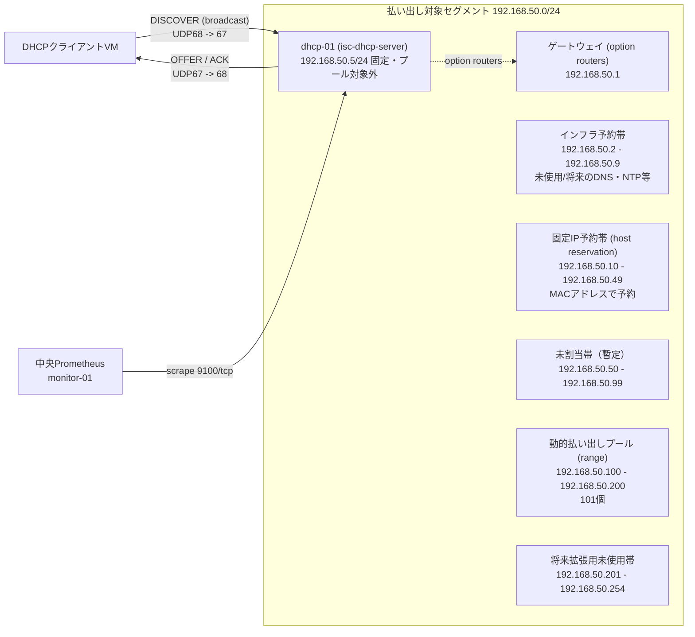

# ネットワーク設計・IPアドレス表

> 💡 **初めて読む方へ**: この文書はどのIP・ポートに、誰が、どこから接続できるかを決めた文書です。案件パック全体の地図は[初心者ガイド](beginner-guide.md#04-ネットワーク設計ipアドレス表)を参照してください。

セグメント・プール・予約帯・公開ポートの値は[要件定義書](00-requirements.md)3章の内容と完全に一致させています。実装（Ansible変数）との対応は[パラメータシート](03-parameter-sheet.md)を正本とし、本書はパック内の他文書が参照する「Zone・アドレス帯・実機確認コマンド」の索引です。値そのものを変えるときは、両方の文書を同じPRで更新します。

## 1. 本体構成

管理アクセス（SSH）とDHCPペイロード（UDP67）は、公開範囲の考え方が異なります。SSHは組織側で決める送信元CIDRに縛られる管理経路、DHCPペイロードは払い出し対象セグメント内に閉じるサービス経路です。この非対称な制御方針は[基本設計書](01-basic-design.md)3章の論理構成図とも一致させています。

| Zone | CIDR / interface | 主な通信 | 制御 |
| --- | --- | --- | --- |
| 管理端末 | 組織で割り当て（本書内の記入例: `192.0.2.30`。CIDRは`192.0.2.0/24`を仮定） | SSH 22/tcp | production受入では上流FW/VPNまたはsource指定UFW ruleで管理元CIDRのみ |
| dhcp-01 | `192.168.50.5/24`（払い出し対象セグメント内の固定IP。動的プール対象外） | SSH（構築・運用）、DHCPペイロード（UDP67受信）、node_exporter応答（9100/tcp） | UFW default deny incoming。67/udpは払い出し対象interface（`dhcp_server_interface`）限定（DHCPDISCOVERの送信元は`0.0.0.0`のため送信元CIDRでは絞れない）、9100/tcpは`monitor-01`限定、22/tcpは全送信元への`LIMIT`（production受入では管理元CIDR限定を追加） |
| 払い出し対象LANセグメント | `192.168.50.0/24` | DORA（DISCOVER/OFFER/REQUEST/ACK）、クライアントの通常通信 | ゲートウェイ`192.168.50.1`経由で外部と通信。同一セグメント内でDHCPサーバーとして応答してよいのは`dhcp-01`のみ（NFR-08、DST-06、DNW-09で非存在を確認） |
| 中央Prometheus（`monitor-01`） | 既存監視基盤側。値は[Linux版ネットワーク設計](../build-package/04-network-ip-plan.md)を参照（本案件による変更なし） | `dhcp-01`のnode_exporter（9100/tcp）へのscrape（pull型） | UFWで9100/tcpの送信元を`monitor-01`のみに限定。`dhcp-01`側からmonitor-01への到達性は前提としない |

`dhcp-01`自身にはDNS（`option domain-name-servers`）として`192.168.50.1`（ゲートウェイへ委譲）と`1.1.1.1`（外部フォールバック、閉域網では除外可）を配布し、ドメイン名（`option domain-name`）は`lab.example.test`とします（FR-07）。

## 2. 払い出し対象セグメントの内訳

DHCPのDORA実演にはL2ブロードキャストが必要です。既存の[二セグメント障害ラボ](../../labs/network-troubleshooting/README.md)（Docker上の`172.28.10.0/24` / `172.28.20.0/24`）が使うDockerの既定bridgeネットワークでは、DockerがコンテナのIPをIPAMで払い出すため素直に成立しません。そのため本パックは、二セグメント障害ラボとは独立に、**VM/実機での実演を正本**とします。VirtualBoxのHost-OnlyネットワークまたはInternalネットワークで`dhcp-01`とクライアント役VMを同一セグメントへ置く具体的な立ち上げ手順は[立ち上げ環境・受け入れ](10-host-bringup-and-acceptance.md)にまとめます。Dockerベースの払い出しラボは「発展的な設計・将来構想」で言及するにとどめ、**未実装**です。

| 帯域 | 範囲 | アドレス数 | 用途 |
| --- | --- | --- | --- |
| ゲートウェイ | `192.168.50.1` | 1 | `option routers`。検証環境ではルーター役（VirtualBoxならHost-Onlyネットワークのホスト側、実務では既存のL3スイッチ/ルーター） |
| dhcp-01固定IP | `192.168.50.5` | 1 | DHCPサーバー自身の静的IP。動的プール対象外として除外する |
| インフラ予約帯 | `192.168.50.2` 〜 `192.168.50.9` | 8（うち`192.168.50.5`は上記dhcp-01が使用済み） | 未使用/将来のDNSやNTP等 |
| 固定IP予約帯 | `192.168.50.10` 〜 `192.168.50.49` | 40 | host reservation。MACアドレスで予約（FR-03、`dhcp_server_reservations`変数） |
| 未割当帯（暫定） | `192.168.50.50` 〜 `192.168.50.99` | 50 | 要件定義・パラメータシートのいずれにも割り当てのない帯。プール拡張や予約帯拡張の候補になり得るが、現時点では用途未定義であることを正直に記す（変更するときは[変更・ロールバック計画](08-change-rollback-plan.md)の手順に従う） |
| 動的払い出しプール | `192.168.50.100` 〜 `192.168.50.200` | 101 | isc-dhcp-serverの`range`（FR-02、FR-04、`dhcp_server_range_start`/`dhcp_server_range_end`変数） |
| 将来拡張用未使用帯 | `192.168.50.201` 〜 `192.168.50.254` | 54 | 未使用。将来のプール拡張やVLAN分割等の余地として確保 |

default-lease-timeは`43200`秒（12時間）、max-lease-timeは`86400`秒（24時間）です。T1（renew、目安21600秒＝50%）・T2（rebind、目安37800秒＝87.5%）はクライアントの自動更新タイミングを理解するための説明にとどめ、`dhcpd.conf`では明示指定しないため、クライアント側がRFC 2131の既定比率で計算します（詳細は[詳細設計書](02-detailed-design.md)）。

## 3. 実環境で確認する項目

実行順、期待結果、採録方法は[ネットワーク実機検証手順](09-network-validation-procedure.md)を正本とします。二セグメント障害ラボはDockerの既定bridgeネットワークの制約でDORA実演に使えないため、その成功を実VM上でのUDP67待受・UFW検証の代用にはしません。

- `ip -br link` / `ip -br addr` でinterfaceとCIDRを確認する（`dhcp_server_interface`変数に設定した値と実機のinterface名が一致していることを必ず突き合わせる）
- `ip route` / `ip route get 192.168.50.1` でdefault gatewayと経路を確認する
- `ss -lunp` でUDP67（DHCP）の待受を確認し、`ss -lntup`でTCP22（SSH）とTCP9100（node_exporter）の待受を確認する
- `sudo tcpdump -nn -i <interface> udp port 67 or port 68` でDORA（DISCOVER/OFFER/REQUEST/ACK）の4パケットを観測する
- `sudo ufw status verbose` でUDP67の許可がinterface `dhcp_server_interface`（払い出し対象セグメント側）限定であり、他ネットワークへの許可が無いことを確認する
- クライアント検証VM側で`sudo dhclient -v <interface>`を実行し、動的プール範囲内でのリース取得と、`ip route`・`resolvectl status`（または`cat /etc/resolv.conf`）でgateway・DNS・ドメイン名が設計値どおり反映されていることを確認する
- `sudo nmap --script broadcast-dhcp-discover`相当の確認、またはクライアント側で応答したDHCPサーバーのIPを確認し、`dhcp-01`（`192.168.50.5`）以外に応答するDHCPサーバーが存在しない（rogue DHCPが無い）ことを構築直前・構築後の両方で確認する

repository既定のUFWはSSH 22/tcpを`LIMIT`で開けますが、送信元CIDRは絞りません。管理元CIDR限定が受入条件の環境では、上流security group/VPNの制限を採録するか、source指定UFW ruleを案件変数として設計・実装してから引き渡します。rate limitをsource制限の証跡にはしません。

本パックにはまだ実行済みのephemeral runner結果や実ホスト証跡はありません。独立した引き渡し対象host・クライアント検証VMの結果は、[DHCP実ホスト ネットワーク検証結果票テンプレート](../evidence/templates/network-host-validation-dhcp.md)から日付付きevidenceを作成するまで、すべて`NOT RUN`です。
