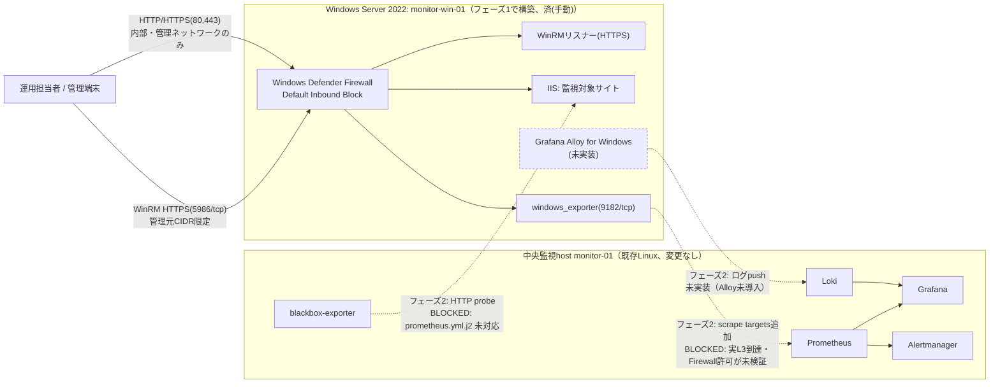

# 基本設計書

要求と受け入れ条件は [要件定義書](00-requirements.md)を正本とし、本書ではその実現方式を定義します。

## 1. 目的

既存の Linux 監視基盤（案件 ID SM-LAB-001、[Linux 版基本設計書](../build-package/01-basic-design.md)が正本）に、Windows Server を新しい監視対象ホストとして安全かつ再現可能に追加登録し、異常検知、一次切り分け、復旧までを検証できる環境を提供します。本案件（SM-WIN-001）は、Windows 上に Prometheus / Grafana / Loki / Alertmanager をもう 1 式構築するものではなく、既存の中央監視基盤（論理ホスト名 monitor-01）を拡張する案件である点が要点です。

## 2. 対象範囲

| 対象 | 内容 |
| --- | --- |
| OS | Windows Server 2022 Standard（Desktop Experience 基準。Server Core は構成の対応を検討） |
| 対象ホスト | 検証用 VM 1 台（論理ホスト名 monitor-win-01） |
| 配備 | フェーズ1は手動 PowerShell 手順。Ansible 化された Windows 対応 role は未実装 |
| Web | IIS（Web-Server 機能）で公開する検証用サイト |
| 監視（フェーズ2、要ネットワーク拡張） | windows_exporter によるホストメトリクス、blackbox-exporter による IIS の外形監視。いずれも既存の中央 Prometheus 側で実施する設計であり、Windows 側に新規の監視サーバーは置かない |
| ログ（フェーズ2、未実装） | Grafana Alloy for Windows 経由で既存 Loki へ集約する設計のみ存在し、実装はまだ無い |
| 運用 | Windows Server Backup によるバックアップ、ランブック、変更管理、サービス停止復旧演習 |

対象外は、複数ホスト冗長化、24 時間有人運用、SSO、実組織の個人情報、商用 SLA、既存 AD ドメイン自体の新規構築、Windows Server のライセンス調達方式の是非、Windows Server 上への監視スタック（Prometheus / Grafana / Loki / Alertmanager）の新規構築です。

### 2.1 対象ホストの OS 系統

Linux 版が Debian 系 / RHEL 系でツール（apt/dnf、ufw/firewalld 等）が異なるのと同様に、Windows 版でも認証方式・Firewall プロファイル・時刻同期先・更新経路が異なる 2 系統を扱います。ツールの実体（Windows Defender Firewall、W32Time、Windows Update）自体は共通です。

| 項目 | 系統A: ワークグループ（スタンドアロン、本パックの既定） | 系統B: AD ドメイン参加（参考） |
| --- | --- | --- |
| 想定用途 | 個人ラボ・小規模検証 | 実務のエンタープライズ想定（この AD ドメイン自体の構築は対象外。既存 AD に参加させる場合の差分のみを示す） |
| 管理アカウント | ローカル Administrator（既定名から変更して運用） | ドメイングループ（例: `CORP\ServerAdmins`） |
| WinRM 認証 | HTTPS リスナー + 証明書（自己署名 or 内部 CA）。Basic / Negotiate の平文相当は無効化 | Kerberos / Negotiate（ドメイン参加により既定で強化される） |
| Firewall プロファイル | Public（検証用途に応じて Private へ変更可） | Domain |
| 時刻同期 | W32Time、外部 NTP（`time.windows.com` など） | ドメイン階層（PDC エミュレータ経由、`w32tm /query /source` で確認） |
| 更新 | Windows Update（Microsoft Update から直接、自動ダウンロード・手動再起動が既定） | WSUS またはグループポリシー経由の集中管理 |

両系統とも Windows Defender Firewall（`netsh advfirewall` または `New-NetFirewallRule`）、Windows Defender Antivirus は共通です。SELinux に相当する追加の強制アクセス制御機構は既定では使用しません（該当なし）。本パックの基準は系統Aとし、系統Bは差分の記載にとどめます。

## 3. 論理構成

### 3.1 フェーズ構成

本案件は次の 2 段階で構成します。[試験仕様書・結果票](06-test-specification.md)、[引き渡しチェックリスト](07-handover-checklist.md)、[作業結果・引き渡し報告書](11-work-result-report.md)でもこの 2 段階を区別して記載します。

- **フェーズ1（ホスト単体構築）**: OS 初期設定、WinRM、Firewall、IIS、windows_exporter 導入、バックアップ、単体での network 実機検証まで。「済（手動）」の範囲で完結し、Windows Server 1 台だけで検証・完了できます。
- **フェーズ2（中央監視統合）**: 中央 Prometheus からの scrape、blackbox probe、ログ集約、アラート経路。次の 3 点が解消するまで `BLOCKED` です。
  1. `ansible/roles` 配下に Windows 対応 role（`common_windows` 等）が無く、Ansible での自動構築ができない。
  2. Prometheus コンテナは `compose.yaml` 上で `monitoring`（`internal: true`）だけでなく `host-access`（`internal: true` を付けない通常の bridge network）にも接続されています。nftables ルールを実機で確認したところ、`host-access` 側には MASQUERADE と `DOCKER-FORWARD` chain での accept が生成されており、`monitoring` の `internal: true` 単体が Docker ホスト外への egress を塞いでいるわけではありません。実際に scrape を成立させるうえで未確立なのは、(a) 中央監視host（`monitor-01`）の Docker ホスト自身と Windows Server が稼働するネットワークセグメントとの実 L3 到達性（本ラボの各ホストは RFC 5737 の例示用アドレス `192.0.2.0/24` を使っており、実ネットワーク上での到達は一度も検証されていません）、(b) windows_exporter 側 Firewall ルールが、`host-access` の MASQUERADE により Windows Server から見える送信元が Prometheus コンテナの内部アドレスではなく Docker ホスト自身の実 IP になる点を踏まえて許可設定されているか、の 2 点であり、いずれも `NOT SET` です。現状の job 名 `linux-node` へ Windows を混ぜること自体、名前が実態と合わなくなる点も残存課題として明記します。
  3. Windows Event Log / IIS ログを既存 Loki へ送る経路（Grafana Alloy for Windows の導入、Loki の push API を loopback 以外からも安全に受け付けるための認証・network 設計）が無い。

  解消後は、`ansible/roles/app/defaults/main.yml` の `app_node_exporter_targets` 変数へ Windows ホストの address/host/environment を 1 行追加し、中央 host 側で `ansible-playbook site.yml` を再適用するだけで scrape を有効化できます（この変数はもともと「監視サーバー 1 台が N 台の node_exporter を scrape する」ための汎用機構で、`ansible/roles/app/templates/prometheus.yml.j2` が `linux-node` という 1 つの Prometheus job に for ループで target を展開しており、windows_exporter も同じ形（address:port + host label）で追加できるためです）。

### 3.2 構成図

実線は現時点（フェーズ1）で成立する経路、点線はフェーズ2で構築予定の経路（現状は設計のみで `NOT RUN`/`BLOCKED`）を示します。Windows Defender Firewall のルール自体（windows_exporter・IIS への許可）はフェーズ1の「済（手動）」範囲で設定しますが、中央 Prometheus / blackbox-exporter からの実際の到達は 3.1 に記載した未実装事項が解消するまで成立しません。

## 4. 非機能要件

| 分類 | 要件 | 確認方法 |
| --- | --- | --- |
| セキュリティ | WinRM は HTTPS 専用とし Basic 認証を無効化する。RDP は既定 Disable とする | WST-01, WST-02 |
| 最小権限 | windows_exporter の実行アカウント（既定 LocalSystem）を記録し、是正余地を残存課題とする | WST-03 |
| 再現性 | 未構築の対象 VM へ本パックの手順（現時点は手動 PowerShell）を適用し、エラーなく完了する | WIT-01 |
| 冪等性 | 同一手順を 2 回目実行しても不要な変更（サービス再作成、Firewall ルール重複等）が発生しない | WIT-02 |
| ネットワーク | Windows Defender Firewall は Default Inbound Block とし、WinRM / IIS / windows_exporter を管理元 CIDR 限定で許可する | WST-04 |
| 可観測性 | メトリクス・外形監視・ログを関連付けて一次切り分けできる（フェーズ2の範囲は未実装区間ありと明記する） | WIT-05, WIT-06 |
| 復旧性 | サービス停止演習で検知から復旧までの RTO を記録する | WIT-08 |
| 保守性 | 変更前後の状態、検証、ロールバック条件と結果を記録する | [08 変更管理・ロールバック計画](08-change-rollback-plan.md) |
| 追跡性 | 実行日時、環境、ホストのビルド番号、実行コマンド、実出力、判定を証跡へ残す | 全必須試験 |
| 実装境界の明示 | Ansible 化されていない手順を「済（手動）」と明記し、既存の `site.yml` のような自動化済み経路と混同しない | 全文書共通 |

## 5. 可用性と保存期間

- 単一 Windows 対象ホスト構成のため、ホスト障害時の無停止継続は保証しません（Linux 版と同じ制約です）。
- 中央側の Prometheus / Loki の保持期間は既存設計を変更しません。値は[Linux 版基本設計書](../build-package/01-basic-design.md)のとおり、Prometheus は 35 日、Loki は 30 日を初期値とします。
- Windows 側のバックアップ（Windows Server Backup）は日次 03:30（Asia/Tokyo）、保持 14 世代を初期値とし（Linux 版の `backup_retention_days` と同じ値）、[バックアップ・リストア手順](../backup-restore.md)の枠組みに準じて別ボリューム/別ホストへの復元試験（WIT-09）で確認します。
- ラボ内 SLO は、フェーズ1の範囲では IIS サイトの health 用エンドポイントの到達性確認にとどめます。既存の[SLO](../slo.md)への正式な数値目標の統合は、フェーズ2（中央 Prometheus による外形監視）が有効化された後に行う予定であり、現時点で Windows 対象ホストの SLO 数値は NOT SET です。

## 6. 受け入れ条件

本書の受け入れ条件は次のとおりです。

- フェーズ1必須試験（WUT-01, WUT-02, WUT-05, WIT-01, WIT-02, WIT-04, WIT-08, WIT-09, WIT-10, WST-01〜WST-06, WNW-01〜WNW-09）がすべて `PASS` していること。
- フェーズ2対象試験（WIT-03, WIT-05, WIT-06, WIT-07, WIT-11）は、3.1 に記載した 3 点の未実装事項が解消するまで `BLOCKED` として明記され、理由と解除条件が記録されていること。
- 実行日時、環境、ホストのビルド番号（`winver` または `Get-ComputerInfo` の `OsBuildNumber`）、実行コマンド、実出力、判定が証跡として保存されていること。
- 未解決事項、秘密値（証明書・パスワード）の受け渡し方法、ロールバック方法が[作業結果・引き渡し報告書](11-work-result-report.md)に記録されていること。

詳細な試験項目と判定基準は[試験仕様書・結果票](06-test-specification.md)を正本とします。
