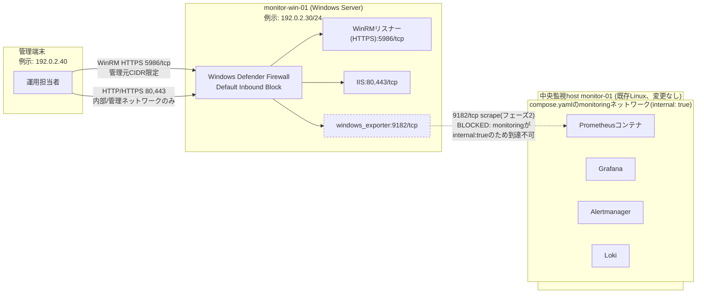

# ネットワーク設計・IP アドレス表

本書は、monitor-win-01(Windows Server 2022 Standard、Desktop Experience基準)を新しい監視対象ホストとして追加するにあたってのネットワーク設計とIPアドレス表を定義します。中央監視host(論理名 monitor-01、既存Linux、変更なし)側の設計は[Linux版ネットワーク設計・IPアドレス表](../build-package/04-network-ip-plan.md)を正本とし、本書はWindows追加分の差分のみを扱います。

Linux版は単一ホスト完結の構成であり、Compose networkの管理UIをloopbackへbindしたうえで、外部からの到達はSSHトンネル経由に限定するという設計が正本でした。Windows版はこれと前提が異なります。監視対象のmonitor-win-01は最初から独立した実machineであり、中央監視host(monitor-01)とは別筐体・別セグメントに置かれるため、loopback bindでは経路そのものが成立しません。したがって本パックでは、Windows Defender Firewallによる送信元IP制限(管理元CIDR、または中央Prometheus hostのIPのみ許可)を到達制御の正本とします。WinRM(HTTPS)は通信自体が暗号化されているため、Linux版のSSHトンネルに相当する追加のトンネルは不要です(この非対称性はWNW-09で確認します)。

## 1. 本体構成

| Zone | CIDR / interface(設計値、例示) | 主な通信 | 制御 |
| --- | --- | --- | --- |
| 管理端末 | 例示IPv4: `192.0.2.40` | WinRM HTTPS(5986/tcp)、必要時のみRDP(3389/tcp) | Windows Defender Firewallで管理元CIDR限定に許可(WST-04) |
| monitor-win-01(Windows Server) | 例示IPv4: `192.0.2.30/24`、例示FQDN: `monitor-win.example.test` | WinRM(5986)、IIS(80/443)、windows_exporter(9182) | Windows Defender Firewall Default Inbound Block。許可はこの3経路のみ、経路ごとに送信元を個別制限 |
| 中央監視host monitor-01(既存Linux、変更なし) | 環境ごとに決定(`NOT SET`。[パラメータシート](../build-package/03-parameter-sheet.md)の実機記入欄を参照) | Prometheus/Grafana/Alertmanager/Lokiの既存UI/APIはloopbackのみbind(既存設計のまま変更なし) | 既存Linux版設計のまま。本案件によるFirewall変更は無い |
| `compose.yaml`の`monitoring`ネットワーク | Docker管理、`internal: true` | Prometheus等コンテナ間通信 | 外部egress不可。windows_exporter(実machine、既定9182/tcp)へは現状到達不可(未実装、フェーズ2 `BLOCKED`) |

ポート単位の許可範囲・認証方式の詳細(WinRM 5986/tcp、RDP 3389/tcp、IIS 80/443/tcp、windows_exporter 9182/tcp)は[パラメータシート](03-parameter-sheet.md)のアクセス制御表を正本とします。

### monitoring networkの`internal: true`制約(本書の中心)

中央側では、`compose.yaml`の`monitoring`ネットワークが`internal: true`で定義されており、Prometheusコンテナは同じDockerホストの外にある実machine(Windows Server、windows_exporterの既定9182/tcp)へは現状到達できません。到達させるには、たとえばPrometheusサービスだけを`internal`ではない追加の管理用bridge network(例: `remote-targets`のような名前)にも接続する`compose.yaml`変更が必要ですが、これは未実装です(フェーズ2、`BLOCKED`)。現状のjob名`linux-node`へWindowsを混ぜること自体、名前が実態と合わなくなる点も残存課題として明記します。

この制約が解消するまで、Windows Server側でwindows_exporterの9182/tcpをFirewallで許可していても、中央Prometheusからのscrapeは成立しません。フェーズ1で行うFirewall許可設定(WST-04)と、フェーズ2で成立するscrape経路(WIT-03)は別の状態であることを、証跡の記録時に混同しないでください。

## 2. 複数ホスト構成の考慮

Linux版には二セグメント障害ラボ(`labs/network-troubleshooting`)があり、frontend/backendの2つのDocker networkにまたがる障害を注入して、DNS・経路・所属ネットワークの順に切り分けを演習できます。Windows/Linux混在のネットワーク障害を注入・体験するラボは、本リポジトリには現時点でまだありません。正直に申し上げると、Docker networkの操作だけでは、実machine(Windows Server)側のNIC到達性・Firewallプロファイル・ドメイン参加の有無までは模擬できないため、既存ラボをそのまま拡張しても同等の演習にはならないという制約があります。将来ラボを用意する場合は、この制約を踏まえた別設計が必要です。

本節では、ラボの代わりに、フェーズ1・フェーズ2を通じて実際に存在する「複数ホスト構成」の構造を図で示します。

実線は現時点(フェーズ1)で成立する経路、点線はFirewallで許可していても現状は到達しない経路(フェーズ2、`BLOCKED`)を示します。管理端末からWindows Serverへの経路(WinRM、IIS)はフェーズ1の「済(手動)」範囲で成立しますが、windows_exporterから中央Prometheusへの経路は、上記1節の`internal: true`制約が解消するまで成立しません。また、管理端末と中央監視hostのDockerホストは、通常は別々のネットワークセグメントに存在するため、運用者は少なくとも2種類の経路(管理端末→Windows Server、管理端末→中央監視host)を個別に把握しておく必要があります。これはLinux版が単一ホスト内で完結していたのとは異なる、Windows追加分特有の運用上の考慮点です。

## 3. 実環境で確認する項目

実行順、期待結果、採録方法は[ネットワーク実機検証手順](09-network-validation-procedure.md)を正本とします。本節はその概要であり、WNW-01〜09それぞれに対応するPowerShellコマンドの一覧です。

- WNW-01(interface/IP/CIDR): `Get-NetIPAddress`、`Get-NetAdapter` で対象interfaceの状態とIPv4/prefixを確認
- WNW-02(route/gateway): `Get-NetRoute`、`Test-NetConnection -TraceRoute` でdefault gatewayと経路を確認
- WNW-03(DNS): `Resolve-DnsName` で名前解決結果と問い合わせ先DNSを確認
- WNW-04(ICMP): `Test-Connection` で疎通を確認(Firewall方針でICMPを遮断する場合はpacket loss自体を障害と判定せず、TCP/HTTP試験へ進む)
- WNW-05(待受port): `Get-NetTCPConnection -State Listen` で5986/tcp、80/tcp、443/tcp、9182/tcpの待受状態と、想定外listenerの有無を確認
- WNW-06(TCP/HTTP): `Invoke-WebRequest` または `curl.exe` でIISのhealth用エンドポイントのHTTP status、およびwindows_exporterの`/metrics`応答を確認
- WNW-07(packet capture): `pktmon`(Windows組込)でheaderのみを短時間採取。認証情報を含む本文は採録しない
- WNW-08(Windows Defender Firewall): `Get-NetFirewallProfile`、`Get-NetFirewallRule` でプロファイル(系統AはPublic、系統BはDomain)と許可ルールが設計と一致することを確認
- WNW-09(end-to-end): 管理元CIDR以外からの接続が拒否されることを確認。WinRM HTTPSは通信自体が暗号化されているため、Linux版のSSHトンネルに相当する追加のトンネルは不要

Linux版はNW-01〜09を単一ホスト完結(対象VM自身のloopbackとSSHトンネル)で正本化していましたが、Windows版は最初から管理端末とmonitor-win-01という複数ホスト構成であり、Firewallによる送信元IP制限(WNW-08、WST-04)がend-to-endの到達制御の正本です。トンネルで経路を隠す設計ではなく、Firewallルールそのものが許可条件を表す設計である点が、Linux版との構造的な違いです。

実行結果の記入先は[ネットワーク実機検証テンプレート(Windows版)](../evidence/templates/network-host-validation-windows.md)です。独立した引き渡し対象host/管理端末での結果は、日付付きevidenceを作成するまで`NOT RUN`です。
