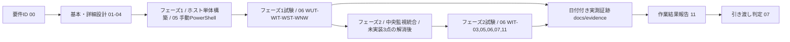

# Windows サーバー構築案件パック

**一言でいうと**: すでにある Linux の監視基盤に、Windows Server 1 台を監視される側として追加登録する案件の書類一式です。

初めての方は、先に[案件パック 初心者ガイド(Windows版)](beginner-guide.md)を読むと全体像がつかめます。

このディレクトリは、Windows Serverを新しい監視対象ホストとして追加登録する構築案件の成果物を、工程順にまとめたものです。追加先は既存の監視基盤(案件ID `SM-LAB-001`、正本は[../build-package/README.md](../build-package/README.md))です。監視スタック(Prometheus / Grafana / Loki / Alertmanager)をWindows上にもう1式作るのではなく、既存の中央監視基盤を拡張します。

案件は「何を作るか決める → 設計する → 作る → 試験する → 報告して渡す」の順に進みます。工程ごとに書類が分かれるため、文書は00から11までの12個あります。番号順に読めば、そのまま案件の流れをたどれます。

構成・文体・厳格さは`docs/build-package/`にあるLinuxサーバー構築案件パックを踏襲します。本文書にある「設計値」と、実機で取得した「実績値」は分けて管理します。

| 案件 ID | 対象 | 現在の引き渡し判定 |
| --- | --- | --- |
| `SM-WIN-001` | Windows Server 2022 Standard(Desktop Experience 基準)の検証用 VM 1 台(論理ホスト名 `monitor-win-01`)を、既存 Linux 監視 host(論理名 `monitor-01`)配下の監視対象ホストとして追加登録 | **`NOT READY`** — 引き渡し対象ホストが未指定で、フェーズ1必須試験が `NOT RUN`。フェーズ2は「未実装」3点により `BLOCKED` |

表中の `NOT READY` は、必須の試験が終わっておらず、引き渡せる状態ではないことを表します。

次の3つは、それぞれ別の状態です。ひとまとめにしないでください。

- 文書が「作成済み」であること
- フェーズ1の手順を実機で実行して `PASS` したこと
- 特定の引き渡し対象ホスト(`monitor-win-01`)で受け入れが完了したこと

最終判定は[作業結果・引き渡し報告書](11-work-result-report.md)と[引き渡しチェックリスト](07-handover-checklist.md)を使います。

初めて「要件定義書」「非機能要件（NFR。速さ・止まりにくさ・安全性など、機能以外の要求）」
「Gate（次の工程へ進んでよいかを判断する関門）」といった言葉に触れる場合は、先に
[案件パック 初心者ガイド（Windows版）](beginner-guide.md)で案件パック全体の地図と、
フェーズ1／フェーズ2・WinRM・IIS などの Windows 固有の言い回しを確認してください。
文書の番号構成（00〜11）と役割は[Linux版](../build-package/beginner-guide.md)と共通です。

## Linux版との違い

本パックは `docs/build-package/` の構成・文体・厳格さを踏襲しますが、対象が Windows Server であることに由来する次の3点が異なります。

1. **単一ホスト完結ではなく2ホスト構成**: Linux版(`SM-LAB-001`)は監視スタックと監視対象アプリが同一VM上で完結する単一ホスト構成です。本パック(`SM-WIN-001`)は、既存の中央Linux監視host(論理名 `monitor-01`。詳細は[../build-package/03-parameter-sheet.md](../build-package/03-parameter-sheet.md))と、新規のWindows監視対象host(論理名 `monitor-win-01`)の2ホスト構成です。中央側の監視スタックは変更せず、既存基盤の監視対象ホストを1台追加する形を取ります。
2. **Ansible自動化roleが無く、手動PowerShell手順が中心**: Linux版は `ansible/playbooks/site.yml` によるほぼ全自動の構築です。本パックにはWindows対応role(`common_windows` 等)が無いため、OS初期設定・Firewall・IIS・windows_exporter導入・バックアップ設定は、本パックのPowerShell手順による「済(手動)」が中心になります。唯一の自動化経路は、中央host側の `ansible/roles/app/defaults/main.yml` の `app_node_exporter_targets` へWindowsホストのaddress/host/environmentを1行追加し `site.yml` を再適用する「済(自動)」だけです。この扱いの定義は各文書で共通して使います。
3. **フェーズ1/フェーズ2の2段階に分かれる**: Linux版は構築から試験まで単一フェーズで完結します。本パックは、Windows Server 1台だけで検証・完了できる**フェーズ1(ホスト単体構築)**と、中央監視基盤への統合を要する**フェーズ2(中央監視統合)**に分けます。フェーズ2は、Windows対応Ansible roleの不在、`monitoring` networkの `internal: true` 制約、Windows向けログ集約経路の不在という「未実装」3点が解消するまで `BLOCKED` です。

## 最短レビュー順

1. [要件定義書](00-requirements.md) — 何を作り、何を作らないか。どうなれば合格かを決める(受け入れ条件。要件 ID は FR-01〜FR-07, NFR-01〜NFR-12)
2. [基本設計書](01-basic-design.md) — 全体の構成、フェーズ1とフェーズ2の分け方、非機能(NFR)の設計方針
3. [パラメータシート](03-parameter-sheet.md) — 実際に入力する設定値の一覧(OS・WinRM・Firewall・windows_exporter・バックアップ)
4. [構築手順書](05-build-procedure.md) — Windows Server 1台を手作業のPowerShell操作で組み立てる手順(フェーズ1)
5. [試験仕様書・結果票](06-test-specification.md) — 何を確かめれば合格かと、実測結果を書き込む用紙(WUT/WIT/WST/WNW)
6. [ネットワーク実機検証手順](09-network-validation-procedure.md) — 実機で通信できるかの確認(通信が届くか、名前が引けるか、経路は正しいか、待ち受けているか。IP/route/DNS/ICMP/待受/HTTP/packet/Firewall)
7. [作業結果・引き渡し報告書](11-work-result-report.md) — 計画対実績（予定と実際の比較）、試験の集計、差異、残存リスク（残ったままの危険）、完了判定
8. [検証証跡台帳](../evidence/README.md) — 実測済み・未実測の境界(どこまで実機で確かめ、どこからが未確認か)

## 成果物一覧

| 工程 | 成果物 | 状態 |
| --- | --- | --- |
| 要件定義 | [00-requirements.md](00-requirements.md) | 作成済み |
| 基本設計 | [01-basic-design.md](01-basic-design.md) | 作成済み |
| 詳細設計(フェーズ2のネットワーク拡張案含む) | [02-detailed-design.md](02-detailed-design.md) | 作成済み |
| パラメータ設計 | [03-parameter-sheet.md](03-parameter-sheet.md) | 作成済み |
| ネットワーク設計 | [04-network-ip-plan.md](04-network-ip-plan.md) | 作成済み |
| 構築(フェーズ1) | [05-build-procedure.md](05-build-procedure.md) | 手順作成済み・実機結果は証跡台帳で管理 |
| 試験 | [06-test-specification.md](06-test-specification.md) | 仕様作成済み・未実施欄は `NOT RUN` |
| 引き渡し | [07-handover-checklist.md](07-handover-checklist.md) | 作成済み |
| 変更・ロールバック | [08-change-rollback-plan.md](08-change-rollback-plan.md) | 計画・記録様式作成済み(スナップショット復元を最優先手段とする設計)。実施結果は `NOT RUN` |
| ネットワーク実機検証 | [09-network-validation-procedure.md](09-network-validation-procedure.md) | 手順作成済み。実施結果は `NOT RUN` |
| 立ち上げ・受け入れ | [10-host-bringup-and-acceptance.md](10-host-bringup-and-acceptance.md) | 環境選択肢(クラウド/評価版ISO/ボリュームライセンス)と最短手順を作成済み |
| 作業結果報告 | [11-work-result-report.md](11-work-result-report.md) | 原本作成済み。対象ホストごとの実績は日付付き evidence へ複製して記録 |
| ネットワーク結果票(Windows) | [実機検証テンプレート](../evidence/templates/network-host-validation-windows.md) | テンプレート作成済み |
| 一次切り分け記録 | [トラブルシュート一次記録テンプレート](../evidence/templates/troubleshooting-worklog.md) | テンプレート作成済み(Linux版と共用) |

## 工程ゲート

表中の `NOT SET` は、値や承認がまだ決まっていないことを表します。

| Gate | 完了条件 | 現在の状態 |
| --- | --- | --- |
| G0 要件確定 | 要件 ID、対象、対象外、受け入れ条件が合意済み | 文書作成済み。実案件での承認は `NOT SET` |
| G1 設計確定 | 基本・詳細・パラメータ・ネットワーク設計のレビュー完了 | 文書作成済み。実案件での承認は `NOT SET` |
| G2(フェーズ1)構築完了 | 対象VMへの初回手動構築(`WIT-01`)が成功し、2回目実行で不要な変更が無いこと(`WIT-02`)を記録 | 手順作成済み。引き渡し対象ホストは `NOT RUN` |
| G2(フェーズ2)統合完了 | `app_node_exporter_targets` へのWindowsホスト追加、`monitoring` networkのegress拡張、Windows向けログ集約経路の導入が完了 | 設計のみ。3点とも未実装で、着手時期は `NOT SET` |
| G3(フェーズ1)試験完了 | フェーズ1必須 ID(`WUT-01`, `WUT-02`, `WUT-05`, `WIT-01`, `WIT-02`, `WIT-04`, `WIT-08`, `WIT-09`, `WIT-10`, `WST-01`〜`WST-06`, `WNW-01`〜`WNW-09`)がすべて `PASS` | `NOT READY` |
| G3(フェーズ2)試験完了 | フェーズ2必須 ID(`WIT-03`, `WIT-05`, `WIT-06`, `WIT-07`, `WIT-11`)がすべて `PASS` | `BLOCKED`(G2フェーズ2の解消が前提) |
| G4 作業完了 | 作業結果報告書に実績、障害、差異、残存リスクを記録 | 原本のみ。実案件報告は `NOT SET` |
| G5 引き渡し | 受領者、日時、秘密値受け渡し、未解決事項を記録 | `NOT READY` |

## 検証環境

基準環境は Windows Server 2022 Standard(Desktop Experience)の検証用 VM 1台(論理ホスト名 `monitor-win-01`)です。Windows Server 2022 Server Core にも構成の対応を検討しますが、基準VMは Desktop Experience であり、両エディションでの実測を意味しません。認証方式・Firewallプロファイル・時刻同期先・更新経路が異なる2系統(系統A: ワークグループ/スタンドアロン、系統B: ADドメイン参加)のうち、本パックの既定・基準は系統Aです。系統Bは「既存ADに参加させる場合の差分」を示すのみで、ADドメイン自体の構築は対象外です。

中央側の既存Linux監視host(論理名 `monitor-01`)は変更しません。監視スタック(Prometheus / Grafana / Loki / Alertmanager)をWindows上にもう1式構築するのではなく、既存基盤の監視対象ホストとしてWindows Serverを追加登録します。

最小構成の目安は 2 vCPU / メモリ 4GB / ディスク 60GB です(Windows Serverの前提要件は Ubuntu より高い点に注意してください)。ライセンス費用が発生するため無償の VirtualBox VM がそのまま使えず、立ち上げ環境の選択肢(クラウドWindows Serverインスタンス/評価版ISOによる Hyper-V・VMware 上のVM/社内ボリュームライセンス)は[10-host-bringup-and-acceptance.md](10-host-bringup-and-acceptance.md)にまとめます。

フェーズ1(ホスト単体構築)・フェーズ2(中央監視統合)ともに、独立した引き渡し対象VM・管理端末を用いた実測はまだありません。日付付きの[ネットワーク結果票(Windows)](../evidence/templates/network-host-validation-windows.md)が保存されるまで `NOT RUN` とします。

## 完了の定義

次をすべて満たした時点で「構築・試験完了」とします。

- フェーズ1の必須試験(`WUT-01`, `WUT-02`, `WUT-05`, `WIT-01`, `WIT-02`, `WIT-04`, `WIT-08`, `WIT-09`, `WIT-10`, `WST-01`〜`WST-06`, `WNW-01`〜`WNW-09`)がすべて `PASS`
- フェーズ2の必須試験(`WIT-03`, `WIT-05`, `WIT-06`, `WIT-07`, `WIT-11`)は、[基本設計書](01-basic-design.md)に記す「未実装」3点(Windows対応Ansible roleの不在、`monitoring` networkの `internal: true` 制約、Windows向けログ集約経路の不在)の解消条件とともに `BLOCKED` として明記されていること
- 実行日時、環境、ホストのビルド番号(`winver` または `Get-ComputerInfo` の `OsBuildNumber`)、実行コマンド、実出力、判定が証跡として保存される
- 未解決事項、秘密値(証明書・パスワード)の受け渡し方法、ロールバック方法が引き渡し記録に残る
- 実ホストの名前解決、経路、待受、HTTP疎通、Windows Defender Firewall を確認し、実行出力を保存する
- [作業結果・引き渡し報告書](11-work-result-report.md)の計画対実績、試験集計、差異、残存リスク、受領判定を記入する
