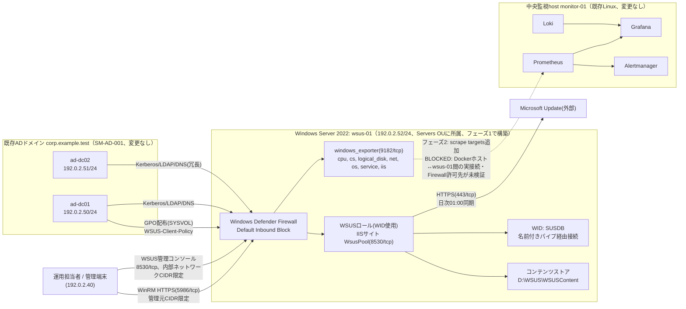

# 基本設計書

> 💡 **初めて読む方へ**: この文書は要件を「どう実現するか」の全体方針を描く文書です。初めての場合は先に[案件パック 初心者ガイド](beginner-guide.md#01-基本設計書)で全体の地図を確認してください。

要求と受け入れ条件は[要件定義書](00-requirements.md)を正本とし、本書ではその実現方式を定義します。

## 1. 目的

**一言でいうと、既存のADドメイン(`corp.example.test`、案件ID `SM-AD-001`)にWSUS(Windows Server Update Services。Microsoft製の更新プログラム集中管理サーバー)を1台追加し、グループポリシーによる更新プログラムの集中管理を実現する案件である。**

[Windows版パック](../build-package-windows/01-basic-design.md)・[AD版パック](../build-package-ad/01-basic-design.md)のいずれも、パラメータシート・基本設計書に「自動更新はWindows Updateから直接。実務ではWSUS/グループポリシー経由の集中管理を推奨するが、本パックの基準ではない」という一文を明記していた。本案件(`SM-WSUS-001`)は、この「推奨だが対象外」として先送りされてきた欠落を埋めるパックであり、新規のADフォレスト・ドメイン自体を構築するものでも、Windows Serverを新規の監視対象として追加するものでもない。既存ドメインへ新規メンバーサーバー(論理ホスト名 `wsus-01`)を1台参加させ、そこにWSUSロールを構築し、更新プログラムの承認・配布をグループポリシー経由で一元管理できる状態を検証することが目的である。

## 2. 対象範囲

| 対象 | 内容 |
| --- | --- |
| OS | Windows Server 2022 Standard(Desktop Experience基準。Server Coreは検討課題として対象外) |
| 対象ホスト | 検証用VM 1台(論理ホスト名 `wsus-01`) |
| 配備 | 本パックのPowerShell手順による手動構築(Ansible化されたWindows対応roleは未実装。[Windows版パック](../build-package-windows/01-basic-design.md)・[AD版パック](../build-package-ad/01-basic-design.md)と同じ制約) |
| ドメイン参加 | 既存ADドメイン `corp.example.test` へメンバーサーバーとして参加。コンピューターオブジェクトは既定のComputersコンテナではなく [AD版パック](../build-package-ad/01-basic-design.md)が定義した `Servers` OUへ明示的に移動する |
| WSUSロール | WID(Windows Internal Database。SQL Serverを別途用意せずWindows標準で使えるデータベースエンジン)を使用。IIS上の専用サイト(既定ポート8530/HTTP)で公開する |
| 同期 | Microsoft Updateを直接の同期元とし、対象製品・分類・言語を絞った同期を行う |
| グループポリシー | 新規GPO「WSUS-Client-Policy」をServers OUへリンクし、クライアント側ターゲティングで更新プログラムの取得元を集中管理する |
| 監視(フェーズ2、要ネットワーク拡張) | windows_exporterによるホスト・IISメトリクス。既存の中央Prometheus側で実施する設計であり、Windows側に新規の監視サーバーは置かない |
| ログ(フェーズ2、未実装) | Grafana Alloy for Windows経由で既存Lokiへ集約する設計のみ存在し、実装はまだ無い |
| 運用 | WSUSサーバークリーンアップウィザード相当コマンドレットの定期実行、SUSDB・コンテンツストア・IIS構成のバックアップ、ランブック、変更管理 |

対象外は、複数クライアントによる大規模検証(`ad-dc01`・`ad-dc02`・`monitor-win-01`等の既存ホストをWSUS管理下へ追加する展開)、WSUS通信のHTTPS化(証明書配布)、外部SQL Serverへの移行(系統B)、レプリカ/ダウンストリームWSUSサーバーによる階層化構成、SSRS(SQL Server Reporting Services)連携、24時間有人運用、SSO、実組織の個人情報、商用SLA、既存ADドメイン・既存中央監視基盤本体の変更である。

### 2.1 データベース方式(系統A/系統B)

[Windows版パック](../build-package-windows/01-basic-design.md)の「系統A(ワークグループ)/系統B(ADドメイン参加)」という書き方を踏襲し、本パックでは軸をWSUSのデータベース方式に変えて用いる。WSUSロールをインストールする際、更新プログラムのメタデータ・承認状態・クライアント登録情報等を格納するデータベースを、WIDと外部SQL Serverのどちらにするかを選ぶ必要があるためである。

| 項目 | 系統A: WID(既定・本パックの基準) | 系統B: 外部SQL Server(差分のみ・対象外) |
| --- | --- | --- |
| 想定用途 | 個人ラボ・小規模検証。クライアント数が少ない環境 | 実務のエンタープライズ想定。クライアント数がおよそ数百台を超える規模から検討されることが多いという一般的な目安であり、断定的な閾値ではない |
| インストール | WSUSロール導入時に本体機能と「WID接続用のサブ機能」を同時に有効化する | WSUSロール導入時に「SQL Server接続用のサブ機能」を選び、あらかじめ用意したSQL Serverインスタンスの名前を指定する |
| 接続方式 | ローカル名前付きパイプ(`\\.\pipe\MICROSOFT##WID`)経由のみ。ネットワークポートを使わない | TCP(既定1433/tcp)またはSQL Server側の構成に応じた経路。ネットワーク到達性・認証設計が別途必要 |
| レポート連携 | SSRS(SQL Server Reporting Services)との連携は不可 | SSRSによるレポート連携が可能(実務での選択理由の1つ) |
| 本パックでの扱い | 採用(WSUSロールインストール手順・[構築手順書](05-build-procedure.md)の基準) | 対象外。差分のみをこの節に記載するにとどめ、構築・試験は行わない |

本パックの基準は系統Aとし、系統Bは実務での選択肢として存在を明記するにとどめる。

## 3. 論理構成

### 3.1 フェーズ構成

本案件は次の2段階で構成する。[試験仕様書・結果票](06-test-specification.md)、[引き渡しチェックリスト](07-handover-checklist.md)、[作業結果・引き渡し報告書](11-work-result-report.md)でもこの2段階を区別して記載する。

- **フェーズ1(ホスト単体構築)**: `wsus-01`のドメイン参加、WSUSロール(WID使用)の導入・構成、GPO「WSUS-Client-Policy」によるクライアント側ターゲティングの設定、`wsus-01`自身をWSUSクライアントとして自己登録・同期・承認・適用まで一巡させる範囲までを含む。windows_exporterのローカル導入までを含む。「設計とする」「手順とする」の範囲で完結し、Windows Server 1台(と既存ADドメイン)だけで検証・完了できる範囲である。
- **フェーズ2(中央監視統合)**: 中央Prometheusからのscrape、ログ集約、アラート経路。[Windows版パック](../build-package-windows/01-basic-design.md)・[AD版パック](../build-package-ad/01-basic-design.md)と共通の次の3点が解消するまで`BLOCKED`とする。この3点の理由付けは両パックと同じ扱いとし、本パック独自の理由には作り替えない。
  1. `ansible/roles`配下にWindows対応role(`common_windows`等)が無く、Ansibleでの自動構築ができない。
  2. Prometheusコンテナは`monitoring`(`internal: true`)に加えて`compose.yaml`の`host-access`(internal指定なしのbridge)にも接続されており、Dockerは`host-access`向けにMASQUERADE(NAT)とFORWARD許可を自動生成するため、`internal: true`自体はDockerホスト外への到達を防ぐ壁ではない(実際にnftablesルールを生成・検証済み)。実際にscrapeを成立させるには、(a)中央監視hostのDockerホスト自体が`wsus-01`の属するネットワークセグメントへ実際に到達できること、(b)windows_exporterのFirewallルールが、`host-access`経由のMASQUERADEで送信元がDockerホストの実IPへ書き換わった後の値を許可対象とすることが必要である。本ラボの各ホストはRFC 5737の例示用アドレス(`192.0.2.0/24`)であり、DockerホストとWindowsホストを実際に同一セグメントへ接続した実績が無いため、これらは`NOT SET`・未検証のままである。
  3. Windows Event Log/IISログを既存Lokiへ送る経路(Grafana Alloy for Windowsの導入、Lokiのpush APIをloopback以外からも安全に受け付けるための認証・network設計)が無い。

  解消後は、[Windows版パック](../build-package-windows/05-build-procedure.md)5節と同じ手順で、`ansible/roles/app/defaults/main.yml`の`app_node_exporter_targets`変数へ`wsus-01`のaddress/host/environmentを1行追加し、中央host側で`ansible-playbook site.yml`を再適用するだけでscrapeを有効化できる設計である。

### 3.2 構成図

実線は現時点(フェーズ1)で成立する経路、点線はフェーズ2で構築予定の経路(現状は設計のみで`NOT RUN`/`BLOCKED`)を示す。`ad-dc01`・`ad-dc02`は[AD版パック](../build-package-ad/01-basic-design.md)で構築済みの既存ドメインコントローラーであり、本パックによる変更は行わない。`wsus-01`はこの既存ドメインへ新規メンバーサーバーとして参加し、GPO「WSUS-Client-Policy」はドメインコントローラー側(SYSVOL)から配布され、`wsus-01`自身も他の将来のドメインメンバーと同様にこのGPOの適用対象(Servers OU)に含まれる。Windows Defender Firewallのルール自体(WinRM・WSUSコンテンツ・windows_exporterの許可)はフェーズ1の範囲で設定するが、中央Prometheusからの実際の到達は3.1節に記載した未実装事項が解消するまで成立しない。

## 4. 非機能要件

| 分類 | 要件 | 確認方法 |
| --- | --- | --- |
| 可用性/冪等性 | 構築手順を2回目実行しても不要な変更(ロール再作成、GPOリンク重複、Firewallルール重複等)が発生しない | SIT-02 |
| セキュリティ | Windows Defender FirewallはDefault Inbound Blockとし、WinRM・WSUSコンテンツ・windows_exporterへの経路を個別に最小化する | SST-01 |
| セキュリティ | WinRMはHTTPS専用とし、Basic認証を無効化する | SST-02 |
| セキュリティ | RDP(3389/tcp)は既定Disableとする | SST-03 |
| セキュリティ | WSUS管理サイト(8530/tcp)は内部ネットワークCIDR限定で公開する | SST-04 |
| 運用性 | コンテンツストアの増加を抑えるため、同期対象の言語(英語・日本語のみ)・製品(Windows Server 2022、Windows 11のみ)・分類(Critical/Security/Updates/Update Rollupsのみ)を絞る | SIT-03 |
| 運用性 | WSUSサーバークリーンアップウィザード相当のコマンドレットを毎週日曜03:00(Asia/Tokyo)にタスクスケジューラへ登録し、不要なメタデータ・コンテンツによるディスク枯渇を防ぐ | SIT-07 |
| 性能 | IISアプリケーションプール(WsusPool)にアイドルタイムアウト0、キュー長2000程度、プライベートメモリ制限0(無制限)という運用上広く知られた推奨設定を適用し、同期・クライアント通信の失敗(503エラー等)を防ぐ | SIT-03、SIT-05 |
| 可観測性 | WSUSコンソールのレポート機能で承認状況・準拠状況を確認できる。Windows Server 2016以降のWSUSコンソールでレポート機能を使うには、別途レポート表示用ランタイム(Microsoft Report Viewer相当)の追加インストールが必要になる場合があるという、実務でよく知られたつまずきを手順書に明記する | SIT-05、[07-handover-checklist.md](07-handover-checklist.md) |
| 復旧性 | SUSDB(WID)、コンテンツストア、IISのWSUS管理サイト構成の3点についてバックアップ手順を用意し、復元できることを確認する | SIT-08 |
| 保守性 | 変更前後の状態、検証、ロールバック条件と結果を記録する | [08-change-rollback-plan.md](08-change-rollback-plan.md) |
| 追跡性 | 実行日時、環境、ホストのビルド番号、実行コマンド、実出力、判定を証跡へ残す | 全必須試験 |
| 実装境界の明示 | Ansible化されていない手順を「設計・手順の記述」と明記し、既存の`site.yml`のような自動化済み経路と混同しない | 全文書共通 |

## 5. 可用性と保存期間

- 単一WSUSホスト構成のため、ホスト障害時の無停止継続は保証しない([Windows版パック](../build-package-windows/01-basic-design.md)・[AD版パック](../build-package-ad/01-basic-design.md)と同じ制約である)。アップストリームサーバーはこの`wsus-01`が最初かつ唯一であり、レプリカ/ダウンストリーム構成による冗長化は本パックの対象外とする。
- WSUSサーバークリーンアップウィザード相当のコマンドレットは毎週日曜03:00(Asia/Tokyo)にタスクスケジューラへ登録する設計とする。
- SUSDB・コンテンツストア・IISのWSUS管理サイト構成のバックアップは、頻度・格納先とも実機で決定するため`NOT SET`とする。格納先は別ボリュームを推奨する設計方針にとどめ、[パラメータシート](03-parameter-sheet.md)・[構築手順書](05-build-procedure.md)で確定値を記載する。
- 中央側のPrometheus/Lokiの保持期間は既存設計を変更しない。値は[Linux版基本設計書](../build-package/01-basic-design.md)のとおり、Prometheusは35日、Lokiは30日を初期値とする(フェーズ2が有効化された後に適用される値であり、現時点で`wsus-01`はこの保持期間の対象になっていない)。
- ラボ内SLOは、フェーズ1の範囲ではWSUSサービス(WsusService)およびIISサイトの起動状態確認にとどめる。既存の[SLO](../slo.md)への正式な数値目標の統合は、フェーズ2(中央Prometheusによる監視)が有効化された後に行う予定であり、現時点で`wsus-01`のSLO数値は`NOT SET`である。

## 6. 受け入れ条件

本書の受け入れ条件は次のとおりである。

- フェーズ1必須試験(SUT-01〜05、SIT-01〜08、SST-01〜06、SNW-01〜09)がすべて`PASS`していること。
- フェーズ2対象試験(SIT-09)は、3.1節に記載した3点の未実装事項が解消するまで`BLOCKED`として明記され、理由と解除条件が記録されていること。
- 実行日時、環境、ホストのビルド番号(`winver`または`Get-ComputerInfo`の`OsBuildNumber`)、実行コマンド、実出力、判定が証跡として保存されていること。
- 未解決事項、秘密値(ローカルAdministratorパスワード、サービスアカウント資格情報等)の受け渡し方法、ロールバック方法が[作業結果・引き渡し報告書](11-work-result-report.md)に記録されていること。
- 本パックの引き渡し判定は`NOT READY`であり、実機での構築・試験実績が揃うまで`READY`へ変更しないこと。

詳細な試験項目と判定基準は[試験仕様書・結果票](06-test-specification.md)を正本とする。
