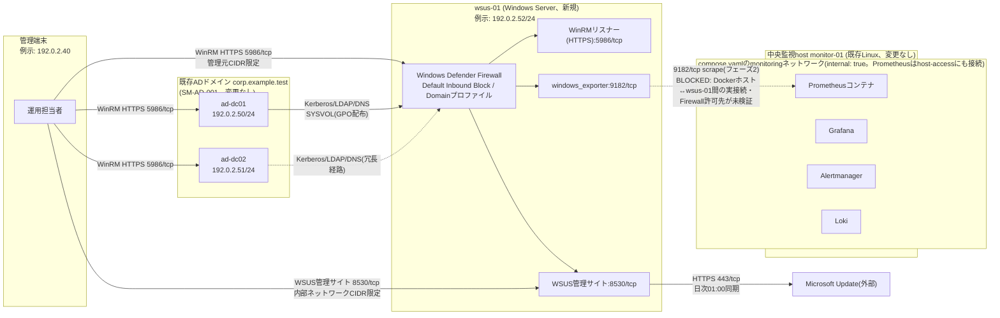

# ネットワーク設計・IPアドレス表

本書は、既存のADドメイン`corp.example.test`(AD版パック、案件ID`SM-AD-001`が正本)へ新規メンバーサーバー`wsus-01`を追加するにあたってのネットワーク設計とIPアドレス表を定義する。ドメインコントローラー`ad-dc01`・`ad-dc02`側の設計は[AD版ネットワーク設計・IPアドレス表](../build-package-ad/04-network-ip-plan.md)を正本とし、本書は`wsus-01`追加分の差分のみを扱う。[詳細設計書](02-detailed-design.md)の「アクセス制御」表は本書の要約であり、値の正本は本書である。

## 1. 本体構成

### IPアドレス表

| 論理ホスト名 | FQDN | 例示IPv4/prefix | 役割 | 備考 |
| --- | --- | --- | --- | --- |
| `wsus-01` | `wsus-01.corp.example.test` | `192.0.2.52/24` | 本パックで新規追加するWSUSメンバーサーバー(新規) | TEST-NET-1、RFC 5737の例示用アドレス。[AD版パック](../build-package-ad/README.md)の`ad-dc01=192.0.2.50/24`、`ad-dc02=192.0.2.51/24`と同一レンジ内で、重複を避けるため`.52`を採用する |
| `ad-dc01` | `ad-dc01.corp.example.test` | `192.0.2.50/24` | 既存ドメインコントローラー(AD版パック、変更なし) | 正本は[AD版04](../build-package-ad/04-network-ip-plan.md) |
| `ad-dc02` | `ad-dc02.corp.example.test` | `192.0.2.51/24` | 既存ドメインコントローラー(AD版パック、2026-09-03追加、変更なし) | 同上 |
| 管理端末 | — | `192.0.2.40`(例示) | 運用担当者の操作端末(既存パック共通の論理管理端末) | 例示 |

`wsus-01`はADドメイン参加により、AD統合DNSゾーン`corp.example.test`へ`wsus-01.corp.example.test`のAレコードが登録される想定である。実際の登録確認はSNW-03で行う。

### Zone表

| Zone | CIDR / interface(設計値、例示) | 主な通信 | 制御 |
| --- | --- | --- | --- |
| 管理端末 | `192.0.2.40` | WinRM HTTPS(5986/tcp)宛、必要時のみRDP(既定Disable) | 管理元CIDR限定、Windows Defender Firewallで許可(SST-01) |
| `wsus-01`(Windows Server、新規) | `192.0.2.52/24` | 受信: WinRM(5986)、WSUS管理サイト(8530)、windows_exporter(9182)。送信: Microsoft Update同期用HTTPS(443)、AD認証・名前解決用の内部ネットワークCIDR向け通信 | Windows Defender Firewall Default Inbound Block。許可はこの3経路のみ、経路ごとに送信元を個別制限。ドメイン参加によりFirewallプロファイルは`Domain` |
| 既存ADドメイン(`ad-dc01`・`ad-dc02`、変更なし) | `192.0.2.50/24`、`192.0.2.51/24` | Kerberos/LDAP/DNS/SMB(SYSVOL、GPO配布) | [AD版パック](../build-package-ad/04-network-ip-plan.md)の設計のまま。本パックによるFirewall変更は無い |
| 内部ネットワーク(将来のドメインメンバー) | 環境ごとに決定(`NOT SET`) | AD関連通信(DNS/Kerberos/LDAP/SMB等)、`wsus-01`のWSUSコンテンツ配信(8530) | 内部ネットワークCIDR限定。範囲の考え方は2節を参照 |
| 中央監視host`monitor-01`(既存Linux、変更なし) | 環境ごとに決定(`NOT SET`) | Prometheus/Grafana/Alertmanager/Lokiの既存UI/APIはloopbackのみbind(既存設計のまま変更なし) | 既存Linux版設計のまま。本案件によるFirewall変更は無い |
| `compose.yaml`の`monitoring`ネットワーク | Docker管理、`internal: true`(ただしPrometheusは`host-access`にも接続済み) | Prometheus等コンテナ間通信 | `internal: true`単体は外部egressを禁止するが、Prometheusは`host-access`(internal指定なしのbridge)にも接続済みでNAT egressを実際に持つ。`wsus-01`のwindows_exporter(既定9182/tcp)への到達は、Dockerホストと`wsus-01`の実ネットワーク接続・Firewall許可先が未検証のため現状BLOCKED(フェーズ2) |

ポート単位の許可範囲・認証方式の詳細は[パラメータシート](03-parameter-sheet.md)のアクセス制御表を正本とする。

実線は現時点(フェーズ1)で成立する経路、点線は冗長経路(`ad-dc02`経由の認証)、またはフェーズ2で構築予定の経路(現状は設計のみで`NOT RUN`/`BLOCKED`)を示す。管理端末は`wsus-01`単体だけでなく、`ad-dc01`・`ad-dc02`それぞれへも個別にWinRM経路を持つ。各ホストのWindows Defender Firewallはホストごとに独立して設定するため(この構成には中央集約型のFirewallアプライアンスは無い)、管理元CIDRのスコープを3台それぞれで一致させて維持する必要がある。

### Dockerホスト↔`wsus-01`間の実接続(フェーズ2が`BLOCKED`である技術的理由)

中央側では、`compose.yaml`の`monitoring`ネットワークが`internal: true`で定義されているが、Prometheusコンテナは`monitoring`に加えて`host-access`(internal指定なしのbridge)にも接続されている。Dockerは`host-access`のサブネットに対してNAT(POSTROUTINGのmasquerade)とFORWARD許可を自動生成するため(`docker network inspect`と生成された実際のnftablesルールで確認済み)、`internal: true`単体はDockerホスト外への到達を防ぐ壁ではない。したがって、以前このパックが述べていた「到達にはPrometheusサービスだけを`internal`ではない追加のbridge networkへ接続する`compose.yaml`変更が必要」という説明は誤りで、その追加のbridge network(`host-access`)は既に存在し、Prometheusは既に接続済みである。この点は[Windows版パック](../build-package-windows/04-network-ip-plan.md)・[AD版パック](../build-package-ad/04-network-ip-plan.md)と共通の訂正であり、フェーズ2が`BLOCKED`である理由は次の3点に整理し直す。この理由付けは両パックと同じ扱いとし、本パック独自の理由には作り替えない。

1. `ansible/roles`配下にWindows対応role(`common_windows`等)が無く、Ansibleでの自動構築ができない。
2. 実際にscrapeを成立させるには、(a)中央監視hostのDockerホスト自体が`wsus-01`の属するネットワークセグメントへ実際に到達できること、(b)windows_exporterのFirewallルールが、`host-access`経由のMASQUERADEで送信元がDockerホストの実IPへ書き換わった後の値を許可対象とすることが必要である。本ラボの各ホストはRFC 5737の例示用アドレス(`192.0.2.0/24`。実運用を想定しないドキュメント用range)であり、DockerホストとWindowsホストを実際に同一セグメントへ接続した実績が無いため、これらは`NOT SET`・未検証のままである。
3. Windows Event Log/IISログを既存Lokiへ送る経路(Grafana Alloy for Windowsの導入、Lokiのpush APIをloopback以外からも安全に受け付けるための認証・network設計)が無い。

`wsus-01`のwindows_exporterはIISコレクター(`iis`)を有効化し、WSUS管理サイトのメトリクスも公開対象に含めるが、これは公開する指標の種類の話であり、上記2点目の到達性の未検証とは無関係である。9182/tcpという同一ポートに対する同一の未検証状態が、他パックの監視対象ホストと同様にそのまま`wsus-01`にも当てはまる。

現状のFirewall許可設定(SST-01、windows_exporterの9182/tcpを中央Prometheus hostのIPのみへ許可)と、フェーズ2で成立するscrape経路(SIT-09)は別の状態である。証跡の記録時に、フェーズ1で「Firewallルールを許可した」ことと、フェーズ2で「実際にscrapeが成立した」ことを混同しない。

## 2. 複数ホスト構成の考慮

本パックが対象とするのは`wsus-01`という1ホストだが、実際に到達性を確認すべき相手は`ad-dc01`・`ad-dc02`・管理端末の3者にまたがる。[Windows版パック](../build-package-windows/01-basic-design.md)のワークグループ構成の監視対象ホスト(`monitor-win-01`)や、[Zabbix版パック](../build-package-zabbix/01-basic-design.md)の完全独立ホスト(`zbx-01`)とは異なり、`wsus-01`はADドメインへ参加するメンバーサーバーであるため、認証・名前解決・グループポリシー配布のすべてをAD側との通信に依存する。この依存関係の強さが、本パックのネットワーク設計における最大の特徴である。

Windowsクライアント(`wsus-01`を含む)は、ドメインへの通信先DCを固定せず、DNSのSRVレコード(`_ldap._tcp.dc._msdcs.corp.example.test`等)を参照して動的に選ぶ「DCロケーター」という仕組みを使う。したがって`wsus-01`のKerberos認証・LDAP検索・GPO配布(SYSVOL参照)は、`ad-dc01`・`ad-dc02`のどちらが応答してもよく、片方のみに固定した経路設計にしてはならない。[AD版パック](../build-package-ad/01-basic-design.md)3.4節に記録されている2026-09-03のDC 1台停止試験(ラボ範囲)でも、ドメインレベルFSMO役割を保持する`ad-dc01`を停止してもDNS・LDAP・Kerberos・GCは`ad-dc02`単独で継続することが確認されており、本パックのネットワーク設計もこの冗長性を前提にする。つまり、内部ネットワークCIDRから`ad-dc01`・`ad-dc02`の双方へ到達できることが、`wsus-01`のドメイン参加・GPO適用が安定して成立するための条件であり、どちらか一方への経路だけを確認して済ませてはならない。

内部ネットワークCIDRの考え方は、[AD版パック](../build-package-ad/04-network-ip-plan.md)が定義した概念をそのまま用いる。「将来ドメインに参加するすべてのホストが所属しうる範囲」であり、管理端末だけに絞る「管理元CIDR」よりも広い区分である。`wsus-01`は本パックによってこの内部ネットワークCIDRへ新たに加わるホストであり、例示アドレスとしては`ad-dc01`・`ad-dc02`と同じ`192.0.2.0/24`のレンジに属する(`192.0.2.52`)。実環境の具体的な範囲は環境ごとに決定するため`NOT SET`のままとし、パラメータシートに実機記入欄を設ける。

管理端末側の運用も、AD版単体の時点(DC 2台への経路)から`wsus-01`が加わったことで3台への経路管理に広がる。各ホストのWindows Defender Firewallは独立して設定するため、管理元CIDRの値を変更する場合は3台それぞれで見直す必要がある。反対に、`wsus-01`が依存するのはAD側(`ad-dc01`・`ad-dc02`)だけであり、[Zabbix版パック](../build-package-zabbix/README.md)の`zbx-01`や、ワークグループ構成の[Windows版パック](../build-package-windows/README.md)の`monitor-win-01`とはネットワーク的な依存関係を持たない。これらは互いに無関係なセグメントとして扱ってよい。

なお、[Windows版パック](../build-package-windows/04-network-ip-plan.md)が正直に述べているとおり、Windows/AD混在のネットワーク障害を注入・体験するラボは本リポジトリに現時点で無い。`wsus-01`とAD側の間で名前解決やKerberosが失敗するケースを模擬した演習も、同様に将来課題であり、本書では複数ホスト構成の「あるべき経路」を図と表で示すにとどめる。

## 3. 実環境で確認する項目

実行順、期待結果、採録方法は[ネットワーク実機検証手順](09-network-validation-procedure.md)を正本とする。本節はその概要であり、SNW-01〜09それぞれに対応するPowerShellコマンドの一覧である。

- SNW-01(interface/IP/CIDR): `Get-NetAdapter`、`Get-NetIPAddress`で対象interfaceの状態とIPv4/prefixを確認する
- SNW-02(route/gateway): `Get-NetRoute`、`Test-NetConnection -TraceRoute`でdefault gatewayと経路を確認する
- SNW-03(DNS、`corp.example.test`ゾーン): `Resolve-DnsName`で`wsus-01.corp.example.test`のAレコード、および`_ldap._tcp.dc._msdcs.corp.example.test`等のSRVレコードが想定どおり解決されることを確認する
- SNW-04(ICMP): `Test-Connection`で疎通を確認する(Firewall方針でICMPを遮断する場合はpacket loss自体を障害と判定せず、TCP/HTTP試験へ進む)
- SNW-05(待受port): `Get-NetTCPConnection -State Listen`で5986/tcp、8530/tcp、9182/tcpの待受状態と、3389/tcpが既定Disableで非待受であることを確認する
- SNW-06(TCP/HTTP): `Invoke-WebRequest`または`curl.exe`でWSUS管理サイト(8530)への到達が内部ネットワークCIDR内からのみ成立すること、windows_exporterの`/metrics`応答が中央Prometheus host以外からは拒否されることを確認する
- SNW-07(packet capture): `pktmon`(Windows組込)でheaderのみを短時間採取する。認証情報を含む本文は採録しない
- SNW-08(Windows Defender Firewall): `Get-NetFirewallProfile`、`Get-NetFirewallRule`でプロファイル(`Domain`)と許可ルールが設計と一致することを確認する
- SNW-09(end-to-end): 管理元CIDR以外からのWinRM接続、内部ネットワークCIDR以外からのWSUSコンテンツ接続がいずれも拒否されることを確認する。WinRM HTTPSは通信自体が暗号化されているため、Linux版のSSHトンネルに相当する追加のトンネルは不要である(この非対称性を確認する)

`ad-dc01`・`ad-dc02`向けの確認項目は[AD版ネットワーク検証手順](../build-package-ad/09-network-validation-procedure.md)を正本とし、本書・本パックの手順は`wsus-01`単体、および管理端末→`wsus-01`の経路のみを対象とする。実行結果の記入先は[WSUS実ホスト ネットワーク検証結果票](../evidence/templates/network-host-validation-wsus.md)である。独立した引き渡し対象host/管理端末での結果は、日付付きevidenceを作成するまで`NOT RUN`である。
