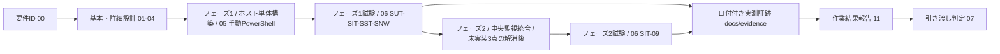

# WSUSサーバー構築案件パック

**一言でいうと**: 既存のADドメイン(`corp.example.test`)へWSUS(Windows Server Update Services。更新プログラムを集中配信するMicrosoft製サーバー)を1台追加し、グループポリシーによる更新プログラムの集中管理を実現する案件の書類一式です。

初めての方は、先に[案件パック 初心者ガイド(WSUS版)](beginner-guide.md)を読むと全体像がつかめます。

このディレクトリは、既存のActive Directoryドメイン(`corp.example.test`。案件ID`SM-AD-001`、正本は[AD版案件パック](../build-package-ad/README.md))へ、WSUSサーバーを新しいメンバーサーバーとして1台追加登録する構築案件(案件ID`SM-WSUS-001`)の成果物を、工程順にまとめたものです。[Windows版パック](../build-package-windows/README.md)・[AD版パック](../build-package-ad/README.md)は、いずれも「自動更新はWindows Updateから直接。実務ではWSUS/グループポリシー経由の集中管理を推奨するが、本パックの基準ではない」と明記していました。本パックは、この「推奨だが対象外」とされてきた欠落を埋めるものです。既存の中央監視基盤([Linux版パック](../build-package/README.md)、案件ID`SM-LAB-001`)は変更しません。

案件は「何を作るか決める → 設計する → 作る → 試験する → 報告して渡す」の順に進みます。工程ごとに書類が分かれるため、文書は00から11までの12個あります。番号は作られた順で、読む順とは一致しません。初めて読むときは、下の「最短レビュー順」に従ってください。

構成・文体・厳格さは`docs/build-package/`にあるLinuxサーバー構築案件パックを踏襲します。本文書にある「設計値」と、実機で取得した「実績値」は分けて管理します。

| 案件 ID | 対象 | 現在の引き渡し判定 |
| --- | --- | --- |
| `SM-WSUS-001` | 既存ADドメイン`corp.example.test`(依存案件`SM-AD-001`)へ、Windows Server 2022 Standard(Desktop Experience基準)の検証用VM1台(論理ホスト名`wsus-01`)をメンバーサーバーとして参加させ、WSUSロール(WID使用)を構築 | **`NOT READY`** — 設計・手順書は作成済みだが、引き渡し対象ホストが未指定でフェーズ1必須試験が`NOT RUN`。フェーズ2は「未実装」3点により`BLOCKED` |

表中の`NOT READY`は、必須の試験が終わっておらず、引き渡せる状態ではないことを表します。

次の3つは、それぞれ別の状態です。ひとまとめにしないでください。

- 文書が「作成済み」であること
- フェーズ1の手順を実機で実行して`PASS`したこと
- 特定の引き渡し対象ホスト(`wsus-01`)で受け入れが完了したこと

最終判定は[作業結果・引き渡し報告書](11-work-result-report.md)と[引き渡しチェックリスト](07-handover-checklist.md)を使います。

初めて「要件定義書」「非機能要件(NFR。速さ・止まりにくさ・安全性など、機能以外の要求)」
「Gate(次の工程へ進んでよいかを判断する関門)」「WID」「クライアント側ターゲティング」と
いった言葉に触れる場合は、先に[案件パック 初心者ガイド(WSUS版)](beginner-guide.md)で
案件パック全体の地図と、WSUS固有の言い回しを確認してください。文書の番号構成(00〜11)と
役割は[Linux版](../build-package/beginner-guide.md)・[Windows版](../build-package-windows/beginner-guide.md)・[AD版](../build-package-ad/beginner-guide.md)と共通です。

## 既存パックとの関係

本パックは`docs/build-package/`の構成・文体・厳格さを踏襲しますが、次の3点が異なります。

1. **既存ADドメインへの依存**: 本パックは[AD版パック](../build-package-ad/README.md)(案件ID`SM-AD-001`)が構築した既存ドメイン`corp.example.test`へメンバーサーバーとして参加する構成です。AD版パックが定義した組織単位(OU)構成(`_Tier0-Admins`、`Servers`、`Workstations`、`Employees`、`Groups`、`ServiceAccounts`の6OU)をそのまま利用し、`wsus-01`のコンピューターオブジェクトは既定の`Computers`コンテナではなく`Servers`OUへ配置します。AD版パック未完了の状態では本パックは開始できません。
2. **「推奨だが対象外」を埋めるパック**: [Windows版パック](../build-package-windows/00-requirements.md)・[AD版パック](../build-package-ad/00-requirements.md)のパラメータシート/基本設計書には、いずれも「自動更新はWindows Updateから直接。実務ではWSUS/グループポリシー経由の集中管理を推奨するが、本パックの基準ではない」という一文があります。本パックは、この欠落を埋める5本目の案件パックです。
3. **フェーズ1/フェーズ2の2段階に分かれる**: Windows版・AD版パックと同じ考え方で、`wsus-01`単体で検証・完了できる**フェーズ1(ホスト単体構築)**と、中央監視基盤への統合を要する**フェーズ2(中央監視統合)**に分けます。フェーズ2は、Windows対応Ansible roleの不在、`monitoring`ネットワークの`internal: true`制約、Windows向けログ集約経路の不在という「未実装」3点が解消するまで`BLOCKED`です。これはWindows版・AD版パックと全く同じ理由付けです。

## 最短レビュー順

1. [要件定義書](00-requirements.md) — 何を作り、何を作らないか。どうなれば合格かを決める(受け入れ条件。要件IDはFR-01〜FR-08, NFR-01〜NFR-09)
2. [基本設計書](01-basic-design.md) — 全体の構成、フェーズ1とフェーズ2の分け方、データベース方式(系統A/系統B)の考え方
3. [パラメータシート](03-parameter-sheet.md) — 実際に入力する設定値の一覧(OS・ドメイン参加・GPO・WSUSロール・同期設定・バックアップ)
4. [構築手順書](05-build-procedure.md) — `wsus-01`を手作業のPowerShell操作で組み立てる手順(フェーズ1)
5. [試験仕様書・結果票](06-test-specification.md) — 何を確かめれば合格かと、実測結果を書き込む用紙(SUT/SIT/SST/SNW)
6. [ネットワーク実機検証手順](09-network-validation-procedure.md) — 実機で通信できるかの確認(通信が届くか、名前が引けるか、経路は正しいか、待ち受けているか)
7. [作業結果・引き渡し報告書](11-work-result-report.md) — 計画対実績(予定と実際の比較)、試験の集計、差異、残存リスク(残ったままの危険)、完了判定
8. [検証証跡台帳](../evidence/README.md) — 実測済み・未実測の境界(どこまで実機で確かめ、どこからが未確認か)

## 成果物一覧

| 工程 | 成果物 | 状態 |
| --- | --- | --- |
| 要件定義 | [00-requirements.md](00-requirements.md) | 作成済み |
| 基本設計 | [01-basic-design.md](01-basic-design.md) | 作成済み |
| 詳細設計 | [02-detailed-design.md](02-detailed-design.md) | 作成済み |
| パラメータ設計 | [03-parameter-sheet.md](03-parameter-sheet.md) | 作成済み |
| ネットワーク設計 | [04-network-ip-plan.md](04-network-ip-plan.md) | 作成済み |
| 構築(フェーズ1) | [05-build-procedure.md](05-build-procedure.md) | 手順作成済み・実機結果は証跡台帳で管理 |
| 試験 | [06-test-specification.md](06-test-specification.md) | 仕様作成済み・未実施欄は`NOT RUN` |
| 引き渡し | [07-handover-checklist.md](07-handover-checklist.md) | 作成済み |
| 変更・ロールバック | [08-change-rollback-plan.md](08-change-rollback-plan.md) | 計画・記録様式作成済み(スナップショット復元を最優先手段とする設計)。実施結果は`NOT RUN` |
| ネットワーク実機検証 | [09-network-validation-procedure.md](09-network-validation-procedure.md) | 手順作成済み。実施結果は`NOT RUN` |
| 立ち上げ・受け入れ | [10-host-bringup-and-acceptance.md](10-host-bringup-and-acceptance.md) | 環境選択肢と最短手順を作成済み |
| 作業結果報告 | [11-work-result-report.md](11-work-result-report.md) | 原本作成済み。対象ホストごとの実績は日付付きevidenceへ複製して記録 |
| ネットワーク結果票(WSUS) | [実機検証テンプレート](../evidence/templates/network-host-validation-wsus.md) | テンプレート作成済み |
| 一次切り分け記録 | [トラブルシュート一次記録テンプレート](../evidence/templates/troubleshooting-worklog.md) | テンプレート作成済み(既存4パックと共用) |

## 工程ゲート

表中の`NOT SET`は、値や承認がまだ決まっていないことを表します。

| Gate | 完了条件 | 現在の状態 |
| --- | --- | --- |
| G0 要件確定 | 要件ID、対象、対象外、受け入れ条件が合意済み | 文書作成済み。実案件での承認は`NOT SET` |
| G1 設計確定 | 基本・詳細・パラメータ・ネットワーク設計のレビュー完了 | 文書作成済み。実案件での承認は`NOT SET` |
| G2(フェーズ1)構築完了 | 対象VMへの初回手動構築(`SIT-01`)が成功し、2回目実行で不要な変更が無いこと(`SIT-02`)を記録 | 手順作成済み。引き渡し対象ホストは`NOT RUN` |
| G2(フェーズ2)統合完了 | `app_node_exporter_targets`へのWSUSホスト追加、`monitoring`networkのegress拡張、Windows向けログ集約経路の導入が完了 | 設計のみ。3点とも未実装で、着手時期は`NOT SET` |
| G3(フェーズ1)試験完了 | フェーズ1必須ID(`SUT-01`〜`05`、`SIT-01`〜`08`、`SST-01`〜`06`、`SNW-01`〜`09`)がすべて`PASS` | `NOT READY` |
| G3(フェーズ2)試験完了 | `SIT-09`が`PASS` | `BLOCKED`(G2フェーズ2の解消が前提) |
| G4 作業完了 | 作業結果報告書に実績、障害、差異、残存リスクを記録 | 原本のみ。実案件報告は`NOT SET` |
| G5 引き渡し | 受領者、日時、秘密値受け渡し、未解決事項を記録 | `NOT READY` |

## 検証環境

基準環境はWindows Server 2022 Standard(Desktop Experience基準)の検証用VM1台(論理ホスト名`wsus-01`)です。Windows Server 2022 Server Coreは検討課題であり、基準VMはDesktop Experienceです。データベース方式は系統A(WID。既定)を基準とし、系統B(外部SQL Server)は差分のみ記載し対象外です(詳細は[基本設計書](01-basic-design.md))。

最小構成の目安は4 vCPU / メモリ8GB / Cドライブ80GB / コンテンツストア専用のDドライブ100GB以上です。他パック基準(2 vCPU / 4GB / 60GB)より重いのは、Microsoft Update全メタデータの取得・WIDのインデックス処理・IISによる大容量コンテンツ配信を1台で担うためです。立ち上げ環境の選択肢(クラウドWindows Serverインスタンス/評価版ISOによるHyper-V・VMware上のVM/社内ボリュームライセンス)は[10-host-bringup-and-acceptance.md](10-host-bringup-and-acceptance.md)にまとめます。

`wsus-01`は既存のADドメイン`corp.example.test`(DC: `ad-dc01`=`192.0.2.50/24`、`ad-dc02`=`192.0.2.51/24`)へメンバーサーバーとして参加します。例示IPv4/prefixは`192.0.2.52/24`で、既存2台と重複を避けて52を使用します。中央側の既存Linux監視host(論理名`monitor-01`)は変更しません。

フェーズ1(ホスト単体構築)・フェーズ2(中央監視統合)ともに、独立した引き渡し対象VM・管理端末を用いた実測はまだありません。日付付きの[ネットワーク結果票(WSUS)](../evidence/templates/network-host-validation-wsus.md)が保存されるまで`NOT RUN`とします。

## 完了の定義

次をすべて満たした時点で「構築・試験完了」とします。

- フェーズ1の必須試験(`SUT-01`〜`05`、`SIT-01`〜`08`、`SST-01`〜`06`、`SNW-01`〜`09`)がすべて`PASS`
- フェーズ2の必須試験(`SIT-09`)は、[要件定義書](00-requirements.md)に記す「未実装」3点(Windows対応Ansible roleの不在、`monitoring`ネットワークの`internal: true`制約、Windows向けログ集約経路の不在)の解消条件とともに`BLOCKED`として明記されていること
- 実行日時、環境、ホストのビルド番号(`winver`または`Get-ComputerInfo`の`OsBuildNumber`)、実行コマンド、実出力、判定が証跡として保存される
- 未解決事項、秘密値(ローカルAdministratorパスワード等)の受け渡し方法、ロールバック方法が引き渡し記録に残る
- 実ホストの名前解決、経路、待受、HTTP疎通、Windows Defender Firewallを確認し、実行出力を保存する
- [作業結果・引き渡し報告書](11-work-result-report.md)の計画対実績、試験集計、差異、残存リスク、受領判定を記入する
