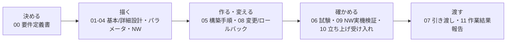

# 案件パック 初心者ガイド（WSUS版）

> **対象**: 「WSUS」「WID」「クライアント側ターゲティング」などの言葉を初めて見る人。[Windows版初心者ガイド](../build-package-windows/beginner-guide.md)や[AD版初心者ガイド](../build-package-ad/beginner-guide.md)は読んだがWSUS版は初めて、という人も対象
> **ゴール**: 12個の文書を読む前に、案件パック全体の地図と、WSUS特有の言い回しを頭に入れる
> **所要時間の目安**: 25〜35分（暗記ではなく、地図を持つことが目的）

このディレクトリ（[`docs/build-package-wsus/`](README.md)）には、要件定義から引き渡しまでの
文書が12個並んでいます。既存のActive Directoryドメイン（`corp.example.test`、案件ID
`SM-AD-001`）へ、WSUS（Windows Server Update Services。Microsoft製の更新プログラム集中配信
サーバー）を1台追加し、グループポリシーによる更新プログラムの集中管理を実現する案件と
見立てたものです。

構成も呼び方も[Windows版案件パック](../build-package-windows/README.md)・
[AD版案件パック](../build-package-ad/README.md)と同じです。どちらかを読んだ人には、
見覚えのある文書が多いはずです。

ただしWSUS版には、この案件パックにしか出てこない言葉が多く出てきます。

- 「WID」: SQL Serverを別途用意せず、Windows標準で使える軽量データベース機能
- 「コンテンツストア」: ダウンロードした更新プログラム本体を保管する場所
- 「クライアント側ターゲティング」: GPOで配ったグループ名をもとに、クライアントが
  WSUSコンソール側のコンピューターグループへ自動的に登録される仕組み
- 「承認ルール」: 特定の条件を満たす更新プログラムを自動的に承認するルール

いきなり[00-requirements.md](00-requirements.md)から読み始めると、そこでつまずきやすく
なっています。

この文書は案件パック本体（成果物）には含まれません。初めて読む人のための
**地図と用語辞典**です。読んだらすぐ本編の
[最短レビュー順](README.md#最短レビュー順)へ進んでください。

## この文書の使い方

**一言でいうと**: 最初に全体の地図をつかみ、あとは分からない言葉が出るたびに引き直す文書です。

1. 最初に「[1. そもそも案件パックとは](#1-そもそも案件パックとは)」で、このパックが
   何本目のパックで、既存のADドメインや他の案件パックとどう関係するのかをつかむ
2. 「[3. 迷わないための5フェーズ](#3-迷わないための5フェーズ)」で12文書を5グループに
   圧縮して覚える
3. 「[4. 12文書カード](#4-12文書カード)」を辞書として使い、読みながら該当カードだけ確認する
4. 分からない言い回しが出たら「[5. 現場用語ブリッジ](#5-現場用語ブリッジ)」を引く。
   WSUS固有の言葉はここにまとめてある
5. 一度に全部を覚えようとしない。困ったらこの文書へ戻ってくればよい

## 1. そもそも案件パックとは

**一言でいうと**: 案件パックとは1件の構築案件の約束事を文書一式にまとめたもので、
本パックはその5本目（案件ID `SM-WSUS-001`）です。

実際のサーバー構築の受託案件では、発注者（依頼する側）と受注者（構築する側）の間で、

- 何を作るか（要件）
- どう作るか（設計）
- 具体的にどんな値で作るか（パラメータ）
- 実際にどう手を動かすか（構築手順）
- 本当にできているかをどう確かめるか（試験）
- 何を、いつ、どう渡すか（引き渡し）

を、口約束ではなく**文書として残す**のが普通です。これは「面倒な形式」ではなく、
担当者が変わっても同じ基準で仕事を続けられるようにするための仕組みです。

このリポジトリには、すでに4本の案件パックがあります。

| 順番 | パック | 案件ID | 何をする案件か |
| --- | --- | --- | --- |
| 1本目 | [Linux版](../build-package/README.md) | `SM-LAB-001` | 中央監視基盤（Prometheus/Grafana/Loki/Alertmanager）そのものをUbuntu Server 1台に構築 |
| 2本目 | [Windows版](../build-package-windows/README.md) | `SM-WIN-001` | 既存の中央監視基盤へ、Windows Server 1台（`monitor-win-01`）を監視対象ホストとして追加登録 |
| 3本目 | [AD版](../build-package-ad/README.md) | `SM-AD-001` | 新規のActive Directoryフォレスト・ドメイン（`corp.example.test`）をWindows Server（`ad-dc01`、`ad-dc02`）に構築 |
| 4本目 | [Zabbix版](../build-package-zabbix/README.md) | `SM-ZBX-001` | 既存の監視基盤とは独立した第2の監視経路として、新規ホスト`zbx-01`にZabbix 7.0 LTSを構築 |
| **5本目（本パック）** | **WSUS版** | **`SM-WSUS-001`** | **既存ADドメイン`corp.example.test`へWSUSサーバー（`wsus-01`）を1台追加し、グループポリシーによる更新プログラムの集中管理を実現** |

本パックが未経験者にとって少しややこしいのは、**単に「5番目に作られたから読む」パックでは
ない**という点です。2本目のWindows版パック・3本目のAD版パックには、いずれもパラメータシート
や基本設計書に次の一文が明記されていました。

> 「自動更新はWindows Updateから直接。実務ではWSUS/グループポリシー経由の集中管理を
> 推奨するが、本パックの基準ではない」

つまり、Windows版・AD版は「WSUSによる集中管理が望ましいことは分かっていたが、対象外に
した」という書き方を、意図的に残していました。本パック（`SM-WSUS-001`）は、この
「推奨だが対象外」として先送りされてきた欠落を、あとから埋めるパックです。1本目
（監視基盤そのもの）や4本目（第2の監視経路）のように新しい柱を1本増やすのではなく、
2本目・3本目が積み残した宿題を片付ける、という位置づけです。

WSUSとは何かを、ひとことで言うと**「各PCが個別にインターネットからWindows Updateを
取りに行くのではなく、1台のサーバーがまとめてダウンロードし、社内の他のPC・サーバーへ
配布・承認を一元管理する仕組み」**です。使わない場合、更新プログラムをどのPCがいつ
インストールしたか把握しづらく、インターネット回線の帯域も個別ダウンロード分だけ
消費します。WSUSを使うと、「どの更新プログラムを承認するか」「いつ配布するか」を
管理者が1か所で決められるようになります。

もう1つ重要なのが、既存パックとの依存関係です。本パックは**AD版パックが構築した
既存ドメイン`corp.example.test`に、新規メンバーサーバーとして参加する**ことが前提に
なっています。AD版パックが定義した組織単位（OU。アカウントを整理するフォルダーの
ようなもの）の6OU構成——ドメイン直下の`_Tier0-Admins`、`Servers`、`Workstations`、
`Employees`、`Groups`、`ServiceAccounts`——を、そのまま利用します。`wsus-01`の
コンピューターオブジェクトは、既定の`Computers`コンテナではなく`Servers`OUへ明示的に
移動する設計です。AD版パックが先に完了していないと、本パックは開始できません。

Windows版パックとは「Windows Serverを1台追加する」という形は似ていますが、対象ホスト・
案件IDとも別物です。Windows版パックはワークグループ（Active Directoryに参加させない
形。本パックが説明する「系統」とは軸が違う既定の構成）が既定であり、そもそもWSUSは
対象外と明記されていました。本パックはその逆で、**最初からADドメイン参加が前提**です。
この違いは「[9. よくある誤解](#9-よくある誤解)」でも扱います。

Zabbix版パック・Linux版パックとは直接の依存関係はありません（独立しています）。

未経験者が最初につまずくのは、内容そのものではありません。「なぜこの文書が12個も
要るのか」「ADドメインの話（OU）とWSUSの話（コンピューターグループ）が、なぜ両方
出てくるのか」という点です。次の章で、12文書を5つの塊に圧縮して覚え方を作ります。

## 2. 全体の流れを1つの図で見る

**一言でいうと**: 12個の文書は「決める → 描く → 作る・変える → 確かめる → 渡す」の
5段階に並びます。



この図は、[案件パックのREADME](README.md)にある工程ゲートの図をもとにしています。
元の図は「要件→設計→構築→試験→証跡→報告→引き渡し」の7段階です。それを初心者向けに
5語へ圧縮・再編成しました。Gate（ゲート）や証跡の意味は
[5. 現場用語ブリッジ](#5-現場用語ブリッジ)で説明します。

7段階と5語は1対1には対応しません。例えば「試験」「証跡」の一部を④確かめるへ、
「報告」「引き渡し」を⑤渡すへまとめています。

文書番号の00〜11は作られた順であって、実際に読む・使う順ではありません。読む順は
「[6. 読む順とかかる時間の目安](#6-読む順とかかる時間の目安)」を使ってください。

## 3. 迷わないための5フェーズ

**一言でいうと**: 12個の文書を5つの動詞にまとめると、どの文書が何のためにあるかを
覚えやすくなります。

**覚え方: 「決める → 描く → 作る・変える → 確かめる → 渡す」**

| フェーズ | 一言 | 含まれる文書 | この段階で答える問い |
| --- | --- | --- | --- |
| ① 決める | 何を作り、何をもって完成とするか決める | [00 要件定義書](#00-要件定義書) | 「既存のADドメインとどう依存関係を結ぶか」「複数クライアント展開・HTTPS化・系統Bのような対象外は何か」 |
| ② 描く | 実現方法・具体値・接続範囲を描く | [01 基本設計書](#01-基本設計書)、[02 詳細設計書](#02-詳細設計書)、[03 パラメータシート](#03-パラメータシート)、[04 ネットワーク設計](#04-ネットワーク設計ipアドレス表) | 「どう作るか」「具体的な値は何か」「誰がどこから接続できるか」 |
| ③ 作る・変える | 実際に手を動かし、変更時の戻し方も決める | [05 構築手順書](#05-構築手順書)、[08 変更・ロールバック計画](#08-変更ロールバック計画兼記録票) | 「どう構築するか」「失敗したらどう戻すか」 |
| ④ 確かめる | 本当にできているかを事実で確認する | [06 試験仕様書・結果票](#06-試験仕様書結果票)、[09 ネットワーク実機検証手順](#09-ネットワーク実機検証手順)、[10 立ち上げと受け入れ試験](#10-立ち上げと受け入れ試験) | 「合否の基準は何か」「実際に確認したか」 |
| ⑤ 渡す | 相手に説明し、記録を残して引き渡す | [07 引き渡しチェックリスト](#07-引き渡しチェックリスト)、[11 作業結果・引き渡し報告書](#11-作業結果引き渡し報告書) | 「渡す前に漏れはないか」「予定と実績の差は何か」 |

12文書のうち03・04は②、05・08は③のように、1つのフェーズに複数の文書が含まれることに
注意してください。文書番号（00〜11）と、このフェーズの順番は一致しません。

> **注意: この「5フェーズ」と、00・01文書に出てくる「フェーズ1／フェーズ2」は別物です**
>
> [00 要件定義書](00-requirements.md)や[01 基本設計書](01-basic-design.md)を読むと、もう1つの
> 「フェーズ」が出てきます。「フェーズ1（ホスト単体構築）」「フェーズ2（中央監視統合）」です。
>
> あちらは**構築作業そのものを2段階に分ける区切り**です。
> フェーズ1は`wsus-01`のドメイン参加、WSUSロール導入、GPOによるクライアント側
> ターゲティングの設定、そして`wsus-01`自身をWSUSクライアントとして自己登録・同期・
> 承認・適用まで一巡させる範囲です。windows_exporterのローカル導入までを含みます。
> フェーズ2は3点の未実装事項が解消するまで`BLOCKED`の範囲です。3点とは、Windows対応
> Ansible role・`compose.yaml`の`monitoring`ネットワーク（`internal: true`）・
> Windows向けログ集約経路であり、[Windows版パック](../build-package-windows/00-requirements.md)・
> [AD版パック](../build-package-ad/00-requirements.md)と全く同じ理由付けです。
>
> 一方この章の「5フェーズ（決める→描く→作る・変える→確かめる→渡す）」は、
> **12文書を読む順番を覚えるための、この初心者ガイドだけの言葉**です。
> 同じ「フェーズ」という言葉でも指しているものが違います。今どちらの話をしているかを
> 意識してください。
>
> [AD版パックの初心者ガイド](../build-package-ad/beginner-guide.md#3-迷わないための5フェーズ)、
> [Windows版パックの初心者ガイド](../build-package-windows/beginner-guide.md#3-迷わないための5フェーズ)
> にも、同じフェーズ1／フェーズ2の区切りがあります。この2本の初心者ガイドですでに
> 同じ説明が言語化されているので、どちらかを先に読んだ人には見覚えのある注意書きのはずです。

[案件パックREADMEの工程図](README.md)は10（立ち上げと受け入れ試験）を「構築・変更」の
グループ（05・08と同じ）に置いています。ただしこの文書では、あえて④確かめるに
分類しています。

10の中身は「構築済みのホストで、まだ確認していない項目を試験する」ことが中心だからです。
初心者にとっては「作る」より「確かめる」の仲間として覚えるほうが実感に合います。

[初心者向け学習ガイド](../beginner-learning-guide.md)にも、5語の覚え方があります。
「見る → 動かす → 確認する → 壊して直す → 説明する」で、形は似ていますが中身は別物です。
混同しないよう、今どちらの文書を読んでいるかを意識してください。

## 4. 12文書カード

**一言でいうと**: 12個の文書を1枚ずつのカードにした辞書です。

[未経験者向けサーバー構築キーワード集](../server-building-keywords.md)と同じ
「一言 → なぜ必要か → 読むポイント → このパックでの実例」の4点セットです。先に一言だけ
読み、必要になったときに残りを確認してください。

> 「実例」には`Get-ADComputer`、`wsusutil.exe postinstall`のような具体的なPowerShell
> コマンド名がそのまま出てきます。用語そのものの丁寧な説明はこの文書ではなく
> [サーバー構築キーワード集](../server-building-keywords.md)や、この文書の
> 「[5. 現場用語ブリッジ](#5-現場用語ブリッジ)」で行っています。初めて見る名前が多い
> 場合は、先にそちらへ目を通してから戻ってきてください。

### 00 要件定義書

- **一言**: 「何を作るか」「完成の合格基準」を先に決める文書
- **なぜ必要か**: 作ってから「思っていたのと違う」を防ぐため。特に本パックは既存の
  ADドメインへ依存する案件のため、「済（自動）」「済（手動）」「未実装」という3区分に
  加えて、複数クライアント展開・WSUS通信のHTTPS化・系統B（外部SQL Server）・レプリカ
  構成のような「対象外」の線引きを最初に合意しておかないと、どこまでがこの案件の完成
  範囲か分からなくなる
- **読むポイント**: 機能要件（FR）表と非機能要件（NFR）表の「実装・設計先」列。5章
  「制約と対象外」で、対象外の項目が具体的に列挙されている点
- **実例**: `FR-01`（ドメイン参加・`Servers`OU配置）が`SUT-01`・`SIT-01`へ、`FR-08`
  （中央監視統合、フェーズ2）が`SIT-09`（`BLOCKED`前提）へつながる

### 01 基本設計書

- **一言**: 要件を「どう実現するか」の全体方針を描く文書
- **なぜ必要か**: 細部を決める前に、フェーズ1／フェーズ2という段階分けの境界線と、
  系統A／系統Bという2つのデータベース方式のどちらを採るかを関係者で合意しておくため
- **読むポイント**: 論理構成図（mermaid）と、2.1節「データベース方式（系統A/系統B）」の表
- **実例**: 系統A（WID。Windows標準の軽量データベース機能。ローカル名前付きパイプ経由の
  接続のみでネットワークポートを使わない。本パックの既定）と、系統B（外部SQL Server。
  SSRSによるレポート連携が可能な実務での選択肢だが、本パックでは差分のみ記載し対象外）の違い

### 02 詳細設計書

- **一言**: コンポーネントごとの実装と「正常性の見分け方」を描く文書
- **なぜ必要か**: WSUSロール・WID・IIS（`WsusPool`）・GPO・windows_exporterのように
  複数の役割が1台に同居する`wsus-01`では、「動いているかどうか」を部品単位で先に
  決めておかないと、どこが壊れているのか切り分けられないため
- **読むポイント**: コンポーネント設計表の「正常性確認方法」列。「配備設計」の1〜10番の
  手順見出し（ドメイン参加、WSUSロール導入、GPO設計、コンピューターグループ・承認ルール等）
- **実例**: 「WIDは構成ウィザードがSUSDB接続でエラーなく完了すれば正常」「`WsusPool`は
  アイドルタイムアウト0・キュー長2000・メモリ制限0であることを`Get-IISAppPool`で確認」

### 03 パラメータシート

- **一言**: OS・ドメイン参加・GPO・WSUSロール・IIS・同期設定・バックアップの具体的な
  設定値を一覧にした表
- **なぜ必要か**: 文章の設計書だけでは見落としやすい具体値（コンテンツストアのパス、
  GPO名、承認ルール名等）を1か所にまとめ、実機の値と照合しやすくするため
- **読むポイント**: 「設計値」列と「実績値」列が分かれていること。実績欄の`NOT RUN`は
  「値がない」ではなく「まだ実機で確認していない」という意味
- **実例**: コンテンツストア配置先`D:\WSUS\WSUSContent`、GPO名`WSUS-Client-Policy`、
  自動承認ルール名「Critical and Security Updates - Pilot Auto-Approve」が、実機構築後は
  実績欄へコピーされる設計

### 04 ネットワーク設計・IPアドレス表

- **一言**: どのIP・ポートに、誰が、どこから接続できるかを決めた文書
- **なぜ必要か**: WinRM（5986）・WSUS管理サイト（8530）・windows_exporter（9182）という
  3経路の到達制御の正本は、Windows Defender Firewallによる送信元IP制限になる。この
  文書がないと公開範囲を誤りやすいため
- **読むポイント**: 「`compose.yaml`の`monitoring`ネットワークの制約」の節。この制約が
  フェーズ2が`BLOCKED`である直接の技術的理由
- **実例**: `wsus-01`の例示IP`192.0.2.52/24`は、[AD版パック](../build-package-ad/04-network-ip-plan.md)の
  `ad-dc01`（`192.0.2.50/24`）・`ad-dc02`（`192.0.2.51/24`）と同一レンジで、重複を避けて
  `.52`を採用したという注記

### 05 構築手順書

- **一言**: 実際に`wsus-01`を構築するとき、上から順に実行するPowerShell手順書
- **なぜ必要か**: 手順書がないと特定の人にしか構築できなくなる（属人化）ため。特に
  WSUSはロールインストール後、管理コンソールを初めて開く前にコマンドラインでコンテンツ
  ディレクトリを初期化しないと、コンソール起動時にエラーになるという、忘れやすい落とし
  穴がある
- **読むポイント**: 「0. 作業前確認」を飛ばさないこと。既存ADドメインへの到達性ベース
  ライン確認から始まる構成。4節「WSUSロールのインストールとコンテンツストア設定」の
  中の「コンソール初回起動前のコマンドライン初期化」
- **実例**: `Add-Computer -DomainName corp.example.test -Restart` → `Move-ADObject`で
  `Servers`OUへ移動 → `Install-WindowsFeature -Name UpdateServices -IncludeManagementTools`
  → `wsusutil.exe postinstall CONTENT_DIR=D:\WSUS\WSUSContent`

### 06 試験仕様書・結果票

- **一言**: 完成したかどうかを判定する「試験問題と模範解答（期待結果）」
- **なぜ必要か**: 「たぶんできてる」ではなく、コマンドと期待結果を先に決めておくことで、
  誰が実行しても同じ基準で合否を判定できるため
- **読むポイント**: 冒頭の「この文書の読み方」を先に読む。原本は常に`NOT RUN`のまま
  保存され、実施結果は日付付きの証跡（evidence）へコピーして記録する運用になっている
- **実例**: `SUT-xx`（単体・設定確認、5件想定）、`SIT-xx`（構築・結合試験、9件想定）、
  `SST-xx`（セキュリティ試験、6件想定）、`SNW-xx`（ネットワーク実機検証、9件想定）の
  4系統。`SIT-09`（中央監視統合）はフェーズ2の未実装3点が解消するまで`BLOCKED`が前提

### 07 引き渡しチェックリスト

- **一言**: 作業を依頼者に引き渡す前の最終確認リスト
- **なぜ必要か**: 「試験は全部`PASS`したが、ローカルAdministratorパスワードやサービス
  アカウントの資格情報の受け渡し方法を伝え忘れた」のような漏れを防ぐため
- **読むポイント**: 冒頭の引き渡し判定表と、GPOの対象グループ名がWSUSコンソール側の
  コンピューターグループ名（`Servers`）と一致しているかの確認項目
- **実例**: 秘密値そのものではなく「安全な受け渡し・再発行方法」を共有したか、という
  チェック項目

### 08 変更・ロールバック計画兼記録票

- **一言**: 完成後に設定を変更するとき、「失敗したらどう戻すか」を先に決めておく文書
- **なぜ必要か**: GPO変更や承認ルール変更のようなWSUS特有の変更も、始める前にGo/No-Go
  （作業を進めるか、中止するか）の判断基準と戻し方を決めておくため。WSUSには
  `Backup-GPO`のようなエクスポート機能が承認ルール・コンピューターグループには無く、
  記録漏れは手戻りになる
- **読むポイント**: 「Go/No-Go条件」チェックリストと、「ロールバック開始条件」の一覧。
  VM／ハイパーバイザーのスナップショット（ある時点の状態をまるごと保存した控え）復元が、
  主要な戻し手段として明記されている点
- **実例**: GPO変更前に`Backup-GPO`でバックアップを取得し、想定外の挙動が出た場合は
  GPOの復元またはスナップショット復元で戻す

### 09 ネットワーク実機検証手順

- **一言**: 実機のネットワークが設計どおりに動いているかを、1項目ずつ確認する手順書
- **なぜ必要か**: 「たぶんつながっている」ではなく、名前解決 → 経路 → 待受 → 通信 →
  Firewallの順に事実を積み上げて確認するため
- **読むポイント**: `SNW-01`〜`09`の番号順。WinRMは通信自体が暗号化されているため、
  Linux版のSSHトンネルに相当する追加のトンネルが不要という非対称性
- **実例**: `SNW-06`でWSUS管理サイトのクライアントWebサービス、windows_exporterの
  `/metrics`エンドポイントへの到達性を確認し、`WsusPool`のアイドルタイムアウト0・
  キュー長2000・プライベートメモリ制限0という設定を`Get-IISAppPool`で確認する

### 10 立ち上げと受け入れ試験

- **一言**: 「まだ確認していない項目」を、1台の実サーバーで一気に埋めるための手順書
- **なぜ必要か**: 使い捨ての検証環境では確認できない「再起動後もWSUSサービス・GPO・
  windows_exporterが正しく戻るか」を確かめるため
- **読むポイント**: 立ち上げ環境の選択肢を比較した表。ライセンス費用が発生するため、
  Linux版のように無償のVirtualBox VMがそのまま使えない点。既存ADドメインへの到達性が
  前提条件になる点
- **実例**: [Windows版](../build-package-windows/10-host-bringup-and-acceptance.md)と同様、
  自動判定スクリプトは本パックには存在しないと誠実に明記した上で、手動確認の手順を示す

### 11 作業結果・引き渡し報告書

- **一言**: 予定と実績の差、トラブル、残課題をまとめて報告する文書
- **なぜ必要か**: 試験結果がバラバラのファイルに散らばったままだと、依頼者は
  「結局終わったのか」が分からないため
- **読むポイント**: 「試験集計」で、フェーズ1必須IDの個別結果と合計が一致しているかを
  確認する部分
- **実例**: 案件ID`SM-WSUS-001`に対する完了判定欄（`NOT READY`のまま残っていれば未完了）。
  フェーズ2（`SIT-09`）は未実装3点の解消条件とともに`BLOCKED`として記録される

## 5. 現場用語ブリッジ

**一言でいうと**: 12文書で説明なしに使われる言葉を、日常語で言い換えた対訳表です。

12文書のあちこちで説明なしに出てくる言い回しです。意味が分かれば読む速度が大きく変わります。
まず[Windows版初心者ガイド](../build-package-windows/beginner-guide.md#5-現場用語ブリッジ)・
[AD版初心者ガイド](../build-package-ad/beginner-guide.md#5-現場用語ブリッジ)と共通の言葉、
続けてWSUS版だけに出てくる言葉の順に並べます。

| 用語 | 意味 |
| --- | --- |
| 正本（せいほん） | 「本当の値はどこにあるか」を1か所に決めておく考え方。フェーズ1の設計値の正本は本パックのPowerShell手順であり、パラメータシートの表はそれを見やすくした「索引」に過ぎない |
| 原本（げんぽん） | 06・08・11のような「空欄のひな形」文書そのものを指す言葉。実際に実行した結果はこの原本へ直接書き込まず、日付付きの別ファイル（証跡 / evidence）へコピーして記録する |
| 案件ID | 案件を一意に識別する番号。この案件パックでは`SM-WSUS-001`。依存先のAD版は`SM-AD-001` |
| 設計値 / 実績値 | 設計値はコード・文書から確認できる「決めた値」。実績値は対象ホストで実際にコマンドを実行して得た「実測した値」。設計値から実績値を推測して埋めない |
| `FR` / `NFR` | Functional Requirement（機能要件）/ Non-Functional Requirement（非機能要件）の略。FRは「何ができるか」、NFRは「どのくらいの品質・安全性で」を表す |
| フェーズ1 / フェーズ2 | Windows版・AD版・本パックだけに出てくる、構築作業を2段階に区切る言葉。フェーズ1は`wsus-01`単体で完結する範囲、フェーズ2は中央監視統合の範囲で、3点の未実装事項が解消するまで`BLOCKED`。上の「[3. 迷わないための5フェーズ](#3-迷わないための5フェーズ)」の5フェーズとは別物 |
| Gate（ゲート） `G0`〜`G5` | 各工程が完了したと認めるための関門。前のゲートを満たさないまま次の工程へ進まない、という約束事 |
| `SUT` / `SIT` / `SST` / `SNW` | 試験IDの頭文字。単体・設定確認 / 構築・結合試験 / セキュリティ試験 / ネットワーク実機検証。接頭辞`S`は本パック専用（末尾の"SUS"由来）で、[Windows版](../build-package-windows/06-test-specification.md)の`W`、[AD版](../build-package-ad/06-test-specification.md)の`A`、[Zabbix版](../build-package-zabbix/06-test-specification.md)の`Z`と衝突しないための選択 |
| `PASS` / `FAIL` / `BLOCKED` / `NOT RUN` | 結果の4状態。`PASS`は実測して期待どおり、`FAIL`は実測して不一致、`BLOCKED`は前提が整わず実行できない、`NOT RUN`は単に未実行 |
| `NOT SET` | 値そのものがまだ決まっていない（`NOT RUN`は「実行していない」、`NOT SET`は「値を決めていない」という違い） |
| `NOT READY` | 完了と判定するための条件が、まだ揃っていない状態 |
| commit SHA | Gitの変更履歴を一意に指す40桁のID。「どのブランチか」ではなく「どの時点のコードか」を正確に指すために使う |
| 日付付きevidence（証跡） | 06・08・11などの文書は「空欄のひな形（原本）」として保存され、実際に実行した結果は上書きせず、日付の付いた別ファイルへコピーして記録する |

### WSUS固有の用語

WSUSを初めて構築する人が、専門用語を専門用語のまま覚えようとしてつまずく言葉です。
まず日常語で言い換え、そのあとに正式名称を添えています。

| 用語 | 一言で言うと |
| --- | --- |
| WSUS（Windows Server Update Services） | 一言で言うと、各PCが個別にWindows Updateへ取りに行くのではなく、1台のサーバーがまとめてダウンロードし、承認・配布を一元管理する仕組み。Microsoft製で、Windows Serverの標準機能として追加できる |
| WID（Windows Internal Database） | 一言で言うと、SQL Serverを別途用意しなくても使える、Windows同梱の軽量データベース機能。本パックの既定（系統A）。ローカル名前付きパイプ（`MICROSOFT##WID`への接続）経由のみで、ネットワークポートを使わない |
| 系統A / 系統B | 一言で言うと、本パックが扱う2つのデータベース方式。系統A（WID、本パックの既定）はローカル接続のみで小規模向け、系統B（外部SQL Server、対象外）はSSRSレポート連携が可能な実務での選択肢で、クライアント数がおよそ数百台を超える規模から検討されることが多いという目安がある。Windows版パックの「系統A（ワークグループ）/系統B（ADドメイン参加）」と名前は同じだが、軸にしているものが違う点に注意 |
| コンテンツストア | 一言で言うと、ダウンロードした更新プログラム本体（実ファイル）を保管しておく場所。本パックではOSボリューム（C:）とは別のD:ドライブ配下（`D:\WSUS\WSUSContent`）に置く |
| 「更新プログラムをこのサーバーに保存する」 | 一言で言うと、コンテンツストアへ実ファイルをローカル保存するかどうかの設定。本パックでは有効にする。これにより「承認した更新プログラムだけが実際に配信される」という制御が効くようになる |
| コンソール初回起動前の初期化コマンド | 一言で言うと、WSUSロールをインストールした直後、管理コンソールを初めて開く前に、コマンドラインでコンテンツディレクトリの場所を教えてあげる作業（`wsusutil.exe postinstall CONTENT_DIR=...`）。これを忘れてコンソールを先に開くと、エラーになるという実務でよくあるつまずき |
| WSUS管理サイトの8530/8531ポート | 一言で言うと、WSUSが使う専用のWebサイトのポート番号。IISの既定サイト（一般的なWebサイトが使う80/443）とは別物で、8530がHTTP、8531がHTTPSにあたる。WSUS 3.0 SP2以降の標準仕様であり、古いバージョンが80/443を使っていたことと混同しないよう注意 |
| クライアント側ターゲティング | 一言で言うと、GPO（グループポリシー）で配った「グループ名」をもとに、クライアント（本パックでは`wsus-01`自身）がWSUSコンソール側のコンピューターグループへ自動的に登録される仕組み。GPO側の対象グループ名と、WSUSコンソール側で作るコンピューターグループの名前を一致させる必要がある |
| 承認ルール（自動承認ルール） | 一言で言うと、「この分類・この製品・このグループなら自動的に承認してよい」という条件を先に決めておくルール。本パックでは`Critical and Security Updates - Pilot Auto-Approve`という名前のルールを1件作るが、無人承認による意図しない適用を避けるため、スケジュール化はせず手動実行にとどめる設計とする |
| コンピューターグループ | 一言で言うと、WSUSコンソール内で更新プログラムの承認対象を分けるための入れ物。「すべてのコンピューター」の下に手動で`Servers`グループを作り、その下にサブグループ`Pilot`を作る設計。**ADの組織単位（OU）とは別の概念**であり、混同しやすい最大のポイント（下の囲みも参照） |
| Windows Defender Firewall | 一言で言うと、Windows標準のFirewall。本パックはDefault Inbound Blockとし、WinRM・WSUSコンテンツ・windows_exporterの3経路だけを、経路ごとに送信元を個別制限して許可する |

> **つまずきやすいポイント: ADの「OU」とWSUSの「コンピューターグループ」は別物**
>
> 本パックを読み進めると、似たような「グループ分け」の話が2回出てきます。
>
> - **OU（組織単位）**: [AD版パック](../build-package-ad/README.md)がドメイン全体に対して
>   定義した、Active Directoryのフォルダーのような入れ物です。`wsus-01`は
>   `Servers`OUへ配置します。ここへの所属は、GPO（グループポリシー）がどのコンピューター
>   へ配布されるかを決めます。
> - **コンピューターグループ**: WSUSコンソールというWSUS専用の管理画面の中だけに存在する、
>   まったく別の入れ物です。「すべてのコンピューター」の下に手動で`Servers`グループを
>   作り、その下に`Pilot`サブグループを作ります。ここへの所属は、更新プログラムの
>   承認・配布の単位を決めます。
>
> 名前がどちらも「`Servers`」であるためによけいに混同しやすいのですが、**これは意図した
> 設計**です。GPOの「クライアント側ターゲティングを有効にする」設定で対象グループ名を
> `Servers`と指定すると、`wsus-01`は起動時にこの名前を頼りにWSUSコンソール側の
> `Servers`コンピューターグループへ自動的に登録されます。つまり、AD側の`Servers`OUと
> WSUS側の`Servers`コンピューターグループは、**名前を意図的に揃えることで連携する、
> 別々の仕組み**です。OUを移動しただけではコンピューターグループへは登録されず、
> コンピューターグループを作っただけではOUを移動したことにもなりません。両方を
> 別々に行う必要があります。

## 6. 読む順とかかる時間の目安

**一言でいうと**: 番号順ではなく、この表の順に8ステップで読むと理解が早くなります。

[案件パックREADMEの「最短レビュー順」](README.md#最短レビュー順)を、初心者向けに時間の
目安付きで書き直したものです。

| 順番 | 文書 | 目安時間 | この段階の完了条件 |
| --- | --- | ---: | --- |
| 0 | この初心者ガイド | 25分 | 5フェーズの覚え方と、WSUS固有の現場用語ブリッジの表を一通り眺めた |
| 1 | [00 要件定義書](00-requirements.md) | 15分 | FR・NFRのどれか1つを選び、対応する試験IDを言える |
| 2 | [01 基本設計書](01-basic-design.md) | 10分 | 系統A（WID）と系統B（外部SQL Server）の違いを1つ言える |
| 3 | [03 パラメータシート](03-parameter-sheet.md) | 10分 | 「設計値」と「実績値」の違いを自分の言葉で説明できる |
| 4 | [05 構築手順書](05-build-procedure.md) | 20分 | ドメイン参加→WSUSロール導入→コンテンツディレクトリ初期化→GPO設計、という並び順を言える |
| 5 | [06 試験仕様書・結果票](06-test-specification.md) | 15分 | フェーズ2（`SIT-09`）の試験がなぜ`BLOCKED`を前提とするのかを説明できる |
| 6 | [09 ネットワーク実機検証手順](09-network-validation-procedure.md) | 10分 | 障害切り分けを「名前解決 → 経路 → 待受 → 通信 → Firewall」の順で言える |
| 7 | [11 作業結果・引き渡し報告書](11-work-result-report.md) | 10分 | 「文書が揃っている」ことと「引き渡し完了」の違いを説明できる |
| 8 | [検証証跡台帳](../evidence/README.md) | 10分 | 実測済みと未実測の境界を、1つ具体例で説明できる |

残りの02・04・07・08・10は、上の8ステップを終えてから読んでください。
[案件パックREADME](README.md#成果物一覧)の一覧に沿って読むと、どこに何が書いてあるかが
推測しやすくなります。

## 7. 覚えるための1分チェック

**一言でいうと**: 読んだ内容が身についたかを、7問で自己採点します。

すべて、この文書を読み返さずに答えられるかを確認する設問です。

1. 12文書を5つの動詞に圧縮すると何になりますか。
2. `NOT RUN`と`NOT SET`の違いは何ですか。
3. フェーズ1とフェーズ2の違いは何ですか。
4. 本パックが「対象外」とする項目を、3つ挙げられますか。
5. フェーズ2が`BLOCKED`である技術的な理由を、`compose.yaml`のどの設定に絡めて説明できますか。
6. ADの「OU」とWSUSの「コンピューターグループ」の違いを言えますか。
7. なぜこのパックが必要になったのか、Windows版・AD版パックとの関係で説明できますか。

<details>
<summary>解答例</summary>

1. 決める → 描く → 作る・変える → 確かめる → 渡す
2. `NOT RUN`は「まだ実行していない」、`NOT SET`は「値そのものをまだ決めていない」
3. フェーズ1は`wsus-01`単体で、ドメイン参加からWSUSクライアントとしての自己登録・
   同期・承認・適用まで一巡させる範囲（済・手動が中心）。フェーズ2は中央監視統合の範囲で、
   3点の未実装事項が解消するまで`BLOCKED`
4. 複数クライアントでの大規模検証、WSUS通信のHTTPS化（証明書配布）、外部SQL Serverへの
   移行（系統B）、レプリカ/ダウンストリームWSUSサーバーによる階層化構成、SSRS連携、など
   （このうち3つ挙げられれば十分）
5. `compose.yaml`の`monitoring`ネットワークが`internal: true`のため、Prometheusコンテナが
   同じDockerホストの外にある実マシン（`wsus-01`）のwindows_exporterへ到達できないため
6. OUはActive Directory側の入れ物で、GPOがどのコンピューターへ配布されるかを決める。
   コンピューターグループはWSUSコンソール専用の入れ物で、更新プログラムの承認・配布の
   単位を決める。名前（`Servers`）を意図的に揃えることで、クライアント側ターゲティングを
   通じて連携する、別々の仕組みである
7. Windows版・AD版パックには「自動更新はWindows Updateから直接。実務ではWSUS/
   グループポリシー経由の集中管理を推奨するが、本パックの基準ではない」という一文が
   あり、本パックはこの「推奨だが対象外」として先送りされてきた欠落を埋めるパックである

</details>

## 8. 面接で聞かれたら

**一言でいうと**: このパックを口頭で説明するときの型です。

空欄を自分の言葉で埋めて、声に出して説明できるか確認してください。

```text
このポートフォリオでは、Linux版（SM-LAB-001）、Windows版（SM-WIN-001）、AD版
（SM-AD-001）、Zabbix版（SM-ZBX-001）に続く5本目の案件パックとして、[SM-WSUS-001]
という架空の構築案件を作りました。Windows版・AD版のパラメータシートには「自動更新は
Windows Updateから直接。実務ではWSUS/グループポリシー経由の集中管理を推奨するが、
本パックの基準ではない」という一文があり、この[推奨だが対象外]とされてきた欠落を
埋めるパックです。既存のADドメイン（corp.example.test）へ、新しいメンバーサーバー
（wsus-01）を1台参加させ、WSUS（Windows Server Update Services）ロールを構築しました。

データベース方式は[WID（Windows Internal Database）]を採用し、外部SQL Serverを使う
系統Bは差分のみを記載して対象外としました。構築は[フェーズ1（ホスト単体構築）]と
[フェーズ2（中央監視統合）]の2段階に分けており、フェーズ1はwsus-01自身をWSUS
クライアントとして[自己登録・同期・承認・適用まで一巡]させる範囲で完結します。
フェーズ2は[Windows対応Ansible roleの不在、monitoringネットワークのinternal:true
制約、Windows向けログ集約経路の不在]という3点の未実装事項が解消するまで[BLOCKED]
として明記しています。

WSUS特有の設計判断として、GPOの自動更新ポリシーは[オプション3（自動ダウンロードを
行い、インストールの通知を行う）]を選び、無人再起動によるサービス影響を避けました。
自動承認ルールも[スケジュール化はせず手動実行にとどめる]ことで、意図しない自動配布を
避けています。ADのOUとWSUSのコンピューターグループという[名前は同じだが別の概念]も、
初心者向けガイドで丁寧に区別しました。

未実施の項目は[NOT RUN]のまま残し、実行していないことをPASSとは書きません。
[文書が揃っていることと、実際に構築・検証が完了したことは別の状態である]という
考え方に基づいています。
```

## 9. よくある誤解

**一言でいうと**: 初心者がとくに取り違えやすい6点を、誤解と実際の対で並べます。

| 誤解 | 実際 |
| --- | --- |
| WSUS版もWindows版と同じく「ワークグループ／ADドメイン参加」で系統が分かれる | 本パックの系統A／系統Bはワークグループ/ADドメイン参加の軸ではなく、WSUSのデータベース方式（WID/外部SQL Server）の軸である。本パックは最初からADドメイン参加が前提であり、ワークグループという選択肢自体が無い |
| ADの「OU」とWSUSの「コンピューターグループ」は同じもの | 別の概念である。OUはActive Directory側の入れ物でGPOの配布先を決め、コンピューターグループはWSUSコンソール専用の入れ物で承認・配布の単位を決める。名前（`Servers`）を意図的に揃えて連携させている。詳しくは[5. 現場用語ブリッジ](#5-現場用語ブリッジ)の囲みを参照 |
| WSUS管理サイトはIISの既定サイト（80/443）で公開される | 既定サイトとは別の専用サイトで、既定ポートは8530（HTTP）/8531（HTTPS）である。WSUS 3.0 SP2以降の標準仕様であり、古いバージョンが80/443を使っていたことと混同しない |
| コンテンツストア用のディスクさえ確保すれば、WSUSコンソールはすぐ使い始められる | ロールインストール後、管理コンソールを初めて開く前に`wsusutil.exe postinstall`でコンテンツディレクトリをコマンドラインから初期化する必要がある。これを忘れてコンソールを先に開くと、エラーになる実務でよくあるつまずきである |
| 自動承認ルールを作れば、あとは自動的に承認が進む | 本パックの自動承認ルールはスケジュール化せず、手動実行にとどめる設計である。無人承認による意図しない適用を避ける安全側の判断であり、それ以外の更新プログラムはすべて手動承認である |
| 12文書が揃えば構築完了 | 文書が「作成済み」であることと、実ホストで試験が`PASS`して引き渡しが完了したことは別の状態である。[案件パックREADME](README.md)冒頭の引き渡し判定は`NOT READY`のまま。[AD版パック](../build-package-ad/README.md)のような実機評価済みの体裁は取らず、[Windows版パック](../build-package-windows/README.md)と同じ「作成済みだが未実施」の状態を保っている |

## 次に読む文書

**一言でいうと**: この文書を読み終えたら、次は案件パック本体のREADMEへ進んでください。

- 案件パック本体: [案件パックREADME（最短レビュー順・成果物一覧・工程ゲート）](README.md)
- 依存元のパック: [AD版案件パック](../build-package-ad/README.md)（`SM-AD-001`。既存ADドメインの正本）
- 似た形の2本目のパック: [Windows版案件パック](../build-package-windows/README.md)（`SM-WIN-001`）
- 用語をさらに詳しく: [未経験者向けサーバー構築キーワード集](../server-building-keywords.md)
- ここへ来る前の基礎: [初心者向け学習ガイド](../beginner-learning-guide.md) / [一本道ラーニングパス](../learning-path.md)
- 実測と未実施の境界: [検証証跡台帳](../evidence/README.md)
