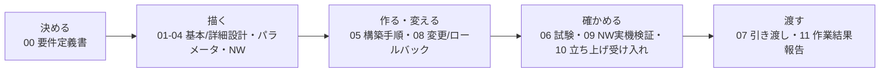

# 案件パック 初心者ガイド（WSUS版）

> **対象**: 「WSUS」「WID」「クライアント側ターゲティング」などの言葉を初めて見る人。[Windows版初心者ガイド](../build-package-windows/beginner-guide.md)や[AD版初心者ガイド](../build-package-ad/beginner-guide.md)は読んだがWSUS版は初めて、という人も対象
> **ゴール**: 12個の文書を読む前に、案件パック全体の地図と、WSUS特有の言い回しを頭に入れる
> **所要時間の目安**: 25〜35分（暗記ではなく、地図を持つことが目的）

このディレクトリ（[`docs/build-package-wsus/`](README.md)）には、要件定義から引き渡しまでの
文書が12個並んでいます。既存のActive Directoryドメイン（`corp.example.test`）へWSUS
（Windows Server Update Services。更新プログラムを集中配信するMicrosoft製サーバー）を
1台追加し、グループポリシーで更新プログラムを集中管理する案件と見立てたものです。構成も
呼び方も[Windows版](../build-package-windows/README.md)・
[AD版](../build-package-ad/README.md)の案件パックと同じですが、この案件パックにしか
出てこない言葉が多く出てきます（WID、コンテンツストア、クライアント側ターゲティング等）。
いきなり[00-requirements.md](00-requirements.md)から読み始めると、そこでつまずきやすく
なっています。

この文書は案件パック本体（成果物）には含まれません。初めて読む人のための
**地図と用語辞典**です。読んだらすぐ本編の[最短レビュー順](README.md#最短レビュー順)
へ進んでください。

## この文書の使い方

**一言でいうと**: 最初に全体の地図をつかみ、あとは分からない言葉が出るたびに引き直す文書です。

1. 「[1. そもそも案件パックとは](#1-そもそも案件パックとは)」で、このパックが何本目で、
   既存のADドメインや他の案件パックとどう関係するのかをつかむ
2. 「[3. 迷わないための5フェーズ](#3-迷わないための5フェーズ)」で12文書を5グループに
   圧縮して覚える
3. 「[4. 12文書カード](#4-12文書カード)」を辞書として使い、読みながら該当カードだけ確認する
4. 分からない言い回しが出たら「[5. 現場用語ブリッジ](#5-現場用語ブリッジ)」を引く
5. 一度に全部を覚えようとしない。困ったらこの文書へ戻ってくればよい

## 1. そもそも案件パックとは

**一言でいうと**: 案件パックとは1件の構築案件の約束事を文書一式にまとめたもので、
本パックはその5本目（案件ID `SM-WSUS-001`）です。

実際の受託案件では、発注者と受注者の間で要件・設計・パラメータ・構築手順・試験・
引き渡しを、口約束ではなく**文書として残す**のが普通です。担当者が変わっても同じ
基準で仕事を続けられるようにするための仕組みです。

このリポジトリにはすでに4本の案件パックがあります。

| 順番 | パック | 案件ID | 何をする案件か |
| --- | --- | --- | --- |
| 1本目 | [Linux版](../build-package/README.md) | `SM-LAB-001` | 中央監視基盤そのものをUbuntu Server 1台に構築 |
| 2本目 | [Windows版](../build-package-windows/README.md) | `SM-WIN-001` | Windows Server（`monitor-win-01`）を監視対象として追加 |
| 3本目 | [AD版](../build-package-ad/README.md) | `SM-AD-001` | 新規ADドメインを`ad-dc01`・`ad-dc02`に構築 |
| 4本目 | [Zabbix版](../build-package-zabbix/README.md) | `SM-ZBX-001` | 独立した第2の監視経路として`zbx-01`にZabbixを構築 |
| **5本目（本パック）** | **WSUS版** | **`SM-WSUS-001`** | **既存ADドメインへWSUSサーバー（`wsus-01`）を追加し集中管理を実現** |

本パックが少しややこしいのは、単に「5番目に作られたから読む」パックではない点です。
2本目・3本目のパックには、いずれも次の一文がパラメータシートや基本設計書に明記されて
いました。

> 「自動更新はWindows Updateから直接。実務ではWSUS/グループポリシー経由の集中管理を
> 推奨するが、本パックの基準ではない」

本パックは、この「推奨だが対象外」として先送りされてきた欠落を、あとから埋めるパックです。
新しい柱を1本増やすのではなく、2本目・3本目が積み残した宿題を片付ける位置づけです。

WSUSとは、ひとことで言うと**「各PCが個別にWindows Updateを取りに行くのではなく、
1台のサーバーがまとめてダウンロードし、承認・配布を一元管理する仕組み」**です。管理者が
「どの更新プログラムを、いつ配布するか」を1か所で決められるようになります。

もう1つ重要なのが依存関係です。本パックは**AD版パックが構築した既存ドメイン
`corp.example.test`に、新規メンバーサーバーとして参加する**ことが前提です。AD版パックが
定義した6OU構成（`_Tier0-Admins`、`Servers`、`Workstations`、`Employees`、`Groups`、
`ServiceAccounts`）をそのまま利用し、`wsus-01`は既定の`Computers`コンテナではなく
`Servers`OUへ移動します。AD版が先に完了していないと本パックは開始できません。Windows版
とは「Windows Serverを1台追加する」形は似ていますが、対象ホスト・案件IDとも別物で、
Windows版はワークグループが既定でWSUSは対象外でした（詳しくは[9.](#9-よくある誤解)）。
Zabbix版・Linux版とは直接の依存関係はありません。

未経験者が最初につまずくのは、「ADのOUとWSUSのコンピューターグループが、なぜ両方
出てくるのか」という点です。次の章で12文書を5つの塊に圧縮します。

## 2. 全体の流れを1つの図で見る

**一言でいうと**: 12個の文書は「決める → 描く → 作る・変える → 確かめる → 渡す」の
5段階に並びます。



この図は、[案件パックのREADME](README.md)にある工程ゲートの図（「要件→設計→構築→
試験→証跡→報告→引き渡し」の7段階）を、初心者向けに5語へ圧縮・再編成したものです。
7段階と5語は1対1には対応せず、「試験」「証跡」の一部を④確かめるへ、「報告」
「引き渡し」を⑤渡すへまとめています。文書番号の00〜11は作られた順であって、実際に
読む順ではありません。読む順は「[6.](#6-読む順とかかる時間の目安)」を使ってください。

## 3. 迷わないための5フェーズ

**一言でいうと**: 12個の文書を5つの動詞にまとめると、どの文書が何のためにあるかを
覚えやすくなります。

**覚え方: 「決める → 描く → 作る・変える → 確かめる → 渡す」**

| フェーズ | 一言 | 含まれる文書 | この段階で答える問い |
| --- | --- | --- | --- |
| ① 決める | 何を作り、何をもって完成とするか決める | [00 要件定義書](#00-要件定義書) | 「ADドメインとの依存関係」「何が対象外か」 |
| ② 描く | 実現方法・具体値・接続範囲を描く | [01基本設計](#01-基本設計書)、[02詳細設計](#02-詳細設計書)、[03パラメータ](#03-パラメータシート)、[04NW設計](#04-ネットワーク設計ipアドレス表) | 「どう作るか」「具体的な値は何か」 |
| ③ 作る・変える | 実際に手を動かし、変更時の戻し方も決める | [05構築手順](#05-構築手順書)、[08変更/RB](#08-変更ロールバック計画兼記録票) | 「どう構築するか」「失敗したらどう戻すか」 |
| ④ 確かめる | 本当にできているかを事実で確認する | [06試験](#06-試験仕様書結果票)、[09NW検証](#09-ネットワーク実機検証手順)、[10受入試験](#10-立ち上げと受け入れ試験) | 「合否の基準は何か」「実際に確認したか」 |
| ⑤ 渡す | 相手に説明し、記録を残して引き渡す | [07引き渡し](#07-引き渡しチェックリスト)、[11報告書](#11-作業結果引き渡し報告書) | 「渡す前に漏れはないか」「予定と実績の差は何か」 |

12文書のうち03・04は②、05・08は③のように、1つのフェーズに複数の文書が含まれる点に
注意してください。文書番号と、このフェーズの順番は一致しません。

> **注意: この「5フェーズ」と、00・01文書に出てくる「フェーズ1／フェーズ2」は別物です**
>
> [00 要件定義書](00-requirements.md)や[01 基本設計書](01-basic-design.md)には、もう1つの
> 「フェーズ」が出てきます。「フェーズ1（ホスト単体構築）」「フェーズ2（中央監視統合）」
> です。あちらは**構築作業そのものを2段階に分ける区切り**です。
>
> フェーズ1は`wsus-01`のドメイン参加からWSUSロール導入、GPOによるクライアント側
> ターゲティング設定、`wsus-01`自身をWSUSクライアントとして自己登録・同期・承認・適用
> まで一巡させる範囲（windows_exporterのローカル導入を含む）です。フェーズ2は、Windows
> 対応Ansible role・Dockerホストと`wsus-01`の実ネットワーク接続やFirewall許可先の未確定・Windows
> 向けログ集約経路という3点が解消するまで`BLOCKED`の範囲で、
> [Windows版](../build-package-windows/00-requirements.md)・
> [AD版](../build-package-ad/00-requirements.md)と全く同じ理由付けです。
>
> この章の「5フェーズ」は**読む順番を覚えるための、この初心者ガイドだけの言葉**で、
> [AD版](../build-package-ad/beginner-guide.md#3-迷わないための5フェーズ)・
> [Windows版](../build-package-windows/beginner-guide.md#3-迷わないための5フェーズ)にも
> 同じ区切りがあります。

[案件パックREADMEの工程図](README.md)は10を「構築・変更」グループ（05・08と同じ）に
置いていますが、10の中身は「構築済みのホストで未確認の項目を試験する」ことが中心なため、
この文書ではあえて④確かめるに分類しています。[初心者向け学習ガイド](../beginner-learning-guide.md)
の「見る→動かす→確認する→壊して直す→説明する」という5語とは中身が別物です。

## 4. 12文書カード

**一言でいうと**: 12個の文書を1枚ずつのカードにした辞書です。

[未経験者向けサーバー構築キーワード集](../server-building-keywords.md)と同じ
「一言 → なぜ必要か → 読むポイント → このパックでの実例」の4点セットです。先に一言だけ
読み、必要になったときに残りを確認してください。

### 00 要件定義書

- **一言**: 「何を作るか」「完成の合格基準」を先に決める文書
- **なぜ必要か**: 3区分（済・自動/済・手動/未実装）と対象外の線引きを最初に合意する
- **読むポイント**: FR/NFR表の「実装・設計先」列、5章「制約と対象外」
- **実例**: `FR-01`（ドメイン参加）が`SUT-01`へ、`FR-08`（中央監視統合）が`SIT-09`
  （`BLOCKED`前提）へつながる

### 01 基本設計書

- **一言**: 要件を「どう実現するか」の全体方針を描く文書
- **なぜ必要か**: フェーズ1／2の境界と、系統A/系統Bという2つのデータベース方式の
  どちらを採るかを合意しておくため
- **読むポイント**: 論理構成図（mermaid）と2.1節「データベース方式」の表
- **実例**: 系統A（WID、名前付きパイプ接続のみ、本パックの既定）と系統B（外部SQL
  Server、SSRS連携可、対象外）の違い

### 02 詳細設計書

- **一言**: コンポーネントごとの実装と「正常性の見分け方」を描く文書
- **なぜ必要か**: 複数の役割が1台に同居する`wsus-01`で、部品単位の正常性を先に
  決めておかないと切り分けられないため
- **読むポイント**: コンポーネント設計表の「正常性確認方法」列
- **実例**: `WsusPool`はアイドルタイムアウト0・キュー長2000・メモリ制限0を
  `Get-IISAppPool`で確認すれば正常

### 03 パラメータシート

- **一言**: OS・ドメイン参加・GPO・WSUSロール・同期・バックアップの具体値を一覧にした表
- **なぜ必要か**: 見落としやすい具体値を1か所にまとめ、実機の値と照合しやすくするため
- **読むポイント**: 「設計値」列と「実績値」列の分離
- **実例**: コンテンツストア`D:\WSUS\WSUSContent`、GPO名`WSUS-Client-Policy`が実績欄へ
  コピーされる設計

### 04 ネットワーク設計・IPアドレス表

- **一言**: どのIP・ポートに誰がどこから接続できるかを決めた文書
- **なぜ必要か**: 到達制御はWindows Defender Firewallの送信元IP制限が正本であり、
  誤ると公開範囲を誤るため
- **読むポイント**: 「`compose.yaml`の`monitoring`ネットワークの制約」節（フェーズ2が
  `BLOCKED`である技術的理由）
- **実例**: `wsus-01`の例示IP`192.0.2.52/24`は`ad-dc01`（`.50`）・`ad-dc02`（`.51`）と
  同一レンジで、重複回避のため`.52`を採用

### 05 構築手順書

- **一言**: `wsus-01`を構築するとき上から順に実行するPowerShell手順書
- **なぜ必要か**: 手順書がないと属人化するため。コンソール初回起動前の初期化を忘れる
  落とし穴もあるため
- **読むポイント**: 「0. 作業前確認」、4節「コンソール初回起動前のコマンドライン初期化」
- **実例**: `Add-Computer`でドメイン参加 → `Move-ADObject`で`Servers`OUへ →
  `Install-WindowsFeature UpdateServices` → `wsusutil.exe postinstall`

### 06 試験仕様書・結果票

- **一言**: 完成判定の「試験問題と模範解答（期待結果）」
- **なぜ必要か**: コマンドと期待結果を先に決めておけば、誰が実行しても同じ基準で
  合否を判定できるため
- **読むポイント**: 冒頭「この文書の読み方」。原本は常に`NOT RUN`、結果は証跡へコピー
- **実例**: `SUT`/`SIT`/`SST`/`SNW`の4系統。`SIT-09`は未実装3点解消まで`BLOCKED`前提

### 07 引き渡しチェックリスト

- **一言**: 作業を依頼者に引き渡す前の最終確認リスト
- **なぜ必要か**: 「試験は全部`PASS`したが秘密値の受け渡し方法を伝え忘れた」のような
  漏れを防ぐため
- **読むポイント**: 冒頭の引き渡し判定表、GPOの対象グループ名とWSUSコンソール側の一致確認
- **実例**: 秘密値そのものではなく「安全な受け渡し・再発行方法」を共有したかという
  チェック項目

### 08 変更・ロールバック計画兼記録票

- **一言**: 変更時に「失敗したらどう戻すか」を先に決めておく文書
- **なぜ必要か**: WSUSには承認ルール・コンピューターグループのエクスポート機能が無く、
  記録漏れが手戻りになるため
- **読むポイント**: 「Go/No-Go条件」と「ロールバック開始条件」。スナップショット復元が主要
- **実例**: GPO変更前に`Backup-GPO`を取得し、想定外の挙動が出たらGPO復元で戻す

### 09 ネットワーク実機検証手順

- **一言**: 実機ネットワークが設計どおりか1項目ずつ確認する手順書
- **なぜ必要か**: 名前解決→経路→待受→通信→Firewallの順で事実を積み上げて確認するため
- **読むポイント**: `SNW-01`〜`09`の番号順。WinRMは通信が暗号化され追加トンネル不要
- **実例**: `SNW-06`でWSUS管理サイトと`/metrics`への到達性、`WsusPool`チューニングを確認

### 10 立ち上げと受け入れ試験

- **一言**: 未確認項目を1台の実サーバーで一気に埋める手順書
- **なぜ必要か**: 再起動後もWSUSサービス・GPO・windows_exporterが正しく戻るかを確かめるため
- **読むポイント**: 立ち上げ環境の選択肢比較表。ライセンス費用が発生し無償VMが使えない点
- **実例**: [Windows版](../build-package-windows/10-host-bringup-and-acceptance.md)同様、
  自動判定スクリプトは存在しないと明記の上で手動確認手順を示す

### 11 作業結果・引き渡し報告書

- **一言**: 予定と実績の差、トラブル、残課題をまとめる文書
- **なぜ必要か**: 試験結果が散らばると「結局終わったのか」が分からなくなるため
- **読むポイント**: 「試験集計」でフェーズ1必須IDの個別結果と合計の一致確認
- **実例**: `SM-WSUS-001`の完了判定欄（`NOT READY`のまま残れば未完了）。`SIT-09`は
  未実装3点の解消条件とともに`BLOCKED`として記録

## 5. 現場用語ブリッジ

**一言でいうと**: 12文書で説明なしに使われる言葉を、日常語で言い換えた対訳表です。

まず[Windows版](../build-package-windows/beginner-guide.md#5-現場用語ブリッジ)・
[AD版](../build-package-ad/beginner-guide.md#5-現場用語ブリッジ)と共通の言葉、続けて
WSUS版だけに出てくる言葉の順に並べます。

| 用語 | 意味 |
| --- | --- |
| 正本 | 「本当の値はどこにあるか」を1か所に決めておく考え方。設計値の正本は本パックのPowerShell手順で、パラメータシートはその索引に過ぎない |
| 原本 | 06・08・11のような「空欄のひな形」文書。実施結果は上書きせず日付付きの証跡（evidence）へコピーする |
| 案件ID | 案件を一意に識別する番号。本パックは`SM-WSUS-001`、依存先のAD版は`SM-AD-001` |
| 設計値 / 実績値 | 設計値は文書・コードから確認できる決めた値、実績値は実機で実測した値。推測で埋めない |
| `FR` / `NFR` | 機能要件 / 非機能要件。FRは「何ができるか」、NFRは「どのくらいの品質・安全性で」 |
| フェーズ1 / フェーズ2 | 構築作業を2段階に区切る言葉。フェーズ1は`wsus-01`単体で完結、フェーズ2は未実装3点解消まで`BLOCKED`。[3.](#3-迷わないための5フェーズ)の5フェーズとは別物 |
| Gate `G0`〜`G5` | 各工程が完了したと認めるための関門 |
| `SUT`/`SIT`/`SST`/`SNW` | 単体・設定確認/構築・結合試験/セキュリティ試験/ネットワーク実機検証の頭文字。接頭辞`S`は末尾"SUS"由来 |
| `PASS`/`FAIL`/`BLOCKED`/`NOT RUN` | 結果の4状態。実測して一致/不一致/前提不足で実行不能/単に未実行 |
| `NOT SET` / `NOT READY` | 値が未決定 / 完了条件が未達（`NOT RUN`の「未実行」とは違う） |
| commit SHA | Gitの変更履歴を一意に指す40桁のID |

### WSUS固有の用語

| 用語 | 一言で言うと |
| --- | --- |
| WSUS | 各PCが個別にWindows Updateを取るのではなく、1台のサーバーがまとめてダウンロードし承認・配布を一元管理する仕組み |
| WID | SQL Serverを別途用意せず使えるWindows同梱の軽量DB機能。本パックの既定（系統A）。名前付きパイプ経由のみでポート不要 |
| 系統A / 系統B | WSUSのデータベース方式の軸。系統A（WID、既定）と系統B（外部SQL Server、対象外） |
| コンテンツストア | 更新プログラム本体を保管する場所。C:とは別のD:ドライブ配下（`D:\WSUS\WSUSContent`） |
| 「このサーバーに保存する」設定 | コンテンツストアへローカル保存する設定。本パックは有効化し、承認操作が実配信を制御できるようにする |
| コンソール初回起動前の初期化コマンド | `wsusutil.exe postinstall`でコンテンツディレクトリを教える作業。忘れるとエラーになるつまずき |
| 8530/8531ポート | WSUS専用サイトのポート。8530がHTTP、8531がHTTPS。IIS既定サイト（80/443）とは別物 |
| クライアント側ターゲティング | GPOの「グループ名」をもとに、クライアントがWSUSコンソール側のコンピューターグループへ自動登録される仕組み |
| 承認ルール | 「この分類・製品・グループなら自動承認してよい」条件。`Critical and Security Updates - Pilot Auto-Approve`は手動実行にとどめる |
| コンピューターグループ | WSUSコンソール内で承認対象を分ける入れ物。**ADのOUとは別概念**（下の囲み参照） |

> **つまずきやすいポイント: ADの「OU」とWSUSの「コンピューターグループ」は別物**
>
> - **OU**: [AD版パック](../build-package-ad/README.md)が定義したADの入れ物。`wsus-01`は
>   `Servers`OUへ配置し、GPOの配布先を決めます。
> - **コンピューターグループ**: WSUSコンソール専用の入れ物。`Servers`の下に`Pilot`を作り、
>   更新プログラムの承認・配布の単位を決めます。
>
> 名前が「`Servers`」で揃っているのは**意図した設計**です。GPOの「クライアント側
> ターゲティングを有効にする」で対象グループ名を`Servers`にすると、`wsus-01`は起動時に
> この名前を頼りにコンソール側の`Servers`グループへ自動登録されます。OUを移動しただけ
> ではコンピューターグループへ登録されず、逆も同様です。

## 6. 読む順とかかる時間の目安

**一言でいうと**: 番号順ではなく、この表の順に8ステップで読むと理解が早くなります。

[案件パックREADMEの「最短レビュー順」](README.md#最短レビュー順)を、初心者向けに時間の
目安付きで書き直したものです。

| 順番 | 文書 | 目安時間 | この段階の完了条件 |
| --- | --- | ---: | --- |
| 0 | この初心者ガイド | 25分 | 5フェーズの覚え方とWSUS固有の用語ブリッジを一通り眺めた |
| 1 | [00 要件定義書](00-requirements.md) | 15分 | FR・NFRのどれか1つを選び、対応する試験IDを言える |
| 2 | [01 基本設計書](01-basic-design.md) | 10分 | 系統A（WID）と系統B（外部SQL Server）の違いを言える |
| 3 | [03 パラメータシート](03-parameter-sheet.md) | 10分 | 「設計値」と「実績値」の違いを説明できる |
| 4 | [05 構築手順書](05-build-procedure.md) | 20分 | ドメイン参加→ロール導入→コンテンツ初期化→GPO設計の順を言える |
| 5 | [06 試験仕様書・結果票](06-test-specification.md) | 15分 | `SIT-09`がなぜ`BLOCKED`前提かを説明できる |
| 6 | [09 ネットワーク実機検証手順](09-network-validation-procedure.md) | 10分 | 障害切り分けの5段階の順を言える |
| 7 | [11 作業結果・引き渡し報告書](11-work-result-report.md) | 10分 | 「文書が揃っている」ことと「引き渡し完了」の違いを説明できる |
| 8 | [検証証跡台帳](../evidence/README.md) | 10分 | 実測済みと未実測の境界を具体例で説明できる |

残りの02・04・07・08・10は、上の8ステップを終えてから[案件パックREADME](README.md#成果物一覧)
の一覧に沿って読んでください。

## 7. 覚えるための1分チェック

**一言でいうと**: 読んだ内容が身についたかを、7問で自己採点します。

すべて、この文書を読み返さずに答えられるかを確認する設問です。

1. 12文書を5つの動詞に圧縮すると何になりますか。
2. `NOT RUN`と`NOT SET`の違いは何ですか。
3. フェーズ1とフェーズ2の違いは何ですか。
4. 本パックが「対象外」とする項目を、3つ挙げられますか。
5. フェーズ2が`BLOCKED`である技術的な理由を、`compose.yaml`のどの設定に絡めて
   説明できますか。
6. ADの「OU」とWSUSの「コンピューターグループ」の違いを言えますか。
7. なぜこのパックが必要になったのか、Windows版・AD版パックとの関係で説明できますか。

<details>
<summary>解答例</summary>

1. 決める → 描く → 作る・変える → 確かめる → 渡す
2. `NOT RUN`は「まだ実行していない」、`NOT SET`は「値そのものをまだ決めていない」
3. フェーズ1は`wsus-01`単体で自己登録・同期・承認・適用まで一巡させる範囲。フェーズ2は
   中央監視統合の範囲で、3点の未実装事項解消まで`BLOCKED`
4. 複数クライアントでの大規模検証、WSUS通信のHTTPS化、系統B（外部SQL Server）への
   移行、レプリカ/ダウンストリーム構成、SSRS連携など（3つ挙げられれば十分）
5. Prometheusは`monitoring`（`internal: true`）に加えて`host-access`（internal指定なしのbridge）にも
   接続されておりNAT egress自体は持つが、Dockerホストと`wsus-01`を実際に同一ネットワークセグメントへ
   接続した実績、およびwindows_exporterのFirewall許可先（Dockerホストの実IP）の確定が無いため
6. OUはAD側でGPOの配布先を決め、コンピューターグループはWSUSコンソール専用で承認・
   配布の単位を決める。名前（`Servers`）を意図的に揃えて連携させている
7. Windows版・AD版パックには「自動更新はWindows Updateから直接。実務ではWSUS/
   グループポリシー経由の集中管理を推奨するが、本パックの基準ではない」という一文が
   あり、本パックはこの「推奨だが対象外」の欠落を埋めるパックである

</details>

## 8. 面接で聞かれたら

**一言でいうと**: このパックを口頭で説明するときの型です。

空欄を自分の言葉で埋めて、声に出して説明できるか確認してください。

```text
このポートフォリオでは、Linux版（SM-LAB-001）、Windows版（SM-WIN-001）、AD版
（SM-AD-001）、Zabbix版（SM-ZBX-001）に続く5本目の案件パックとして、[SM-WSUS-001]
という架空の構築案件を作りました。Windows版・AD版には「自動更新はWindows Updateから
直接。実務ではWSUS/グループポリシー経由の集中管理を推奨するが、本パックの基準ではない」
という一文があり、この[推奨だが対象外]とされてきた欠落を埋めるパックです。既存のAD
ドメイン（corp.example.test）へ新しいメンバーサーバー（wsus-01）を参加させ、WSUS
ロールを構築しました。

データベース方式は[WID]を採用し、外部SQL Serverを使う系統Bは差分のみ記載して対象外と
しました。構築は[フェーズ1（ホスト単体構築）]と[フェーズ2（中央監視統合）]の2段階に
分け、フェーズ1はwsus-01自身を[自己登録・同期・承認・適用まで一巡]させる範囲で完結
します。フェーズ2は[Windows対応Ansible roleの不在、Dockerホストとwsus-01の実ネットワーク接続や
windows_exporterのFirewall許可先が未確定であること、Windows向けログ集約経路の不在]の
3点が解消するまで[BLOCKED]です。
GPOの自動更新ポリシーは[オプション3（自動ダウンロードを行い、インストールの通知を
行う）]を選び、無人再起動によるサービス影響を避けました。自動承認ルールも
[スケジュール化はせず手動実行にとどめる]ことで意図しない自動配布を避けています。

未実施の項目は[NOT RUN]のまま残し、[文書が揃っていることと、実際に構築・検証が完了
したことは別の状態である]という考え方に基づいています。
```

## 9. よくある誤解

**一言でいうと**: 初心者がとくに取り違えやすい6点を、誤解と実際の対で並べます。

| 誤解 | 実際 |
| --- | --- |
| WSUS版もWindows版と同じく「ワークグループ／ADドメイン参加」で系統が分かれる | 本パックの系統A／系統BはWSUSのデータベース方式（WID/外部SQL Server）の軸であり、最初からADドメイン参加が前提 |
| ADの「OU」とWSUSの「コンピューターグループ」は同じもの | 別の概念である。OUはAD側でGPOの配布先を決め、コンピューターグループはWSUSコンソール専用で承認・配布の単位を決める。詳しくは[5.](#5-現場用語ブリッジ)の囲みを参照 |
| WSUS管理サイトはIISの既定サイト（80/443）で公開される | 既定サイトとは別の専用サイトで、既定ポートは8530（HTTP）/8531（HTTPS）である |
| コンテンツストア用のディスクさえ確保すれば、コンソールはすぐ使い始められる | コンソールを初めて開く前に`wsusutil.exe postinstall`でコンテンツディレクトリを初期化する必要がある |
| 自動承認ルールを作れば、あとは自動的に承認が進む | 本パックの自動承認ルールはスケジュール化せず手動実行にとどめる、無人承認を避ける安全側の設計である |
| 12文書が揃えば構築完了 | 文書が「作成済み」であることと、実ホストで試験が`PASS`して引き渡しが完了したことは別の状態。[案件パックREADME](README.md)の引き渡し判定は`NOT READY`のまま |

## 次に読む文書

**一言でいうと**: この文書を読み終えたら、次は案件パック本体のREADMEへ進んでください。

- 案件パック本体: [案件パックREADME（最短レビュー順・成果物一覧・工程ゲート）](README.md)
- 依存元のパック: [AD版案件パック](../build-package-ad/README.md)（`SM-AD-001`。既存ADドメインの正本）
- 似た形の2本目のパック: [Windows版案件パック](../build-package-windows/README.md)（`SM-WIN-001`）
- 用語をさらに詳しく: [未経験者向けサーバー構築キーワード集](../server-building-keywords.md)
- ここへ来る前の基礎: [初心者向け学習ガイド](../beginner-learning-guide.md) / [一本道ラーニングパス](../learning-path.md)
- 実測と未実施の境界: [検証証跡台帳](../evidence/README.md)
