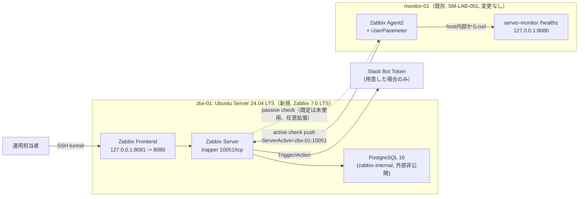

# 基本設計書

> 💡 **初めて読む方へ**: この文書は要件を「どう実現するか」の全体方針を描く文書です。初めての場合は先に[案件パック 初心者ガイド](beginner-guide.md#01-基本設計書)で全体の地図を確認してください。

要求と受け入れ条件は[要件定義書](00-requirements.md)を正本とし、本書ではその実現方式を定義します。

## 1. 目的

新規の監視サーバーホスト `zbx-01` へ **Zabbix 7.0 LTS** による監視基盤一式（DB・Server・Frontend）を安全かつ再現可能に構築し、既存の監視対象ホスト `monitor-01`（案件ID `SM-LAB-001`、変更なし）を、既存のPrometheus/Grafana/Loki/Alertmanager基盤とは独立した2本目の監視経路で監視、異常検知、一次切り分け、復旧までを検証できる環境を提供します。「Prometheus/Grafana一本で監視設計ができる」だけでなく、日本のインフラ求人で頻出するZabbixでも同種の監視基盤を設計・構築できることを示すポートフォリオ上の狙いがあります。

## 2. 対象範囲

| 対象 | 内容 |
| --- | --- |
| OS(zbx-01) | Ubuntu Server 24.04 LTS、新規の検証用VM1台 |
| 配備 | Docker Compose（`compose.zabbix.yaml`）による手動構築が中心。専用Ansible roleは未実装 |
| 監視サーバー | Zabbix Server(`zabbix/zabbix-server-pgsql:alpine-7.0.29`)、Zabbix Frontend(`zabbix/zabbix-web-nginx-pgsql:alpine-7.0.29`)、PostgreSQL(`postgres:16-alpine`) |
| 監視対象 | `monitor-01`（既存、変更なし）。Zabbix Agent2のactive checkと、UserParameterによるアプリ死活監視を追加設定 |
| 通知 | Slack Bot Token(`chat:write`)を使う組み込みSlack Media type(Trigger/Action経由) |
| 運用 | PostgreSQLの日次バックアップ、ランブック、変更管理、Agent停止復旧演習(D-Z1) |

対象外は、複数ホスト冗長化、24時間有人運用、SSO、実組織の個人情報、商用SLA、既存中央監視基盤(`SM-LAB-001`)本体の変更、専用Ansible roleによる自動プロビジョニングです。

## 3. 論理構成

zbx-01上の2つの公開ポートは、bindの考え方が異なります。Frontendは`127.0.0.1`限定でSSH tunnel経由の利用のみを前提とし（既存パックと同じ「管理UIは外部公開しない」方針）、trapper(10051/tcp)はmonitor-01のAgent2がactive checkでpushしてくる唯一の監視系ポートのため、loopback限定にはできません。ゆるくbindしつつ、DockerがPublishしたportには効かないUFWではなく`DOCKER-USER` iptables chainで送信元（monitor-01のIPのみ）を絞る設計とし、[ネットワーク設計・IPアドレス表](04-network-ip-plan.md)で両者の違いを明示します。

server-monitorアプリの`/healthz`は[Linux版ネットワーク設計](../build-package/04-network-ip-plan.md)によりloopback限定で外部非公開のため、zbx-01のZabbix Serverはネットワーク越しに直接probeできません。そこでZabbixの「web監視シナリオ」は使わず、monitor-01自身のAgent2にUserParameter(`service_monitor.healthz`)を追加し、ホスト内部からcurlする設計とすることで、既存の「管理UIを外部公開しない」方針を崩さずに死活監視を実現します。

## 4. 非機能要件確認方法

| 分類 | 要件 | 確認方法 |
| --- | --- | --- |
| 再現性 | 未構築のzbx-01へ`compose.zabbix.yaml`を適用し、全コンテナがhealthy/runningになる | ZIT-01 |
| 冪等性 | 同一コマンドを2回目実行しても不要な再作成が発生しない | ZIT-02 |
| セキュリティ | Zabbix FrontendはloopbackのみでSSH tunnel経由の利用を前提とする | ZST-01 |
| セキュリティ | 既定管理者アカウント(Admin/zabbix)のパスワードを初回ログイン直後に変更する | ZST-02 |
| 最小権限 | DBパスワード・Slack bot token等の秘密値をDocker secretsファイルで注入し、実値をGitで追跡しない | ZST-03 |
| ネットワーク | trapper port(10051/tcp)はmonitor-01のIPのみ許可する | ZST-04 |
| 可観測性 | Agent停止・閾値超過・アプリ死活異常をSeverityに応じて通知に関連付け、一次切り分けできる | ZIT-06、ZIT-07 |
| 復旧性 | D-Z1演習（`systemctl stop zabbix-agent2`→検知→`start`→復旧）でRTOを記録する | ZIT-07 |
| 保守性 | 変更前後のcommit・設定、検証、ロールバック条件と結果を記録する | [08-change-rollback-plan.md](08-change-rollback-plan.md) |
| 追跡性 | 実行日時、環境、commit SHA、コマンド、実出力、判定を証跡へ残す | 全必須試験 |
| 完了管理 | 計画対実績、試験集計、設計差異、障害、未実施、受領可否を1件の報告へまとめる | [11-work-result-report.md](11-work-result-report.md) |

## 5. 可用性と保存期間

- 単一のzbx-01ホスト構成のため、ホスト障害時の無停止継続は保証しません。
- 既存の中央監視基盤（`SM-LAB-001`）側のPrometheus/Loki保持期間は変更しません。[Linux版基本設計書](../build-package/01-basic-design.md)のとおり、Prometheusは35日、Loki は30日を初期値とします。
- ZabbixのDB（PostgreSQL）バックアップは日次03:45（Asia/Tokyo）、保持14世代を初期値とします。既存server-monitorのbackupが03:30のため、実行時刻をずらす設計です。復元できることは別ボリューム/別DBへの`pg_restore`と、host数・item数の一致確認（ZIT-08）で確かめます。
- 本パック自体に対する可用性・latencyのSLO数値目標は現時点で`NOT SET`です。監視対象はmonitor-01の死活・メトリクスであり、Zabbix自体のSLOは本案件の範囲外とします。

## 6. 受け入れ条件

[試験仕様書・結果票](06-test-specification.md)の必須試験（`ZUT-01`〜`ZUT-03`、`ZIT-01`〜`ZIT-05`、`ZIT-07`〜`ZIT-09`、`ZST-01`〜`ZST-04`）がすべて`PASS`し、実行日時、commit SHA、環境、主要ログ、発見した問題が証跡として保存され、[作業結果・引き渡し報告書](11-work-result-report.md)の差異・残存リスク・受領判定が記入されていることを受け入れ条件とします。`ZIT-06`（Slack実配信）はbot tokenと受信先channelを用意した場合のみ試験し、未用意の環境では`BLOCKED`となり得ますが、Trigger発火までは必須です。
