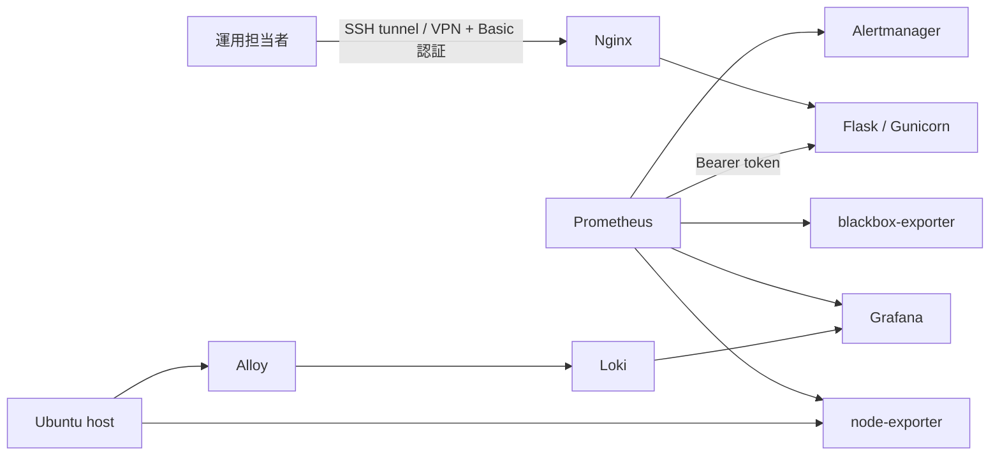

# 基本設計書

要求と受け入れ条件は [要件定義書](00-requirements.md)を正本とし、本書ではその実現方式を定義します。

## 1. 目的

小規模な Linux サーバーへ監視ダッシュボードと監視・ログ基盤を安全かつ再現可能に構築し、異常検知、一次切り分け、復旧までを検証できる環境を提供します。

## 2. 対象範囲

| 対象 | 内容 |
| --- | --- |
| OS | Ubuntu Server 24.04 LTS（22.04 LTS も構成コードの対象） |
| 配備 | Ansible、Docker Engine、Docker Compose |
| Web | Nginx、Flask、Gunicorn |
| 監視 | Prometheus、node-exporter、blackbox-exporter、Grafana、Alertmanager |
| ログ | Grafana Alloy、Loki |
| 運用 | バックアップ、ランブック、変更管理、復旧演習 |

対象外は、複数ホスト冗長化、24 時間有人運用、SSO、実組織の個人情報、商用 SLA です。

## 3. 論理構成

## 4. 非機能要件

| 分類 | 要件 | 確認方法 |
| --- | --- | --- |
| セキュリティ | UI と metrics の認証を分離し、秘密値をリポジトリへ保存しない | 認証試験、secret scan |
| 最小権限 | アプリコンテナを非 root で実行する | `docker inspect` |
| 再現性 | 新規ホストを Ansible で構築できる | `site.yml` 実行 |
| 冪等性 | 同一構成を再適用して不要な変更を発生させない | 2 回目 `changed=0` |
| 可観測性 | メトリクス、ログ、外形監視を一画面から追跡できる | Grafana と LogQL の試験 |
| 復旧性 | プロセス停止から復旧し、RTO を記録できる | D-1 演習 |
| 保守性 | 変更目的、事前確認、ロールバック、結果を PR に残す | PR テンプレート確認 |

## 5. 可用性と保存期間

- 単一ホスト構成のため、ホスト障害時の無停止継続は保証しません。
- Prometheus は 35 日、Loki は 30 日を初期値とします。
- ラボ内 SLO は可用性 99.5% / 30 日、`/healthz` p95 500 ms 未満です。
- バックアップは日次、14 世代を初期値とし、復元できることを演習で確認します。

## 6. 受け入れ条件

[試験仕様書・結果票](06-test-specification.md)の必須試験がすべて `PASS` し、実行日時、commit SHA、環境、主要ログ、発見した問題が証跡として保存され、[作業結果・引き渡し報告書](11-work-result-report.md)の差異・残存リスク・受領判定が記入されていることを受け入れ条件とします。

