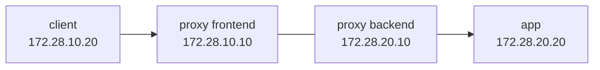

# ネットワーク設計・IP アドレス表

## 1. 本体構成

本番相当の入口は VPN または SSH tunnel を前提とし、Compose の管理 UI は loopback のみに bind します。外部から直接 3000 / 9090 / 9093 / 3100 へ接続させません。

| Zone | CIDR / interface | 主な通信 | 制御 |
| --- | --- | --- | --- |
| 管理端末 | 組織で割り当て | SSH 22/tcp | productionでは上流FW / VPNまたはsource指定UFW ruleで管理元 CIDR のみ |
| Ubuntu host | 環境で割り当て | SSH、更新、通知 | UFW default deny incoming。repository既定のSSH ruleは全送信元へのrate limitであり、CIDR制限ではない |
| Compose network | Docker 管理 | service 間通信 | host へ不要な port を公開しない |
| loopback | `127.0.0.1/8` | UI、Grafana、Prometheus 等 | ローカル / tunnel のみ |

## 2. 二セグメント障害ラボ

通信経路と障害切り分けの実演には [`labs/network-troubleshooting`](../../labs/network-troubleshooting/README.md) を使います。

| Segment | CIDR | Gateway | Container / IP |
| --- | --- | --- | --- |
| frontend | `172.28.10.0/24` | Docker bridge | proxy `.10`、client `.20` |
| backend | `172.28.20.0/24` | Docker bridge | proxy `.10`、app `.20` |

想定障害は proxy を backend network から切断するものです。`curl`、`ip route`、`getent hosts`、`docker network inspect` を用いて、DNS、経路、所属ネットワークの順に原因を絞ります。

## 3. 実環境で確認する項目

実行順、期待結果、採録方法は [ネットワーク実機検証手順](09-network-validation-procedure.md)を正本とします。二セグメント障害ラボの成功を、実 VM の NIC / UFW 検証の代用にはしません。

- `ip -br addr` で interface と CIDR を確認
- `ip route` で default gateway と経路を確認
- `ss -lntup` で listen address を確認
- `getent hosts` / `dig` で名前解決を確認
- `curl -v` で HTTP の接続先と status を確認
- `tcpdump -nn -i any port 8080` で必要時だけ packet を確認
- UFW と cloud security group の許可範囲が一致することを確認

repository既定のUFWはSSH 22/tcpを`LIMIT`で開けますが、送信元CIDRは絞りません。
管理元CIDR限定が受入条件の環境では、上流security group / VPNの制限を採録するか、
source指定UFW ruleを案件変数として設計・実装してから引き渡します。rate limitをsource制限の証跡にはしません。

ephemeral runner内の結果は[2026-08-22 E2E証跡](../evidence/2026-08-22-full-stack-e2e.md)に記録済みです。
独立した引き渡し対象host/管理端末の結果は、
[結果票テンプレート](../evidence/templates/network-host-validation.md)から日付付きevidenceを作成するまで`NOT RUN`です。

