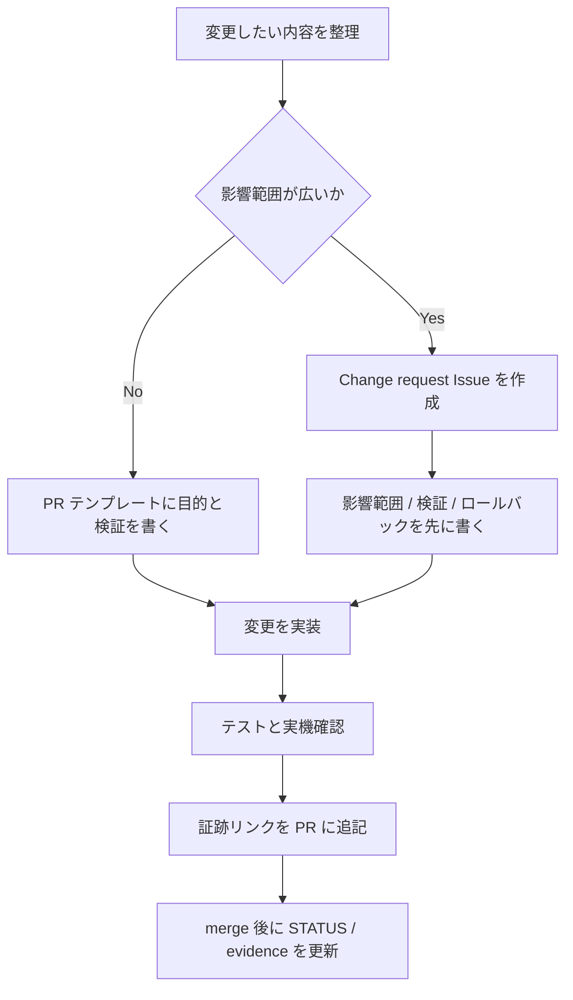

# 変更管理ミニ運用

このリポジトリでは、個人ラボでも「変更理由、影響、確認、ロールバック、証跡」を残す。
ITIL の Change Enablement を大きな会議体として再現するのではなく、PR と Issue で
小さく回せる運用に落とし込む。

---

## 対象

| 種別 | 例 | 記録方法 |
| --- | --- | --- |
| 標準変更 | ドキュメント修正、Dashboard 表示調整、テスト追加 | PR テンプレートに確認結果を書く |
| 通常変更 | Alertmanager、Prometheus rules、Nginx、Compose、Ansible、Terraform の変更 | Change request Issue を作り、PR と紐づける |
| 緊急変更 | 監視停止、重大な設定ミス、秘密値漏えいの修正 | Issue に時系列を残し、事後に PR / 証跡へ反映する |

---

## 変更フロー

---

## PR で必ず残す項目

| 項目 | 内容 |
| --- | --- |
| 目的 | なぜ変更するか。採用ポートフォリオ上の意図も含める |
| 影響範囲 | UI、Compose、監視、Ansible、Terraform、ドキュメント |
| 検証 | 実行したコマンド、画面確認、ログ、スクリーンショット |
| ロールバック | どの設定を戻し、戻した後に何を確認するか |
| 証跡 | `docs/evidence/`、`docs/drills/logs/`、Issue、PR のリンク |

---

## 変更前チェック

- [ ] 秘密値、公開 IP、AWS account ID、個人名、webhook URL を含めない。
- [ ] 「実装済み」「実測済み」「設計のみ」を混同しない。
- [ ] 変更が監視や通知に影響する場合、対応するランブックを確認する。
- [ ] 戻し方が 1 文で説明できない変更は、Change request Issue を作る。

---

## 変更後チェック

| 領域 | 最小確認 |
| --- | --- |
| Python / Flask | `pytest` |
| Compose | `docker compose config --quiet` |
| Prometheus / Alertmanager | `promtool check config`、`promtool check rules`、`amtool check-config` |
| Loki / Alloy | `loki -verify-config`、`alloy validate` |
| Ansible | `ansible-lint`、`ansible-playbook --syntax-check`、必要に応じて `molecule test` |
| Terraform | `terraform fmt -check`、`terraform validate`、`tfsec`、`checkov` |
| 証跡採録 | `docs/evidence/README.md` または `docs/drills/logs/` へリンク |

---

## 運用上の境界

- 個人ラボのため、CAB や承認者ロールは設けない。
- ただし、AWS 費用が発生する変更、公開範囲が変わる変更、秘密値を扱う変更は
  Change request Issue を作ってから実行する。
- 緊急変更は先に止血し、後から時系列・原因・再発防止を記録する。

---

## 関連

- [検証証跡台帳](evidence/README.md)
- [ローカル証跡採録ガイド](evidence/local-evidence-quickstart.md)
- [インシデント周知テンプレ](incident-comms.md)
- [停止時ランブック](runbooks/service-down.md)
