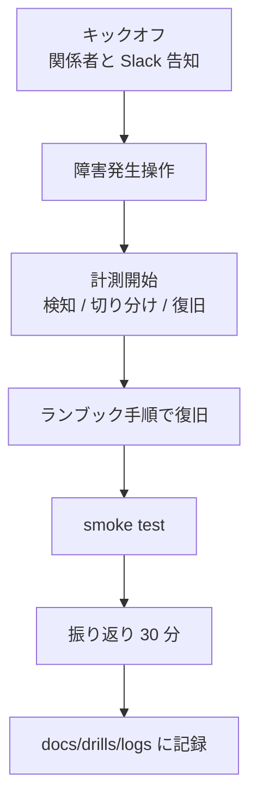

# 復旧演習一覧

設計書 §5 のシナリオを「実行可能なドリル」として落とし込む。各シナリオはランブックと
1 対 1 で対応し、演習ログは [`docs/drills/logs/`](logs/) に履歴を残す。

## 1. シナリオ表

| # | シナリオ | 頻度 | 想定時間 | 環境 | 詳細 |
| --- | --- | --- | --- | --- | --- |
| D-1 | プロセスダウン → 自動復旧確認 | 月次 | 15 分 | ローカル Docker | [D-1-process-down.md](D-1-process-down.md) |
| D-2 | ホスト障害 → 別ホストに復元 | 四半期 | 2 時間 | AWS staging（環境待ち） | [roadmap/D-2-host-failure.md](../roadmap/D-2-host-failure.md) |
| D-3 | 操作ミス（メトリクス削除）→ スナップから復元 | 四半期 | 1 時間 | AWS staging | （別 PR で追加予定）|
| D-4 | AZ 障害シミュレーション | 半期 | 3 時間 | AWS staging | （v2.x で追加）|
| D-5 | リージョン障害（Terraform 別リージョン再適用） | 年次 | 半日 | 別 AWS account | （v2.x で追加）|

凡例:

- **頻度**: 通常運用での実施目安。RTO 改善目標として参照する。
- **環境**: 本番影響を避けるため、原則 dev / staging で実施する。本番で実施する
  場合は事前に SLO レビュー会で承認する。

## 2. 共通の進行

詳細手順とテンプレートは次を参照する。

| 項目 | ドキュメント |
| --- | --- |
| Slack 周知 / 状態遷移 | [docs/incident-comms.md](../incident-comms.md) |
| 演習ログのテンプレ | [docs/drill-template.md](../drill-template.md) |
| スナップショット命名規則 | [docs/backup-naming.md](../backup-naming.md) |

## 3. 推奨実施タイミング

| シナリオ | 目安 |
| --- | --- |
| D-1 | 毎月第 1 月曜 10:00 JST（業務開始直後の集中力ある時間帯）|
| D-2 | 四半期初の月 / 月内のメンテナンス枠 |
| D-3 | D-2 と隔週で実施 |
| D-4 | 上半期 / 下半期の最初 |
| D-5 | 年初の事業計画期間中 |

## 4. 完了条件と紐付け

- 「実機で 1 回成功」したシナリオは DoD の対応項目をチェックする
  （[docs/backup-restore.md](../backup-restore.md) の演習履歴セクション）。
- 演習で見つかった改善アクションは、必ず GitHub Issue or PR に紐付け、月次レビューで
  クローズ状況を確認する。
