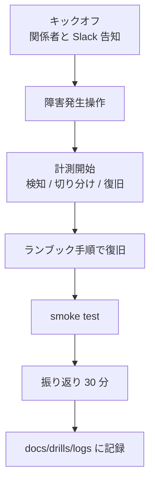

# 演習一覧

演習ログは [`docs/drills/logs/`](logs/) に履歴を残す。

演習は 2 系統ある。

- **B シリーズ（構築演習）**: 手元で今すぐ実行できる。スクリプトが実行結果から
  証跡を自動生成するので、手で PASS を書き込む余地がない。
- **D シリーズ（復旧演習）**: 設計書 §5 のシナリオ。D-1 以外は環境待ち。

## 0. 構築演習（B シリーズ・実行可能）

| # | 演習 | 対象 | 所要 | 環境 | 実行 |
| --- | --- | --- | --- | --- | --- |
| B-1 | ディスク設計・LVM 拡張 | LVM、ファイルシステム、online 拡張、fstab | 10 分 | Linux + root（loop device） | [`scripts/labs/lvm-drill.sh`](../../scripts/labs/lvm-drill.sh) |
| B-2 | 3 層構成の障害切り分け | Web / AP / DB の層別 health、経路断との区別 | 10 分 | Docker | [`labs/three-tier/run-drill.sh`](../../labs/three-tier/run-drill.sh) |
| B-3 | DB バックアップ・復元 | `pg_dump` / `pg_restore`、RTO / RPO 実測 | 10 分 | Docker | [`labs/three-tier/run-restore-drill.sh`](../../labs/three-tier/run-restore-drill.sh) |
| B-4 | L2 / L3 切り分け | 静的ルート、`ip_forward`、802.1Q VLAN | 10 分 | Docker + NET_ADMIN | [`labs/routing/run-drill.sh`](../../labs/routing/run-drill.sh) |

いずれも `docs/drills/logs/<日付>-B-<n>.md` に、実施日時・環境・commit SHA・
判定表・**確認していないこと**を含む証跡を書き出す。判定は script が
期待値と実測値を比較した結果で、1 件でも FAIL があれば終了コードが 0 にならない。

B-1 は `losetup` と device-mapper を使うため、通常の Linux kernel を持つ環境
（物理 PC、VirtualBox / Hyper-V の VM）で実行する。device-mapper の無い
コンテナ環境では、実行前の検査で理由を表示して停止する。

### この 4 本の現在の状態

| | 状態 |
| --- | --- |
| B-2 | ✅ 実コンテナで実行済み（[証跡](logs/2026-08-24-B-2.md)、9 PASS / 0 FAIL） |
| B-3 | ✅ 実 PostgreSQL で実行済み（[証跡](logs/2026-08-24-B-3.md)、7 PASS / 0 FAIL。RTO 0.149 秒） |
| B-4 | ✅ 実行済み（[証跡](logs/2026-08-24-B-4.md)、6 PASS / 0 FAIL / 3 SKIP-ENV） |
| B-1 | ❌ 未実行。device-mapper が要る。安全装置テストは実行して 7/7 PASS |

### B-4 のトポロジは Docker の network を使わない

当初は Docker の bridge network を 3 つ並べていたが、実行を試みて成立しない
ことが分かった。

1. router に各セグメントの `.1` を要求していたが、Docker は既定で bridge 自身へ
   `.1` を割り当てる。`Address already in use` になる。
   **この演習は一度も起動できていなかった。**
2. Docker は endpoint ごとに
   `iptables -t raw -A PREROUTING -d <IP> ! -i <その bridge> -j DROP` を入れる。
   別セグメントから router 宛に来たパケットは **FORWARD へ届く前に落ちる**。
3. コンテナ内の `/proc/sys` が read-only で `ip_forward` を切り替えられない。

そこで bridge・veth・network namespace を自分で組む形
（[`labs/routing/topology.sh`](../../labs/routing/topology.sh)）に変えた。
Docker のネットワーク機能を使わないので上の 3 点はいずれも当てはまらず、
「ネットワークを自分で組む」という演習の目的にも合う。権限は privileged な
コンテナ 1 台へ閉じてあり、後始末は `down` で済む。

VLAN 部（`B4-L2-02`〜`04`）は kernel が `CONFIG_VLAN_8021Q` を有効にして
いる環境でのみ実行できる。無効な環境では `SKIP-ENV`（未検証）として記録する。

安全装置そのものの検証は [`scripts/labs/storage-guard-test.sh`](../../scripts/labs/storage-guard-test.sh)
が担当する（存在しないデバイス、`/` への mount、既存署名のあるディスクなどを
与えて、LVM 操作の手前で止まることを確認する）。

## 1. 復旧演習（D シリーズ）

| # | シナリオ | 頻度 | 想定時間 | 環境 | 詳細 |
| --- | --- | --- | --- | --- | --- |
| D-1 | プロセスダウン → 自動復旧確認 | 月次 | 15 分 | ローカル Docker | [D-1-process-down.md](D-1-process-down.md) |
| D-2 | ホスト障害 → 別ホストに復元 | 四半期 | 2 時間 | AWS staging（環境待ち） | [roadmap/D-2-host-failure.md](../roadmap/D-2-host-failure.md) |
| D-3 | 操作ミス（メトリクス削除）→ スナップから復元 | 四半期 | 1 時間 | AWS staging | **未実装**（AWS 環境待ち）|
| D-4 | AZ 障害シミュレーション | 半期 | 3 時間 | AWS staging | **未実装**（AWS 環境待ち）|
| D-5 | リージョン障害（Terraform 別リージョン再適用） | 年次 | 半日 | 別 AWS account | **未実装**（AWS 環境待ち）|

D-3 以降は AWS 環境が用意できていないため未実装。手順書もスクリプトも無い。
「論理バックアップからの復元」という考え方の実測は B-3 が担当している
（対象は PostgreSQL であって Prometheus のスナップショットではない）。

凡例:

- **頻度**: 通常運用での実施目安。RTO 改善目標として参照する。
- **環境**: 本番影響を避けるため、原則 dev / staging で実施する。本番で実施する
  場合は事前に SLO レビュー会で承認する。

## 2. 共通の進行

詳細手順とテンプレートは次を参照する。

| 項目 | ドキュメント |
| --- | --- |
| Slack 周知 / 状態遷移 | [docs/incident-comms.md](../incident-comms.md) |
| 演習ログのテンプレ | [docs/drill-template.md](../drill-template.md) |
| スナップショット命名規則 | [docs/backup-naming.md](../backup-naming.md) |

## 3. 推奨実施タイミング

| シナリオ | 目安 |
| --- | --- |
| B-1 〜 B-4 | 環境を作り直したとき、および関連コードを変更した PR |
| D-1 | 毎月第 1 月曜 10:00 JST（業務開始直後の集中力ある時間帯）|
| D-2 | 四半期初の月 / 月内のメンテナンス枠 |
| D-3 | D-2 と隔週で実施 |
| D-4 | 上半期 / 下半期の最初 |
| D-5 | 年初の事業計画期間中 |

## 4. 完了条件と紐付け

- 「実機で 1 回成功」したシナリオは DoD の対応項目をチェックする
  （[docs/backup-restore.md](../backup-restore.md) の演習履歴セクション）。
- 演習で見つかった改善アクションは、必ず GitHub Issue or PR に紐付け、月次レビューで
  クローズ状況を確認する。
