# lab-base01 添付画像一覧

[作業結果・試験記録へ戻る](../../2026-09-08-lab-base01-initial-build.md)

2026-09-07〜08の対話で本人が提供したスクリーンショットを、バイト列を変更せずコピーしたもの。
E番号は本報告書の参照番号であり、全件の厳密な時系列ではない。画像の表示時刻はゲストやホストの時計に依存する。
[元ファイル名・サイズ・SHA-256の対応](manifest.json) / [SHA-256一覧](SHA256SUMS.txt)

画像にはラボのプライベートIP、MACアドレス、Windowsのホスト名・ユーザー名、公開鍵の指紋が含まれる。
パスワード・パスフレーズ・秘密鍵本文は掲載しない。画面外の操作は画像単独では証明できない。
ハッシュはコピーの同一性を確認するためのもので、撮影時刻や操作主体を第三者認証するものではない。

## E01 初期OS・ユーザー・ホスト名・DHCP・SSHサービスinactive

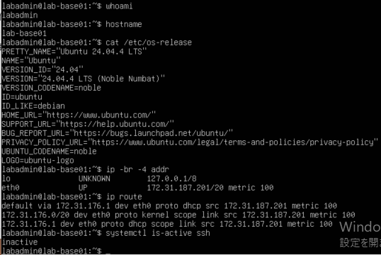

## E02 SSH socket active、22番待受、eth1未設定

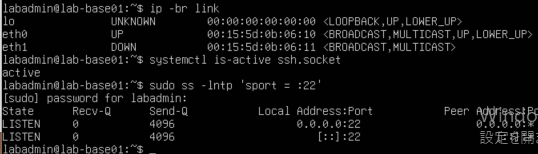

## E03 eth1固定IPとeth0デフォルト経路

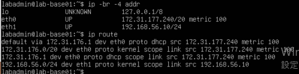

## E04 公開鍵登録後の鍵認証成功。途中にパスワード再入力あり

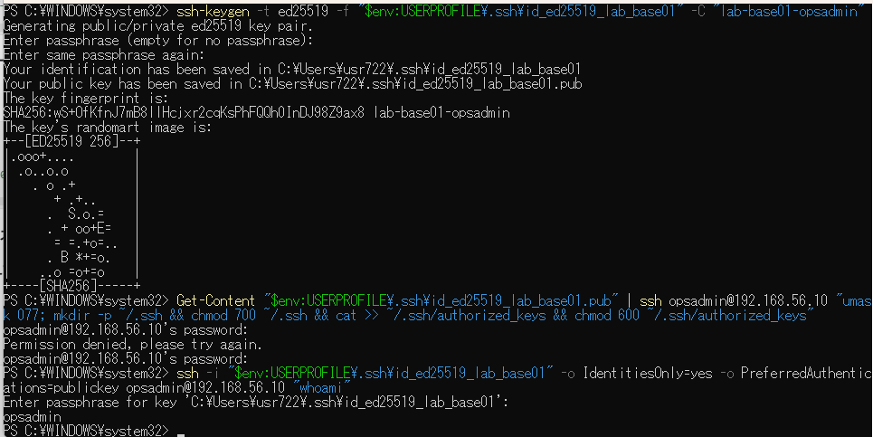

## E05 パスワード方式のみの接続拒否

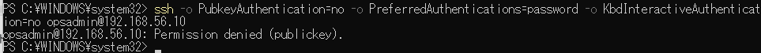

## E06 UFW有効・SSH許可元限定

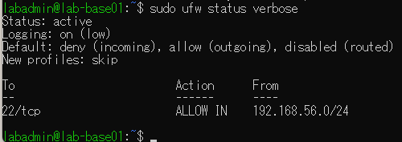

## E07 UFW有効化後の鍵接続

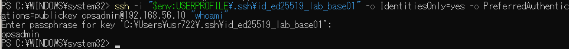

## E08 apt upgrade末尾。終了コード・更新全件一覧は未採録

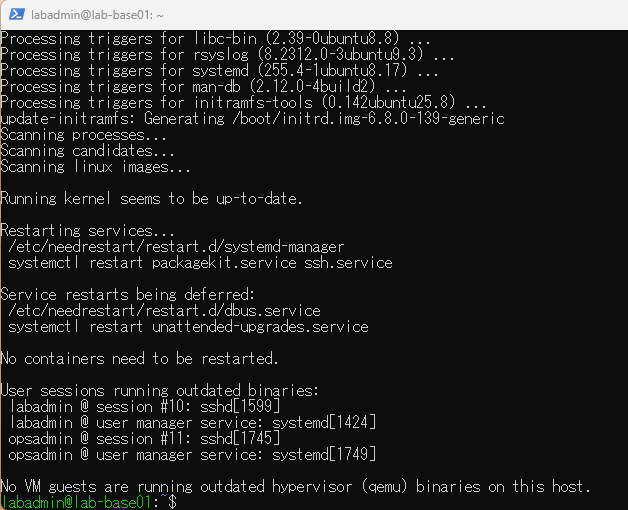

## E09 再起動後の固定IP・経路・NTP同期yes・UFW

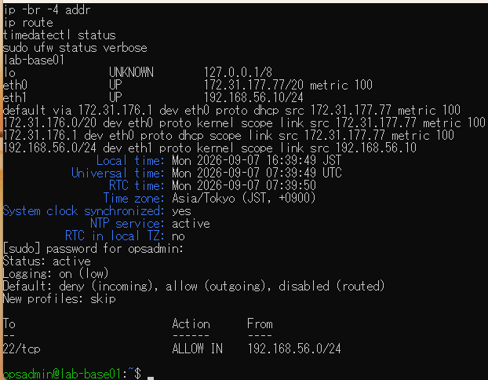

## E10 sudo認証要求・終了コード1・認証後root・root L

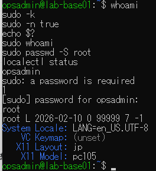

## E11 ja_JP.utf8生成とLANG=ja_JP.UTF-8

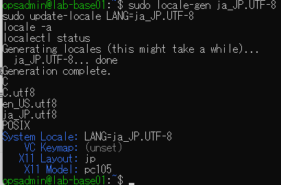

## E12 自動更新の導入・設定2項目・enabled・dry-run終了0

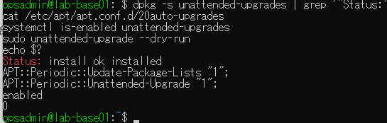

## E13 実効値permitrootlogin no

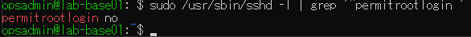

## E14 root接続拒否、ping成功、80番TCP接続失敗

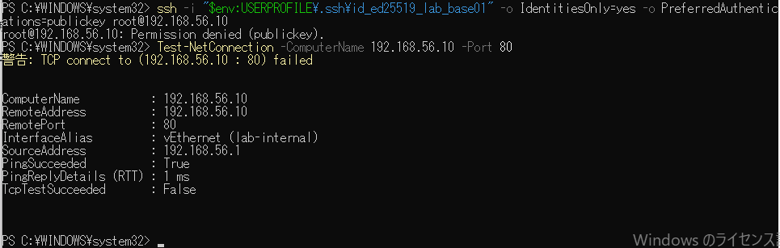

## E15 未登録の試験鍵による接続拒否

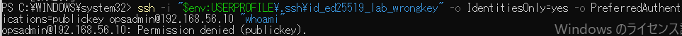

## E16 Failed publickey for opsadminと送信元192.168.56.1

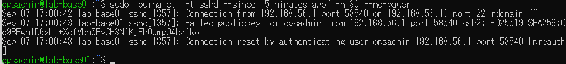

## E17 bad ownership or modesのログと600への復旧

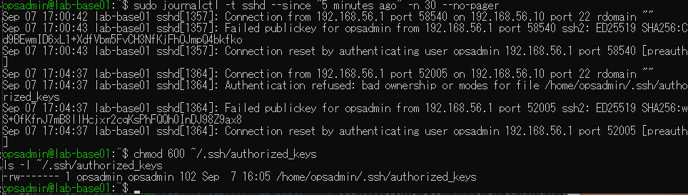

## E18 権限不備で拒否、復旧後に同じ正しい鍵で成功

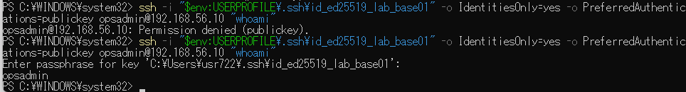

## E19 ホスト名をlab-restore-testへ一時変更

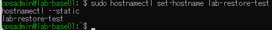

## E20 復元操作後lab-base01と日本語ロケール

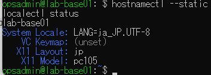

## E21 LabInvalidOption検出・終了255。入力行にsshdコマンド重複あり

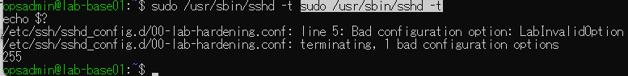

## E22 復元後のSSH接続タイムアウト

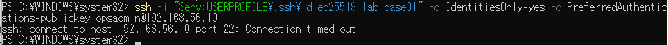

## E23 コンソールでsshd -t成功・終了0

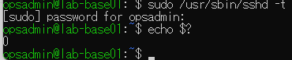

## E24 復元後の固定IP・socket/service active・22番待受・UFW

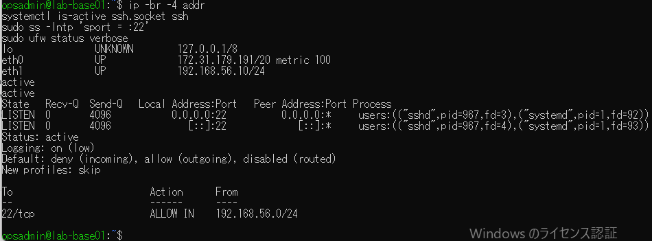

## E25 再試行でping・22番・鍵接続が成功

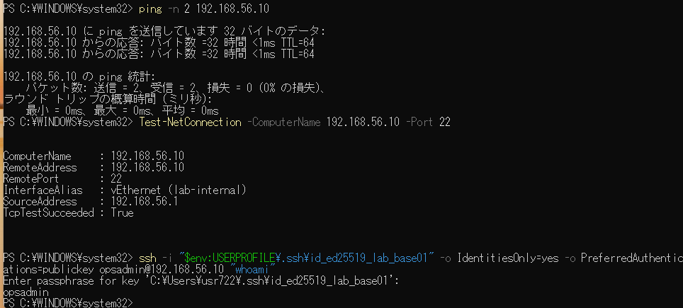

## E26 設定ファイル退避・No such file・終了1

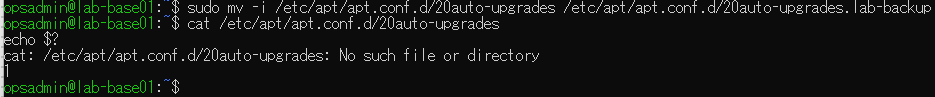

## E27 退避元を復元し自動更新2項目が1

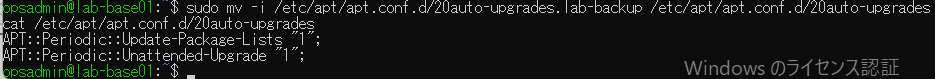

## E28 試験用ネットワークのping成功・22番拒否・送信元57.1

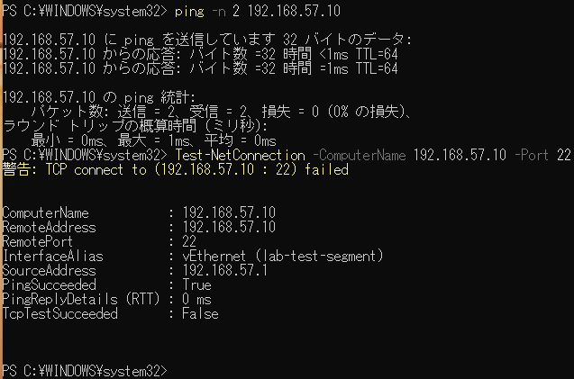

## E29 eth2でUFW BLOCK、SRC57.1、DST57.10、DPT22

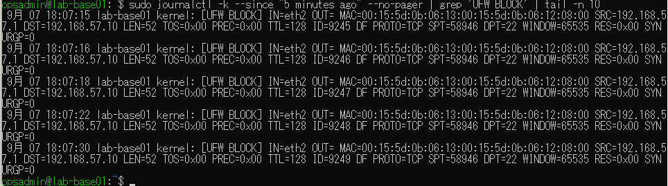

## E30 試験後eth2撤去・eth0/eth1と固定IP維持

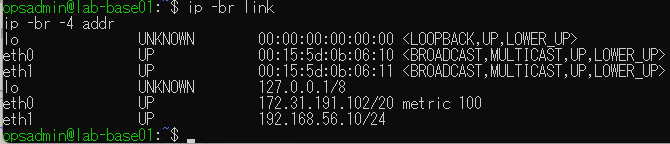

## E31 /と/varと/var/tmpが同一ext4 LV、空き約4.7G

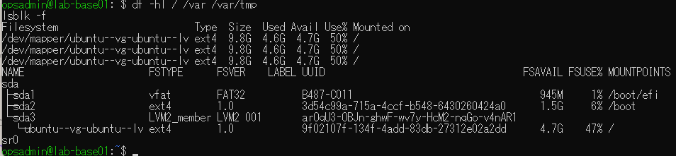

## E32 初回tmpfs容量不足・終了1・64M/100%

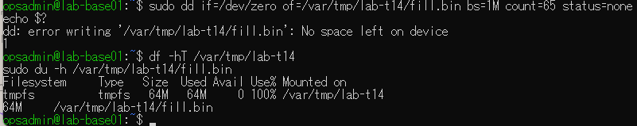

## E33 中断後はtmpfs未マウント・空ディレクトリのみ

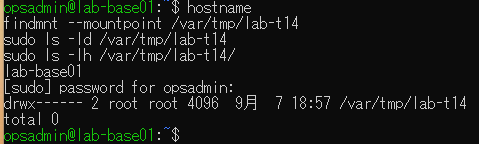

## E34 再実施で容量不足1→削除→空き64M→再書込0

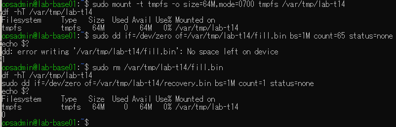

## E35 T18専用鍵の正常接続と変更前ACL

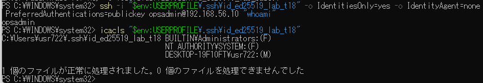

## E36 Users権限によるUNPROTECTED PRIVATE KEY FILEと拒否

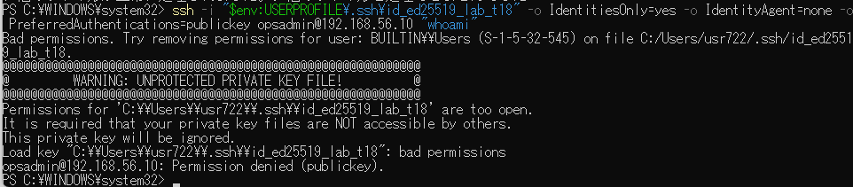

## E37 Users権限削除後のACLと鍵接続成功

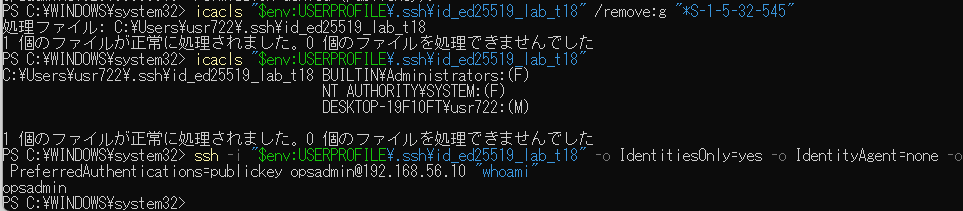

## E38 authorized_keysからlab-t18を削除し通常鍵のみ残存

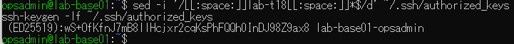

## E39 登録削除後のT18鍵を拒否

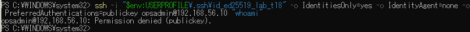

## E40 T18鍵2ファイル不存在・通常鍵でopsadmin接続成功

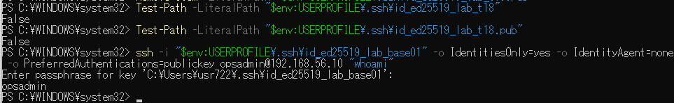

## E41 初回接続時の保存済みホスト鍵不一致

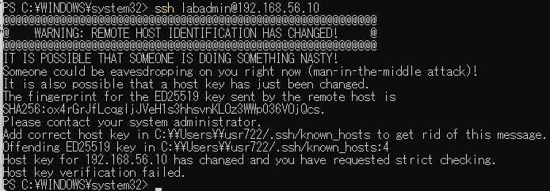

## E42 撤去時Netplanはeth0/eth1のみ。試験用設定なし

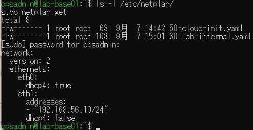
