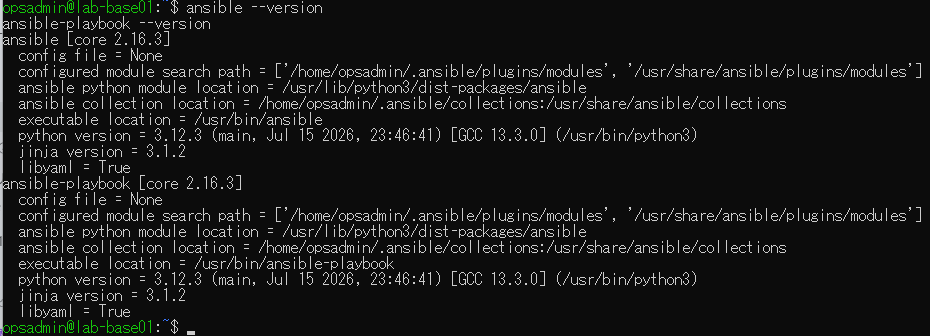
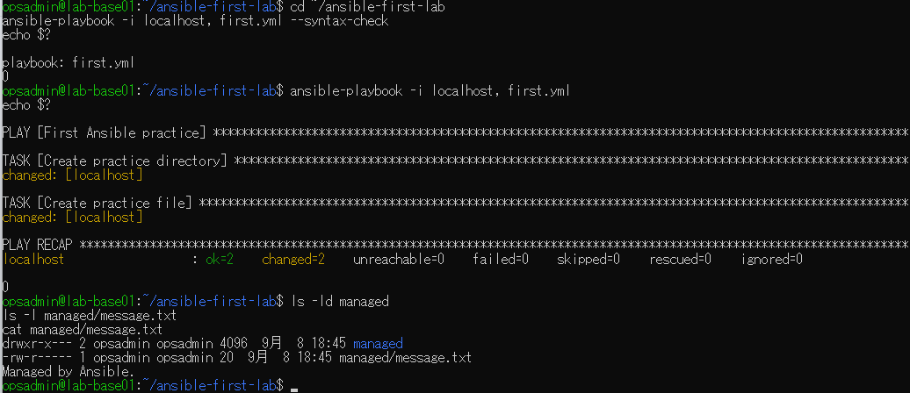
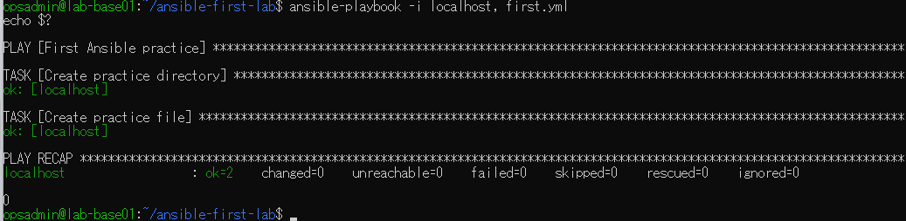
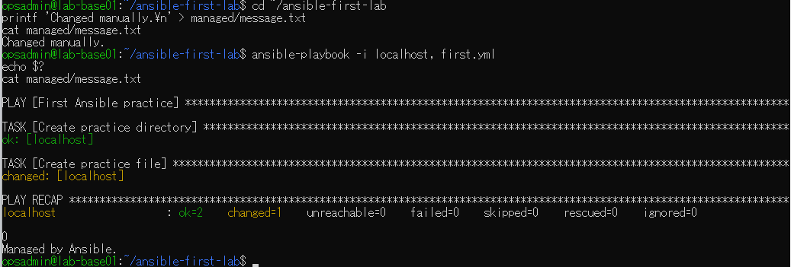

# lab-base01：Ansible入門演習の原画像

[結果票へ戻る](../../2026-09-08-lab-base01-ansible-intro-practice.md)

本人提供画像4枚を無加工で保存。ラボのホスト名・ユーザー名・パス・版数・表示日時等を含む。
秘密値本文は含めない。ハッシュはコピーの同一性確認用で、主体や撮影日時を第三者認証するものではない。
[元ファイル名・サイズ・SHA-256](manifest.json) / [SHA256SUMS](SHA256SUMS.txt)

## E01 Ansible/ansible-playbook core2.16.3、Python3.12.3

## E02 構文確認0・初回changed2・権限と本文

## E03 2回目changed0・failed0・終了0

## E04 本文を手動変更後、再実行changed1で指定本文へ復旧

