# lab-base01：Docker最小構成の原画像

[作業結果へ戻る](../../2026-09-08-lab-base01-compose-practice.md)

本人が対話へ添付した画像17枚を無加工でコピーした。表示時刻や主体を第三者認証する資料ではない。
Windows/Ubuntuのアカウント名、ラボIP、パス、公開情報としてのcommitやイメージdigestを含む。
秘密値の本文を表示した画像は含めない。生成・読取りコードと実際の秘密値は区別する。
[元ファイル名・サイズ・SHA-256](manifest.json) / [SHA256SUMS](SHA256SUMS.txt)

## E01 変更前メモリ658MiB・空きディスク4.7G・Docker未検出

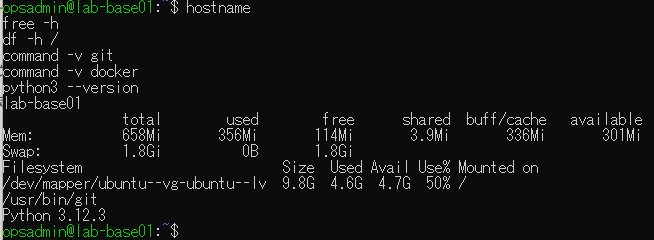

## E02 メモリ変更後1.9GiB・available 1.5GiB

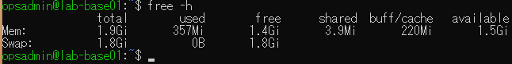

## E03 LV 10GiB・VG未割当約7.32GiB

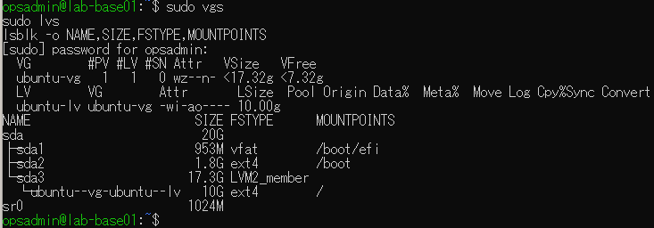

## E04 LVとext4のオンライン拡張・終了0・空き12G

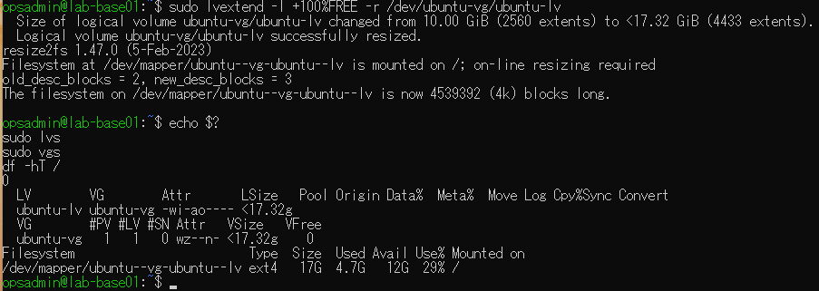

## E05 Docker公式noble/amd64の配布元取得

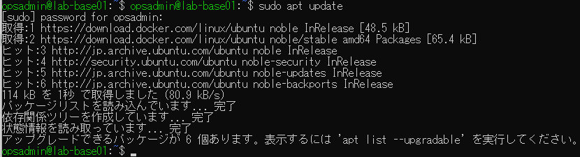

## E06 Docker active・Client/Server 29.8.0・Compose v5.5.1

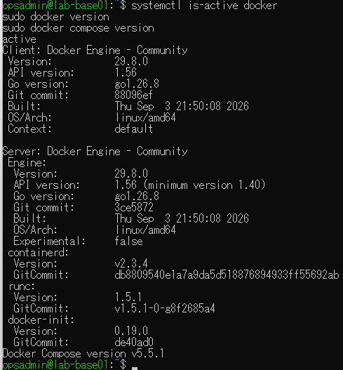

## E07 hello-world取得・起動成功・終了0

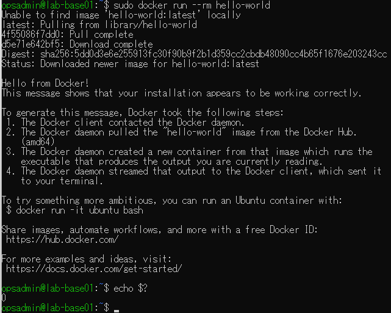

## E08 clone・mainのSHA・Python3.12.3・venv作成

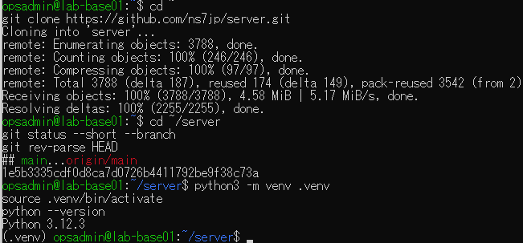

## E09 pytest 167 passed in 4.08s・終了0

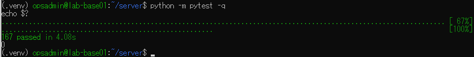

## E10 opsadminのdockerグループ・sudoなしdocker ps成功

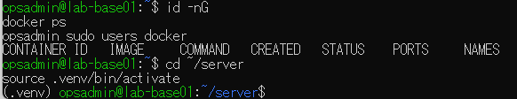

## E11 設定生成終了0・4パスignore・秘密値追跡なし

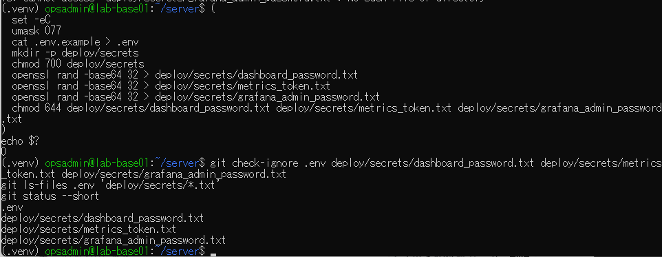

## E12 app healthy・nginx Up・loopback公開・起動終了0

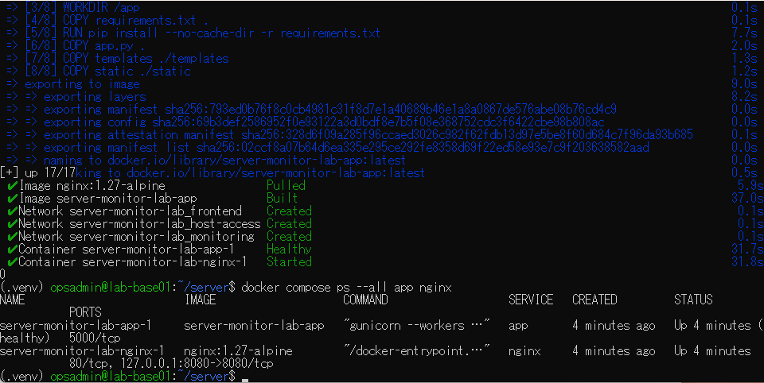

## E13 healthz 200・画面401・metrics401

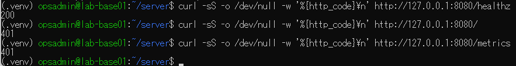

## E14 秘密値をファイルから読むPythonで認証付きAPI200

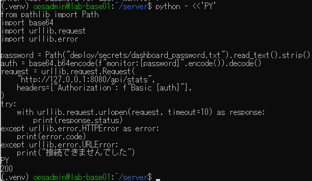

## E15 app healthy維持・nginx停止・curl接続失敗000

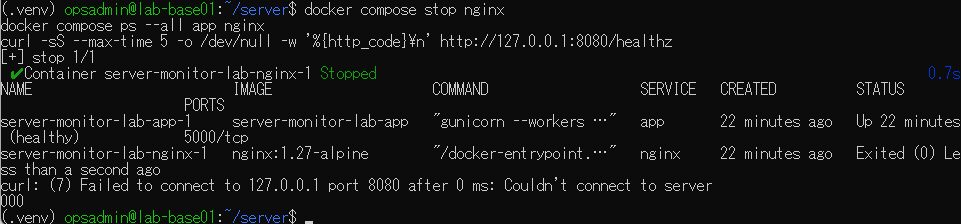

## E16 手動再開後nginx Up・healthz200

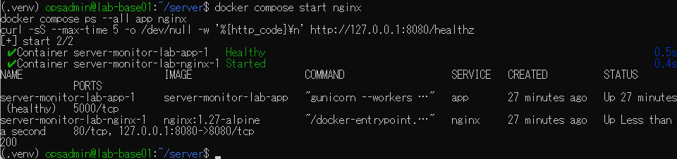

## E17 2コンテナと3ネットワーク削除・サービス行なし・venv終了

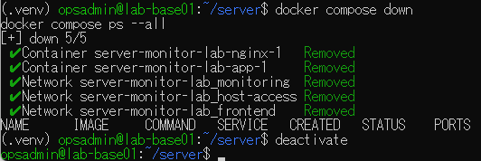
