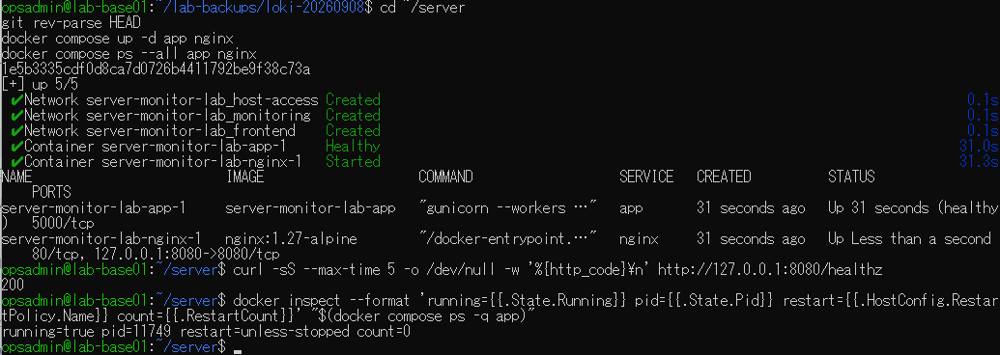
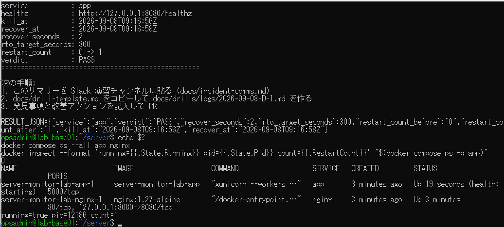
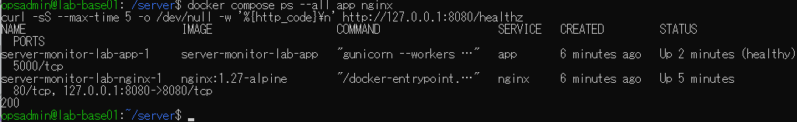
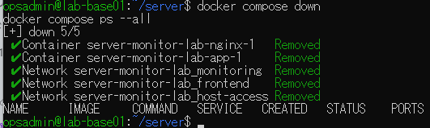

# lab-base01：D-1自動復旧演習の原画像

[結果票へ戻る](../../2026-09-08-lab-base01-d1-practice.md)

本人提供画像4枚を無加工で保存。ラボのユーザー名・パス・IP/ポート・PID・実施時刻等を含む。
秘密値本文は含めない。ハッシュはコピーの同一性確認で、時刻・主体の第三者認証ではない。
[元ファイル名・サイズ・SHA-256](manifest.json) / [SHA256SUMS](SHA256SUMS.txt)

## E01 開始時HEAD・healthy・HTTP200・PID11749・restart count0

## E02 サマリー2秒/PASS・終了0・count1・PID12186、health starting

## E03 後続確認でapp healthy・nginx Up・HTTP200

## E04 2コンテナ・3ネットワーク撤去・サービス行なし

