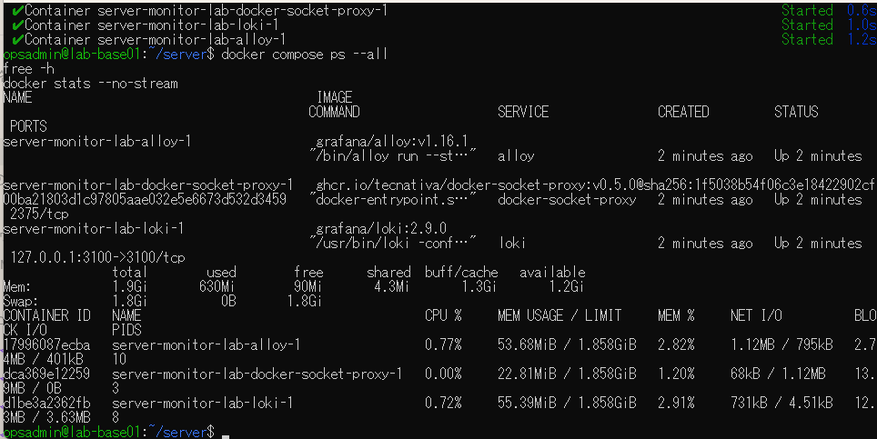
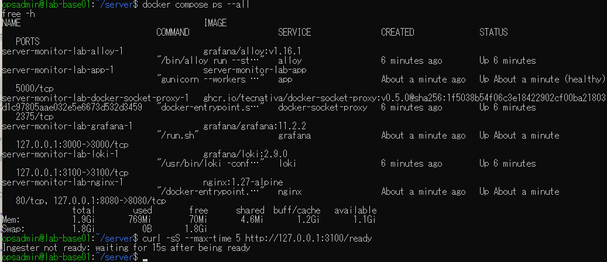
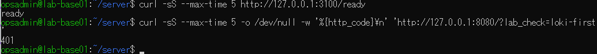
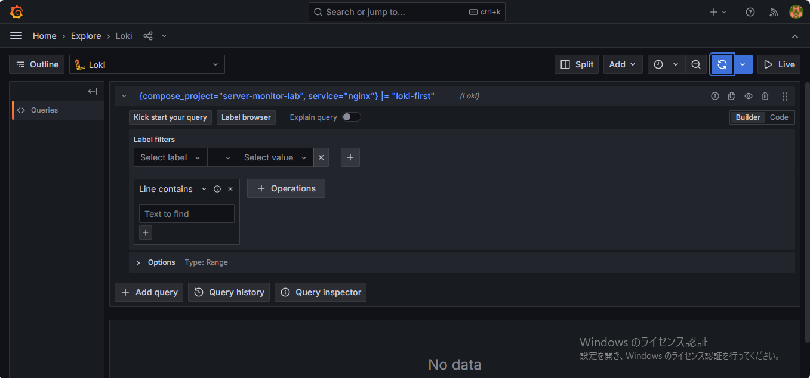
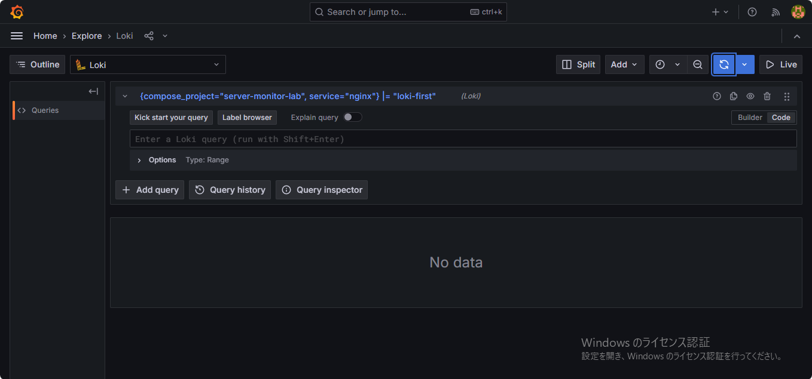
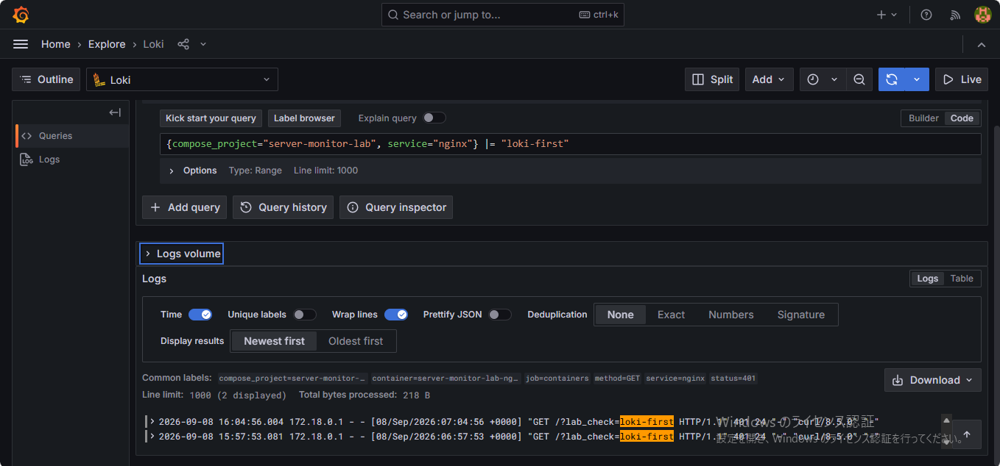
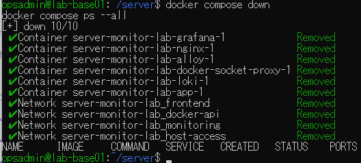

# lab-base01：6サービスのログ監視演習の原画像

[作業結果へ戻る](../../2026-09-08-lab-base01-loki-practice.md)

本人提供の原画像7枚を無加工でコピーした。画像内にラボのIP、ユーザー名、パス、アクセス日時等を含む。
パスワード・秘密鍵本文は掲載しない。撮影時刻や操作主体を第三者認証した資料ではない。
[元ファイル名・サイズ・SHA-256](manifest.json) / [SHA256SUMS](SHA256SUMS.txt)

## E01 Loki・Alloy・proxy起動、available1.2GiB、Swap0

## E02 6サービスUp・app healthy・available1.1GiB、Loki ready判定待ち

## E03 Loki ready・目印付きアクセスが401

## E04 ExploreのBuilderとNo data

## E05 Codeに切替後の入力欄が空、No data

## E06 入力済みLogQLと目印loki-firstを含むログ2件、GET/401

## E07 6コンテナ・4ネットワーク撤去、psにサービス行なし

