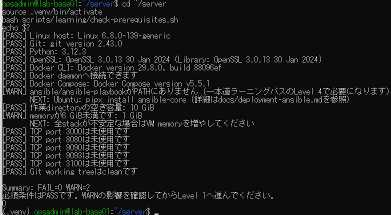
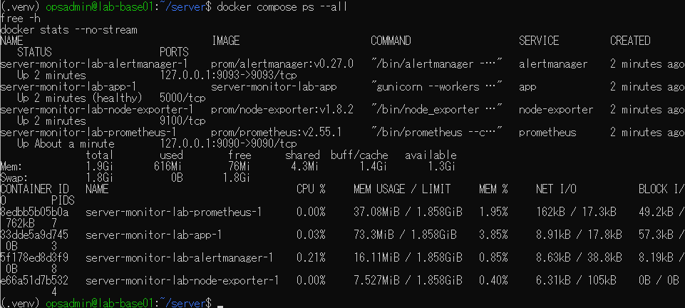
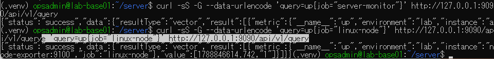
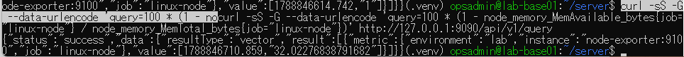
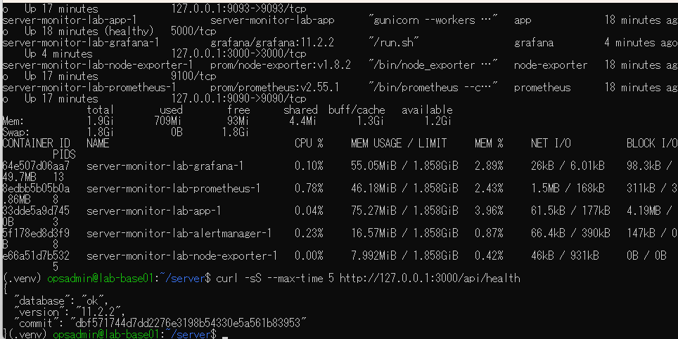
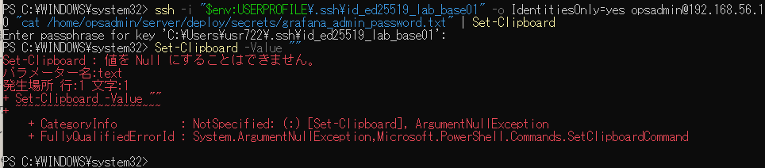
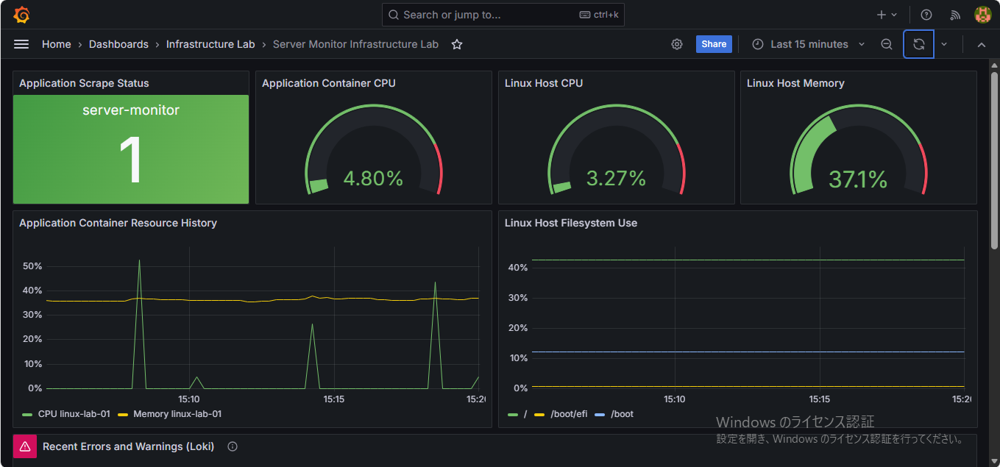
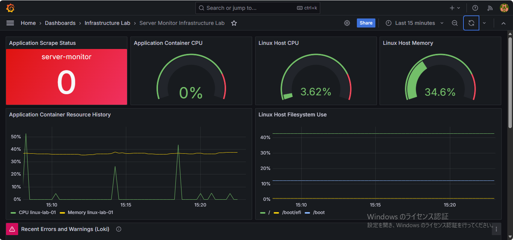
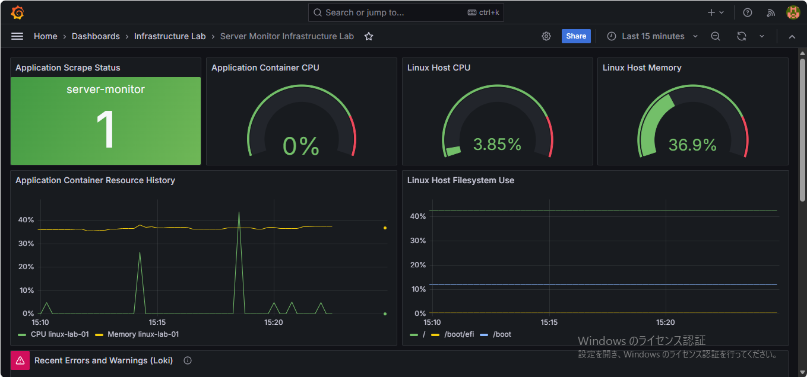
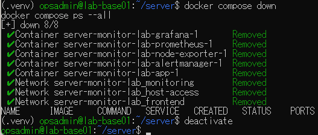

# lab-base01：5サービス監視演習の原画像

[作業結果へ戻る](../../2026-09-08-lab-base01-monitoring-practice.md)

本人提供の画像10枚を無加工でコピーした。ラボのIP・ユーザー名・ファイルパス・公開鍵の保存先等を含む。
パスワード・秘密鍵本文・認証ヘッダーの実値は含めない。画面外の操作、正確な撮影時刻、第三者の認証を示すものではない。
[元ファイル名・サイズ・SHA-256](manifest.json) / [SHA256SUMS](SHA256SUMS.txt)

## E01 前提診断FAIL0/WARN2・終了0、Ansible未導入・メモリ警告

## E02 4サービス起動・app healthy・available1.3GiB・Swap0

## E03 アプリとlinux-nodeのupクエリ

## E04 node-exporterから計算したメモリ使用率約32.02%

## E05 Grafanaを含む5サービス・available1.2GiB・database ok

## E06 Windows Set-Clipboardへの空文字指定が失敗。秘密値本文は表示されていない

## E07 Grafanaの数値・履歴表示、Application Scrape Status1

## E08 手動停止後のApplication Scrape Status0

## E09 手動再開後のApplication Scrape Status1

## E10 5コンテナ・3ネットワーク撤去、サービス行なし、venv終了

