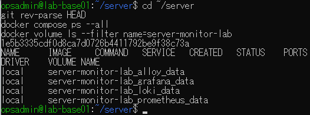
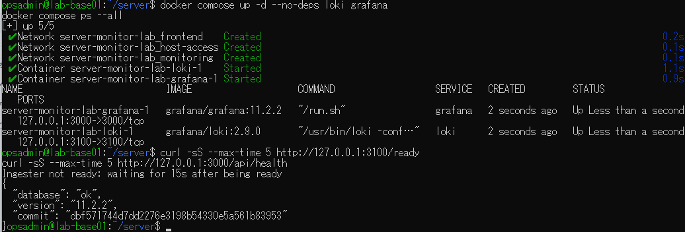
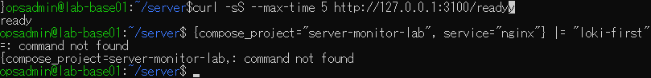
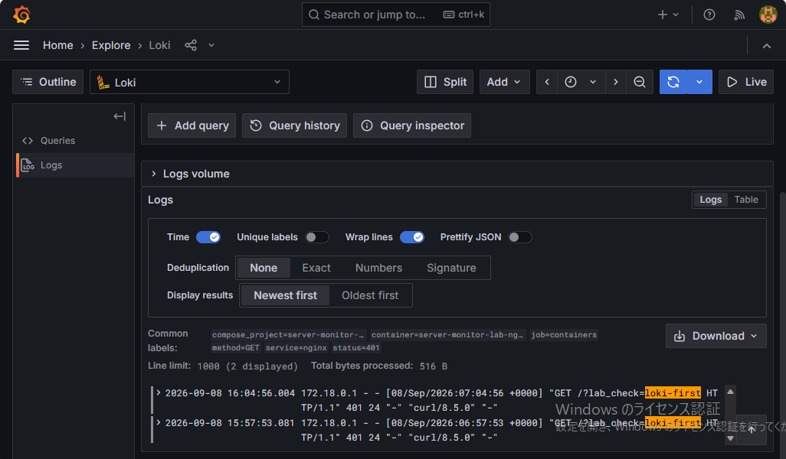
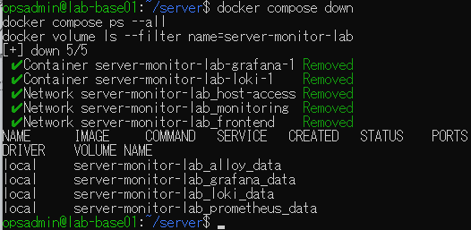

# lab-base01：保存ログ再読込みの原画像

[結果票へ戻る](../../2026-09-08-lab-base01-persistence-practice.md)

本人提供画像5枚を無加工で保存。ラボのIP・ユーザー名・パス・アクセス日時を含む。
秘密鍵・パスワード本文は含めない。画像のハッシュは同一性確認用で、操作主体や撮影時刻を第三者認証するものではない。
[元ファイル名・サイズ・SHA-256](manifest.json) / [SHA256SUMS](SHA256SUMS.txt)

## E01 開始時HEAD・サービス行なし・保存ボリューム4件

## E02 LokiとGrafanaだけ再作成・Grafana health ok・Loki準備待ち

## E03 Loki ready・LogQLをBashへ入力したエラー

## E04 前回と同じ時刻・目印・GET/401のログ2件を再表示

## E05 2コンテナ・3ネットワーク撤去後も保存ボリューム4件残存

