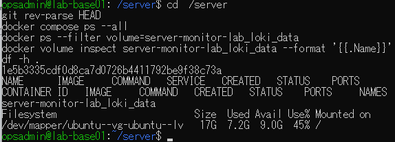
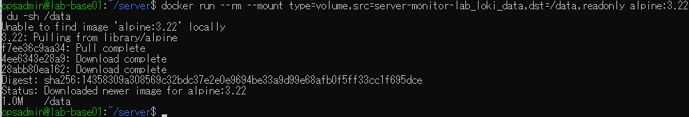
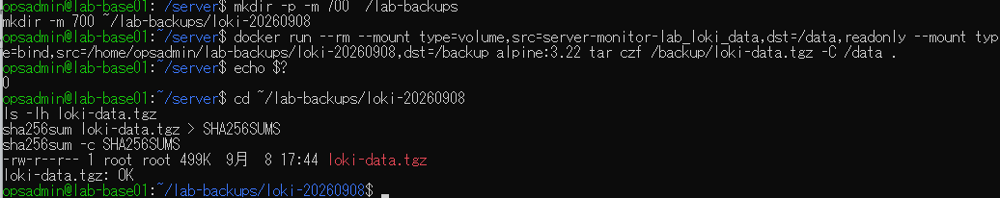
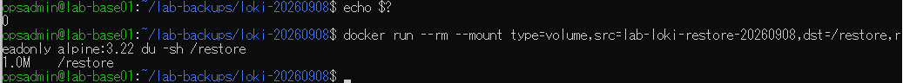
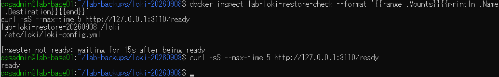
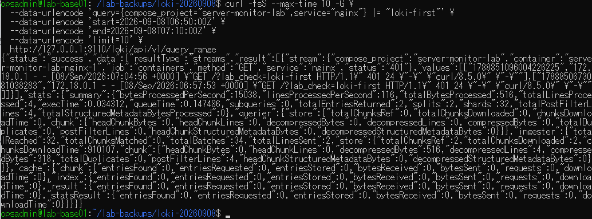
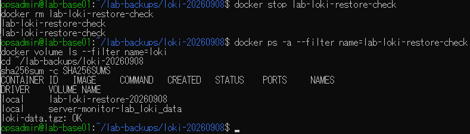

# lab-base01：Lokiバックアップ・別ボリューム復元の原画像

[結果票へ戻る](../../2026-09-08-lab-base01-restore-practice.md)

本人提供画像7枚を無加工で保存。ラボIP・ユーザー名・パス・アクセス日時等を含む。
秘密値の本文は含めない。ハッシュはコピーの同一性を確認するもので、撮影時刻や主体の第三者認証ではない。
[元ファイル名・サイズ・SHA-256](manifest.json) / [SHA256SUMS](SHA256SUMS.txt)

## E01 HEAD・対象コンテナ停止・元ボリューム存在・空き9G

## E02 元ボリュームをread-onlyで確認、使用量約1M

## E03 tarバックアップ終了0、499K、SHA256SUMS検査OK

## E04 展開後として提示された終了0と復元先約1M

## E05 復元先を/lokiへマウント、3110番ready

## E06 3110番へのクエリで目印付き過去ログ2件を取得

## E07 確認用コンテナ撤去、元/復元先volume残存、archive検査OK

