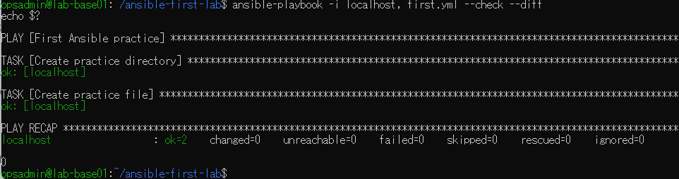
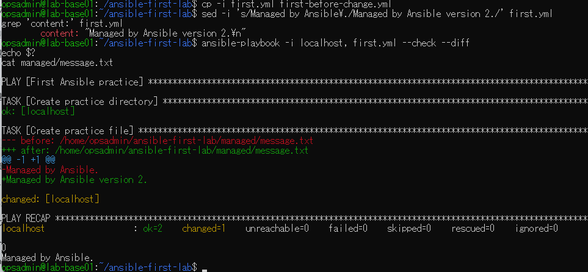
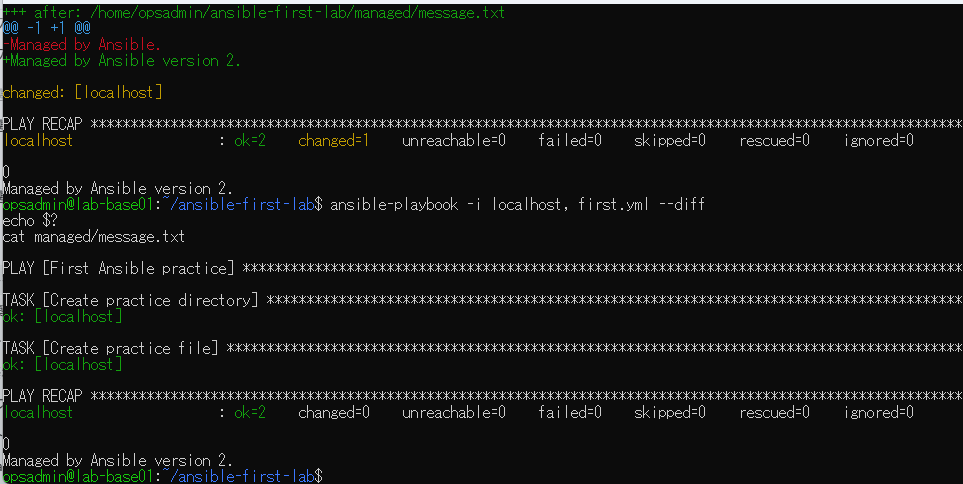

# lab-base01：Ansible check/diff演習の原画像

[結果票へ戻る](../../2026-09-09-lab-base01-check-diff-practice.md)

本人が対話へ提供した原画像3枚を無加工でコピーした。ホスト名・ユーザー名・パス・演習用本文を含む。
秘密値本文は含めない。ハッシュはコピーの同一性確認用で、主体や日時の第三者認証ではない。
[元ファイル名・サイズ・SHA-256](manifest.json) / [SHA256SUMS](SHA256SUMS.txt)

## E01 変更前のcheck/diffでchanged0・failed0・終了0

## E02 Playbook退避と指定変更・予測changed1・実ファイルは旧本文

## E03 適用後の本文version2・changed1、通常再実行changed0

