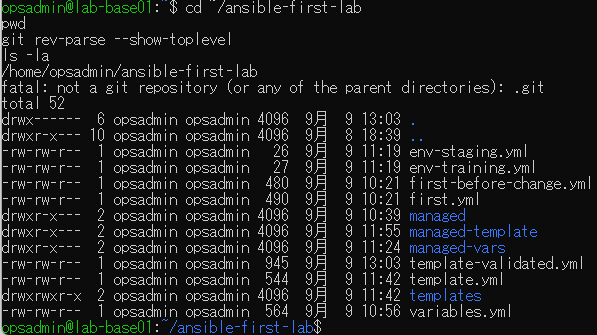
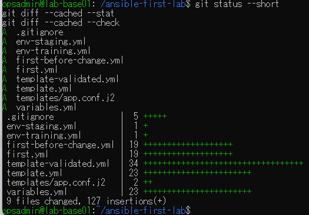
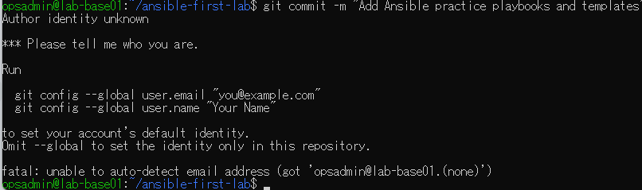
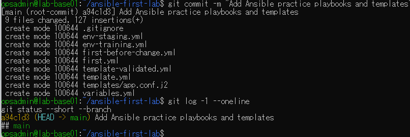

# lab-base01：Git管理入門の原画像

[結果票へ戻る](../../2026-09-09-lab-base01-git-intro-practice.md)

本人提供の原画像4枚を無加工で保存。ホスト名・ユーザー名・パス・ファイル表示日時・Git識別情報等を含む。
秘密値本文は含めない。ハッシュはコピーの同一性確認で、主体や日時の第三者認証ではない。
[元ファイル名・サイズ・SHA-256](manifest.json) / [SHA256SUMS](SHA256SUMS.txt)

## E01 Git未管理と演習フォルダーの一覧

## E02 9ファイルのステージ・127行・空白検査出力なし

## E03 Author identity unknownにより初回コミット停止

## E04 root commit a94c1d3・9ファイル・main clean

