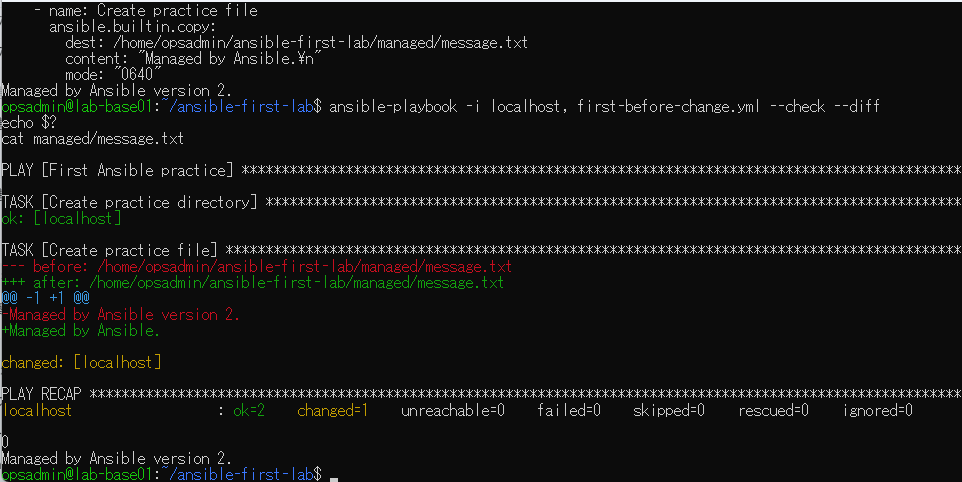
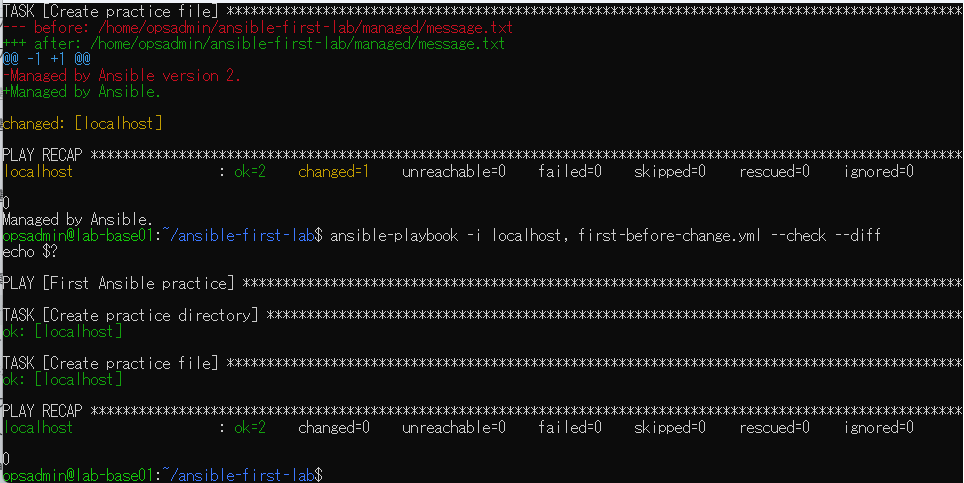

# lab-base01：Ansible切り戻し演習の原画像

[結果票へ戻る](../../2026-09-09-lab-base01-rollback-practice.md)

本人提供の原画像2枚を無加工で保存。ラボのホスト名・ユーザー名・パス・演習用本文を含む。
秘密値本文は含めない。ハッシュはコピーの同一性確認用で、撮影時刻や主体の第三者認証ではない。
[元ファイル名・サイズ・SHA-256](manifest.json) / [SHA256SUMS](SHA256SUMS.txt)

## E01 旧Playbookで切り戻し予測changed1、実ファイルはversion2を維持

## E02 旧本文へ適用changed1、check/diff再確認changed0

