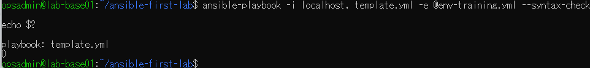
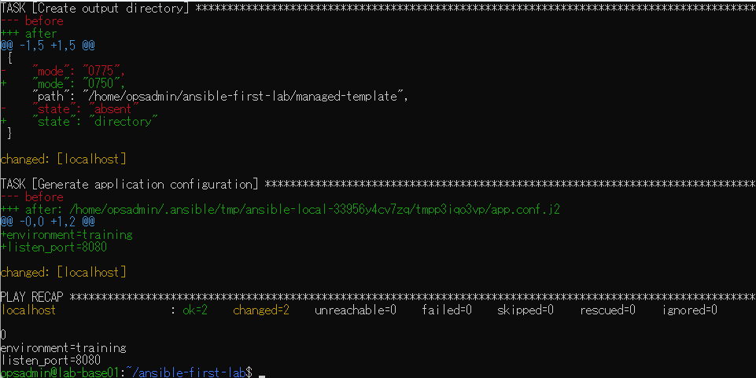
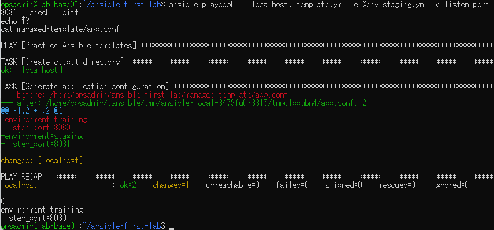
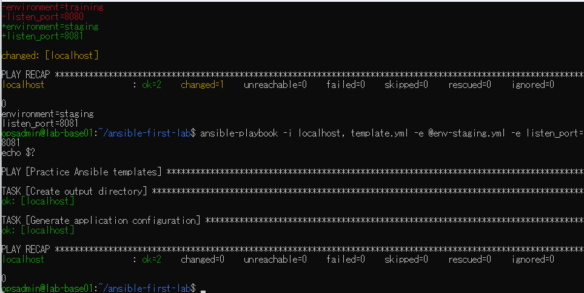

# lab-base01：Ansibleテンプレート演習の原画像

[結果票へ戻る](../../2026-09-09-lab-base01-template-practice.md)

本人提供の原画像4枚を無加工で保存。ラボのホスト名・ユーザー名・パス・演習用設定値を含む。
秘密値本文は含めない。ハッシュはコピーの同一性確認用で、撮影日時や主体の第三者認証ではない。
[元ファイル名・サイズ・SHA-256](manifest.json) / [SHA256SUMS](SHA256SUMS.txt)

## E01 template.ymlのsyntax-check成功・終了0

## E02 初回changed2・終了0、training/8080の生成

## E03 staging/8081の変更予測changed1、実体training/8080維持

## E04 適用changed1・staging/8081、同指定再実行changed0

