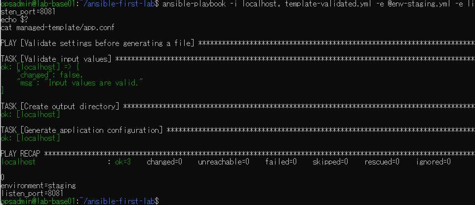
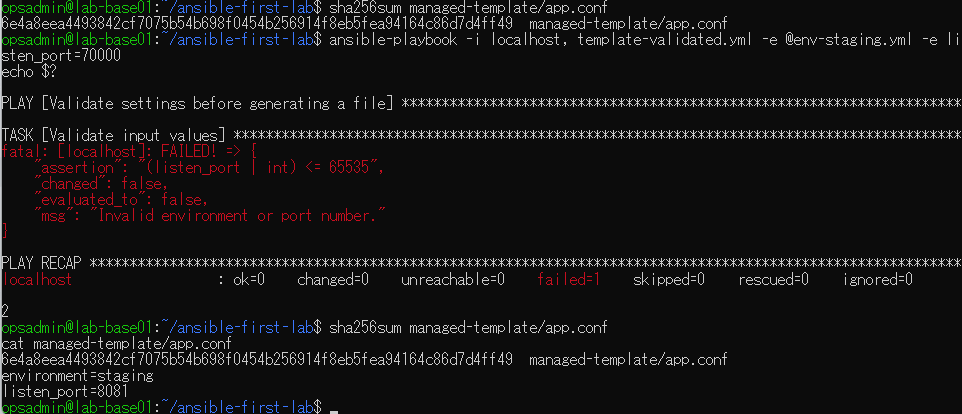

# lab-base01：Ansible入力検証の原画像

[結果票へ戻る](../../2026-09-09-lab-base01-validation-practice.md)

本人提供の原画像2枚を無加工で保存。ホスト名・ユーザー名・パス・演習用設定値・ファイルハッシュを含む。
秘密値本文は含めない。画像ハッシュはコピーの同一性確認用で、主体や時刻の第三者認証ではない。
[元ファイル名・サイズ・SHA-256](manifest.json) / [SHA256SUMS](SHA256SUMS.txt)

## E01 正しいstaging/8081でassert成功・changed0・終了0

## E02 70000を拒否・終了2・前後SHA256一致・既存本文維持

