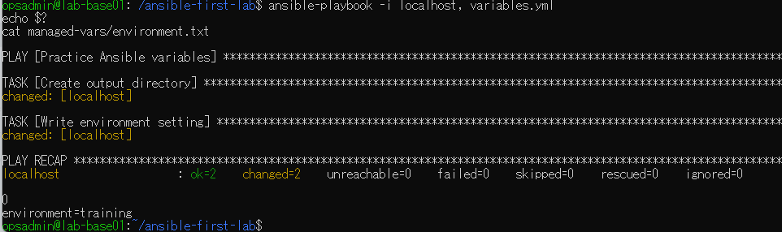
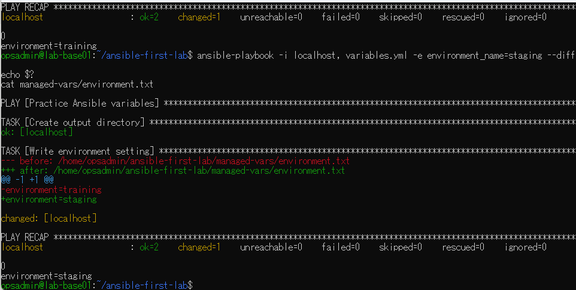
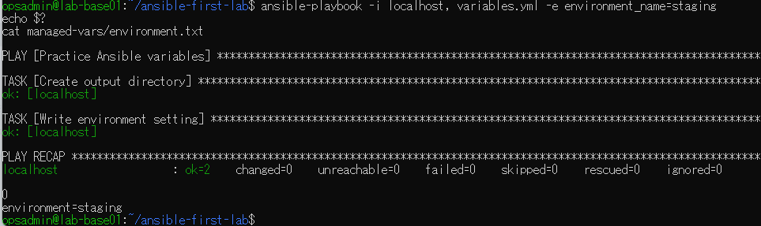

# lab-base01：Ansible変数演習の原画像

[結果票へ戻る](../../2026-09-09-lab-base01-variables-practice.md)

本人提供の原画像3枚を無加工で保存。ホスト名・ユーザー名・パス・演習用本文を含む。
秘密値本文は含めない。ハッシュはコピーの同一性確認用で、主体や時刻の第三者認証ではない。
[元ファイル名・サイズ・SHA-256](manifest.json) / [SHA256SUMS](SHA256SUMS.txt)

## E01 初回changed2・failed0・終了0、environment=training

## E02 予測後の旧本文、staging指定の実適用changed1・終了0

## E03 同じstaging指定の再実行changed0・終了0、本文維持

