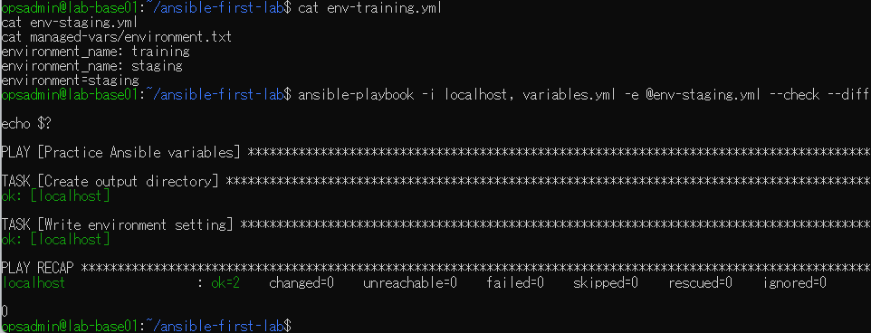
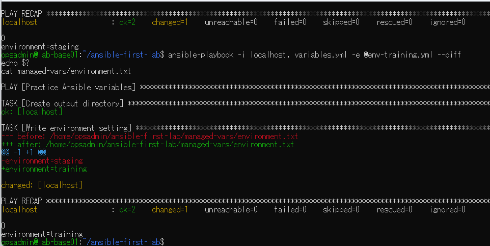
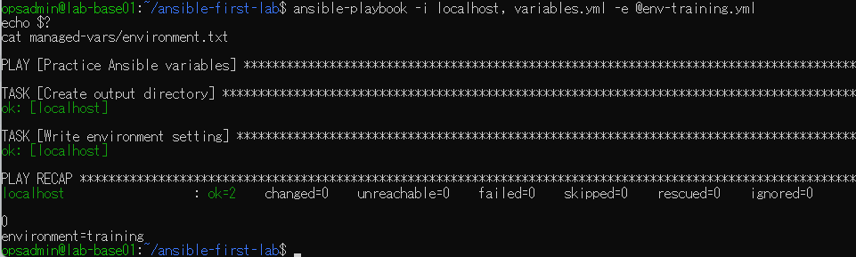

# lab-base01：Ansible変数ファイル演習の原画像

[結果票へ戻る](../../2026-09-09-lab-base01-vars-files-practice.md)

本人提供の原画像3枚を無加工で保存。ホスト名・ユーザー名・パス・演習用本文を含む。
秘密値本文は含めない。ハッシュはコピーの同一性確認用で、主体や日時の第三者認証ではない。
[元ファイル名・サイズ・SHA-256](manifest.json) / [SHA256SUMS](SHA256SUMS.txt)

## E01 変数ファイル2件の本文・現在staging・staging指定checkでchanged0

## E02 予測後staging維持、trainingファイル指定で実適用changed1

## E03 trainingファイル指定の通常再実行changed0、本文training維持

