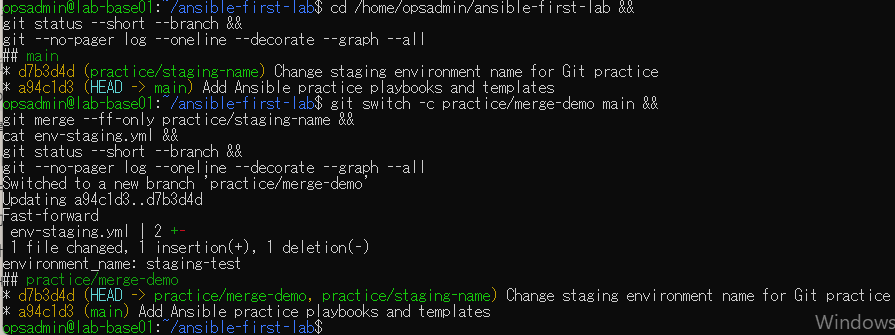
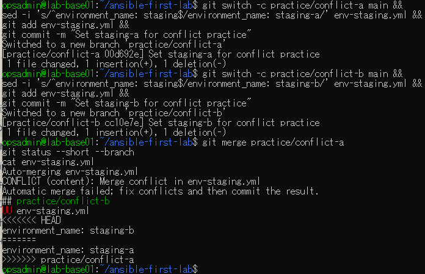
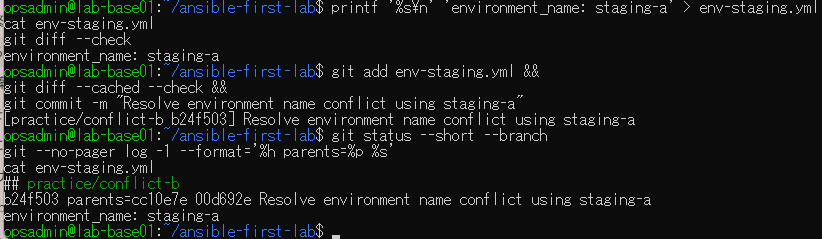
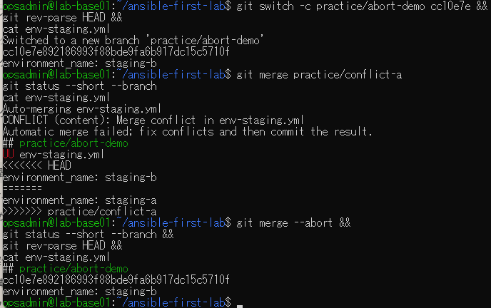
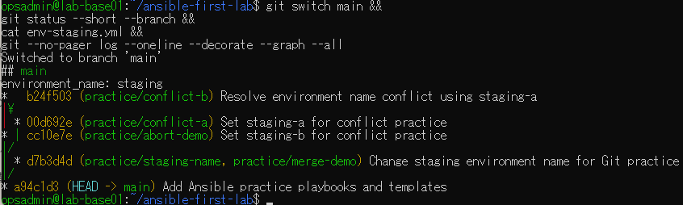

# lab-base01：マージ演習の原画像

[結果票へ戻る](../../2026-09-10-lab-base01-git-merge-practice.md)

本人提供の原画像5枚を無加工で保存。ユーザー名・ホスト名・演習パス・コミットSHAを含む。
秘密鍵本文やパスワードは含まない。ハッシュはコピーの一致確認用で、日時や実施主体の第三者認証ではない。

[元ファイル名・サイズ・SHA-256](manifest.json) / [SHA256SUMS](SHA256SUMS.txt)

## E01 Fast-forwardとmainの保持

## E02 共通mainからの分岐と競合

## E03 競合解消と2つの親

## E04 競合の再現とabort前後のSHA一致

## E05 mainへの復帰と全ブランチ履歴

