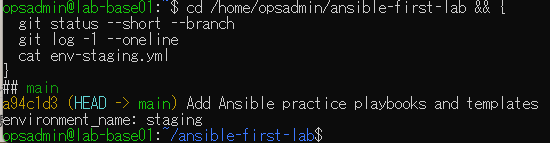
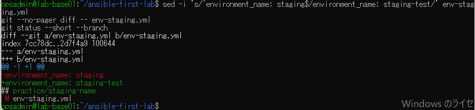
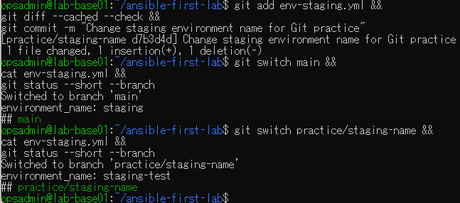
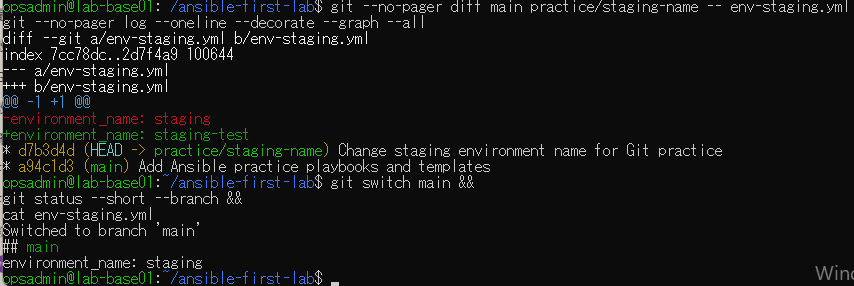
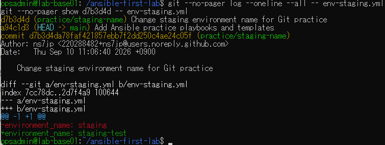
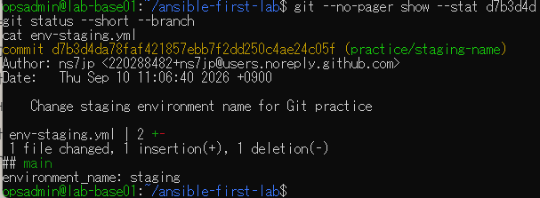
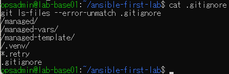
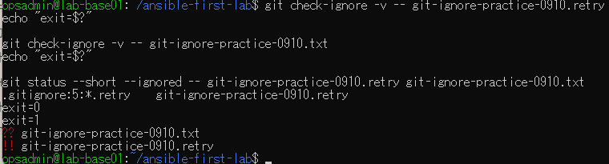
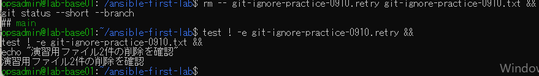

# lab-base01：Git演習の原画像（2026-09-10）

[結果票へ戻る](../../2026-09-10-lab-base01-git-practice.md)

本人提供の原画像9枚を無加工で保存。ユーザー名・ホスト名・ホーム内のパス・Git authorの
noreplyメールアドレス・コミット日時とSHAを含む。秘密鍵本文・パスワードは含まない。
ハッシュは提供画像と保存コピーの同一性確認用で、実施主体や撮影日時の第三者認証ではない。

[元ファイル名・サイズ・SHA-256](manifest.json) / [SHA256SUMS](SHA256SUMS.txt)

## E01 開始状態：main cleanとstaging

## E02 作業ブランチで環境名を変更

## E03 変更コミットとブランチ切替

## E04 ブランチ間比較・履歴・mainへの復帰

## E05 ファイル別履歴と変更コミットの詳細

## E06 変更要約とmainの状態維持

## E07 既存除外ルールとgitignoreの追跡確認

## E08 除外一致・不一致の終了コードと状態

## E09 演習ファイル削除とmain clean

